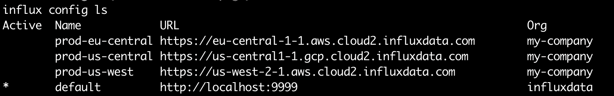
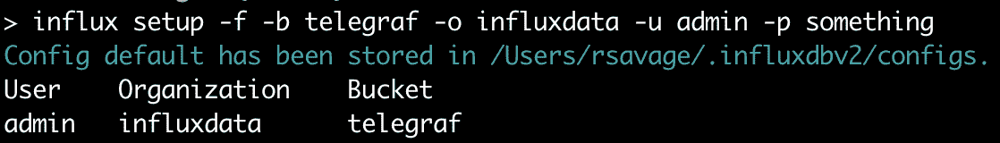
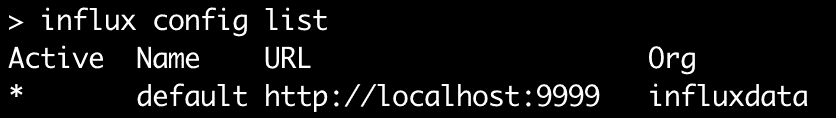
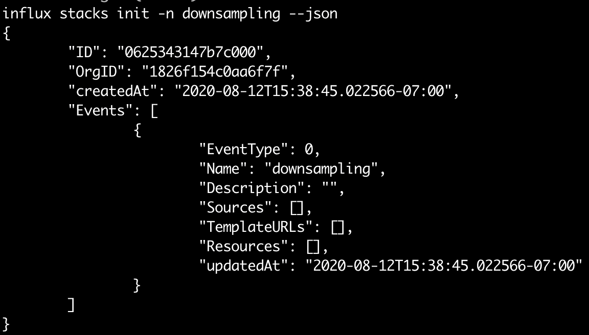
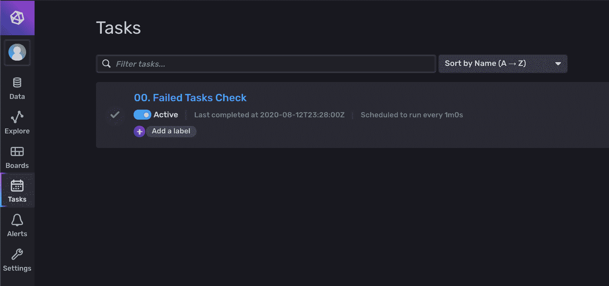
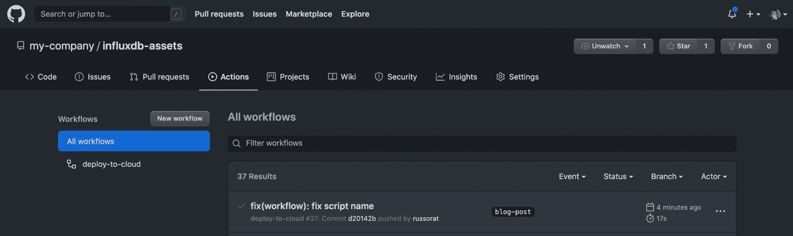
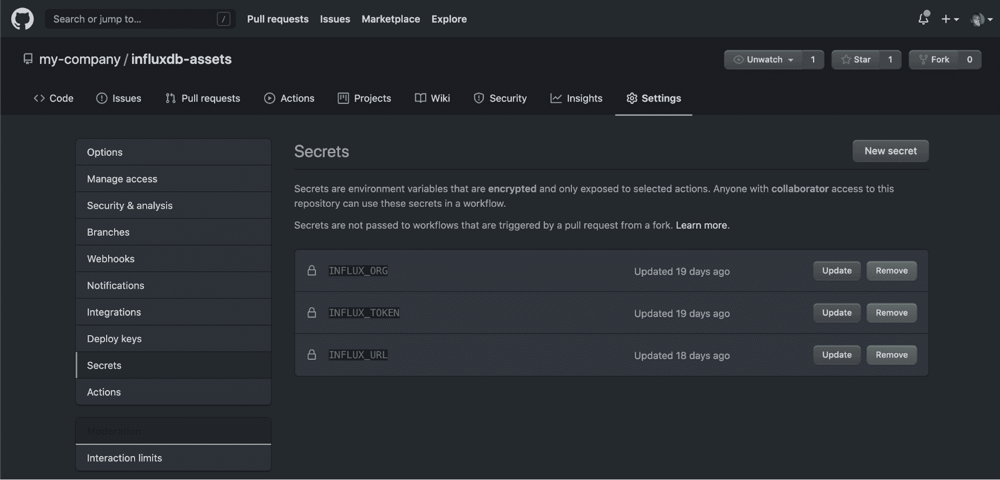

# 使用 InfluxDB 模板创建 GitOps 工作流

> 原文：<https://thenewstack.io/make-a-gitops-workflow-using-influxdb-templates/>

[InfluxData](https://www.influxdata.com/) 赞助了这篇文章。

 [拉斯·萨维奇

Russ 是 InfluxData 的产品管理总监。他有计算机工程背景，过去 10 年来一直专注于企业数据的各个方面。Russ 之前曾在 Cask Data、Elastic、Box 和 Amazon 工作。](https://www.linkedin.com/in/russellsavage/) 

自从 [Kubernetes](https://kubernetes.io/) 、 [GitOps](https://www.weave.works/technologies/gitops/) 工作流已经成为团队管理大型系统状态的标准方式。GitOps 是一种执行应用程序管理和交付的方法，其核心是利用版本控制系统来维护系统的期望状态。能够使用人类可读的文本文件描述所需的状态，并允许基于这些文件自动处理部署和更新，意味着更少的人为错误和更快的部署。

在 InfluxData，我们使用 [InfluxDB 平台](https://www.influxdata.com/products/influxdb-overview/)来监控我们的内部服务。我们需要能够快速管理和部署对该环境的更改。GitOps 工作流在这里非常有意义，因此我们的工程团队在平台中构建了大量功能来支持这种模式。这是支持 [InfluxDB 模板](https://www.influxdata.com/products/influxdb-templates/)的相同技术。

在这篇博文中，我将带您建立一个 GitHub 存储库，作为您的 InfluxDB 云的版本控制系统。我们将创建自动化，使您的团队能够从 GitHub 中检出一个存储库，安装并配置一个本地 InfluxDB OSS 实例来模拟生产，进行更改并将这些更改推送到存储库，并使用 [GitHub Actions](https://github.com/features/actions) 将这些更改自动部署到您的生产 InfluxDB 云帐户。

设置这个工作流的所有代码都可以在我的 [influxdb-assets git 存储库](https://github.com/russorat/influxdb-assets/tree/blog-post)中找到。您还可以看到一个如何配置 GitHub 动作的示例，以将其自动部署到您的 InfluxDB 云实例。如果你是 InfluxDB 的新手，你可以在几秒钟内[免费创建一个 InfluxDB 云帐户](https://www.influxdata.com/products/influxdb-cloud/)。

在我们进入如何实现这个工作流的细节之前，让我们回顾一下为这种体验提供动力的一些不同的技术。

## 如何使用流入 CLI 配置文件

任何对 InfluxDB 进行自动化的人都应该从 [Influx 命令行(CLI)客户端](https://v2.docs.influxdata.com/v2.0/write-data/developer-tools/influx-cli/)开始。它与最新的 InfluxDB OSS Beta 捆绑在一起，或者你可以从我们的[下载页面](https://portal.influxdata.com/downloads/influxdb/2.0/)下载它作为一个独立的二进制文件。由于开发人员在构建时可能会利用不同的环境，如开发、试运行或生产环境，因此 CLI 能够存储多个连接配置文件，从而简化跨这些环境的工作。要查看您的连接配置文件，您可以键入:

…您将看到类似如下的输出:

[](https://cdn.thenewstack.io/media/2020/09/c747696d-image4.png)

如果您刚刚开始使用 InfluxDB，您可能只会看到一个配置概要文件——但是您已经了解了。

我们将以几种方式利用这种能力，使我们的部署自动化更易于管理。当您第一次启动一个本地 InfluxDB OSS 实例时，您需要经历一个引导过程来创建您的第一个用户、组织和 bucket。为了帮助实现自动化，可以通过 CLI 以非交互方式(–force，-f)完成此过程，这也会创建一个“默认”配置文件。下面是设置本地实例的命令示例:

```
influx setup  -f  -b  telegraf  -o  influxdata  -u  admin  -p  any-password

```

T13

很明显，我在这里选择的密码没有赢得任何安全方面的奖励，但这只适用于我机器上的本地开发实例。如果你在一个共享的环境中，你会想要使用一些更强的东西。

您还可以通过运行`influx config`来查看当前的配置概要文件，或者使用`influx config ls`命令列出所有概要文件。请注意，该配置文件在“Active”列标有星号，这意味着您通过 CLI 发送的所有命令都将使用该配置文件。

[](https://cdn.thenewstack.io/media/2020/09/46d00a1c-image2.png)

我们可以为 [DevOps 管道](https://medium.com/taptuit/the-eight-phases-of-a-devops-pipeline-fda53ec9bba)中的每个阶段定义概要文件——比如开发、登台或生产——并对每个阶段使用相同的命令。您可以根据需要设置任意多的配置文件，并通过将它们设置为活动状态来进行切换，如下所示:

```
influx config set  -n  prod  -a

```

此外，我们最近增加了通过`-c, --active-config`选项在命令行上发送特定配置文件的功能。这对于将命令管道化在一起，或者确保特定的命令以特定的配置运行非常方便。我们将使用设置活动配置文件的模式，用于本文中的所有命令。

既然我们可以跨不同的实例无缝地工作，那么让我们来看看使用同一工具管理状态和不同资产的方法。

## 如何使用 InfluxDB 堆栈，InfluxDB 模板管理器

InfluxDB Stacks 是一个管理 InfluxDB 模板的工件，允许您随着时间的推移添加、更新和删除资源。当你安装一个模板时会自动创建一个栈，但是它们也可以预先初始化，这就是我们在这篇文章中要做的。栈是有用的，因为它们不是复制资源，而是在您每次使用相应的标识符运行`influx apply`命令时用更改来更新它们。堆栈可以管理文件、url、数据流或三者组合中定义的资源。这对于以前与 Kubernetes 和`[kubectl](https://kubernetes.io/docs/tasks/tools/install-kubectl/)`合作过的人来说应该很熟悉。

希望在您的脑海中，这些部分开始融合在一起，并考虑如何利用它们来创建 GitOps 工作流。在您的生产环境中，每组资源(仪表板、任务、存储桶等。)绑定到一个堆栈，该堆栈可以随着应用的变化而更新。根据您选择的配置文件，这些更改将被发送到您的本地开发环境或您的生产实例。您可以使用一组脚本进行本地部署，或者持续集成工具(在本例中为 GitHub Actions)可以使用相同的脚本将您的更改部署到生产环境中。

处理堆栈的标准方式是首先使用`influx stacks init -n my_stack`命令初始化它们。提供一个名称可以让您以后轻松地引用它，而不必依赖于将 id 硬编码到您的脚本中(对于这种类型的工作流来说，这是一个明确的反模式)。

[](https://cdn.thenewstack.io/media/2020/09/aa198761-image1.png)

您可以使用`--json`标志以 JSON 格式输出结果，然后可以使用类似于`jq`的工具来获取诸如 id 之类的信息(在本文稍后的部分有关于如何做的例子)。

一旦你初始化了你的栈，你可以添加文件，URL，或者单独的资源到其中。然后，它们将由堆栈管理。这意味着您对这些文件所做的任何更改都将在下次运行`influx apply --stack-id <my-stack-id>`时部署，包括删除资源。

为了开始整合我们的自动化工作流程，这几乎是我们需要知道的全部内容。让我们开始吧！

## 用一个小小的狂欢把所有的东西放在一起

我们首先初始化一个新的 GitHub 存储库，以包含您的 InfluxDB 组织的所有自动化和资产。出于本文的目的，我们称之为`my-company/influxdb-assets`。

一旦在本地创建并克隆了它，并且您位于一个空存储库的根目录中，您就可以开始构建设置本地 InfluxDB 实例和初始化我们的第一个堆栈所需的脚本了。让我们在您最喜欢的文本编辑器中打开一个名为`setup.sh`的新文件，并开始编写脚本。

根据我们已经知道的，这个脚本应该非常简单。我们正在初始化 InfluxDB 的一个新实例，创建一个名为“monitoring”的新堆栈，然后应用它。您会注意到，我使用了前面提到的`--json`标志和`jq`来保存新创建的堆栈 ID，以便以后引用。最后，在退出之前，我们检查从我们的`influx apply`命令返回的响应代码是否成功。

这个任务本身对这篇文章来说并不太重要，但是如果你想知道的话，我从[缩减采样模板](https://github.com/influxdata/community-templates/tree/master/downsampling)中抓取了这个。这是一个自定义任务，起到监视检查的作用。它将检查您系统中失败的任务，并将该信息写入`_monitoring`桶，以便它可以被您可能已经设置的任何[通知规则](https://v2.docs.influxdata.com/v2.0/monitor-alert/notification-rules/)拾取。你可以随意使用任何你喜欢的任务。

如果您将该脚本更改为可执行的，并在本地运行一个空的 InfluxDB，那么您应该能够登录到您的本地实例(对于 InfluxDB 2.0，可能是 http://localhost:9999)并看到我们创建的新任务。

```
chmod  +x  setup.sh
./setup.sh

```

[](https://cdn.thenewstack.io/media/2020/09/0a2797ef-image3.png)

哇，酷。因此，我们可以通过一些脚本快速地从全新安装过渡到加载的任务，但是我们如何跨环境做到这一点呢？还记得我们之前学过的那些 CLI 配置文件吗？结合操作系统和云之间的通用 InfluxDB API，这意味着我们可以简单地添加一个新的配置文件并运行相同的脚本，它将创建堆栈并将其安装在 InfluxDB 云上。

## 如何将配置文件添加到 InfluxDB 安装脚本

当我们在本地运行时，我们很可能总是使用在第一次引导实例时设置的“默认”配置文件，但是我们希望我们的自动化也使用这个设置脚本来更新我们的 InfluxDB 云组织(本例中是我们的“prod”)。

这意味着我们需要更新我们的脚本来接受一个定义要使用的概要文件的命令行参数。

我们在脚本的顶部添加了一些逻辑来查找参数，并使用它来设置配置文件(如果它存在的话)。我承认，我不是世界上最好的 bash shell 脚本编写人员，所以我相信您能够做出比这更好的东西，但是目前它已经完成了工作。

在这次迭代中，我还处理了其他一些日常事务。因为我们希望能够多次运行这个脚本，所以在再次尝试设置它之前，我们需要检查本地实例是否已经设置好。此外，在尝试建立新的堆栈之前，我们需要检查现有的堆栈，这样我们就不会得到一堆重复的堆栈和资源——因为名称不是唯一的。

注意:如果您想快速重置(警告:这将删除您的所有本地数据)您的本地 InfluxDB OSS 实例，您可以创建一个包含以下行的`reset.sh`脚本:

```
#!/bin/bash

killall influxd
# WARNING: THIS NEXT LINE WILL DELETE ALL YOUR DATA
rm  -r  ~/.influxdbv2
influxd  >  /dev/null  2>&1  &

```

这里没有什么新奇的东西，但是在你构建它的时候可以节省一些打字的时间。

现在，我们说到哪了？当我们使用配置文件的名称作为参数运行这个新脚本时，它应该会尝试切换到它。你可能现在只设置了一个配置文件，但是尝试设置另一个并检查它是否有效。

```
influx config create  -n  staging  -u  http://localhost:9999 -o influxdata -t $(influx auth list --json | jq -r '.[0].token')
Active  Name    URL Org
        staging http://localhost:9999   influxdata
./setup.sh staging 
Successfully set config profile to staging...
Checking for existing stacks...
Updating our stack with the task definition...

```

同样，这个`--json`标志对于提取有用的信息很方便——在本例中是令牌。我们假设列表中的第一个令牌，但是如果有多个令牌，一些`jq`功夫可以通过描述过滤令牌。

为了让这个脚本更好地为我们和我们的工作流服务，我们还需要做最后一件事。部署过程将启动一个全新的虚拟机，下载 InfluxDB CLI 工具的新副本，并尝试运行该脚本。这意味着我们没有设置任何配置文件，脚本需要为我们创建一个。

在我们找不到传入的配置文件的情况下，让我们检查适当的环境变量；如果我们找到他们，我们就可以即时创建侧写。

现在，为了进行测试，您可以运行设置了`INFLUX_TOKEN`、`INFLUX_ORG`和`INFLUX_URL`的安装脚本，如下所示:

```
INFLUX_URL=http://localhost:9999 \
INFLUX_ORG=influxdata  \
INFLUX_TOKEN=$(influx auth list  --json  |  jq  -r  '.[0].token')  \
./setup.sh prod
Active  Name    URL Org
* prod    http://localhost:9999   influxdata
Checking for existing stacks...
Applying our stack...
Everything was set up successfully!

```

如果您运行`influx config ls`，您应该会看到同名的新档案被激活。

到目前为止，我们已经走过了很多地方。把所有东西都登记进去可能是个好主意。我们在你运行完`git add .`、`git commit -m ‘feat(stacks): initial stack’`和`git push origin master`后再见，我们将设置 GitHub 动作。

## 使用 GitHub 动作进行自动部署

GitHub Actions 是一个强大的工具，可以给你的 GitHub 库添加自动化功能。这篇文章并不打算完整地介绍它们是如何工作的，或者它们能做什么，所以我们将只关注实现这种自动化的基本要素。

[](https://cdn.thenewstack.io/media/2020/09/f1118e25-image5.png)

要访问 GitHub 操作，只需点击项目根目录中的 Actions 选项卡，就会提示您创建一个新的工作流。我们将创建一个工作流，该工作流将运行我们一直在处理的脚本，但不是将其发送到我们的 InfluxDB 本地实例，而是将其应用到我们已经设置的云帐户，该帐户的行为类似于我们的 prod 实例。

在 GitHub Actions 中创建新的工作流后，您可以将其配置为每晚获取最新的 InfluxDB 操作系统(需要这样我们才能访问 CLI 工具)，然后使用它将堆栈应用到您的云实例。

工作流名称后的第一部分让 GitHub 知道何时运行工作流。在这种情况下，任何时候都有人将某些东西合并到主分支中。要了解更多关于其他触发器的信息，请查看触发器的 [GitHub 文档。](https://docs.github.com/en/actions/reference/events-that-trigger-workflows)

接下来，我们定义我们的 [GitHub 作业](https://docs.github.com/en/actions/getting-started-with-github-actions/core-concepts-for-github-actions#job)。在这种情况下，我们只需要一个作业将我们的代码部署到我们的云实例，但是这里可以有多个作业。每当有人打开试图将资产安装到本地 InfluxDB 实例中的 pull 请求时，运行工作流可能是一个好主意，这样您可以在将它们发送到生产环境之前检查任何错误。

作为我们工作的一部分，我们定义一些[环境变量](https://docs.github.com/en/actions/configuring-and-managing-workflows/using-environment-variables)发送到我们的脚本中。显然，我们不想向外界公开我们的令牌，所以 GitHub 允许您在存储库级别定义秘密，这些秘密对用户是隐藏的，并在日志中编辑。你可以在你的回购设置部分找到这些。组织、令牌和 URL 都可以在 InfluxDB 云帐户的[加载数据](https://v2.docs.influxdata.com/v2.0/write-data/)部分找到。

最后，下面是脚本的步骤，相对简单。我们首先下载 InfluxDB OSS 的最新版本(您也可以使用版本化的副本，这样不容易出错)，设置它，然后使用 prod 配置文件运行我们的安装脚本。就像在我们的本地机器上一样，脚本将获取环境变量并为我们建立一个新的配置文件，这次连接到我们的云帐户。

[](https://cdn.thenewstack.io/media/2020/09/78a060ae-image7.png)

## 总结和最终想法

恭喜你！如果您已经做到了这一步，那么您已经成功地为您的 InfluxDB 云帐户设置了一个自动化部署，并且正在向一个用于管理您的 InfluxDB 资产的完整 GitOps 风格的工作流前进。

当您开始向您的生产实例添加额外的堆栈时，我建议您将它们分别放在各自的文件夹中——可能带有一个`README.md`,带有关于谁拥有该堆栈及其用途的一些附加信息。您将需要为每个文件夹在脚本中添加堆栈，但是我相信您可以弄清楚如何自动选择新文件夹并根据需要动态创建新堆栈。

如果您对该工作流程有任何想法或建议，我们很乐意倾听。加入我们的[社区 Slack workspace](https://influxcommunity.slack.com/join/shared_invite/zt-f8i7xcd2-zTRaIuPmE3yWYOFNOdJFLQ#/) ，让我们知道哪些地方可以改进。您还可以在我们的 [InfluxDB GitHub repo](https://github.com/influxdata/influxdb) 中公开您遇到的任何 bug 的问题。

通过 Pixabay 的特征图像。

目前，新堆栈不允许直接在该网站上发表评论。我们邀请所有希望讨论某个故事的读者通过推特(Twitter)或脸书(T2)与我们联系。我们也欢迎您通过电子邮件发送新闻提示和反馈:[反馈@thenewstack.io](mailto:feedback@thenewstack.io) 。

<svg xmlns:xlink="http://www.w3.org/1999/xlink" viewBox="0 0 68 31" version="1.1"><title>Group</title> <desc>Created with Sketch.</desc></svg>