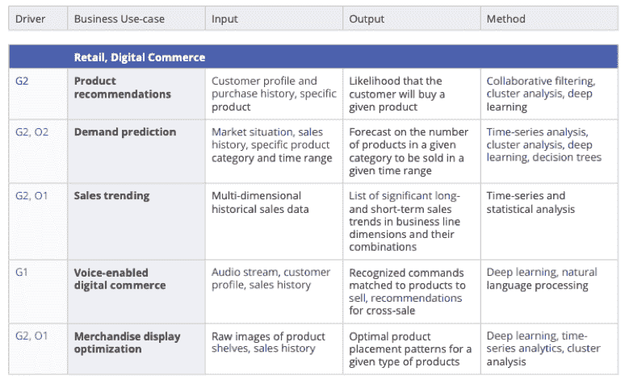
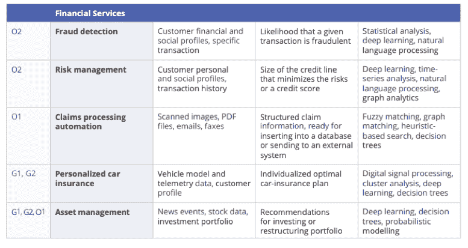
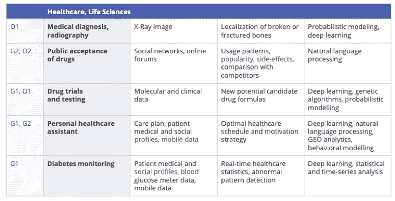
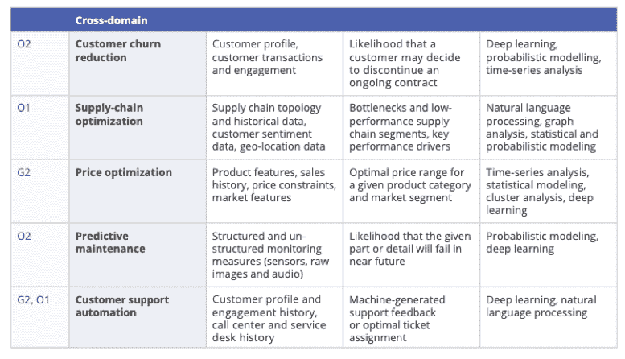

# 让大数据与机器学习一起工作

> 原文：<https://thenewstack.io/make-big-data-work-with-machine-learning/>

 [谢尔盖·哈齐耶夫

谢尔盖·哈齐耶夫是 SVP，SoftServe 的高级技术。Haziyev 在各种技术领域拥有 20 多年的经验，包括:大数据、人工智能、物联网和云计算。他是《智能决策》(Smart Decisions)的合著者，该书目前被卡耐基梅隆大学软件工程学院(SEI CMU)用来教授学生如何设计大数据解决方案。](https://www.softserveinc.com) 

毫无疑问，由于大数据，许多先进的技术公司已经获得了令人信服的竞争优势。在过去的几年中，it 的采用已经从空想家转向了实用主义者，因此今天很难找到任何一个企业组织不投资于存储、处理不断增长的数据并从中提取价值。

然而，一旦公司有能力收集和处理海量数据，问题就变成了:“我如何才能从中获得最大价值？”

每家公司都处于大数据之旅的不同阶段，因此最大化其商业价值意味着将大数据的采用推进到下一阶段。虽然没有单一的标准或度量来衡量一个组织的当前状态，但是“成熟度模型”的概念是一种简单而有效的方法来评估某个事物相对于其他组织的潜力。

## 大数据分析成熟度模型

 [尤里·米洛瓦诺夫

Iurii Milovanov 是 SoftServe 的人工智能和数据科学总监。Milovanov 在构建企业级人工智能、大数据和高级分析解决方案方面拥有超过 10 年的经验。Iurii 是计算机科学专家，非常重视前沿技术。他的研究兴趣包括现代、进步的 IT 和最先进的人工智能的各个方面，如分布式和并行计算、大规模机器学习、自然语言处理、计算机视觉和语音识别。](https://www.softserveinc.com) 

大数据分析成熟度模型描述了一个组织从其初始阶段“数据”到“智慧”的路径，就其业务可能性而言，它既是一个顶峰，也是一个无限的目的地。这个金字塔从顶部开始包括以下内容:

*   **智慧:**认知分析和自动化决策(人工智能)
*   **速度:**实时分析和决策(数据流)
*   **洞察力:**从非结构化数据中发现价值(数据湖、数据管道)
*   **信息:**自助分析(仪表板、在线报告)
*   **数据:**无纸化但繁重的手工数据处理(数据仓库、ETL、Excel 报表)

金字塔本身是对 DIKW(数据-信息-知识-智慧)层次结构的改编，DIKW 是关于数据价值链的基本且被广泛认可的概念之一。我们使用这个模型，因为它很容易理解。

现在，让我们将金字塔层次与现代企业的业务需求联系起来:

### 数据

如果一个组织在数据层面，意味着什么？通常，这意味着组织拥有无纸化但繁重的手动流程和各种各样的数据，从文档和事务记录到媒体文件、机器生成的日志和传感器数据。数据可能已经从不同的来源收集了几十年，并存储在数据仓库或原始格式中，但对这些数据的分析还不发达。

在这种情况下，组织的团队投入大量资源以非自动化的方式提取事实信息，通常以 Microsoft Excel 或 Adobe PDF 文件构建报告。

显而易见但值得一提的是:处于这一水平意味着一个组织的数据流程(或缺乏数据流程)阻碍了其释放潜力，包括运营效率和创新新产品或服务的能力。

### 信息

在收集数据时，应该对其进行处理以使其有用，并回答谁、什么、在哪里以及何时的问题。这是一种描述性的信息状态，通常表现为在线报告、控制面板和自助服务功能的形式，无需请求 IT 或其他部门的支持即可检索感兴趣的信息。

从技术的角度来看，这通常意味着一个组织拥有一个“商业智能(BI)平台”,提供对公司数据的访问。尽管这是从数据阶段走向成熟的重要一步，并且可以在这一级别找到许多组织，但对于业务用户来说，一系列问题仍然没有答案——如何、为什么和如果？

### 见识

这个层次比成熟度模型的数据和信息层次更难解释，因为它更接近人类思维的表现。为了简明起见，我们将它定义为利用传达理解、积累的知识和专业知识的可操作信息。换句话说，这个水平提高了个人采取有效行动的能力。从技术上讲，它包括多种信息来源的综合以及发现隐藏模式和相关性的能力。

考虑这样一个例子，一位医生根据全面的患者信息做出正确的诊断，包括测试结果、患者访谈和患者的病史。然后，他可以根据他或她的行业研究知识和专业经验选择最有效的治疗方案。

企业架构环境中有几个元素支持在这一级别做出可操作的决策，包括从结构化、半结构化和非结构化数据源收集各种数据的数据湖，以及将原始数据转换为随时可用的整体表示的数据处理管道。

达到这一数据成熟度级别的组织通常会夸耀其运营效率的显著提高和/或产品或服务收入的增加。

还有比这更好的吗？决策的加速，这是下一个层次。

### 速度

这个水平指的是一个组织的决策速度。在坚实的洞察力(或可操作的信息)基础的支持下，这一级别通过使实时或接近实时的信息访问成为一种竞争优势而产生了许多可能性。从技术角度来看，数据流、移动计算和物联网技术使这些优势成为可能。

更快的速度可以提高生产率，增加新产品或服务的收入来源。它还可以支持流程的优化，这些流程可以动态地适应由于市场条件甚至天气等因素而不断变化的环境。

今天，没有多少公司可以声称在这个阶段有一个稳固的立足点，或者他们正在从这个水平获得所有的好处，尽管许多行业的远见卓识者正在投入巨资实现这一目标。事实上，许多人可能仍然认为“速度”水平是最终目标，没有意识到当一个公司超越速度走向我们所说的“智慧”时可能会发生什么

### 智慧

有些人可能会认为这是一个相当难以捉摸的概念，它与人类的直觉、理解、解释和行动的关系比与企业系统或技术的关系更大。

在我们的定义中，智慧是数据价值链的最高层次；在解决传统计算技术难以解决的困难任务时，数字解决方案可以达到半人甚至超人的性能。这些任务通常意味着复杂的情况，其特点是模糊性、不确定性和相互矛盾的证据。

这正是**认知计算**的目标，而认知计算又基于模仿人脑工作方式的**机器学习**技术。深度学习是最新的技术之一，仅用三年时间就完成了比人工智能领域此前 25 年所完成的还要多的内容。

值得一提的是，并不是所有的公司部门都可以处于同一水平的大数据采用成熟度。事实上，这在整个行业中是个例外。但各部门之间最常见的是，尽管有公司职能，但他们可以提高自己的成熟度水平，并通过机器学习从数据中获得更多价值。

## 机器学习业务用例

对任何企业来说，最重要的是保持竞争力，而不是成为颠覆或取代的牺牲品。话虽如此，但重要的是要把大数据，尤其是机器学习，视为商业领导机会，而不是组织的 it 部门要解决的技术挑战。这意味着商业战略应该包含机器学习，以从数据中获得最大价值，并将其作为数字化转型的强大工具。

许多组织在这个阶段很难选择将带来最大商业价值的业务用例，并开始技术实现。事实上，机器学习的各种可能性和潜在用例是压倒性的；它的采用没有移动或云技术的采用那么明显。这就是为什么我们经常听到这样的问题:“大数据和机器学习能为我们的业务做些什么？我们行业中有哪些成功的业务案例？”

尽管每个业务在许多方面都是独特的，但大多数业务用例都可以从通用的货币驱动因素中获得，如业务增长和业务运营:

### 企业成长

*   创造新收入(G1)
*   现有收入增长(G2)

### 业务操作

*   生产率提高，成本优化(O1)
*   风险降低，损失最小化(O2)

下表描述了与增长优化驱动因素对应的零售/数字商务、金融服务和医疗保健/生命科学的 20 个使用案例示例。

虽然这些业经验证的使用案例可以在大多数组织中复制，但还有更多具体的使用案例可以成为组织的独特优势。在下一节中，我们将阐述如何选择重要的业务用例，并以可预测的方式实现结果，尽管存在相关的技术挑战。

## 机器学习项目最佳实践

近 30 年来，机器学习一直在开发技术和算法，逐渐提高其准确性。多年来，大多数人工智能应用程序的性能仍然低于人类，即比人类的平均性能更差。但自 2012 年以来，情况开始发生变化，就技术突破和该学科对熟练专业人员的市场需求而言，变化相当剧烈。

商业领袖正在寻找答案的典型问题是:我们如何挑选合适的商业用例？我们如何启动项目？有没有什么方法和流程可以帮助我们以可预测的方式实现结果？我们将在本文中通过描述三个关键的最佳实践来解决这些问题——构思研讨会、多学科团队和快速原型制作。

## 创意研讨会

这是通过对潜在业务机会的构思来区分业务用例优先级的第一个重要练习。构思研讨会包括业务和技术利益相关者以及大数据和机器学习专家，以生成用例，并估计其初步商业价值和实施的难易程度。下面显示的优先排序方法基于这两个因素的最佳组合，并作为进一步执行的路线图。

## 多学科团队

当业务用例被定义时，项目的范围和复杂性通常需要一组具有不同技能的专业人员的参与。等待超级英雄数据科学家的出现将是一种谬误。为了成功解决现代商业和技术挑战，需要多学科的紧密合作。

数据科学、大数据工程、体验设计和主题专业知识是组成项目核心团队的能力。设计思维，尤其是设计冲刺过程，有助于建立跨学科的合作，并使团队朝着共同的目标前进。

## 快速原型

几乎每个机器学习项目都比大多数用传统计算技术开发的软件工程项目更受研究驱动。业务用例是基于假设而不是事实，因此它们必须通过实验和测试来验证，以使它们成为现实。在数据科学中，这种实验是在一次性原型的帮助下进行的，也称为使用高度迭代和敏捷周期的概念证明(PoC)。

为此，数据科学家使用一套工具，显著地将 PoC 周期缩短到几周甚至几天。一旦假设被测试并且模型的准确性令人满意，研究阶段就可以被认为是完成了，用例验证也完成了。

与此同时，大数据工程团队致力于连接数据源、数据处理管道和大数据解决方案的其他可能成分，为在生产中部署机器学习模型做好准备。**战略原型方法**有助于为大数据/机器学习项目带来可预测性，并避免成本、进度和质量风险。

## 摘要

在本文中，我们为寻求将大数据和机器学习融入企业数字化转型战略的任何企业提供了许多常见和重要问题的答案，包括:

*   如何从数据中获取最大价值
*   大数据和机器学习能为我们的业务带来什么
*   如何挑选最有前途的业务用例
*   如何开始你的项目

一旦企业领导层为创造性和突破性项目做好准备，一切皆有可能；即使是最激进的想法也能通过最新的尖端技术实现。也许这就是我们所生活的数字时代的一个美妙之处:将科幻小说中的奇迹变成我们生活中的现实。

通过 Pixabay 的特征图像。

<svg xmlns:xlink="http://www.w3.org/1999/xlink" viewBox="0 0 68 31" version="1.1"><title>Group</title> <desc>Created with Sketch.</desc></svg>