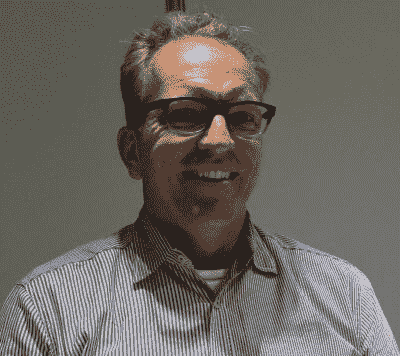

# 采访 VMware 新任首席开源官 Dirk Hohndel

> 原文：<https://thenewstack.io/makers-dirk-hohndel-vmware-role-open-source-commercial-software/>

“你不可能让每个人都满意，”Dirk Hohndel 解释道，他被任命为 VMware 的首席开源官才几个月。“我的目标不是让每个人都开心。我的目标是找到有共识的项目，为他们、为我们、为客户做得更好。”

在这一集的 [The New Stack Makers](/tag/the-new-stack-makers/) 播客中，Hohndel 讨论了任何人作为一家严格捍卫和保护其知识产权的公司的开源开发的公众形象时都必须执行的严格行为。

当集装箱化“运动”(比如他们在技术圈里)第一次开始时，Docker Inc .和 Docker 轨道附近的一些其他公司一起，着手进行一种基于软件的基础设施革命。这场变革的目标是颠覆传统的 IT 基础架构层，而 VMware 在过去十年中正是在这一层上站稳了脚跟。

然而，在短短的反击之后，VMware 继承了这场运动的衣钵。在 8 月下旬的 VMworld 2016 大会上，我们在本期播客中采访了 Hohndel，他正在整合组件和业务战略，目的是实际接管整个运动的领导权。

简而言之，VMware 希望在革命到来之前实现转型。

Hohndel 在加入 VMware 之前，他在开源社区的名声就已经是传奇了。他是最初的 SuSE Linux AG 组织的长期首席技术官，后来在英特尔领导了 15 年的开源工作。现在，他发现自己可能是 VMware 迄今为止所做的最重要工作的负责人:向开发社区推销 vSphere 集成的理念，而开发社区在很大程度上仍然将专有平台视为敌人。

现在请听由亚历克斯·威廉姆斯、基兰·奥利弗、卢克·勒弗勒和斯科特·富尔顿制作的对德克·霍恩德尔的采访:

[新的堆栈制作者:Dirk Hohndel，VMware 的开源负责人](https://thenewstack.simplecast.com/episodes/the-new-stack-makers-dirk-hohndel-vmwares-head-of-open-source)

Docker 是新堆栈的赞助商。

专题图片:[英国约克大教堂的君士坦丁大帝](https://commons.wikimedia.org/wiki/User:Gernot_Keller#/media/File:2009-04-13_ConstantineTheGreat_York.jpg)铜像，由 Gernot Keller 创作，授权于 [CC-BY 3.0](https://creativecommons.org/licenses/by/3.0/deed.en) 。

<svg xmlns:xlink="http://www.w3.org/1999/xlink" viewBox="0 0 68 31" version="1.1"><title>Group</title> <desc>Created with Sketch.</desc></svg>