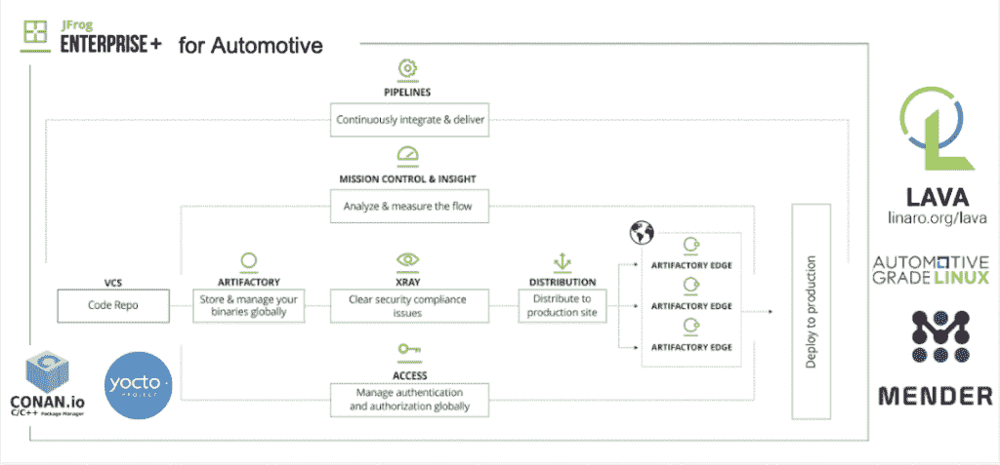

# 让无人驾驶汽车软件自动无缝更新

> 原文：<https://thenewstack.io/making-driverless-car-software-updates-automatic-seamless/>

JFrog 赞助了这篇文章，它是为新的堆栈独立编写的。

尽管所有的发展都在完善自动驾驶汽车，但许多挑战仍然存在。事实上，丰田研究所主任吉尔·普拉特在《纽约时报》的一篇 T2 文章中提到了该领域的“幻灭低谷”。

进入 JFrog，它的想法是[液体软件](https://liquidsoftware.com/)，JFrog 的术语是指持续更新而对用户没有影响的软件。上周在旧金山举行的年度[swamp 2019](https://swampup.jfrog.com/)用户大会上，它展示了一个远程控制模型的空中更新演示，开发者可以随时更新代码。

“我们的想法是，你只要打开汽车，它就应该有它需要的软件。业务开发副总裁 Kit Merker 在一次主题演讲中说:“你不应该计划停机时间或安排[维护]。[他把软件工程师等同于机械师。](https://swampup.jfrog.com/agenda/)

无人驾驶汽车的想法正在四处制造焦虑——包括用户、其他司机、行人甚至开发者。

“你不想成为编写代码的开发人员，可能是在星期五，导致召回，”他说。

美国汽车协会的最新调查发现，70%的美国人害怕自动驾驶汽车，怀疑程度比 2017 年的调查上升了 8 个百分点。

加剧这种焦虑的新闻报道包括:在中国，一名司机无意中触发了一个更新，导致交通堵塞一个小时，司机被困在里面无法打开车门或车窗。

在解决软件更新问题时，JFrog 团队提出了一些基本规则。

它所谓的规则 0，但显然是一个既定的:不要杀任何人！

“对于大多数软件来说，生死未卜，”Merker 说，并指出在驱动程序和开发人员之间建立信任至关重要。

项目的其他规则:

*   **转动钥匙，汽车就会跟上时代的步伐。**更新应该持续不断，并在最安全的时刻以用户几乎看不到的方式应用。只有在紧急情况下，用户才需要去服务中心或安排维护。虽然人们希望控制他们的维护，但理想情况下，这是一个自动化的无缝过程，可以避免用户不理解修复的关键性质的问题。
*   **随着时间的推移，汽车应该会变得更好。**改进的唯一方法是通过迭代，快速更新软件。尤其是安全问题仍然很难解决，并且会侵蚀信任。他指出 [JFrog Pipelines](/jfrog-pipelines-easier-unified-software-delivery/) 是一种迭代和自动化所有堆栈的方式，以及该公司在其安全和合规工具 XRay 中与基于风险的安全的 [VulnDB](https://vulndb.cyberriskanalytics.com/) 的集成，以识别和隔离漏洞。
*   应该可以减少司机和开发者的焦虑。自动化测试、更好地跟踪构建元数据、虚拟驾驶环境等对于在驱动程序和开发人员之间建立牢固的信任关系至关重要。

该公司使用其 Enterprise+平台来演示如何在汽车行驶时实现更新。它整合了用于嵌入式 Linux 的 [Yocto](https://www.yoctoproject.org/) 构建系统；[柯南](https://conan.io/)，其 C/C++包管理器；[汽车级 Linux](https://www.automotivelinux.org/) ，以及用于自动化设备管理和测试的物联网工具 Lava。

它依靠 [JFrog 发行版](https://www.jfrog.com/confluence/display/DIST/Welcome+to+JFrog+Distribution)向 [Artifactory Edge](https://www.jfrog.com/confluence/display/RTF/Artifactory+Edge) 节点交付发布包，将下载和安装分开，然后使用开源更新管理器[修补器](https://mender.io/)在设备上并行部署，在任何故障时都能够快速回滚到上一个安全版本。

“这是一个钢筋混凝土汽车的规模，但我们很乐意与你们所有人合作，以建立它的所有方式，”默克说，演示。“不仅仅是为了我们。我们希望让汽车行业的整个平台变得更加强大，我们希望一起努力。”

<svg xmlns:xlink="http://www.w3.org/1999/xlink" viewBox="0 0 68 31" version="1.1"><title>Group</title> <desc>Created with Sketch.</desc></svg>