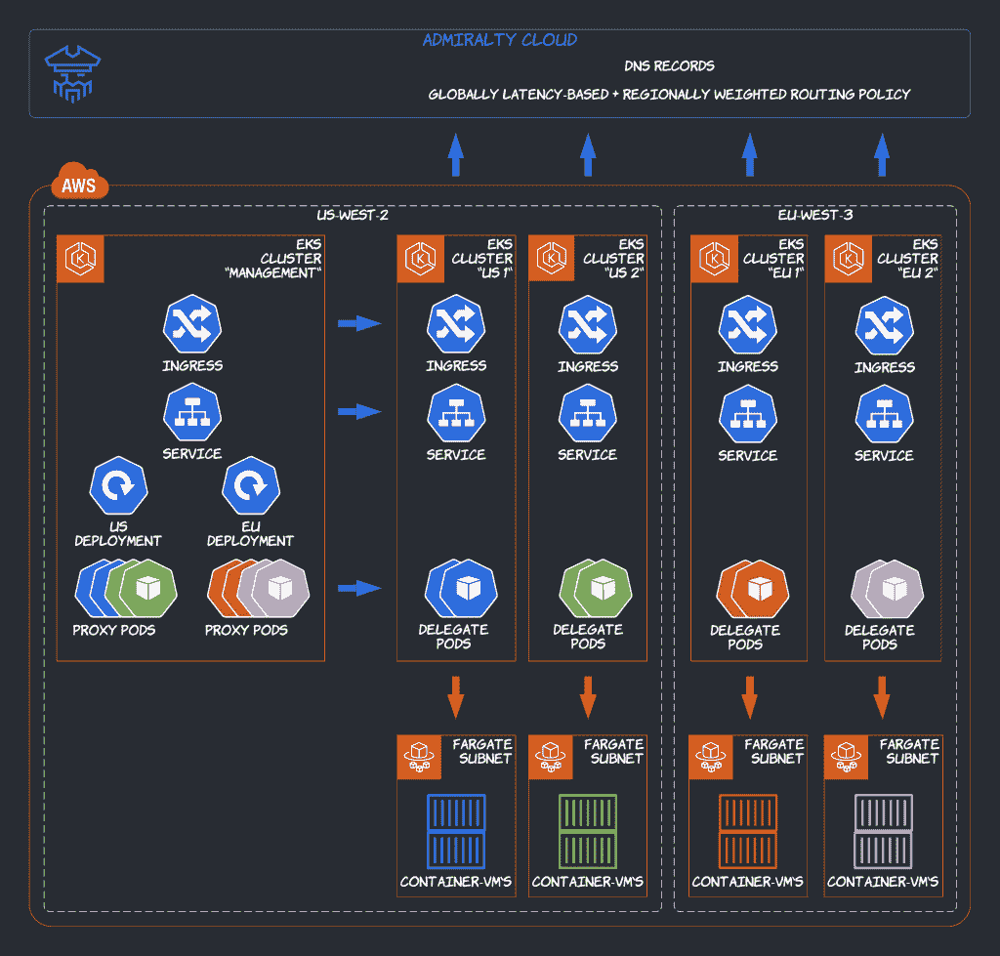
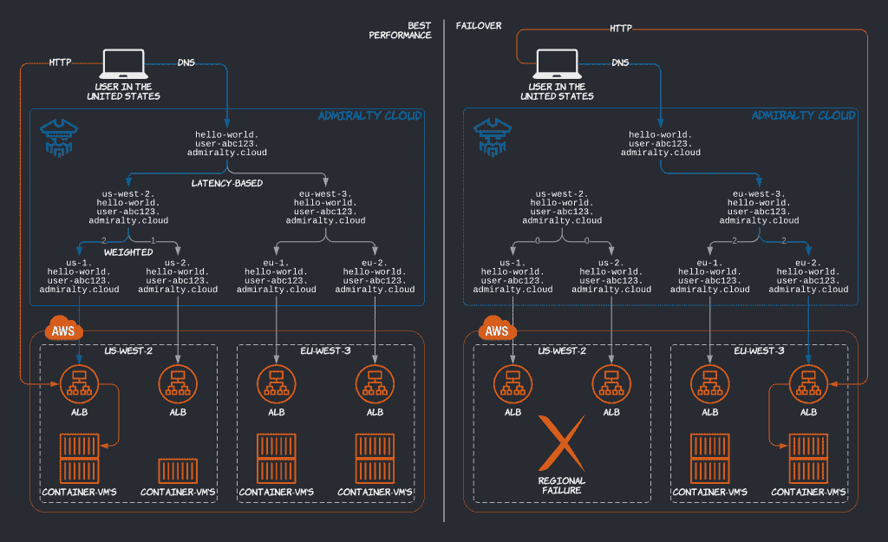

# 通过 EKS 和金钟的 AWS Fargate 使 Kubernetes 无服务器化和全球化

> 原文：<https://thenewstack.io/making-kubernetes-serverless-and-global-with-aws-fargate-on-eks-and-admiralty/>

[Adrien Trouillaud](https://twitter.com/adrienjt)

[Adrien Trouillaud 是 Admiralty 的创始人兼首席执行官，这是一家总部位于西雅图的初创公司，其背后是开源项目和同名的企业多集群应用管理平台。在加入海军部之前，Adrien 在 PayScale 的 Kubernetes 上开发并运行机器学习系统。在他的早期职业生涯中，他在法国跨国石油和天然气公司 Total 开发了高性能数值模拟器。他拥有巴黎中央理工学院的工程师学位(硕士学位)。](https://twitter.com/adrienjt)

高可用性(HA)、性能和开发人员效率已经成为新开发和传统软件应用程序现代化的关键。用户——无论他们在哪里——都不能容忍停机，并期望低延迟和高吞吐量；开发人员需要将他们的应用程序快速推向市场，并经常更新。这两种趋势是相互对立的:建立一个高可用性和高性能的应用程序并确保它保持这种状态需要时间。幸运的是，Kubernetes 和云原生生态系统为开发人员提供了部署高度可用的基于容器的应用程序的构建模块。(注:在这篇博文中，“开发者”包括运营商。)

为了进一步提高开发人员的效率，像 EKS 的[AWS Fargate](https://docs.aws.amazon.com/eks/latest/userguide/fargate.html)这样的工具从 Kubernetes 中删除了节点管理部分，只保留了应用程序管理 API:用户可以提交 Kubernetes 标准部署、服务和入口，让 AWS 启动大小合适的微型虚拟机来运行 pods，让[应用程序负载平衡器(ALBs)](https://docs.aws.amazon.com/eks/latest/userguide/alb-ingress.html) 来服务流量——为了完成网络堆栈，你可以让[外部 dns](https://github.com/kubernetes-sigs/external-dns/blob/master/docs/tutorials/aws.md) 配置 Route53，而[也许可以](https://github.com/aws/containers-roadmap/issues/904)

在这篇博文中，我们将讨论在多个地区使用多个支持 Fargate 的 Kubernetes 集群，通过 EKS 的[AWS Fargate](https://docs.aws.amazon.com/eks/latest/userguide/fargate.html)和 T2 的【金钟】使 Kubernetes 无服务器化和全球化。特别是，我们将在这个上下文中查看调度和入口；将考虑替代方案。想要亲身体验，请查看海军部文档中的配套[教程](https://admiralty.io/docs/tutorials/fargate)。

上面讨论的工具假设与开发人员的接口——或者更可能是他们选择的连续部署(CD)平台——是单个集群的 Kubernetes API。然而，大多数组织运行多个集群，主要是[使运行时隔离不那么令人头疼](https://aws.amazon.com/blogs/containers/multi-tenant-design-considerations-for-amazon-eks-clusters/)，但对于 HA 也是如此，因为[集群确实会失败](https://k8s.af/)。此外，回到“无论用户在哪里”的低延迟，组织通常在多个区域运行集群，以便更接近他们的用户。这产生了一系列新的问题。在这篇博文中，我们将重点关注将应用程序部署到多个集群，并将入口流量路由到多个集群，可能在多个区域。如果您想要支持跨集群流量，您还需要一个多集群服务网格(或 ad-hoc mTLS 和服务发现)，但是我们将在以后的博客文章中讨论这个主题。我们还假设存储被外部化为一个全局云数据库。

## 多集群调度

“将应用程序部署到多个集群”意味着将应用程序映射到集群(用于隔离)，和/或跨集群复制应用程序(用于高可用性和性能)。最简单的解决方案是将定制映射和复制逻辑作为一个 CD 问题来实现，并在所选集群中创建标准的 Kubernetes 部署。要将聚类“视为牛”，可以对聚类进行注册和标记，然后根据这些标记进行选择。 [Google Anthos](https://cloud.google.com/anthos/multicluster-management) 、 [Rancher Fleet](https://fleet.rancher.io/) 、 [kubefed](https://github.com/kubernetes-sigs/kubefed) 等等，都实现了这种方法。虽然内部简单，但它实际上增加了外部的复杂性(开发人员必须处理新的集群选择 API ),并且缺乏表达能力(例如，如何跨集群管理规模？).

海军部实施了一种不同的方法，提供一些内部复杂性(参见[多集群 pod 调度算法](https://admiralty.io/docs/concepts/scheduling))以保持用户体验简单。使用金钟，在管理集群中创建的单个标准 Kubernetes 部署可以跨多个工作负载集群，如果其节点选择器和其他标准调度约束与这些集群中的节点(或 Fargate 配置文件)匹配(不需要新的 API)。

关于表达能力，规模被视为一个多集群的概念。基于区域吞吐量的水平 pod 自动缩放器可以控制区域部署的规模；如果该部署的 M 个单元中有 N 个单元的群集离线，这 N 个单元会立即迁移到其他群集，以保持当前的副本总数为 M。使用其他工具，独立的水平单元自动缩放器会给应用程序带来不必要的压力，同时它们会逐渐对增加的群集负载做出反应。这种设计也非常适合批量工作负载，例如，“在 X GPUs 可用的任何地方运行这个作业。”

## 多集群入口

“将入口流量路由到多个集群”的解决方案可以分为三类:全球 DNS 路由策略、区域反向代理和全球[任播](https://en.wikipedia.org/wiki/Anycast)负载平衡器。

实现全局负载平衡的最简单/最便宜的方法是使用低 TTL 和智能路由策略来配置全局 DNS 记录(例如，使用 Route53)。在这种情况下，每个集群都有自己的入口控制器(EKS 上的 AWS Fargate 的 ALB，但其他集群可以使用不同的，甚至多个入口控制器，包括 [NGINX](https://kubernetes.github.io/ingress-nginx/) ，和/或负载平衡器类型的服务)。入口控制器创建特定于集群的端点。然后，您可以结合基于延迟和加权的路由策略来配置 DNS 记录，以获得全局高可用性和性能。海军部云自动化了这一过程。

如果您不希望依靠 DNS 来实现负载平衡，您应该使用外部反向代理或负载平衡器来代替。开源的 [Project Contour 的万向节](https://github.com/projectcontour/gimbal)和 [uSwitch 的 ygdrasil](https://github.com/uswitch/yggdrasil)是由多个集群共享的基于 [Envoy](https://www.envoyproxy.io/) 的入口控制器。使用 Gimbal，Envoy 运行在自己的集群中，而 Yggdrasil 的创建者更喜欢在 Kubernetes 之外运行 Envoy。遗憾的是，两者都不支持[全局负载均衡](https://www.envoyproxy.io/docs/envoy/latest/intro/arch_overview/upstream/load_balancing/overview%23global-load-balancing)。

为了两全其美，你会想要集成一个选播负载平衡器，比如 [AWS 全球加速器](https://aws.amazon.com/global-accelerator/)、 [Azure 前门](https://azure.microsoft.com/en-us/services/frontdoor/)、 [Cloudflare](https://www.cloudflare.com/load-balancing/) 、 [Fastly](https://www.fastly.com/products/load-balancing) ，或者开源的 [SeeSaw](https://github.com/google/seesaw) ，等等。这就是谷歌的 [Ingress for Anthos](https://cloud.google.com/kubernetes-engine/docs/concepts/ingress-for-anthos) 在 Anthos GKE 集群和谷歌云负载平衡之间所做的事情，以及金钟企业在 AWS 上的 Kubernetes 集群和 AWS 全球加速器之间所做的事情，以及其他集成。

## 实践

配套的[教程](https://admiralty.io/docs/tutorials/fargate)通过复制-粘贴指令，带您了解如何使用 EKS 上的 AWS Fargate、ALB ingress 控制器、海军部开源多集群调度程序和海军部云来公开全球服务。以下是总结:

1.  跨两个区域配置一个管理集群和四个工作负载集群。管理集群是一种常见的模式:Google Anthos 称之为配置集群；牧场主舰队称之为舰队经理等。
2.  在所有集群中安装金钟代理，并使用金钟云作为联合集群身份提供者的公钥目录来连接它们的控制平面。在工作负载集群中，安装 ALB 入口控制器和 Fargate 配置文件。
    
3.  使用不到 100 条 YAML 线路在管理集群中创建两个区域部署、一个服务和一个入口。反过来，海军部在工作负载集群中调度 pod，发送服务和入口，并配置 DNS 记录；而 AWS 在 Fargate 上运行容器，并在集群各自的区域中配置 ALB。
    
4.  从不同地区调用全球服务端点来测试性能，并模拟蓝/绿集群升级和集群故障来测试 HA。

## 结论

通过采用远至抽象节点的 Kubernetes 发行版(如 EKS 的 AWS Fargate)，并将它们与多集群应用管理平台(如金钟)相集成(可在全球范围内自动化部署、入口和其他问题)，可以协调高可用性、性能和开发效率。

<svg xmlns:xlink="http://www.w3.org/1999/xlink" viewBox="0 0 68 31" version="1.1"><title>Group</title> <desc>Created with Sketch.</desc></svg>