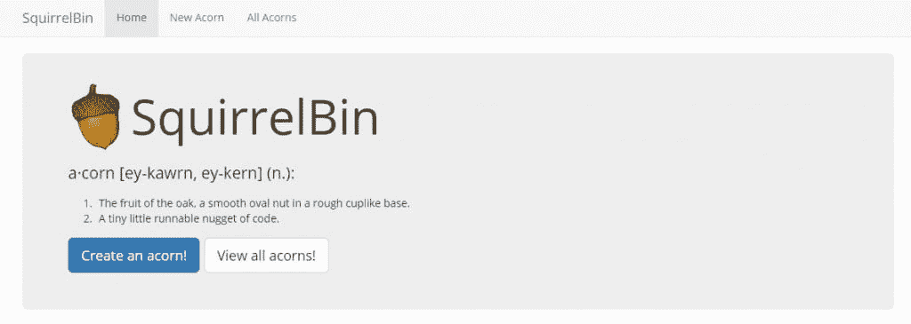

# 在 AWS 上实现可管理的微服务

> 原文：<https://thenewstack.io/making-manageable-microservices-aws/>

微服务的魅力在于你可以将单一的应用程序分解成更小、更易管理的块。诚然，这是一个伟大的想法，但是企业如何实现这种新的架构呢？

在俄勒冈州波特兰举行的 2015 年 Hashicon 大会上，与会者最近听取了来自[的 Chris Munns](https://www.linkedin.com/in/chrismunns) 关于这种新方法的简报，他是亚马逊网络服务 DevOps 业务开发经理。

Munns 解释说，当考虑一个组织是否应该将其较大的应用程序转变为基于微服务的应用程序时，设计师应该首先建立策略、规则和任务分配模式。

当我们将传统的开发人员管道作为一个整体来考虑时，在对应用程序进行编码和支持该应用程序的管道的其余部分所涉及的工作量之间可能会有很大的差异。这种差异会阻碍项目的进展。

如果一个项目的移交需要在生产过程中进行繁重的流程，这会拖延从代码完成到最终产品的时间，那么微服务可以提供一个解决方案来自动化更多占用这些宝贵时间的工作。

## 何时使用微服务，何时不使用

在其核心，微服务架构是一个简单的想法:每个微服务执行一个单一的任务，它们都通过 API 调用相互通信。

然而，在将现有的应用程序或公司流程迁移到这种新模型方面，这种方法会带来一些限制。

Munns 指出，那些依赖于大型数据库的应用程序可能很难迁移到基于微服务的方法，因为在不破坏其组件的情况下，很难移动数据库表或将其分成更小的部分。

还有其他的考虑。

对于较大的项目，团队成员可能已经离开了公司，留下了重叠的概念或部分代码，这使得在出现 bug 时很难评估谁负责拥有项目的一部分。

Munns 在整个演讲中强调，如果一个人的技术阻碍他们的公司在自动化服务方面向前发展，这很可能是由他们代码库中某处的特性债务引起的，应该对其进行评估。

> “微服务是一种模式。尽早定义你的标准，然后采用它们。选择一个标准并标准化它。自动化一切。”——克里斯·芒恩斯，亚马逊。

当构建多个微服务时，跨团队的协调会变得很困难。当进行转换时，软件开发团队必须明确定义谁负责哪个微服务，从而确保责任在整个团队中平等分担。

Munns 指出，较小的团队可能更依赖于重用代码和共享模块，以达到事半功倍的效果。使用微服务时，监控、指标、日志和安全等流程可能会给小型团队带来更大的挑战。Munns 鼓励这些团队在讨论重构以大规模处理负载之前对他们的应用程序进行性能调整，因为许多考虑这个过程的人实际上并不需要这样做。

在建立微服务内的工作模式时，Munns 提出了以下问题，以帮助团队在开始构建微服务之前概述如何最好地解决用例:

1.  客户端如何相互通信？
2.  如何处理跨服务授权？
3.  服务如何防止滥用？
4.  如何将持续集成构建到开发过程中？
5.  如何处理服务发现？

## 自动化管道

Munns 说，使用 API 网关大大减少了许多与微服务相关的常见问题，提供了一些好处，并制定了一些推动良好实践的约束。

AWS 提供自己的 [API 网关服务](https://aws.amazon.com/api-gateway/)，该服务为客户提供托管多个应用版本、分发 API 密钥、节流请求、缓存请求、为软件开发工具包(SDK)生成内容等能力。

构建微服务时的一个常见做法是将代码从流行的 API 框架 [Swagger](https://swagger.io/) 推入清单 API，然后进入 API 网关。

从那里，开发人员可以用任意数量的语言生成 SDK，捆绑 SDK，并使其可供开发团队的其他成员使用。Munns 指出，人们可以很容易地自动化这个工作流程的其余部分，强调在所有可能的情况下，自动化在开发中是至关重要的。

当使用需要稳定更新或能够跟踪版本变化、更新或依赖关系的应用程序时，使用能够使这一过程更有效的工具是很重要的。

[Versionize](http://versionize.fossrec.com/index.cgi/index) 提供了一种实现这些目标的方法，因为它跟踪代码库依赖。Versionize 然后可以通知其他开发人员，有一个新版本的服务可用，具有新的依赖项或需要更新的依赖项。

使用 API 网关消除了应用程序开发过程中的许多上述问题。如果一个人确保每个从事项目的开发人员都遵循一个固定的模式，微服务就可以相对容易地开发出来。

## EC2、容器和λ

Munns 说，许多在 AWS 上管理微服务的团队正在使用亚马逊的 EC2 实例运行它们。使用微服务时，最好只在一个容器中部署一个微服务。如果将多个微服务打包到一个容器中，扩展可能会成为一个问题，因为一个服务可能比另一个服务需要更多的系统功率，这可能导致其他服务的资源匮乏。考虑到这一点，在一个容器中拥有多个微服务最好通过设置系统使用限制或在一个节点集群中分布服务来实现。

Munns 指出，在开发服务目录时，可以创建预定义的环境，并使用 [Terraform](https://terraform.io/) 快速扩展。EC2 提供了大规模的可靠性，有各种工具和工作流增强来支持它。

更大的 EC2 实例类型意味着开发人员有更多的系统能力来运行服务，而大规模运行的运营开销更少。Munns 指出，开发人员可以使用 Consul 将服务指向另一个服务，从而允许更简化的系统发现。

> “如果您遇到的情况是，您管理的容器管理器多于您的服务，那么这就是一个问题。”——克里斯·芒恩斯，亚马逊。

另一个选择是使用容器。容器技术仍然相对较新。虽然多个容器可以减轻系统的负担，但仍然存在运行太多服务器以有效协调所有微服务的问题。

[AWS Lambda](https://thenewstack.io/aws-gets-serious-lambda-adds-python-cron-scheduling/) 服务提供了一个解决方案，为开发过程的这一部分提供了急需的自动化。

[AWS Lambda](https://aws.amazon.com/documentation/lambda/) 轻松管理 EC2 实例，Munns 断言。Lambda 负责日志记录、打补丁和其他任务，因此开发人员不必经常监控一个实例。Lambda 可以在没有预配置的情况下交付执行。它可以触发来自 S3(简单存储服务)和其他内部 AWS 服务的推送通知功能。Lambda 功能也可以由外部事件触发，如移动或浏览器数据流，进入 [Amazon Kinesis](https://aws.amazon.com/kinesis/) 或 [DynamoDB](https://aws.amazon.com/dynamodb/) 。

这里有一个 Lambda 的例子: [SquirrelBin](http://squirrelbin.com/#/) 是一个在 AWS Lambda 中编排的无服务器 web 应用。Munns 指出，前端是用 Javascript 编写的，在 S3 可以通过浏览器访问。Javascript 浏览器然后与 API 网关通信，API 网关继续与 Lambda 通信，Lambda 又执行一个函数与 DynamoDB 通信。

【T2

SquirrelBin 只是 Lambda 和微服务管理的自动化应用工作流的一个例子。总的来说，AWS Lambda 提供了一种管理微服务的强大方法，同时为软件开发人员提供了一种更好的方法来设计、处理和优先化他们的项目管道。

<svg xmlns:xlink="http://www.w3.org/1999/xlink" viewBox="0 0 68 31" version="1.1"><title>Group</title> <desc>Created with Sketch.</desc></svg>