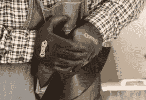

# 旧黑胶唱片的新艺术

> 原文：<https://thenewstack.io/making-new-art-old-vinyl-records/>

即使消费者的心被其他形式的存储媒体所赢得，曾经存储我们最喜爱的音乐的闪亮黑胶唱片也不会成为历史的垃圾堆。艺术家们仍然在寻找创造性的方式来纪念黑胶唱片在过去一代人对音乐的热爱中的作用——通过使用黑胶唱片来制作艺术！

对于布鲁克林的艺术家格雷格·弗雷德里克来说，这是从他在街上发现一盒废弃的唱片开始的。六年来，他一直在用电子设备网站数字趋势[称之为](https://www.digitaltrends.com/music/greg-frederick-vinyl-pop-art-broken-record-interview/)的“错综复杂的乙烯基唱片挂毯”为音乐行业的偶像画像大卫·鲍依、鲍勃·马利、普林斯和艾米·怀恩豪斯现在被永久保存在树脂包裹的乙烯基里。

他成功地将这一切变成了一项名为[黑胶波普艺术](http://www.vinylpopart.com/portfolio)的业务。

https://www.instagram.com/p/BEedoBZAW-x/

“我从 10 岁起就是黑胶唱片的爱好者，”他在视频采访中告诉 Digital Trends。“我继承了我祖母的唱盘，然后在高中，我在唱片店工作。我一直都在黑胶身边。”

也许他不可避免地对这种特殊的音乐媒体产生了某种敬意。

Digital Trends 对格雷格·弗雷德里克的视频采访截图

“我从来不会为了破纪录而买新唱片，”他告诉《数字趋势》。当他需要更多的时候，他开始在易贝寻找更多的黑胶唱片。现在，当地的唱片商店从他们的“美元箱”里向他捐款。他估计他的壁橱里现在藏着 3000 张黑胶唱片。

发展他的混合媒体风格需要一些实验。首先，他尝试在照片中加入乙烯基。然后他做了同样的事情——但是没有照片。据 Digital Trends 称，他坚持只使用“废弃的、无法播放的”唱片。

一点一点地，它们变成了杰瑞·加西亚、吉米·亨德里克斯、迈克尔·杰克逊和流行音乐世界中所有其他逝去的偶像的亲切肖像。

https://www.instagram.com/p/BThrRMHlQaj/

他也画过在世艺术家的肖像。有米克·贾格尔、汤姆·佩蒂，甚至还有野兽男孩和村里的人。很快他们都在乙烯基找到了新家。关于他在《鼠帮》中的一幕，有一点特别令人心酸:

https://www.instagram.com/p/0b5s52gW2R/

他还重现了埃尔维斯·普雷斯利的冷漠和沉思，以及 T2·柯特·科本的绝望面容:

https://www.instagram.com/p/6x1izVgW6y/

本月初，弗雷德里克还宣布了“大新闻！”在他的推特上。“我在拉碧昂斯！我一直在秘密努力创作一个全新的艺术系列，并正在展示它。”秘密？他现在也在研究盒式磁带——用它们创造塑料“画布”,在上面粘贴黑胶唱片。但是即使是这些磁带也被亲切地保存在一层透明树脂中。(弗雷德里克告诉该网站，小心翼翼地消除他作品中每一层树脂的气泡需要一整天的时间，所以每一件作品都需要“一周的时间”)

他估计至少花了 40 个小时来拼凑迈克尔·杰克逊的拼贴画，用的是迈克尔著名的手套的闪亮 CD。他还用几张 CD 精心制作了 T4 和辛迪·劳博尔的形象。

那些不是他使用的唯一材料。弗雷德里克曾经制作了一件艺术品，其中包含了 98 年前发黄的 1919 年《华尔街日报》。他把它们安装在两扇门上，然后用它作为黄色画布，用黑色乙烯基唱片的碎片创作了一幅令人惊叹的自由女神像[肖像。](https://www.facebook.com/vinylpopart/posts/1401463689892526)

https://www.instagram.com/p/BSNNyC2FaGH/

有时，顾客甚至会委托制作音乐行业人士的肖像，作为独特的礼物送给他们。他两次被委托创作主持人的肖像，有一次甚至被委托创作史蒂薇·妮克斯的肖像。

“你可能有机会把一个心爱的人或你最喜欢的图标变成一个原创的杰作，”他的网站解释道。

https://www.instagram.com/p/vE6IxNgWzm/

弗雷德里克的工作让他结交了一些有趣的朋友。

他的网站提到他和安迪·沃霍尔一起在莱斯利·罗曼博物馆展出。他的[Jay Z](https://www.facebook.com/vinylpopart/photos/a.1458650144173880.1073741856.275654599140113/1458650157507212/?type=3&theater)的黑胶唱片和磁带肖像现在挂在世贸中心旁边的世贸展览馆。2015 年，他成为《纽约每日新闻》的头条——因为他声称科特妮·洛芙将他的作品用于旅游商品——然后[没有](http://www.nydailynews.com/entertainment/gossip/confidential/artist-courtney-love-owes-sale-concert-items-article-1.2221204) [付给他](http://www.vinylpopart.com/courtney-love-long-story)。

弗雷德里克并不是唯一一个将黑胶唱片重新用作艺术的人。2015 年，加利福尼亚州戴维斯市市长庆祝了一座两层楼的狗艺术雕塑的揭幕——装饰着周围社区捐赠的黑胶唱片。这只狗巨人显然取代了一个彩色的(但更小的)金字塔——也是用黑胶唱片装饰的。在此之前，一个 18 英尺高的雕塑被艺术家命名为“[斯坦潜水人](http://www.davisenterprise.com/local-news/public-art-a-changing-exhibit-booster-says/)”

英国艺术家基思·海恩斯也向黑胶唱片致敬。他告诉一位采访者，是唱片封套艺术启发了他去艺术学校，并将他的工作描述为“用流行材料创造的流行艺术”但是他从创作唱片艺术家的肖像——使用他们自己的唱片——到创作地图。具体来说，*地铁*地图，每张黑胶唱片代表一个站点。有些装置甚至配有一副耳机，这样你就可以听每张唱片的音轨。

看到这些艺术家回忆起唱片的音乐魔力对之前的几代人意味着什么，令人感动。数字趋势视频以记者小基思·纳尔逊的妙语结束。

"即使音乐停止，艺术也不必停止."

* * *

# WebReduce

专题图片:野兽男孩，作者[格雷格·弗雷德里克](http://www.vinylpopart.com/portfolio?lightbox=image1m2z)。

<svg xmlns:xlink="http://www.w3.org/1999/xlink" viewBox="0 0 68 31" version="1.1"><title>Group</title> <desc>Created with Sketch.</desc></svg>