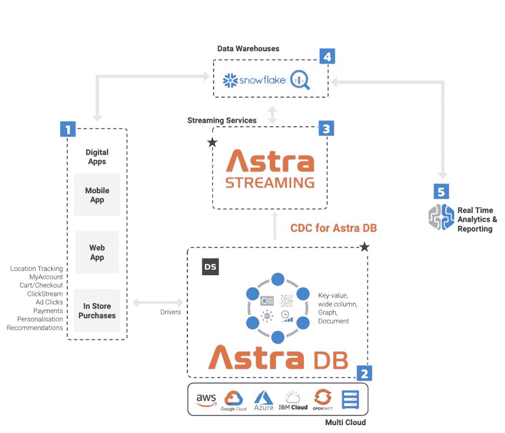

# 让实时数据成为现实:改变 Astra DB 的数据采集

> 原文：<https://thenewstack.io/making-real-time-data-real-change-data-capture-for-astra-db/>

 [克里斯·拉蒂默

克里斯·拉蒂默是 DataStax 的产品管理副总裁，负责领导该公司在事件流和云消息方面的产品战略。在加入 DataStax 之前，Chris 在谷歌、NetJets 和 Apigee 等公司担任软件工程师、架构师和产品经理，在技术领域工作了 20 多年。](https://www.linkedin.com/in/chrislatimer/) 

*data tax Astra DB 新增的变更数据捕获功能可以简化事件驱动架构。*

作为一名开发人员，如果您正在考虑您的数据库，很可能这不是您的选择。查询运行缓慢，您正在检索的数据看起来不像您预期的那样，出现了中断，您正在努力让事情重新运行起来。理想情况下，数据库可以正常工作，您可以专注于您的应用程序。

这就是 DataStax 在开发 Astra DB(我们基于 Apache Cassandra 的数据库即服务)时所追求的目标。然而，没有一个应用程序是孤立的，正如组织需要开发人员优化的方式来管理运营数据一样，他们也需要一种方式来实时连接整个生态系统中的数据，最好不要将这些责任推给应用层。

今天，我们发布了针对 DataStax Astra DB 的[变更数据捕获(CDC ),这是我们面向云环境的无服务器数据库系统。](https://dtsx.io/3NbRrih)

CDC 服务建立在[Astra Streaming—](https://dtsx.io/3JEDFCZ)DataStax 的 [Apache Pulsar](https://pulsar.apache.org/) 云服务的基础上，支持在单个数据库表发生数据更改时捕获这些更改，并允许组织在任何需要的地方传输这些更改:雪花、其他 SQL 或 NoSQL 数据存储、谷歌云发布/订阅、Kafka、Kinesis 等等。

这些功能可以使企业更容易使用实时数据进行即时决策和情报。

## 走向统一的事件驱动架构

CDC 将发布事件的责任委托给数据库。由于在事件驱动架构中发布的许多事件与提交给数据库的更改一致，这简化了应用程序的角色。同时，因为 CDC 是配置驱动的，所以只需在数据库层的新表上启用 CDC，就可以实现新的事件类型。

这消除了每次需要新事件时额外的开发、测试和发布开销。它还消除了这样的情况，即应用程序试图通过发布大量下游系统不关心的事件来保护自己，从而浪费中间件资源并创建大量容易导致代码腐烂的代码。

CDC for Astra DB 旨在从 Astra DB 数据库中捕获事件，并将其发布给下游消费者。但由于 CDC for Astra DB 将这些事件流发布到 Astra Streaming，因此事件可以从其他来源获取，包括来自其他数据库的 CDC，直接来自应用程序，甚至来自 Kafka、Kinesis 或更旧的 MQ 平台等消息系统。

由于 Astra Streaming 支持队列、发布/订阅、事件流和轻量级流处理的消息传递语义，因此它为许多企业目前面临的支离破碎、完全不同的数据运动状态提供了一种替代方案。

## CDC 如何实现实时数据管道？

除了事件驱动架构之外，用于 Astra DB 的 CDC 也有助于加速数据工程。通用用例是实时数据管道。这方面的一个主要例子是需要通过将数据从 Astra DB 流式传输到数据仓库(如雪花)来提供实时分析和报告。

## 分析就绪数据

传统的商业智能长期以来依赖于批处理将数据从运营数据存储转移到数据仓库，以用于报告和分析目的。但是这种批处理造成的滞后越来越不符合对最新信息的需求。

有了 CDC for Astra DB，延迟的批处理作业可以被即时更新所取代，即时更新可以自动将 Astra DB 中的数据更改传输到数据仓库解决方案中，从而提供始终反映数据当前状态的准确画面。

它是这样工作的:应用程序生成数据(例如，广告点击、支付和位置数据)并将这些数据写入它们的数据库，在下面的例子中是 Astra DB。CDC for Astra DB 会自动检测变化，并将其推送到 DataStax 的云原生数据流和事件流处理服务 [Astra Streaming](https://docs.datastax.com/en/astra-streaming/docs/) 中进行处理。

使用内置连接器连接到 Snowflake 或任何具有 JDBC (Java database connectivity，Java 数据库连接)接口的平台，数据的更新视图被推送到下游数据仓库。一旦它们被填充，数据仓库就为报告和数据转换功能创建视图，以所需的格式组织数据。这使得能够通过内置于数据仓库或与数据仓库集成的报告工具，实时了解组织数据的关键方面。

CDC for Astra DB 如何为实时报告填充数据仓库(来源:DataStax)

CDC for Astra DB 还有其他几个重要的使用案例，包括:

## 搜索集成

Cassandra 是一个高度可伸缩的数据库，以其令人印象深刻的读写性能而闻名。但有时数据需要从 Cassandra 转移到更有针对性的搜索解决方案，如 ElasticSearch。在这些情况下，CDC for Astra DB 简化了流程，并实时自动更新您的搜索索引。

## 操作 ML

数据科学通常涉及对时间序列数据的分析，这并不总是容易捕捉的。借助 CDC for Astra DB，数据科学家可以更轻松地访问时间序列数据的事件流，该事件流以逐个表格的方式呈现发生的变化。

这些时间序列在训练 ML 模型中起着关键作用，ML 模型可用于提取更大的洞察力和预测能力。虽然这些模型本身很有价值，但通过使用 Pulsar 函数等功能，利用这些模型作为流数据管道的一部分来实时丰富数据，可以进一步实现将它们作为动态数据策略的一部分进行操作。

面向 Astra DB 的 CDC 还使组织能够:

*   构建响应 CDC 变更事件的应用程序来驱动业务逻辑，以响应 Astra 数据库中检测到的变更。
*   与 Twilio 或 Firebase 等平台集成，以便在 Astra 数据库发生变化时发送短信或推送通知
*   获得对异常行为的可见性，这些异常行为可能表明 CDC 的可消费事件数据流存在安全漏洞。

总之， [CDC for Astra DB](https://dtsx.io/3tx0Auk) 旨在通过降低复杂性和将围绕数据变更事件的跨领域能力委托给事实的来源:数据库来简化开发人员的生活。

<svg xmlns:xlink="http://www.w3.org/1999/xlink" viewBox="0 0 68 31" version="1.1"><title>Group</title> <desc>Created with Sketch.</desc></svg>