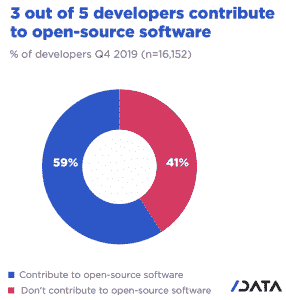

# 让安全成为开源社区的事情

> 原文：<https://thenewstack.io/making-security-an-open-source-community-affair/>

亚马逊网络服务(AWS) 赞助了这篇文章。

 [马特·阿萨伊

Matt 是 AWS 的负责人，参与了开源及其支持的所有领域(云、机器学习、数据基础设施、移动等。)近二十年来，为各种开源公司工作，并定期为 InfoWorld 和 TechRepublic 撰写文章。你可以在推特上关注他(@mjasay)。](https://www.linkedin.com/in/mjasay/) 

100 多年来，我们一直崇拜个人发明家——那些相对默默无闻地辛勤工作，直到灵感迸发的人。然后，砰！玛丽·居里让我们了解了放射性。或者托马斯·爱迪生使白炽灯泡成为商业现实。或者任何数量的发明家，他们一次一个专利地改变了我们的生活。

这很好，我们应该对这样的发明家表示感谢，但这并不是我们今天一些最好的创新发生的原因。

我们经常把发明和创新混为一谈，尽管事实上——正如 HackerOne 首席执行官[马丁·米科斯所说的那样,“发明和创新之间有着天壤之别。”为什么"大多数发明从未到达消费者手中或为社会所用."](https://aws.amazon.com/blogs/startups/hackerone-ceo-on-innovation-by-community/)

爱迪生的每一项改变生活的专利，都有成千上万项堵塞国家专利局——要么毫无用处，要么积极阻碍其他发明。相比之下，创新——尤其是社区驱动的创新——几乎从一开始就被定义为有用的，因为社区塑造创新以适应现实世界的需求。

这是如何工作的？很高兴你问了。

## **需要一个社区**

无论是学校、公司、政府还是其他机构，你都不可能雇佣所有你想雇佣的人。这是 Sun Microsystems 的联合创始人比尔·乔伊(Bill Joy)提出的原则，是社区主导创新的基础。Joy，谈到公司的 Java 战略，[说](https://en.wikipedia.org/wiki/Joy%27s_law_(management))，“世界上最聪明的人并不都为我们工作。他们大多为别人工作。诀窍是让你公司以外的优秀人才支持你的技术是值得的。当其他地方的人和你一起解决问题时，创新会更快。”

当 Joy 在 20 世纪 90 年代这样说的时候，开源并不是一个真正的东西。是的，Linus Torvalds 在摆弄 Linux，布莱恩·贝伦多夫和其他人在启动 Apache HTTP Server，但是直到 1998 年,“开源”这个术语才被创造出来。

然而，今天，开源不仅仅是一个聪明的短语——它描述了世界上许多最重要、最具创新性的软件的创建方式。然而，“开源”也描述了可能有适当许可的软件，但是没有社区支持的好处。

我已经[写了](https://thenewstack.io/why-the-best-open-source-is-community-led-open-source/)关于为什么社区主导的开源是最有生产力和最有用的开源软件。但是，真的，这归结为快乐原则。最聪明的开发人员不会为你工作。因此，你需要想办法在你的防火墙之外收集他人的才能和见解。

## **让安全成为社区事务**

考虑到 Mickos 花了多少时间运营开源公司，包括 MySQL AB 和 Eucalyptus，他想出一种方法将开源原则应用到安全等其他领域就不足为奇了。 [HackerOne](https://www.hackerone.com/) 运行赏金程序，让怀特哈特黑客专注于解决复杂的软件安全问题。HackerOne 模型背后的驱动力是快乐原则:没有一家公司能够雇佣足够的开发人员来满足他们的安全需求。

或者，正如米科斯所说，

一个怀特哈特——因为他们被称为区别于犯罪黑帽——拥有好奇心和创造力，远远超过任何人造系统或工具。试图在组织内部解决问题并没有奏效。向全世界公开并分享这个问题，立刻产生了一个可行的解决方案，一个可以无限扩展的解决方案。这是 HackerOne 的关键创新。一个新的性能维度被创造出来，不是由一个或几个有深度的专家的发明，而是通过将问题外包给整个世界。当你大规模利用人类的创造力和多样性时，创新是无止境的。

在米科什与我分享的另一篇文章(尚未发表)中，他指出，“每个组织都会对专门的人类能力有暂时的需求，但没有一个组织能够永久地雇佣所有这些人。”

通过利用超越任何特定雇主的社区，我们向自己开放广泛、多样的见解和方法来解决安全(和无数其他业务)问题。在安全领域，他接着说，“没有任何软件或内部专家团队可以与一群看似随机组合的黑客的技能和创造力相提并论。”

## **进入开源社区**

如前所述，同样的原则也适用于开源软件开发。根据米科斯的说法，“没有一家公司一直需要世界上最好的专家，但所有公司都需要他们。”在软件领域，许多专家选择通过开源贡献来展示他们的才华。

虽然很难获得开源开发者的准确数量，但是最近 SlashData 调查了超过 16，000 名开发者，发现近 60%的开发者为开源软件项目做出了贡献。

这与来自超过 90，000 名开发者的[栈溢出调查](https://insights.stackoverflow.com/survey/2019#developer-profile)的结果相吻合，该调查发现大约 65%的被调查开发者为开源项目做贡献。

如果我们假设 60%的开发人员希望至少奉献一些时间给开源，并以世界上开发人员的总数来衡量，那么有大量的开发人员可以提供帮助。有多大？SlashData 估计开发者总数为 1900 万(其中 1300 万是专业人士)。GitHub 将这个数字定得更高，为 4000 万。但即使在 10 年前，也有 1000 万 MySQL 用户，这只是一个项目，这可能意味着全球开发者人数是这个数字的数倍。

在开发人员估计的低端，我们得到一个大约 780 万到 1140 万开源贡献者的数字。如果我们采用更高的估计值，我们就要在给定开源项目的数千万潜在贡献者中跋涉。

太高了？即使假设最低人口数的 10%(见鬼，就拿 1%来说)，也会产生一个难以置信的开发者群体，他们共同为 GitHub 和其他地方的 1 亿多个开源项目做出贡献。

正如比尔·乔伊指出的，你不可能雇佣所有这些人。有了社区驱动的开源，你就不必了。

通过 Pixabay 的特征图像。

<svg xmlns:xlink="http://www.w3.org/1999/xlink" viewBox="0 0 68 31" version="1.1"><title>Group</title> <desc>Created with Sketch.</desc></svg>