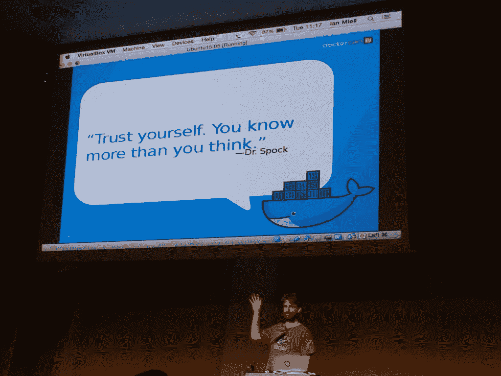
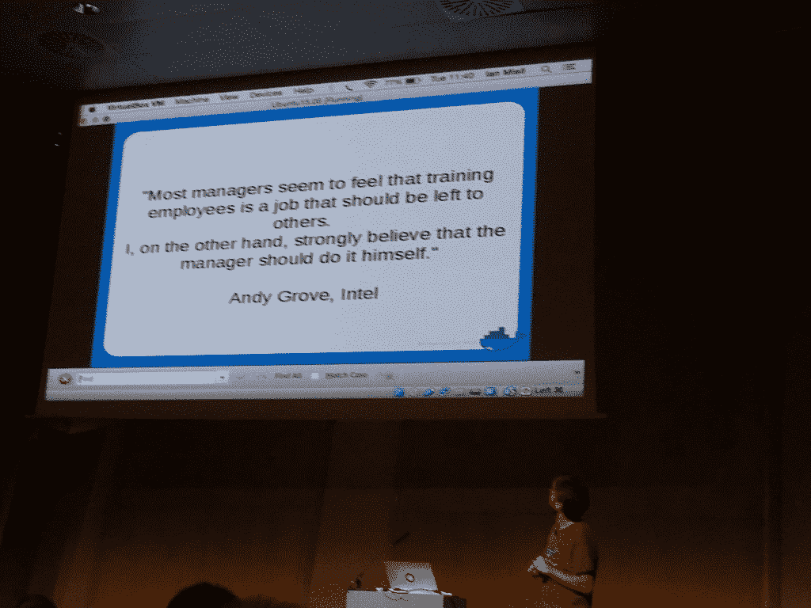
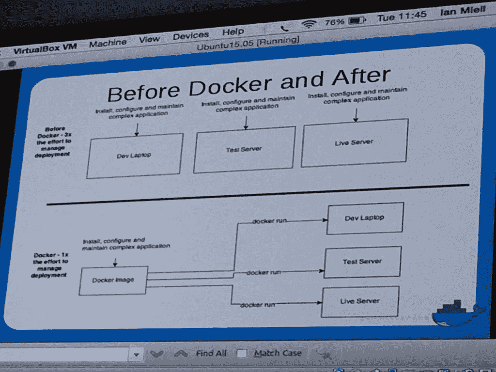

# 如何管理容器带来的变化

> 原文：<https://thenewstack.io/manage-change-docker-brings/>

虽然我们喜欢蓝鲸莫莉带我们游向的集装箱化世界，但集装箱和微服务器带来的技术优势也带来了隐含的文化变化。如果处理不当，它们可能会扰乱工作场所的常规，而且不是以一种好的方式。

就像在引入 [scrum](https://thenewstack.io/agile-management-how-to-manage-microservices-with-your-team/) 和其他激进的重组过程时一样，将微服务架构引入您的团队不应该被轻视，也不应该自上而下地进行。在本周于巴塞罗纳举行的 Dockercon EU 上，《 [Docker in Practice](https://www.manning.com/books/docker-in-practice) 》一书的作者 [Ian Miell](https://twitter.com/ianmiell) ，概述了团队领导应该期待什么，以及如何管理容器和微服务带来的变化。

## 了解你的团队

归根结底，你了解你的团队、你的环境、你的工作流程和你的需求。那是强大的。

“相信你自己，这真的是一个战斗的号召，”米尔说。“两年前，当我在我的公司介绍 Docker 时，人们说你这样做是错误的，你应该这样做。”但是“我有过去失败的经验来相信我的直觉。”

他说，作为一名团队领导，你只需相信自己，因为你了解当地的环境，也知道当地的环境解决方案。“你知道你的企业的答案。”

对于米尔来说，走向 Docker 的行动要追溯到 2013 年，当时他看到了惊人的 *Wired* 文章“[将建造一台互联网大小的计算机的人](http://www.wired.com/2013/09/docker/)”创始人 Solomon Hykes 最近推出了他的开源软件，旨在标准化互联网和世界各地的应用程序。

米尔读完信后说:“这就是我一直在等待的！”当时，他是 OpenBet 在线赌博平台 600 名开发人员团队的 DevOps 主管，在 25 名竞争客户之间周旋，这些客户都有自己的需求和期望。“有钱的客户，乐于为支持付费。出了问题，他们很乐意冲我大喊大叫。”

但是当需要改变 Docker 的时候，让他最难过的并不是客户。

“我很沮丧，因为每个人都很接受技术债务，”米尔解释道。“我每天都面临着管理停机的后果。”

但是当时的标准是使用虚拟机(VM)来管理持续交付的需求。由于认为这不符合他的特殊需求，Miell 将他的决策过程分为四个阶段:

**项目与秘密工程**—项目伴随着结构、批准和资金，而秘密工程将是一个有动力的基金和民主系统，投资将不得不推迟。选择臭鼬工厂后，他很快意识到“那些不提供任何东西的人发现他们没有发言权，然后就退出了。但那些提供了帮助的人发现，他们确实有发言权。”他解释说，在你绕开流程并利用个人的经验和知识的组织中，秘密工作特别有效。“通过专注于构建解决方案而不是从其他地方获得支持，节省了大量时间。”

**微服务 vs . Monolith**—这是他采用标准的时候了，因为他根本无法忍受克服 15 年遗留代码的想法。他指出，许多公司可以从使用 Docker 实现微服务中受益，但它不仅仅需要用于此。

**标准工具与此处未发明的工具**—标准工具是指最受支持和经过验证的工具，而 NIH 指的是快速、功能充足、投资延期的工具。这就是他受到很多反对的地方，人们说“你应该在这里使用行业标准工具”，他回答说“好吧，继续，我们会写一个。”它叫做 ShutIt。

**秘密与公开**——秘密提供控制和关注，而公开冒着“因自行车脱落而死亡”(每个人都知道一切)的风险，但培养了买入并收获了他们无法抗拒的利益。

米尔通过了他的团队的每一个决定，因为“自上而下不起作用。”他接着评论说，人们认为他们自己的公司运作不良，而其他公司已经解决了所有问题。

他说相信你的判断，因为“如果你在一个赚钱的行业，它一定擅长什么”，也就是解决你领域内的问题。

## 准备，准备

## 

业务软件采用失败的最常见原因是入职失败。事实上，数字世界中的几乎所有东西都属于这个重复失败的系统。团队有一天醒来，砰！他们应该使用新的东西。这不是你采用 Docker 的方式，也不是其他任何技术。你需要从说服你的队友做出决定开始——你为什么要迁移到 Docker，它将如何使他们的工作变得更容易——并制定和传达一个实施计划——如何使用 Docker，以及你将以什么样的顺序装箱。

因为 Docker 不是一个万能的工具，所以你应该和你的同事一起公开审查他们已经在使用的流程，尝试预测他们会受到怎样的影响，并集思广益，找出你可能进一步需要的任何方法和解决方法。

这些都应该尽可能提前完成，至少召开一次会议——但可能是几次，因为这可能需要每天以新的方式思考流程——特别是针对 Docker 的会议。

哦，最重要的是，这些会议必须将开发人员和运营人员聚集在一起。在这里，您可以稍微放松一下，几乎迫使开发人员和运营人员一起工作至少几天，坐在一起，尝试彼此的角色，有机地培养同理心。

## 扳动开关

除非你是从零开始建立业务、应用程序或软件，否则切换到 Docker 不可能一蹴而就。而且开发人员不想在项目中期切换到 Docker，所以最终实现的时间比预期的要长。但是一旦他们这样做了，米尔说就会有明显的文化转变。

你可以看到(上图)这个过程是如何突然变得清晰起来的。团队之间的摩擦大大减少，因为没有关于环境考古的讨论，“因为每个开发人员都可以选择在她自己的语言和空间中工作，并且运营可以复制相同的环境。

Miell 说 Docker 的一些早期胜利包括:

*   当发生崩溃时，他们能够通过笔记本电脑在几分钟内完成配置。
*   在减少重复劳动的基础上提高交付速度。
*   日常重建。
*   循环早期的迭代。

但是，由于这是一个大企业，一旦他做出了这些决定并实施了这些决定，说服楼上的人的唯一方法就是证明它是否有节约成本的结果。因为 Docker，他每个月能够节省相当于四个开发人员工作日的时间

关于使用 Docker，Miell 的最后一条建议是“尽可能避免依赖和官僚主义。一步一步地思考，然后一路向前展望未来。”

Docker 是新堆栈的赞助商。

专题图片:高迪的[圣家族大教堂](http://www.sagradafamilia.org/en/)在巴塞罗纳，via Pixabay。

<svg xmlns:xlink="http://www.w3.org/1999/xlink" viewBox="0 0 68 31" version="1.1"><title>Group</title> <desc>Created with Sketch.</desc></svg>