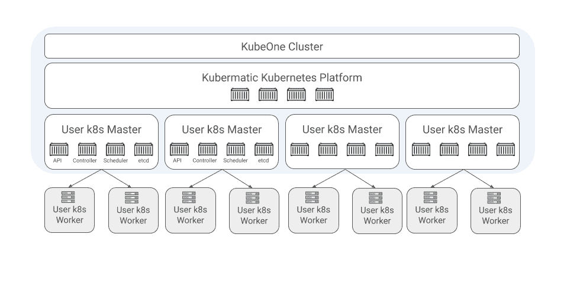
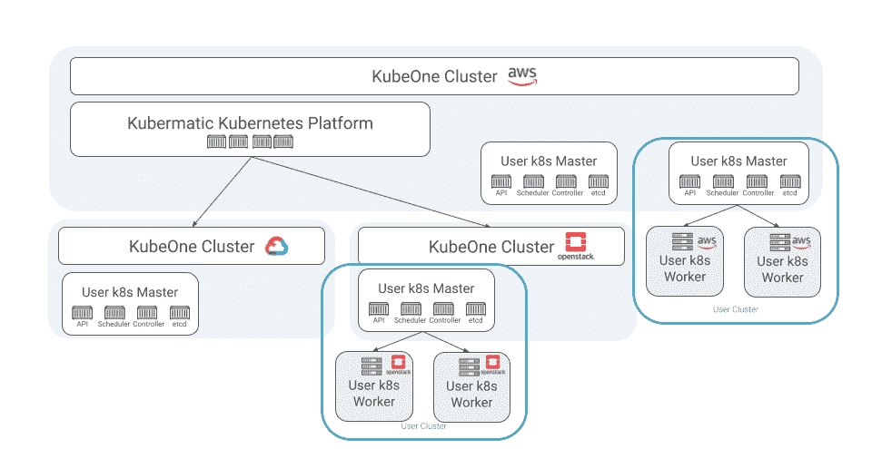

# 通过运营商管理多集群 Kubernetes

> 原文：<https://thenewstack.io/manage-multicluster-kubernetes-with-operators/>

 [萨沙哈斯

萨沙哈斯是 Kubermatic 的副总裁 Edge。他的职业生涯专注于通过正确的技术和正确的人带来价值。在加入 Kubermatic 之前，他曾在不同的云服务提供商处从事 Kubermatic Kubernetes 平台的工作，并建立了一家不断为其市场增值的公司。Sascha 在柏林工作和生活。](https://www.linkedin.com/in/haasesascha/) 

在 [Kubermatic](https://www.kubermatic.com/) 公司，我们一直在帮助我们的客户交付 Kubernetes 集群和其他云原生解决方案，在它们成为流行词汇之前。我们帮助客户使用 Ansible、Terraform 和各种其他非云原生工具构建集群…并且当我们遇到这些工具的限制时，我们帮助他们重建集群。

在早期，我们很快就明白了两件事:1) Kubernetes 不是一个单一的大型集群解决方案，而是需要大量的小型集群 2) Kubernetes 多集群管理需要为声明式 API 驱动的世界构建的云原生工具。从那以后，这些想法在很大程度上得到了世界各地各种组织的验证，包括[云本地计算基金会](https://cncf.io/?utm_content=inline-mention)、 [Twitter](https://www.alibabacloud.com/blog/what-can-we-learn-from-twitters-move-to-kubernetes_595156) 、[今日美国](https://medium.com/usa-today-network/there-and-back-again-scaling-multi-tenant-kubernetes-cluster-s-67afb437716c)、 [Zalando](https://www.youtube.com/watch?v=LpFApeaGv7A) 和[阿里巴巴](https://www.cncf.io/blog/2019/12/12/demystifying-kubernetes-as-a-service-how-does-alibaba-cloud-manage-10000s-of-kubernetes-clusters/)。我们知道每个大规模运行 Kubernetes 的公司都需要有效地管理多集群，因此我们创建了开源的 Kubermatic Kubernetes 平台。这篇博客文章将介绍为什么您需要多集群管理，Kubermatic Kubernetes 平台如何利用 Kubernetes 操作员来跨多个集群、云和区域自动化集群生命周期管理，以及您如何立即开始使用它。

## 为什么您需要多集群管理

Kubernetes 缺乏硬多租户功能，这种功能使用户、组织或运营商能够允许不受信任的租户共享基础设施资源或分离不同的软件。这提出了安全和操作问题。当运营商试图按类型(敏感数据处理和非敏感数据处理)或仅按生产和非生产来划分工作负载时，无法在集群级别做到这一点；制造了一场安全噩梦。在操作方面，试图在同一个集群中部署太多的应用程序会导致版本冲突、配置冲突和软件生命周期管理问题。最后，如果没有适当的隔离，级联故障的风险会增加。

如果集群内没有硬多租户，则必须使用单独的集群来为具有不同安全要求的工作负载提供足够的隔离。部署应用程序的多个集群还允许运营商一起部署相似的应用程序，同时将具有不同生命周期的应用程序相互隔离。部署到同一个群集中的应用程序可以一起升级，以减少操作负载，而需要不同版本、配置和依赖关系的应用程序可以在不同的群集中运行，并可以独立升级。

如果运行多个集群是满足这些工作负载和基础架构要求的唯一解决方案，那么还必须考虑这种模式的运营负担。如果手动运行，运行大量集群将是一项巨大的操作挑战。因此，任何考虑大规模运行 Kubernetes 的运营商都应该仔细评估他们的多集群管理策略。在 Kubermatic，我们选择与 Kubernetes 运营商进行多集群管理。

## 什么是 Kubernetes 操作员？

操作者是一个软件，它知道如何运行并帮助操作另一个软件。CoreOS(已被红帽收购)，[在 2016 年引入了 Kubernetes 运营商](https://thenewstack.io/coreos-contributes-operators-containers-configure-kubernetes/)，[描述了当时的概念](https://coreos.com/operators/):

*操作符是一种打包、部署和管理 Kubernetes 应用程序的方法。Kubernetes 应用程序是一种既部署在 Kubernetes 上，又使用 Kubernetes APIs 和 kubectl 工具进行管理的应用程序。运营商让其定制控制器监视专门为应用定义的定制资源。*

这使得开发人员能够为需要维护状态的应用程序编写生命周期管理知识，从而自动化许多日常管理，包括部署、备份、升级、日志记录和警报。它通过简单地观察事件和利用 Kubernetes 内置的协调循环来做到这一点。总之。一个优秀的操作者涵盖了一个容器化软件的整个生命周期。

## 我们如何使用 Kubernetes 操作符进行多集群管理？

借助 Kubermatic Kubernetes 平台，我们将运营商范式扩展到应用程序之外，以管理集群本身。是的，我们正在使用 Kubernetes 来运营 Kubernetes。这种模式实际上已经被包括阿里巴巴在内的多个组织所证明，阿里巴巴用它来管理成千上万的集群。

在技术层面上，集群状态在自定义资源定义中定义，然后存储在 etcd 中。一组控制器及其关联的协调循环监视集群状态的变化或增加，并根据需要更新每个控制器。所有状态都存储在“主集群”中当定义新的用户集群时，控制平面(API、etcd、调度器和控制器)被创建为主集群的名称空间内的容器部署。用户集群的工作节点由[机器控制器](https://github.com/kubermatic/machine-controller)部署，该控制器实现[集群 API](https://github.com/kubernetes-sigs/cluster-api) 来为工作节点带来声明性的创建、配置和管理。

操作员不仅可以让 Kubermatic 自动创建集群，还可以自动管理集群的整个生命周期。更新控制平面仅仅是对容器的部署进行滚动更新，而更新集群中的实际节点也可以以滚动方式声明性地完成。

利用 Kubernetes 运营商还可以在所有基础设施提供商之间提供一致的抽象。相同的工具可以轻松地从一个提供商移植到下一个提供商，包括混合云、多云以及集成内部基础架构(虚拟化和裸机)，而不是为每一个都重新发明轮子。

## 运营商允许我们的用户做什么？

虽然为一个困难的技术问题创建一个优雅的解决方案是一个令人兴奋的旅程和学习经历，但最令人满意的是看到它每天对我们的用户产生的影响。作为云原生之旅的合作伙伴，我们乐于看到我们软件的结果不言自明。

柏林的托管服务提供商 SysEleven 是我们的第一个生产用户。该公司的工程师希望能够向他们的客户提供 Kubernetes 即服务，但他们知道他们无法通过人员来扩展运营。他们选择了 Kubermatic Kubernetes 平台，通过软件进行扩展，并已投入生产近三年。由于 Kubermatic Kubernetes 平台背后的 Kubernetes 操作员自动化了他们的许多操作任务，包括经典的“关机再开机”，他们能够仅用一个 FTE 运行和管理数百个集群。这使得他们的 Kubernetes 团队能够专注于客户需求，并提供他们所熟知的高质量服务。你可以和我们一起阅读他们的整个旅程[在这里](https://www.kubermatic.com/blog/2018-12-06-sys-eleven-relies-on-kubermatic/)。

除了云原生之旅，运营商还允许我们采用我们成熟的原则和流程来适应边缘。在不久的将来，我们将提供赋予我们刚刚介绍的原则的边缘功能。

## 如何开始

我们最近开源了 **Kubermatic Kubernetes 平台**，以帮助尽可能多的公司加速他们的云原生之旅。你可以在 [Github](https://github.com/kubermatic/kubermatic) 上找到代码，在我们的网站上找到[文档](https://docs.loodse.com/kubermatic/v2.13/)，在 Slack 上找到我们的社区。我们很高兴看到您通过 Kubernetes 运营商实现了多集群管理的自动化！

<svg xmlns:xlink="http://www.w3.org/1999/xlink" viewBox="0 0 68 31" version="1.1"><title>Group</title> <desc>Created with Sketch.</desc></svg>