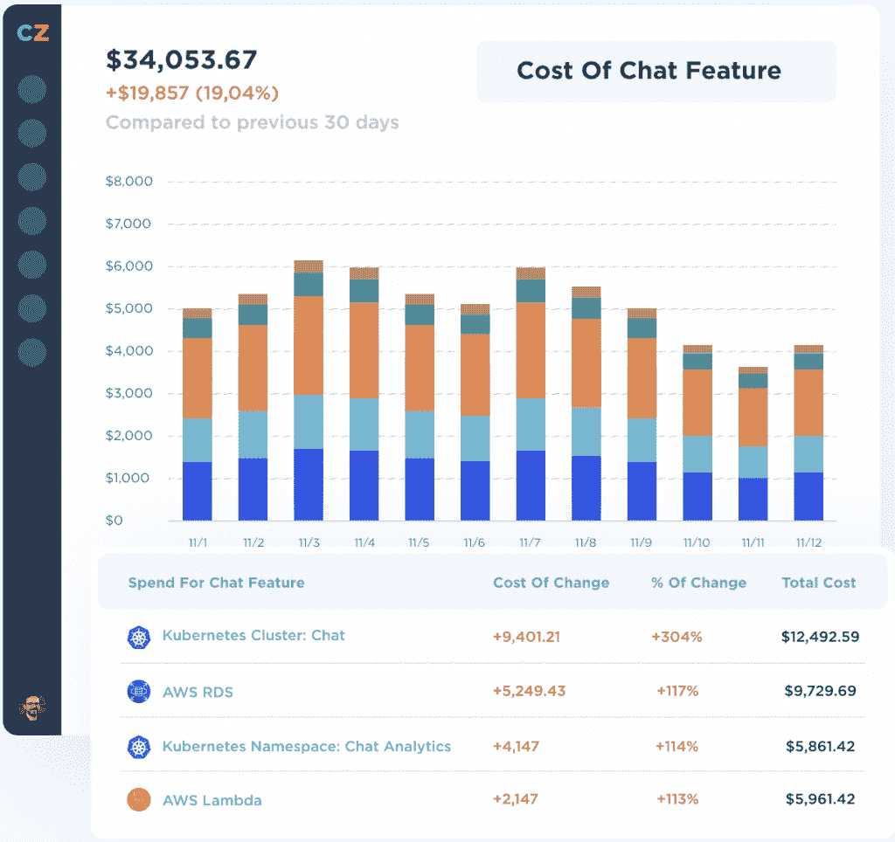
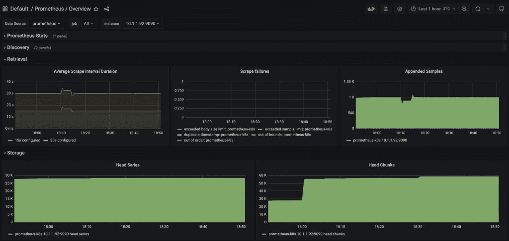

# 管理可观察性成本以最大化投资回报率

> 原文：<https://thenewstack.io/manage-observability-costs-to-maximize-roi/>

 [约翰·波托克尼

约翰是 Chronosphere 公司的高级销售工程师，在监控和可观测性领域拥有近十年的经验。John 最初是一名从事时序数据收集和分析的工程师，后来担任了售前/客户支持职位，并与多个行业的公司合作解决他们独特的可观察性挑战。](https://www.linkedin.com/in/johnpotocny/) 

在这一点上，大多数人可能都熟悉[可观测性成本比基础设施成本增长更快](https://chronosphere.io/learn/observability-data-growth-to-reach-tipping-point-this-year/)的担忧。

我们已经看到了行业内的许多报告，这些报告强调了公司在[通过采用新工具](https://www.spglobal.com/marketintelligence/en/news-insights/research/premium-shelfware-enterprises-struggle-to-use-observability-tools)帮助监控其复杂环境来实现正投资回报(ROI)时所面临的挑战。

这无疑[给组织带来了负担](https://chronosphere.io/learn/esg-study-focuses-on-observabilitys-role-in-solving-data-burden/),因为他们在总体市场不确定性的背景下，努力平衡创新速度与保持可持续商业模式。不过，你能做些什么让事情变得更好吗？

事实上，我们可以做很多事情来更好地控制我们的可观测性成本相对于基础设施的增长速度。如果你想在你的组织中解决这个问题，第一步是提升我们对可观测性成本的看法。

## 云经济和可观测性

让我们从一个场景开始:现在是年度预算的时间，您的老板要求您根据过去一年中每个季度运营您业务的主要服务生成一份基础架构支出报告。

这可能不是太大的要求；如果您适当地标记您的云提供商中的资源，通常可以直接从主要云提供商包括的[成本/计费工具](https://aws.amazon.com/aws-cost-management/aws-cost-explorer/)中提取这些信息，并且还有几个[第三方工具](https://cloudhealth.vmware.com/)、[服务](https://www.kubecost.com/)和[咨询小组](https://www.duckbillgroup.com/)可以帮助您访问这些细节并了解/优化您的支出。

提供这种信息的成本仪表板示例。

现在，如果你的老板回来问你是否能得到同样的可观察性支出的成本明细，你会怎么做？这有可能吗？假设是，几乎肯定不会容易，但为什么会这样呢？

遗憾的是，传统的监控解决方案只能提供对您的使用情况的高级时间点评估，而不能灵活地按服务或团队进行细分，也不能提供对长期趋势的洞察。在这种情况下，开源系统没有太大的不同。

即使是像 Prometheus 这样的开源解决方案，我们也会遇到类似的限制。衡量我们摄入了多少数据是很容易的，但我们可用的数据同样粗糙，使得任何详细的分析都变得困难甚至不可能。

Prometheus 仪表板显示每秒传入的数据点和时间序列数据库中的多个活动序列。此信息在较高层次上可用，但不支持按标签(如服务或工作)细分。

当谈到管理云成本/投资回报时，您可能已经见过术语“[云经济学”](https://aws.amazon.com/economics/)，但是当我们看可观察性时，在帮助我们管理成本和实现投资回报最大化的指南和工具方面却少得多。如果我们的可观测性成本增长失控，我们是否可以吸取一些经验教训，努力控制云成本？如果我们看一下可观测性成本的增长率，那么现在无疑是开始讨论整体经济和验证我们投资的正回报的好时机。

## 了解我们的可观察性 ROI

我们需要能够理解我们在可观察性上的投资所看到的回报。您可能已经有了一些衡量收益的概念/框架，所以首先，让我们关注如何更详细地衡量成本。我们可以再次从如何考虑管理云支出中得出一些相似之处。首先要理解的是，粒度是获得洞察力的关键，这意味着要有适当的标记，允许我们将收集的数据与我们运行的服务或管理它们的团队相关联。我们应该能够回答一些问题，理想情况下是针对我们收集的每种类型的数据(指标、跟踪、日志等)。):

*   每项服务/团队占我支出的比例是多少？
*   总体而言，最大的支出来源是什么？例如，我正在收集的前 20 个最昂贵的指标是什么？
*   我收集的数据量每天/每周/每月如何变化？例如，一天中是否有显著的变化？如果是，是什么服务/团队在产生它们？
*   与基础架构相比，我的数据增长率是多少？不同的团队对此有什么贡献？

我们还想确保我们正在利用我们正在收集的数据。这是您希望委托给单个团队/服务所有者的事情，以便他们对收集的内容拥有自主权(前提是不超出他们的预算)，但是能够回答一些与您的数据如何被使用相关的问题通常是有用的。例如:

*   对于我最昂贵的指标，它们正在哪些仪表板/警报中使用？
*   我们是否利用了我们正在收集的所有基数，或者在查询时是否有持续聚集的维度？

当我们追踪这些问题的答案时，我们可以开始批判性地审视我们正在收集的数据，并将其映射回它所提供的价值。例如，很少/从不使用的[高基数指标](https://chronosphere.io/learn/classifying-types-of-metric-cardinality/)可以被消除或聚合，以降低收集数据的总成本。随着时间的推移，这应该会导致更合理的可观察性成本，因为我们会优化我们收集的数据，以更好地匹配我们从消费数据中获得的价值。此外，团队/服务所有者可以更有信心在合理的情况下添加更多的仪器/收集更多的数据，因为他们将有数据来证明这样做是否是一项好的投资。

## 围绕您的可观察性数据做出战略决策

我们以前在云基础设施中见过这种模式:可观察性成本将继续飙升，直到采取必要的措施来了解支出来自哪里以及哪里没有为自己买单。

如果可观察性成本是你的公司当前关注的焦点，那么现在就开始看看你能测量什么。在此基础上，您可以制定计划来提高成本的可见性，无论是通过构建自定义报告，还是通过采用提供所需洞察力的新工具。并非每个服务/团队在收集的数据量和从中获得的价值之间都会有巨大的差异，但是理解当前的状态是围绕我们的可观察性数据做出更多战略决策的第一步。

这个问题已经变得足够大，以至于在选择任何监控/可观测性解决方案时，它都需要成为一个首要问题，在 Chronosphere，我们已经将它作为我们产品的一个重点，为客户提供他们需要的[可见性](https://chronosphere.io/learn/wrangle-metric-data-explosions-with-chronosphere-profiler/)和[控制](https://chronosphere.io/learn/how-chronospheres-control-plane-helps-users-manage-metrics-at-scale/)，以收回对其可观测性成本的控制。

<svg xmlns:xlink="http://www.w3.org/1999/xlink" viewBox="0 0 68 31" version="1.1"><title>Group</title> <desc>Created with Sketch.</desc></svg>