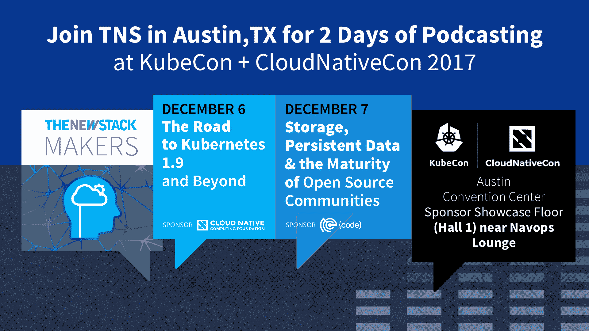

# TNS 指南:如何管理密码并保证你的在线账户安全

> 原文：<https://thenewstack.io/manage-passwords-keep-online-accounts-secure/>

过去几年的大量数据泄露表明，你不能相信在线服务提供商会保护你的账户信息安全。所以，如果你到现在还没有做到这一点，是时候仔细考虑一下你和这类公司分享什么，怎么分享了，从你的密码开始。

首先，如果你继续在不同的网站上为多个账户使用同一个密码，你就犯了网络安全错误。只需前往 HaveIBeenPwned.com，惊叹于过去 10 年间被攻破的用户数据库列表。

仔细阅读对这些违规行为的描述，有一点会变得很清楚:受影响的服务通常需要数年时间才能发现数据失窃。在此期间，窃取的信息被出售给网络罪犯，他们利用这些信息牟利。

2008 年发生的 MySpace 亿账户泄露事件直到 2016 年才曝光。自 2012 年以来，LinkedIn 的 1.64 亿个账户被入侵了四年而没有被发现，而自 2012 年以来，Dropbox 的 6800 万个账户被入侵，直到 2016 年 8 月才被采取行动。这样的例子不胜枚举。

经过过去一年的反复调查，现在由威瑞森所有的雅虎最近得出结论，其 30 亿账户的整个用户基础早在 2013 年就遭到了破坏。

这意味着，如果你现在确信你的密码是安全的，可能需要几年的时间，直到你知道它实际上已经被破坏，并可能被用来访问你的信息。聪明点，减少损失:每个账户使用一个唯一的密码。

## 密码是怎么被黑的？

如果网站遵循最低安全最佳实践，它们通常不会在数据库中以纯文本形式存储密码。相反，它们存储这些密码的加密表示，称为哈希。

哈希是一种加密操作，它生成看起来随机的字符串来表示数据，无论是文件还是密码。特定的数据块将总是具有相同的散列，并且操作应该是不可逆的——仅给定一个散列，确定它对应的输入在计算上应该是不可行的。您可以将哈希视为单向加密，主要用于数据验证。

在身份验证的情况下，网站会在用户注册时根据他们的密码计算哈希值，然后将这些哈希值存储在其数据库中。稍后，每当用户登录时，所提供的密码将被再次散列，并将结果与存储在数据库中的值进行比较。如果哈希匹配，则用户提供了正确的密码。

重要的是要明白，不是所有的散列函数都提供相同级别的安全性。其中一些，如 MD5 或 SHA1，已知在密码学上是脆弱的，如果不实施加盐(salting)等附加措施(将输入与随机值混合),则[可以通过暴力攻击](https://arstechnica.com/information-technology/2013/05/how-crackers-make-minced-meat-out-of-your-passwords/)被破解。这是因为攻击者已经有了庞大的密码列表和他们的等效 MD5 或 SHA1 散列，所以他们可以简单地搜索被盗数据库中已知的值。

例如，2012 年 LinkedIn 的入侵暴露了 SHA1 未经加盐生成的密码哈希，其中大部分在几天内就被破解了。在另一个案例中，Adobe 使用加密而不是哈希来存储超过 1 . 53 亿个帐户的密码。2013 年该公司数据库被攻破时，发现加密实现存在缺陷，因此密码很容易被黑客恢复。

每当您听到被黑客攻击的服务提供商说用户密码被加密或散列，而没有提供任何额外的技术细节时，您应该保持警惕，并考虑这些密码被泄露。根本没有办法知道公司的实施是否扎实。

## 管理密码

所以密码重复使用是不好的，但是你如何为你的每个网络账户生成并记住潜在的几十个独特而复杂的密码呢？你不需要，因为有专门的应用程序。

有很多种密码管理器。有些是开源的，但缺乏基于订阅的产品的更高级的功能，这些功能通常包括跨设备的加密密码数据库的自动同步以及与不同浏览器和平台的无缝集成。

最受欢迎的开源密码管理应用是 [KeePass](https://keepass.info/index.html) 和[密码保险箱](https://pwsafe.org/index.shtml)。KeePass 最初是为 Windows 构建的，但已经移植到大多数其他平台。还有各种各样的第三方插件[来扩展它的功能，增加与 Dropbox 等流行的云存储提供商的同步，或者使用物理安全硬件令牌](https://keepass.info/plugins.html) [YubiKey](https://www.yubico.com/start/) 等双因素认证。

[Password Safe](https://pwsafe.org/index.shtml) 是另一个开源的密码管理应用程序，最初是由著名的密码学家 Bruce Schneier 创建的[。它还支持通过 YubiKey 进行双因素身份验证，并拥有适用于 Linux、MacOS、Android 和 iOS 的第三方端口。但是，用户必须手动同步设备之间的密码数据库。](https://www.schneier.com/academic/passsafe/)

像 [LastPass](https://www.lastpass.com/) 、 [1Password](https://1password.com/) 、 [Dashlane](https://www.dashlane.com/) 和 [Enpass](https://www.enpass.io/) 这样的专有解决方案能够更好地与浏览器和应用集成，包括自动填充和自动登录功能。虽然解锁它们的所有功能需要订阅，但其中一些提供免费版本，对大多数用户来说功能足够了。一些反病毒程序[也有内置的密码管理工具](https://www.avast.com/f-password-manager)。

如果您选择基于云的解决方案，请找到一个密码库总是在本地解密的解决方案，在您的设备上或在您的浏览器中，云服务仅用于在设备之间同步数据库的加密版本。

此外，用一个主密码来保护你所有的密码也可能被恶意软件泄露或窃取，这不是一个好主意。为了降低这种风险，请选择提供某种形式的双因素身份验证的密码管理器，其中解锁密码数据库需要密码和由移动应用程序或硬件设备生成的代码或密钥。

## 选择复杂密码

密码复杂性很重要，因为它可以使基于窃取的哈希的密码破解非常困难，即使使用的哈希算法很弱。如果您定期更改您的密码，并且发生了违规行为，攻击者设法破解了您的一个密码，在您再次更改密码之前，他们仍然可以访问它数周。因此，值得采取措施来确保即使您的密码哈希被盗，攻击者也不太可能在合理的时间内破解它。

密码应该至少有 12 个字符长，虽然你可能应该更多，因为大多数网站没有强制限制，你也不必记住它们。密码应该包含大小写字母、数字以及特殊符号，通常也允许使用空格。

好消息是，许多密码管理应用程序都提供了密码生成功能，您可以选择构建密码的标准。

在一些情况下，你必须记住密码。例如，解锁您的密码数据库的主密码或非常重要的帐户(如电子邮件)的密码。

您的电子邮件是大多数其他在线帐户的网关，在您因任何原因无法访问密码管理应用程序的情况下，您可以使用电子邮件恢复和重置密码。访问你的电子邮件是你的变通办法。

对于如此重要的账户，你应该使用密码短语:由单词、日期和名字组成的句子，这些单词、日期和名字对其他人来说似乎是随机的，但对你来说却是有意义的，并且容易记住。你不应该使用任何基于网上容易找到的关于你生活的信息的可预测的东西。

## 密码不是一切

许多在线服务提供双因素认证(2FA ),将您知道的东西(密码)与您拥有的东西(手机)结合起来。除了密码之外，这些认证方案还要求用户提供一次性代码，该代码通过短信或电子邮件发送(不太安全)，由谷歌认证器(Google Authenticator)等移动应用程序生成，或者由 YubiKey 或智能卡等专用硬件令牌提供。

即使启用了 2FA，一些服务也允许用户将其设备标记为可信。当在特定时间段(例如 30 天)内从这些设备访问帐户时，这实际上禁用了 2FA。虽然此功能提高了可用性，但它是基于这些设备是安全的且未被破坏的假设，因此请小心使用。如果你有理由相信你的电脑或手机已经被入侵，立即登录你的账户，删除所有受信任的设备，并终止所有活动的会话——一些服务允许你这样做。

通过 Pixabay 的特征图像。

<svg xmlns:xlink="http://www.w3.org/1999/xlink" viewBox="0 0 68 31" version="1.1"><title>Group</title> <desc>Created with Sketch.</desc></svg>