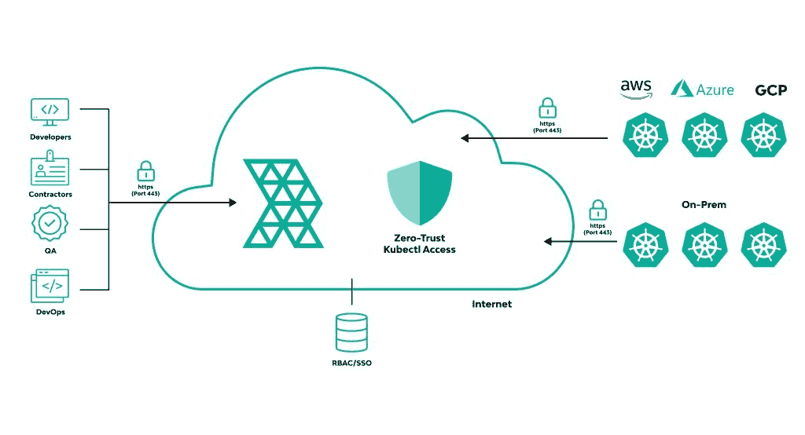

# 管理对所有集群的大规模访问

> 原文：<https://thenewstack.io/managing-access-to-all-your-clusters-at-scale/>

Kubernetes 越来越成为企业技术堆栈的关键部分，这需要保护和加强访问。

 [克里夫·马尔姆堡

Cliff 是 Rafay Systems 的高级产品营销经理，Rafay Systems 是一家拥有超过 15 年经验的充满活力的产品营销领导者。他热衷于讲述故事和将复杂的产品带入生活，并拥有成功颠覆行业和上市的历史。](https://www.linkedin.com/in/cliffmalmborg/) 

对于许多组织来说，这也伴随着集群的爆炸式增长。更多的群集不一定意味着更多的问题，但是增加功能通常意味着更多的安全和管理。每个集群共同管理运行在节点上的多个容器化应用程序。这带来了更多的抽象并降低了 DevOps 的复杂性，但是它也带来了创建更多要管理的东西的副作用。

今天的访问在很大程度上是默认管理的，集群假设可信的网络通信是给定的，用户通信可能会访问 Kubernetes API。随着工作负载的增长，这些方法变得越来越不实用，并且更容易出现潜在的安全问题。

kubectl 默认不提供基于角色的访问控制(RBAC ),并且执行的命令不会被记录。然而，ops/platform 团队可以对组织进行定位，以便进一步扩展、集中和保护 kubectl，从而实现未来增长。

这给运营团队带来了挑战，他们只能通过集中式平台进行管理，否则，配置和管理将是一个不可扩展的逐个集群的过程。本文概述了大规模管理集群的常见挑战，以及从任何地方保护 kubectl 访问和认证的最佳实践。

## 管理大规模集群访问的挑战

对于运营团队来说，一次管理一个集群的基于角色的访问是一项繁重的工作。手动控制的授权决策会影响可伸缩性，并且对整个组织来说更加耗费资源。以下是使大规模保护集群变得具有挑战性的一些关键因素:

*   ### **访问控制你的舰队群**

为所有集群配置访问控制是一个跨多个操作环境、不同云(EKS、AKS 等)的过程。)和在防火墙后运行的内部数据中心。

分散式访问控制使集群管理变得复杂，并导致每个集群由单独的规则定义。这反过来给运营团队带来了更多的工作，并产生了更多的错误。非标准环境很难作为一个团队来管理。

*   ### **利用库贝克**

默认情况下，Kubernetes 的安全性主要是通过命令行逐个集群地实现的，这是一个复杂且容易出错的过程。由于这个原因，很难用 kubectl DIY 你的安全管理。

在防火墙之外访问 kubectl 也很困难，这限制了您使用它来管理集群的方式和位置。这些挑战阻碍了加强 Kubernetes 安全性的努力，从而限制了 Kubernetes 的可伸缩性。

*   ### **建立和管理访问控制**

    需要运营技能和人才

为了正确配置和管理访问控制，群集应该由具有专业操作技能和人才的团队来管理。这意味着组织必须弥补人才缺口，以最大限度地增加对 Kubernetes 的投资。

由于集群对访问有不同的要求，运营团队应该能够跨不同的环境有效地配置和管理集群。他们还应该准备好根据需要重复这些过程。SSH、Bastion、VPN 或命名空间访问控制的操作和用户工作效率问题应该在不影响集群性能或安全性的情况下得到有效解决。

## 从任何地方对远程集群进行安全的 kubectl 访问和身份验证

与逐集群管理相比，有一种集中访问和身份验证的方法。简化访问为运营团队提供了一种在任何地方和任何环境中配置和管理集群的方法。

通过整合访问，您的团队可以对 kubectl 进行身份驱动的单点登录(SSO)安全访问。运营团队可以轻松管理用户组，并为他们提供自己的访问权限，从而简化开发人员、承包商和开发运维工程师的身份认证。

配置和整合对远程集群的 kubectl 访问

通过对所有 kubectl 动作的审计记录，您可以更好地了解集群的使用情况。您可以使用这些用户级审计日志来防止流氓 Kubernetes 管理，并从管理控制台内的单一控制台验证整个车队的安全合规性。

## Kubernetes 零信任访问服务的优势

Rafay 为管理多集群访问和身份验证提供了集中平台的灵活性和便利性。有了这些自动化、安全性和治理能力，企业可以更好地充分利用他们的 Kubernetes 部署。

与您的 Kubernetes 环境无缝集成， [Rafay 针对 Kubernetes 的零信任访问服务](https://rafay.co/platform/zero-trust-access-service/)使用基于浏览器的虚拟终端来提供多集群访问和认证。您还可以在笔记本电脑上通过 kubectl CLI 使用统一的 kubeconfig 文件。要了解更多信息，请尝试 Rafay 。

<svg xmlns:xlink="http://www.w3.org/1999/xlink" viewBox="0 0 68 31" version="1.1"><title>Group</title> <desc>Created with Sketch.</desc></svg>