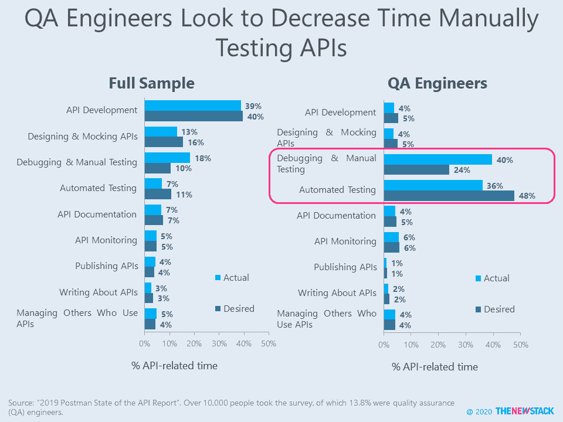

# 管理 API 很费时间

> 原文：<https://thenewstack.io/managing-apis-is-a-time-suck/>

由[孔](https://konghq.com/)和[波兹曼](https://www.getpostman.com/)于 2019 年 12 月发表的调查揭示了创建和管理应用编程接口(API)而不仅仅是消费 API 的挑战。提供一个 API 所需的努力是巨大的，在“ [2019 邮递员状态 API 报告](https://www.getpostman.com/resources/infographics/api-survey-2019/)”的 10，000 多名受访者中，有 63%的人每周至少花 10 个小时在 API 上。在接受调查的后端工程师中，这个数字达到了 74%，35%的人说他们实际上每周花费超过 20 个小时。只有 17%的前端开发人员在 API 上花费 20+小时，这表明 API 是后端的关键组成部分。

花在 API 上的时间有一半(52%)用于开发和设计。由于 Postman 是一个 API 开发平台，对其调查做出回应的人比更大的 IT 社区更有可能关注这个话题。人工测试和调试是被调查者唯一希望减少花在 API 相关活动上的时间的领域。这个问题在质量保证(QA)工程师中最为突出。目前，他们花费 40%的 API 相关时间进行手动测试，但希望这一比例降至 24%。QA 工程师认为，将他们 48%的 API 工作分配给自动化测试会更好地利用他们的时间。除了 QA 团队，自动化测试节省的时间似乎不会再投资到性能上，而是投资到 API 设计上。

在调查的后期，55%的受访者表示他们认为 API 文档低于平均水平或更差。64%的人说 API 提供者可以通过提供更好的例子来改进文档。

来自 Kong 的“ [2020 数字创新基准](https://konghq.com/resources/digital-innovation-benchmark-2020)”的未公开数据显示，API 最有可能(68%)用于让受访者组织内的开发人员消费应用和服务。允许组织外的开发人员使用应用/服务(49%)和利用微服务(44%)也是常见的用例。就像邮递员调查一样，Kong 的研究集中在 API 提供者上。当被问及与管理 API 相关的挑战时，最常提到的是对安全性的普遍担忧，还有一系列与性能、流量和文档相关的问题。这些挑战偏离了消费者最关心的问题。正如[之前](/api-providers-face-high-expectations/)在 [SmartBear](https://smartbear.com/) 的一项研究中报道的，易用性、性能和准确的文档是 API 用户寻求的首要特征。

我们期待更多区分 API 用户和消费者的数据。一个可能的来源是[正在进行的关于 API 集成的调查](https://stateofapi.typeform.com/to/VFh92g)，并计划在今年晚些时候报告。CloudElements 的首席产品官 Ross Garrett 告诉 New Stack，他添加了一个问题，以区分提供自己平台的软件公司和在更特定的基础上集成 API 的软件公司。我们期待着新的研究来区分那些创建仅供内部使用的 API 的公司和那些在其大型软件产品中内置 API 集成的公司。

通过 Pixabay 的特征图像。

<svg xmlns:xlink="http://www.w3.org/1999/xlink" viewBox="0 0 68 31" version="1.1"><title>Group</title> <desc>Created with Sketch.</desc></svg>