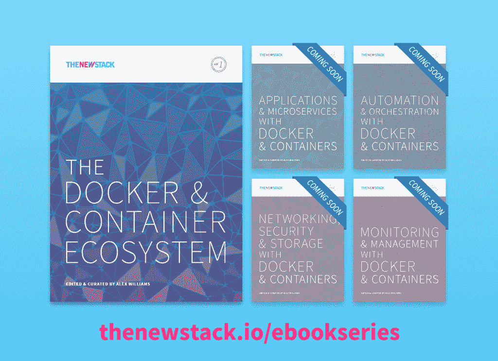

# 跨分布式资源管理容器

> 原文：<https://thenewstack.io/managing-containers-across-distributed-resources/>

集装箱解决方案是阿姆斯特丹的一个咨询集团。他们将当前关于可编程基础设施的讨论框定在机器方面。

虚拟机可能需要大量资源，尤其是在旧机器上开发时。如果资源分配不正确，或者用户没有指定应该使用一定数量的资源来编译日志或完成相关项目要求的其他任务，运行虚拟机管理程序可能会给系统带来压力。

效率是扩展集群的主要问题。应用程序延迟是无法适当扩展的高强度工作负载的结果之一。当应用传统解决方案来解决问题时，具有低效架构的资源具有很高的成本。这可能意味着添加更多的存储和网络设备，它们不具备更现代的体系结构所提供的灵活性。

[容器解决方案](http://container-solutions.com/)的菲尔·温德写道，分布式系统中的伸缩取决于被伸缩的服务。无状态的应用程序可以有效地扩展。它需要计算资源和负载平衡器中的记录。另一方面，数据库更难以水平扩展。Winder [写道](http://container-solutions.com/reasons-use-apache-mesos-frameworks/)“应用程序必须决定谁负责数据同步；这是数据库的责任，还是分布式文件系统的某种功能？”

构建分布式体系结构还有许多其他因素。毫不奇怪，有各种各样的编排环境需要考虑。

编排有助于跨多个容器运行应用程序，而不仅仅是一个容器。在 New Stack 对与容器相关的供应商的调查中，我们询问了有关编排的问题，将它包括在调度、管理和监控工具的类别中。在这种情况下，我们发现几乎三分之二的供应商在 2015 年第二季度提供了该领域的产品。虽然 71%的人还计划在未来推出与编排相关的产品，但有几个人表示他们正在修改产品或发展合作关系。在调查的后期，公司也告诉我们他们如何在内部管理容器。没有占主导地位的工具，超过 4%的受访者提到“没有产品”。新的堆栈容器目录有 55 个与编排管理相关的产品和项目，其中一半代表了开源成果。

## 自动化资源简史

2006 年，亚马逊推出了亚马逊网络服务(AWS)，成为提供虚拟资源的先锋。AWS 创造了几乎永无止境的计算能力，客户只需为他们使用的资源付费。几乎一夜之间，应用程序就可以部署完毕，而不用担心收到带有逗号的数据账单。它相对简单，成本更低——这是导致行为变化和市场转变的两个核心因素。

AWS 为摆脱传统的 IT 模式提出了强有力的论据。亚马逊的运营效率甚至连管理最完善的 IT 商店都难以企及。

[cyclone slider id = " ebook-1-赞助商-2 "]

下一次发展涉及一些新的想法，即如何以自助方式充分利用无限资源，完全自动化，资源更加面向开发人员及其应用程序需求。

这种可编程基础设施的概念是一个更大趋势的一部分，谷歌称之为“仓库规模计算”，这个术语来自 2009 年的一篇谷歌论文，这是谷歌对容器如此感兴趣的核心原因。

CoreOS 首席执行官 Alex Polvi 在今年早些时候的一次采访中描述了一些反映仓库规模计算的组件示例:

*   商用硬件和底层计算资源。
*   商品交换和网络结构。
*   应用程序打包(容器)。
*   资源调度和协调。
*   用于在商用硬件上运行编排和打包的 Linux。

波尔维说，这一次真正不同的是，我们正在构建拥有智能软件和简单硬件的系统——这正是谷歌所闻名的。这意味着可以添加更多的计算资源来获得更多的应用容量。这意味着任何单独的服务器都是没有意义的。我们将从应用程序的角度考虑一切，而不是单个服务器。

“动态调度”是谷歌“云原生计算”定义的一个关键组成部分，正如谷歌的 Craig McLuckie 在新堆栈中描述的那样。

业务线经理应该能够在没有系统管理员帮助的情况下，在一些随需应变的基础设施上运行应用程序。经理不必担心服务器或任何其他物理基础设施。相反，他们应该只从逻辑计算资源的角度考虑部署。有大量计算可用，任何作业都可以被调度运行。

“事实证明，有些事情电脑比人做得更好，”麦克卢奇说。“其中一件事就是实时考虑您的应用程序应该部署在哪里，您的应用程序应该可以访问多少资源，您的应用程序是健康还是不健康，是否需要进行某种程度的补救。”

McLuckie 说:“从一个运营商驱动的范例世界(在这个世界中，你正在创建这些静态的、无生命的东西)转移到一个你的应用程序是活的、被一个非常智能的系统主动管理、动态地、反应性地、观察和观察的世界……[这]改变了游戏。”。

换句话说，软件算法可以根据可用的资源高效地调度和分配作业，这样做将导致显著的成本节约。不再需要打电话给 IT 部门来申请一台可能会在六周后出现的服务器。它还使企业更加敏捷，能够快速启动新的应用程序，优化资源利用，并领先于竞争对手。

那么，如何从一个充斥着哑服务器的数据中心构建一个智能系统呢？这就是 Google Kubernetes 和开源 Apache Mesos 数据中心操作系统等工具的用武之地。同样值得注意的是 Docker 的平台，使用了它的 Machine、Swarm 和 Compose 工具。

## 谷歌 Kubernetes

Google 开发了 Kubernetes 来管理大量的容器。Kubernetes 不是将每个容器分配给一台主机，而是将容器分组到 pod 中。例如，一个多层应用程序，数据库在一个容器中，而应用程序逻辑在另一个容器中，可以组合成一个单元。管理员只需将一个单元从一个计算资源移动到另一个计算资源，而不必担心几十个单独的容器。

谷歌自己在自己的谷歌云服务上让这个过程变得更加容易。它提供了一个名为 Google 容器引擎的 Kubernetes 的生产就绪版本。成本也非常低廉:管理前五个集群是免费的，第五个集群之后的每个集群每小时只需 15 英镑。

在 pod、标签和服务之间，Kubernetes 提供了与集群交互的不同方式:

*   pod 是一小组 Docker 容器，可以在 Kubernetes 中维护。它们易于部署，从而减少了测试构建或 QA 调试时的停机时间。
*   标签就像它们听起来一样，用于组织由键值对确定的对象组。
*   服务用于负载平衡，为一组 pod 提供集中的名称和地址。
*   Kubernetes 上的集群消除了开发人员担心物理机器的需要；这些集群本身就是轻量级虚拟机，每个都能够处理需要可伸缩性的任务。

## 阿帕奇 Mesos

Apache Mesos 是一个集群管理器，可以帮助管理员在一个服务器集群上调度工作负载。Mesos 擅长处理非常大的工作负载，例如 Spark 或 Hadoop 数据处理平台的实现。

Mesos 拥有自己的容器映像格式和运行时，构建方式与 Docker 类似。该项目首先构建编排，容器是需要实际打包和包含应用程序的副作用。应用程序以这种格式打包，以便能够由 Mesos 运行。

Mesos 由 Mesosphere 支持，它提供了 Mesosphere 数据中心操作系统(DCOS)。顾名思义，DCOS 承诺能够集中资源，然后根据这些资源动态地调度作业，就好像所有的服务器作为一个实体一起工作一样。

Mesos 是一款开源软件，最初由加州大学伯克利分校开发。它位于应用层和操作系统之间，使得在大规模集群环境中部署和管理应用程序变得更加容易。它可以在动态共享的节点池上运行许多应用程序。Mesos 的主要用户包括 Twitter、Airbnb、网飞、PayPal、SquareSpace、优步等等。

大约五年前，分布式系统内核诞生于加州大学伯克利分校的 AMPLab。本杰明·欣德曼当时是伯克利的一名博士生；在加入 Mesosphere 之前，他在 Twitter 工作了四年。他是 Apache Mesos 项目的最初创建者之一。

多年来，一位 IT 主管构建硬件，然后在其上运行软件，将所有这些服务器视为宠物。在当今世界，应用程序是第一位的。硬件被抽象化了，更像牲口一样对待。这种宠物与牛的对比如今经常被用来解释在当今以应用程序为中心的数据密集型世界中，必须如何对待现代数据中心。底线是应用是第一位的。

数据中心是一个虚拟的围栏。资源被集中起来，应用程序被启动，就像操作系统在电脑上工作一样。Mesos 能够扩展应用程序的数量和大小，以及不同类型的工作负载所需的计算、存储和其他资源。它的核心在内核中，内核执行主要功能，比如给应用分配资源。

## 码头工人

Docker Machine、Docker Swarm 和 Docker Compose 被设计为一个编排系统。Docker 还与 Mesos 社区密切合作。

### 码头机器

根据 Docker 的说法，Docker Machine 支持一个命令自动化来配置主机基础架构和安装 Docker 引擎。在 Docker Machine 之前，开发人员需要登录到主机，并遵循专门针对该主机及其操作系统的安装和配置说明。借助 Docker Machine，无论是在新笔记本电脑上、数据中心的虚拟机上还是在公共云实例上配置 Docker 守护程序，您都只需要一个命令。

Docker Machine 的可插拔后端允许用户充分利用提供 Docker 就绪基础设施的生态系统合作伙伴，同时仍然通过相同的界面访问所有内容。这个驱动程序 API 用于在本地机器、数据中心的虚拟机或公共云实例上供应 Docker。在当前的 alpha 版本中，Docker Machine 附带了驱动程序，可以通过 Virtualbox 在本地提供 Docker，也可以在 DigitalOcean 实例上远程提供；更多的驱动程序正在为 AWS、Azure、VMware 和其他基础设施而工作。

### 码头工人群

Docker Swarm 是一个集群和调度工具，可以根据应用程序的生命周期阶段、容器使用和性能需求自动优化分布式应用程序的基础架构。

Swarm 有多种模型来确定调度，包括了解特定的容器将如何具有特定的资源需求。Swarm 使用一种调度算法来决定它应该在哪个引擎和主机上运行。Swarm 的核心方面是，当你开发多主机、分布式应用程序时，开发者希望保持体验和可移植性。例如，它需要能够为您正在使用的应用程序使用特定的集群解决方案。这将确保集群功能可以从笔记本电脑一直移植到生产环境中。

Swarm API 是为了让生态系统合作伙伴创建替代或附加的编排工具，这些工具可以覆盖 Docker 的 Swarm 优化算法，以获得针对特定用例的更细微的东西。

这就是 Docker 称之为“包含电池但可更换”的方法。一些用户可能习惯于使用 Docker Swarm 来识别多容器、分布式应用程序架构的优化集群。其他人将希望使用 Swarm 的集群和调度部分来设置自己的参数，而还有一些人将期待生态系统合作伙伴的替代编排优化产品来推荐最佳的集群组合。

在 Swarm 上运行的多容器应用也可以使用 Docker 的 [Compose 工具](https://docs.docker.com/compose)来构建。合成工具使用声明性 YAML 文件来维护所有应用程序容器的逻辑定义以及它们之间的链接。然后，可以动态更新构建的分布式应用程序，而不会影响编排链中的其他服务。

### Docker 撰写

Docker Compose 支持跨多个容器的编排。例如，数据库、web 和负载平衡容器都可以组装到跨多个主机的分布式应用程序中。编排是通过在 YAML 文件中表达容器依赖关系，并通过 Docker 用户界面进行管理来组成的。

## 摘要

编排仍然是一个很少有人知道的话题，但对于构建微服务环境的公司来说，它将是至关重要的。有一些关于虚拟化基础设施以及如何处理无状态和有状态服务等问题需要考虑。有调度程序、服务发现引擎和其他组成这些新型管理系统的组件。这些编排平台具体做什么将是我们在电子书系列后面回答的问题。

Docker、IBM 和 VMware 是新体系的赞助商。

<svg xmlns:xlink="http://www.w3.org/1999/xlink" viewBox="0 0 68 31" version="1.1"><title>Group</title> <desc>Created with Sketch.</desc></svg>