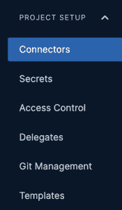

# 管理 DevOps 管道中的秘密

> 原文：<https://thenewstack.io/managing-secrets-in-your-devops-pipeline/>

秘密是你数字王国的钥匙。

 [帕万·贝拉加蒂

Pavan Belagatti 是全球 DevOps 影响者、技术作家和讲故事者。](https://www.linkedin.com/in/pavan-belagatti-growthmarketer/) 

他们可以打开门，授权访问并允许访问您的数据。但是，如果秘密管理不当，它们可能会给组织带来潜在的灾难。

如果您的凭证不安全，您就完了。黑客总是在寻找漏洞进入你的系统，误用本该保密的重要信息。

今天，我们将了解什么是[秘密管理](https://docs.harness.io/category/48wnu4u0tj-secrets-and-secret-management)以及相关的最佳实践。

## 什么是秘密管理？

机密管理是安全存储和保护敏感数据的过程。当公司的数据面临被泄露的风险时，就出现了对机密管理的需求。公司可能不得不应对安全漏洞带来的后果，这些后果可能会导致机密信息、客户数据的丢失和财务损失。机密管理是一个通过安全地识别、分类、标记和存储敏感数据来帮助降低相关风险的过程。

## CI/CD 中的机密管理

在 CI/CD 管道中，机密用于验证和授权应用程序、服务和系统。管理 CI/CD 管道中使用的技术的身份验证凭据是一项极具挑战性、耗时且频繁执行的任务。因此，安全性和可靠性是 CI/CD 管道最重要的特征。安全性通常通过保护受保护区域中的秘密来提高，例如使用私钥和令牌。

保护机密是一个伟大的 CI/CD 平台的基本和必要的元素。必须保护机密数据和凭证，防止未经授权的访问。然而，秘密管理通常被认为是困难的，因为它们不是不可变的。它们很复杂，可以随时在范围内外旋转。

在 CI/CD 管道中管理机密有许多好处，例如凭证存储的标准化、紧急情况下用于故障保护的离线凭证存储，以及强制执行严格访问策略的能力。本文将讨论持续集成交付工作流环境中的秘密管理，以及实现秘密管理的最佳实践。

## 秘密的类型

CI/CD 管道中可以使用许多类型的机密。一些流行的秘密包括:

*   **API 键:**这些键用于访问外部服务或 API。
*   **数据库凭证:**这些用来连接数据库。
*   SSH 密钥:这些密钥用于认证远程服务器。
*   **Git 凭证:**这些凭证用于访问私有 Git 存储库。

## 管理秘密:一般准则

有许多方法可以管理 CI/CD 管道中的机密。当然，最佳方法取决于您的特定需求和您正在使用的工具。但是，有一些通用的指导方针可以帮助您选择最适合您的情况的方法。

1.  ### **确保所有的秘密都被加密。**

这是最重要的规则。所有机密都应该加密，这样未经授权的用户就无法访问。

2.  ### **把秘密储存在安全的地方。**

机密应该存储在安全的位置，如密码管理器或安全文件存储系统。它们不应该存储在纯文本文件或源代码库中。

3.  ### **不同的目的使用不同的秘密。**

不要将同一个秘密用于多种目的。例如，不要在开发、试运行和生产环境中使用相同的数据库密码。这使得轮换密码更容易，并有助于防止敏感信息的意外泄露。

4.  ### **定期轮换秘密。**

秘密应该每个月或每个季度轮换一次。这有助于确保一旦机密泄露，可以快速替换。每 90 天轮换一次你的秘密是个好习惯。每个安全专家的主要工作是确保团队经常轮换他们的秘密。此外，如果任何秘密被泄露，组织应该能够撤销它并阻止任何进一步的滥用。

5.  ### **有 RBAC 在的地方。**

确保只有经过授权的人员才能使用基于角色的访问权限来访问您的项目(RBAC)。这样，您可以跟踪谁在做什么，如果出现问题，您可以完全负责。

6.  ### **并入零信任安全。**

在零信任安全模型中，任何人任何事都被认为是敌对的。它授予项目工作人员最低特权访问权限。遵循严格的协议以获得对项目的更多访问权。

7.  ### **从不硬编码的秘密。**

永远不要在代码中包含秘密。如果有人可以访问您的代码，他们也可以访问您的秘密。确保向你的同事要求代码审查。

8.  ### **使用无秘密的方法。**

在“无机密”CI/CD 管道中，所有机密都存储在 CI/CD 管道之外，仅通过名称引用。对于希望简化管道配置或者没有太多秘密需要管理的组织来说，这可能是一个不错的选择。但是当秘密越来越多的时候，这就变得很麻烦了。

9.  ### **使用工具。**

使用诸如哈希公司金库或 AWS KMS 等工具来加密机密。这样，即使有人能够访问它们，没有正确的解密密钥，他们也无法读取它们。

随着越来越多的组织采用 CI/CD 管道，安全管理机密的需求变得更加重要。有几种不同的方法来管理 CI/CD 管道中的机密，最佳方法取决于组织的需求。

## 利用秘密管理

[Harness](https://app.harness.io/auth/#/signup) 包括一个内置的秘密管理特性，使您能够存储加密的秘密，例如访问密钥，并在您的 Harness 应用程序中使用它们。

让我们看看如何从 Harness 向我们的项目添加文本秘密。

您的 MongoDB 字符串 URL 可以很容易地以加密的方式存储，没有攻击者能够猜到。这可以通过进入项目设置并点击**秘密**来完成。

Harness 主要有三种秘密类型:文本、文件和 SSH 凭证。此外，你可以通过 YAML 建设者的秘密。对于上面的例子，我们将使用基于文本的秘密类型。

你可以给它起任何你想要的名字，并且安全地保存它。

上面可以看到，任何人都不可能看到你的 MongoDB URL 字符串。

此外，您可以通过进入**连接器**并选择**秘密管理器**来查看可以轻松与 Harness 集成的秘密管理工具的类型。

在这个[管理文档](https://ngdocs.harness.io/article/bo4qbrcggv-add-secrets-manager)中，你可以看到更多关于每个秘密管理器的信息——Azure Key Vault、AWS KMS、HashiCorp Vault 和谷歌 KMS。

## 结论

DevSecOps 是当今云原生空间中谈论最多的话题。保持机密安全是 DevOps 管道最重要的方面之一。在任何组织中，管理您的凭证和密钥都应该是重中之重。如果秘密被泄露，挽回信誉和信任需要一大笔钱。因此，投资一个配备了强大的秘密管理系统的平台是非常重要的。安全性是您不能忽视的一个方面。

<svg xmlns:xlink="http://www.w3.org/1999/xlink" viewBox="0 0 68 31" version="1.1"><title>Group</title> <desc>Created with Sketch.</desc></svg>