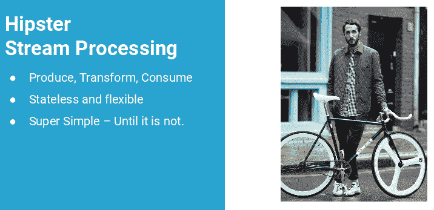
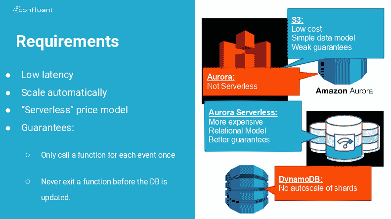

# 在无服务器中管理状态

> 原文：<https://thenewstack.io/managing-state-in-serverless/>

的产品经理格温·沙皮拉 ，已经在移动数据超过 20 年了。Shapira 是“ [Kafka:权威指南](http://shop.oreilly.com/product/0636920044123.do)”的合著者，他定期介绍流处理、Apache Kafka、数据集成和事件驱动架构。最近，在纽约 [无服务器日](https://www.serverlessnyc.com/) 上，她分享了她对无服务器的想法，认为开发人员不必担心可扩展性，因为无服务器云提供商将管理架构的扩展，使开发人员能够专注于他们的应用程序。

但是对于在无服务器环境下工作的开发人员来说，Shapira 目前认为这项技术类似于自行车。“潮人喜欢这些自行车，因为它们很简单，但当你到达一座小山时，你就会明白为什么你需要齿轮，”沙皮拉说。

对沙皮拉来说，管理国家是第一座山。状态是指固定在某个时间点的数据。通常，无服务器工作流被认为是在一种状态下拉入数据，做一些事情，然后可能在流程结束时以新的状态返回数据。

例如，当媒体图像进入无服务器工作流并进行转换，从而将原始图像处理为缩略图、媒体使用的标准输出大小以及其他格式，然后将这些图像存储回 S3 存储桶中时，该工作流不必管理状态，因为图像以一种形式开始，以另一种形式结束。但是，随着无服务器开始用于多种业务工作流，需要接收数据、转换数据，然后在后续流程中使用转换后的数据。这意味着需要这些更复杂的无服务器进程来管理状态。她解释说:“在无服务器的流处理中，数据可能是有状态的，这让你问:我有处理这种复杂性的工具和背景吗？”

“在无服务器中，你需要数据库非常快，”Shapira 说。“您需要数据库以及功能可扩展，并保持相同的按使用付费模式。但是当你看的时候，你会发现完全没有付费使用模式的数据库。他们大多采用双重付费模式:你为存储付费，你为使用付费。因此，很少有像您的无服务器功能那样可扩展的，低延迟是一个相当大的瓶颈。必须进入具有多个表的大型数据库，获取数据，然后推送另一个更新…这将成为一项相当大的开销。”

Shapira 给出了一个订单请求的例子。订单需要检查仓库以查看是否有足够的库存，然后将该库存锁定到订单，这样其他人就不会拿走它，更新库存以显示减少的项目，然后将该订单转移到 shipping。如果没有足够的商品，订单必须更新。在这种情况下，它不像仅仅依赖触发函数的事件那么简单:在一个工作流中有一定程度的数据状态维护和更新。在无服务器中，仅仅选择一个允许状态的数据库可能不是一个足够好的解决方案。

Shapira 指出了解决这个问题的三种方法:

1.  “你可以创建一个高度规范化的数据模型，这样你就可以在一次调用中得到你想要的一切，”她说。
2.  “你可以读取比你严格需要的更多的数据，”她建议道。“例如，如果你可以预测一个函数将如何被重用(通过使用 Kafka)，那么你就会明白，如果你想要一个订单，你通常会需要许多其他订单，所以你也可以提取它并缓存。这非常有用，因为它在无服务器模式下节省了您的时间和金钱。”
3.  “最后一种模式目前是不可能的，”沙皮拉警告说。“理想情况下，无服务器云提供商将允许功能获得更新。事件不仅仅是动作，它们代表一组新的数据。但是，如果我的数据库在我的事件仍在运行时不断得到更新，我就没有办法得到那些更新。这是所有函数提供者的一个限制，但是 Kafka updates 从一开始就非常擅长这个。所以这还不可能，但如果这是可能的，生活将会很棒。”

Shapira 鼓励开发人员从他们的代码中退一步，考虑他们工作的现实应用。“功能是要采取的行动。但这个事件也是信息。例如，当接受一个订单时，发生这种情况意味着除了对其做出反应之外，我可能还需要更新数据存储。例如，库存刚刚更新，因此我可能需要提醒客户该商品现已上市，这可能意味着我也需要更新库存仓库。”

与支持 API 的体系结构一样，无服务器要求组织的业务和技术方面有更紧密的联系。

Shapira 详细阐述了这种更紧密的联系:“当你写代码时，你关注的是作为你工作的第一个类对象的函数。功能是世界的中心。但真实的事情是真实世界中正在发生的事件。有时候你需要一个函数来处理它们，有时候你需要专注于数据库。”

> "在无服务器模式下，你需要数据库非常快."

Shapira 对无服务器带来管理这些问题的可能性感到兴奋，认为这是一种剥离非本质问题，专注于处理实际业务问题的新方法。但她也表示，从已经思考过的东西中可以汲取很多智慧，特别是围绕微服务架构中的事件驱动设计模型，并将它们应用到无服务器。“事件驱动的微服务非常相似，所以学习那些模式，它们通常完全适用于这个稍微新的领域，”她建议道。

<svg xmlns:xlink="http://www.w3.org/1999/xlink" viewBox="0 0 68 31" version="1.1"><title>Group</title> <desc>Created with Sketch.</desc></svg>