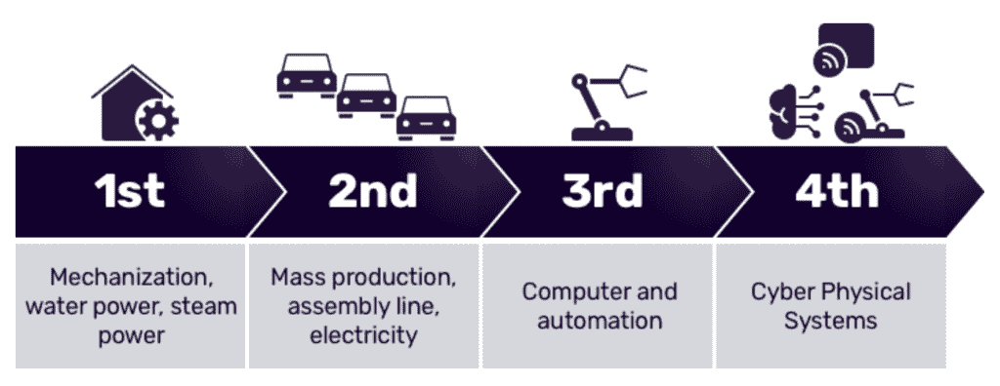

# 工业物联网中时序数据的管理

> 原文：<https://thenewstack.io/managing-time-series-data-in-industrial-iot/>

工业革命是人类历史上的一个分水岭。从零零碎碎的家庭手工业工作到机械化制造的转变改变了人类的工作方式。自 18 世纪以来，连续的创新浪潮，如装配线和计算机，继续改变着制造业的本质。今天，我们发现自己正处于另一场工业变革之中。这一最新的创新浪潮通常被称为工业 4.0，涉及将数据(无论是原始数据还是经过训练的机器学习模型)输入到增强制造流程的自主系统中。

制造商寻求产生一致且可预测的产量。为此，他们采用了物理仪器，包括在设备上放置传感器来测量过程的不同方面。这些传感器是工业物联网(IIoT)的基础，记录有关工业机械如何运行的关键数据。

## 关键环境:时间

 [布莱恩·吉尔摩

Brian 是 InfluxDB 的创造者 InfluxData 的物联网产品管理总监。在过去十年的职业生涯中，他专注于与世界各地的组织合作，推动工业和企业物联网与机器学习、云及其他转型技术趋势的统一。](https://www.linkedin.com/in/industrialdata) 

工业运营商需要这些数据的背景来理解它们。无论传感器收集哪种类型的读数，它总是包含一个时间戳。因此，这种时序数据为这些读数提供了一个共享的上下文，并成为处理和理解工业 4.0 物联网数据的关键支点。

幸运的是，支撑工业 4.0 的基本原则与时间序列数据的特征相吻合。工业 4.0 力求:

*   **互联** —让设备、传感器和人相互连接和通信的能力。
*   **信息透明** —互联允许从制造过程的各个环节收集大量数据。将这些数据提供给工业操作人员可以让他们更好地理解，帮助他们确定创新和改进的领域。
*   **技术支持** —利用集中的仪表盘汇总和可视化收集的数据，工业操作人员可以做出明智的决策，快速解决紧急问题。此外，集中式数据视图有助于工业操作人员避免执行一系列不愉快或不安全的任务。
*   **分散决策** —系统基于收集的数据自主执行任务的能力。这些系统只需要人为输入例外情况。

将这些概念和目标与时间序列数据的一些 IIoT 用例进行比较，您可以开始看到时间序列数据如何触及工业运营的几乎每个方面，包括物理和虚拟。

## 合并时间

工业操作者希望对他们的机器和过程有更好的可观察性，时间序列数据为此提供了原始数据。将原始数据转化为可操作的见解是工业 4.0 中时序数据的关键目标之一。拥有合适的工具来处理、转换和分析这些数据可以成就或毁灭工业 4.0 计划。

这里的挑战是，许多工厂和制造商使用传统的数据历史记录，即工业 3.0 中常见的时序数据库。这些解决方案对于工业 4.0 系统来说并不理想，原因有几个。

*   **成本** —这些解决方案的安装和维护成本高昂，此外还收取年度许可和支持费用。大多数遗留数据历史记录的安装需要定制开发工作，以满足特定业务或流程的需求，并且可能需要外部咨询资源。这些系统的专有性质意味着这项工作既耗时又昂贵。
*   **供应商锁定** —这些解决方案通常基于 Windows，不提供简单、开放的 API 来与其他软件接口。因此，您需要从一个供应商那里购买所有的集成和组件，将您锁定在一个专有的解决方案中。
*   **可扩展性** —可扩展性问题可能源于商业和技术问题。在技术方面，这些遗留数据历史记录是在考虑有限数据集的情况下构建的。这在引入人工智能或机器学习(AI/ML)等高级功能时会产生问题。这些功能需要更多的数据来训练模型，而传统系统无法处理这些数据。
*   **开发人员体验差** —大多数传统解决方案采用传统的封闭设计，API 支持有限。因此，实施或集成这些系统需要花费大量的时间和金钱。这些封闭设计的解决方案提供很少的内置工具，没有开发人员社区，并且不支持模块化开发方法，从而限制了开发人员挑选最适合其组织需求的工具的能力。
*   **孤立数据** — SCADA 制造商可能会为他们的设备提供一个数据历史记录，但大多数使用传统制造执行系统(MES)的工业组织会将他们的所有数据整合到一个内部数据历史记录中。然而，微服务架构和开放 API 的缺乏，以及防火墙和子网的广泛使用，通常会在站点级别分离数据。

如果没有与现代 IT、云或开源软件(OSS)解决方案集成的能力，传统数据历史记录无法提供发展工业运营所必需的灵活性和连接性。这大大降低了所涉及的操作技术和 IT 系统及其包含的数据在工业 4.0 环境中的效率，因为数据历史记录和其他系统之间缺乏互操作性，抑制了创新并限制了可观察性。

## 取代传统数据历史记录

那么，如果遗留数据历史学家不是答案，公司应该用什么来代替呢？

对于制造商来说，依靠熟悉的技术(如关系数据库)来取代传统的数据历史记录可能很有诱惑力。然而，关系数据库不能适应大容量数据和缺乏固定模式的时序数据。

一个更适合替代传统数据历史的平台是开源时序平台。例如，InfluxDB 是专门为处理时间序列数据的数量和速度而构建的。它使用 API，因此能够与几乎任何其他连接的设备集成。InfluxDB 是一个无模式平台，因此它会根据输入 IIoT 数据的变化自动调整。

另一个补充 InfluxDB 的开源工具是 [Telegraf](https://www.influxdata.com/time-series-platform/telegraf/) ，一个基于插件的收款代理。Telegraf 是用 Go 编写的，编译成一个没有外部依赖性的二进制文件，只需要很少的内存。Telegraf 拥有数百个插件，其中许多插件迎合了最流行的 IIoT 技术和协议，如 OPC-UA、MQTT、ModBus、AMQP 和 Kafka，它可以直接连接到几乎任何数据库、应用程序、系统或传感器，或从中抓取数据。

## 管理和利用时间序列数据

这种广泛的连接也使制造商能够更容易地监控和管理分布式系统和网络以及现场的远程设备。例如，如果制造商在全国各地有三个不同的工厂，Telegraf 和 InfluxDB 允许他们从每个工厂的每台机器上的每个传感器收集数据。

每个设施产生的数据可以在现场汇总和存储。这些聚合还可以被发送到一个中央存储实例，该实例从所有三个站点收集数据，并被汇总以生成公司范围的见解。

这些相同的原则适用于边缘的任何连接设备，无论是农村太阳能电池板还是具有 GSM(全球移动通信系统)连接的海洋浮标。无论贵公司如何定义“边缘”，Telegraf 和 InfluxDB 都可以处理从那里的设备收集的数据。

InfluxDB 有一个成熟的 IIoT 系统生态系统。一些领先的工业系统，包括 [PTC Kepware](https://www.influxdata.com/integration/kepware/) 、 [PTC ThingWorx](https://support.ptc.com/help/thingworx_hc/thingworx_8_hc/en/index.html#page/ThingWorx/Help/Composer/DataStorage/PersistenceProviders/using_influxdb_as_the_persistence_provider.html) 、 [Siemens WinCC OA](https://assets.new.siemens.com/siemens/assets/api/uuid:d2bb4a78-e3da-472c-b621-6bcf1b922035/br-technical-product-description-3-17-en.pdf) 和 [Bosch ctrlX](https://apps.boschrexroth.com/microsites/ctrlx-automation/en/ctrlx-world/partner/influxdata-en/) 都使用 InfluxDB 作为他们的时序平台。这些系统已经存在预先配置的集成，因此公司，如那些正在过渡到工业 4.0 的公司，可以快速轻松地将其时间序列数据库升级到 InfluxDB。

将数据导入 InfluxDB 是管理和利用时序数据的一部分。分析和处理这些数据是同等重要的部分。Flux 查询语言适用于 InfluxDB 平台的所有组件(即 InfluxDB、Telegraf)。Flux 允许您对时间序列数据进行切片和切块，以产生可操作的见解，设置阈值和警报，并将数据输出到任何所需的端点。通过使用 Flux 和 InfluxDB，您可以为您的数据创建可视化效果，帮助识别使用模式和优化区域或预测维护。

## 底线

最终，将开源时间序列数据库整合到您的工业 4.0 技术堆栈中有助于弥合运营技术和信息技术之间的差距，为物理和虚拟工厂提供更好的可观察性，并提供关于制造过程所有方面的关键数据。像 InfluxDB 这样的解决方案使工业运营商能够利用数据，为工厂车间的工人提供关键信息，并在整个制造过程中增加可测量的价值。

<svg xmlns:xlink="http://www.w3.org/1999/xlink" viewBox="0 0 68 31" version="1.1"><title>Group</title> <desc>Created with Sketch.</desc></svg>