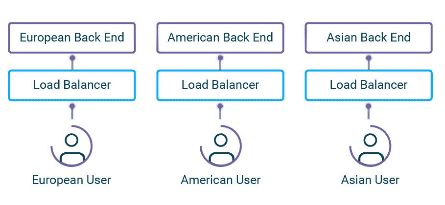
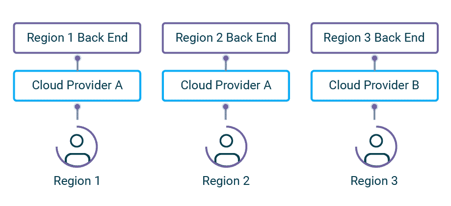
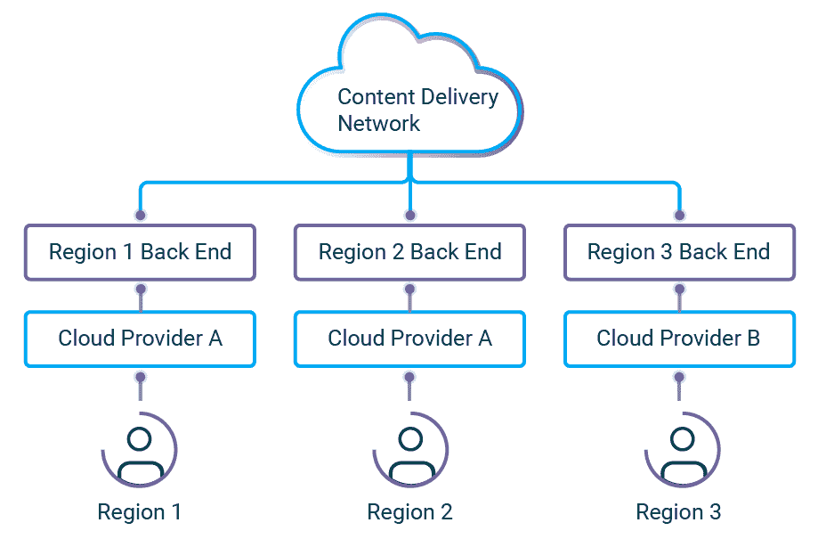
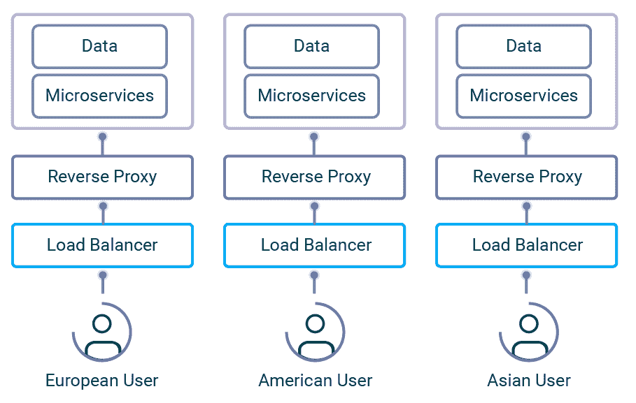
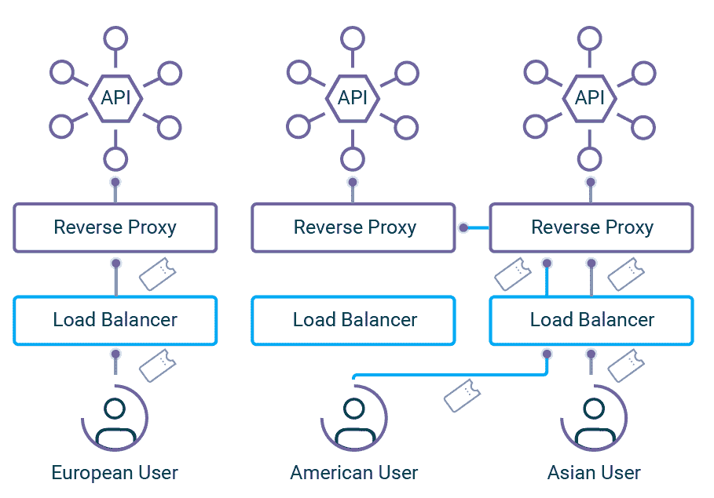
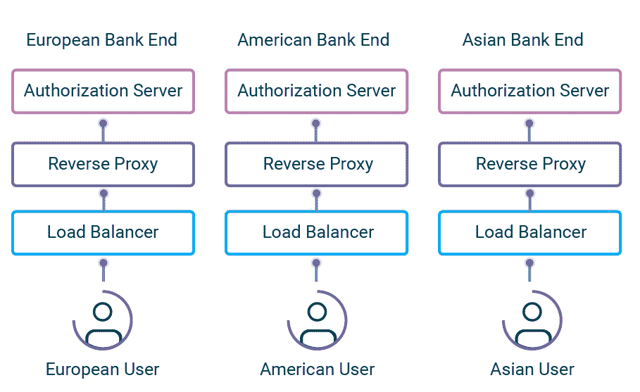
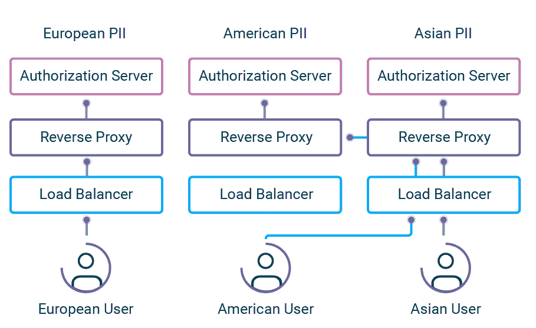

# 管理多区域部署中的用户访问

> 原文：<https://thenewstack.io/managing-user-access-in-multiregion-deployments/>

加里·阿彻

加里是 Curity 公司的产品营销工程师。20 年来，他一直担任首席开发人员和解决方案架构师。

现代企业需要赢得多个地区的客户，以便发展并最大限度地利用市场机会。这导致应用程序开发人员构建可以在多个位置使用的数字服务。

由于需要遵守与数据主权和[个人身份信息(PII)](https://www.dol.gov/general/ppii) 相关的法规，这带来了巨大的挑战。规划如何克服这些问题需要成为架构设计的一部分。

## 扩展后端组件

最初的目标通常是为所有用户实现可接受的性能。为了确保 HTTP 请求的低延迟，通常在多个区域托管后端系统，并使用负载平衡将用户路由到最近的实例:

在某些情况下，公司可能需要在用户的家庭区域存储某些类型的数据。一些国家甚至会屏蔽特定的云提供商。这可能导致软件公司将多云作为其全球部署战略的一部分:

我们将展示 OAuth 如何帮助扩展 web 和 API 部署的设计模式，以及如何支持跨越法律边界管理数据。

## Web 部署和安全性

web 内容的多区域托管非常简单，许多公司都使用内容交付网络:

*   开发单页应用程序(SPA)，以提供最佳用户体验。
*   将 HTML 资源部署到内容交付网络(CDN)。
*   CDN 在大约 20 个全球位置将内容部署到终端用户附近。
*   如果需要，很容易切换到不同的 CDN。

可以阻止 cdn 使用的一个领域是网络安全，因为现在建议网络应用程序只在浏览器中使用安全 cookies。这可能导致一些公司选择基于网站的 OAuth 解决方案，这些解决方案需要特定的运行时，如 Java，这反过来可能会限制托管选项。

解决 web 安全问题的最佳方法需要洞察力，但这是通过以 API 驱动的方式实现 OAuth 工作和 cookie 发布来实现的。这确保了 web 安全实现不会影响您的多区域 web 部署。(关于前端模式 (BFF)的更多细节，请参见本文的[后端。)](https://curity.io/resources/learn/the-bff-pattern/)

## 区域 API 和数据

您真正的后端当然是您的数据和随之而来的组件，包括:

*   用您选择的语言开发的 API
*   为每个 API 存储业务数据的数据库
*   支持组件，如消息代理和监控系统

旨在设计 API 数据存储，使 API 不存储身份数据等敏感信息，而是以令牌的形式临时接收这些数据。

为了在全球范围内部署后端，或者保持您的选择余地，您应该尽早为多云进行设计，这涉及到保持代码和部署的可移植性。这导致许多公司使用可以在提供商之间轻松切换的云原生解决方案:

*   将 API、数据存储和第三方组件部署为 Docker 容器。
*   在托管平台(如 Kubernetes)中管理容器。

首选方案是让每个区域及其数据主要作为独立的集群运行，每个区域都有自己的数据。不过也有一些棘手的情况，比如一个亚洲用户在美国旅行时会发生什么:

处理多个区域最干净、最可靠的方法是在用户级别控制 API 请求的路由。作为一种安全最佳实践，反向代理或 API 网关已经放在 API 的前面。您只需要确保代理支持基于内容的路由。

然后，您可以在颁发给应用程序的 OAuth 令牌中包含区域声明。当收到 API 请求时，反向代理可以读取该声明，并在需要时将用户路由到用户本地区域的内部 API URL。即使用户不在自己的家乡，这种方法也有效:

## 管理 OAuth 安全性

OAuth 是保护 web 应用、移动应用和 API 的现代框架。通过遵循推荐的流程，您将通过安全审查，并拥有与其他系统集成的最佳选择。

一个关键的构建块是授权服务器，它实现了安全标准，因此您的应用程序可以将许多困难的工作外部化。该组件应该不断增加对新标准的支持，随着时间的推移，软件公司将使用它来实现许多安全解决方案:

*   使用 [WebAuthn](https://curity.io/resources/learn/webauthn-overview/) 等标准进行安全且用户友好的身份验证
*   通过[客户端发起的反向信道认证](https://curity.io/resources/learn/ciba-flow/) (CIBA)，支持呼叫中心员工代表用户执行操作
*   向业务伙伴提供或使用财务级别的联系
*   在访问令牌中包含特定于域的声明，这样您的 API 可以使用可数字验证的 jwt(JSON web 令牌)以正确的方式授权请求

在多云设置中，您会希望在所有云中使用相同的提供者，因此许多公司也使用云原生授权服务器，它与 API 一起托管:

建议使用授权服务器作为[个人身份信息](https://curity.io/resources/learn/privacy-and-gdpr/)的真实来源。诸如用户同意和变更审计等方面将由您管理，这将有助于满足 GDPR 等法规。

授权服务器应该使您能够仅在用户的本地区域保存 PII，以及颁发的令牌和会话相关信息。同时，应该很容易对应用程序的所有复杂的 OAuth 客户端设置进行全局管理。

在身份验证过程中，应该能够以与 API 请求相同的方式动态路由用户，以便用户总是在他们的本地区域进行身份验证。对于 OAuth 请求来说，实现起来更具挑战性，但是这篇文章“[动态用户路由](https://curity.io/resources/learn/dynamic-user-routing/)”解释了如何实现:

当然，授权服务器是您的软件平台的关键组件，因此它还应该对现代可用性模式提供良好的支持，包括自动伸缩和零停机升级。

## 进一步的细节

在 Curity，我们是保护现代应用和规模设计的思想领袖。参见我们的[资源](https://curity.io/resources/)了解本帖中推荐的三种关键模式的更多细节:

*   使用[后端对前端](https://curity.io/product/token-service/oauth-for-web/)的方法来确保 web 应用程序符合现代标准，并实现高效部署。
*   在 API 前面托管一个反向代理，并在访问令牌中包含一个区域声明，这样 API 请求就可以被动态地[路由](https://curity.io/resources/learn/dynamic-user-routing/)到用户的本地区域。
*   使用一个可以在多个云中运行的授权服务器，并且还要确保它具有良好的可扩展性特性和对[最新安全标准](https://curity.io/product/conformance/)的支持。

一旦这些基础到位，您将拥有一个提供业务灵活性的全球设计的架构，这使得将您的解决方案扩展到新市场变得更加简单。

<svg xmlns:xlink="http://www.w3.org/1999/xlink" viewBox="0 0 68 31" version="1.1"><title>Group</title> <desc>Created with Sketch.</desc></svg>