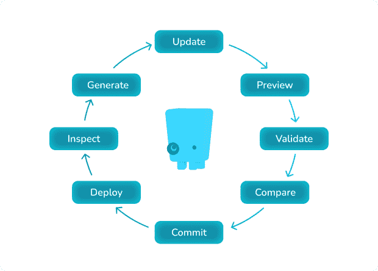

# 先显示—放心部署

> 原文：<https://thenewstack.io/manifest-first-deploy-with-confidence/>

许多 [Kubernetes](https://thenewstack.io/category/kubernetes/) 专家不再专注于优化，而是转向[平台工程](https://thenewstack.io/platform-engineering-what-is-it-and-who-does-it/)的基础，那里的目标是建立一个基础设施，让[开发者更快地部署软件](https://thenewstack.io/category/development/)。

通过降低高效地将无错误代码推向生产所需的认知负荷，DevOps 团队利用 Kubernetes 创建一个围绕部署代码的自助式环境。开发人员获得了他们需要的高速度和高质量的工具，所有这些都不需要对操作有深刻的理解。

但要成功做到这一点，需要为开发人员构建一个基础设施，在每一步都增强信心，比如每次他们提交代码甚至保存 Kubernetes 清单时。突然间，开发人员不再浪费时间在手动测试或昂贵的代码审查上，而是提高了他们的速度。

好消息是，在 Kubernetes 工作的 DevOps 团队有可行的方法来建立他们的信心，使用工具、平台和哲学来帮助他们利用验证预览和 GitOps。

## 什么是验证？

验证是自动分析和识别代码潜在问题的过程。

例如:由于 JavaScript 框架的普遍流行， [ESLint](https://eslint.org/) 是当今最常用的验证工具之一。它静态地分析您的代码中可能出现的大范围问题，小到要求在代码行的末尾使用分号，或者在字符串周围使用单引号。或者，如果配置得当，ESLint 可以寻找安全问题，比如不安全的正则表达式或使用`require(variable)`，这可能允许攻击者加载和运行任意代码。

通过静态分析结果交换格式( [SARIF](https://docs.oasis-open.org/sarif/sarif/v2.1.0/cs01/sarif-v2.1.0-cs01.html) )，跨工具的验证互操作性是可能的，该格式标准化了静态分析工具的规则和配置语法。SARIF 将执行验证的工具从显示结果的工具中分离出来，就像一座桥梁，使它们可以互操作。

有了单一的 SARIF 标准，你可以在任何地方验证你的代码的存在和运行，从 VS 代码扩展，你的本地系统终端，一个 [GitHub 动作](https://thenewstack.io/the-missing-part-of-github-actions-workflows-monitoring/)，一个 webapp 等等。

当您设置一个验证器并配置它来扫描您代码中任意数量的 SARIF 规则时，它会识别错误配置并在您选择的工具中显示它们作为警告或错误。在某些情况下，比如如果您的验证器作为一个[预提交钩子](https://monokle.io/blog/advanced-git)运行，它甚至可以阻止您提交不符合您预先配置的规则的代码。

[@ monokle/validation library](https://github.com/kubeshop/monokle-core/tree/main/packages/validation#readme)只是这种验证器的一个例子，允许团队执行 YAML 语法、[开放策略代理](https://thenewstack.io/open-policy-agent-the-top-5-kubernetes-admission-control-policies/) (OPA)规则、特定版本的 Kubernetes 资源模式等等。您将经过解析的资源输入到库中，它会输出一个 SARIF 响应，帮助您以增量方式进行重新验证，以获得更快甚至实时的反馈。

这里有一个 Monokle 的例子，它让您只需配置一次验证，就可以在任何地方运行:

```
plugins:
  resource-links:  true
  open-policy-agent:  true
  kubernetes-schema:  true
rules:
  resource-links/no-missing-links:  "warn"
  open-policy-agent/no-host-network:  "err"
  open-policy-agent/no-host-mounted-path:  "err"
  open-policy-agent/no-last-image:  "warn"
  open-policy-agent/cpu-limit:  "warn"

settings:
  kubernetes-schema:
 schemaVersion:  v1.24.2

```

## 预览的力量

虽然验证器可以帮助您在开发过程中发现 Kubernetes 资源中的错误配置，但是预览器可以帮助您将这种能力应用到任何 Kubernetes 配置工具(Helm、Kustomize 等等)中。这对您的 DevOps 文化来说更有价值，因为您可以通过快速查看任何当前状态和您尝试创建的未来状态之间的差异，更好地确保您部署到集群的内容的质量。

通过预览，您可以了解将要部署的软件包含什么，它需要对您的集群进行什么访问，它需要什么类型的计算资源等等。预览帮助您获得所有这些知识和背景，而不必成为操作专家，让您更加自主地工作，同时还降低了变更失败率。

我们举一个常见的例子。您是 DevOps 团队的一员，该团队需要通过部署像 [Prometheus](https://prometheus.io/) 这样的第三方工具来扩展其集群的功能。Prometheus 社区提供了[预构建的掌舵图](https://artifacthub.io/packages/helm/prometheus-community/prometheus)，旨在简化所需存储、配置映射、入口服务等的部署流程。

我们最喜欢 Helm 的地方——它极大地简化了将复杂服务部署到 Kubernetes 集群的过程——也是它有风险的地方。理论上，你可以用三个命令安装 Prometheus:

```
helm repo add prometheus-community https://prometheus-community.github.io/helm-charts
helm repo update
helm install  [RELEASE_NAME]  prometheus-community/prometheus

```

但是在这三个命令的背后隐藏着大量的复杂性。预览有助于您准确理解 Helm 想要创建的资源，从而为进一步的更改或增加的成本做好准备。

使用像 [Monokle](http://monokle.io/) 这样的工具，您可以在部署到集群之前比较 Helm 的输出——跨 Git 分支和/或存储库，或者在不同的名称空间和整个集群之间。它非常适合理解安装像 Prometheus 这样的新的第三方工具的含义，而无需花费过多的时间手动测试和调整您的配置。

有了 [Monokle Cloud](https://app.monokle.com/) ，这款基于浏览器的免费工具可以帮助您探索、比较和验证已经存储在 GitHub 上的 Kubernetes 和 GitOps 配置，您可以在几秒钟内开始验证和预览。例如，Monokle Cloud 可以帮助您在浏览器中查看由[普罗米修斯掌舵图](https://app.monokle.com/explore/github/prometheus-community/helm-charts/branch/main?view=helm&pt=1&pf=charts%2Fprometheus%2Fvalues.yaml&f=charts%2Fprometheus%2Fvalues.yaml)生成的所有资源。了解集群状态的大范围变化不需要任何安装。

## GitOps:桥接验证、预览等等

GitOps 的宗旨是将从持续改进软件开发生命周期中获得的经验应用到部署云原生基础设施中。我们不会在这里谈论 GitOps 的每个方面，但有几个相关的关键原则:

*   您以声明方式声明您的集群，因为您的清单描述了所需的状态，而不是实现该状态所需的步骤。
*   这个期望的状态用 git 存储和版本化。
*   您使用额外的工具/平台来自动防止错误配置和不期望的状态。

这些原则很重要，因为 DevOps 和平台工程更多地基于经验，而不是特定类型的正式培训。没有特定的途径，比如一系列的计算机科学课程或一个证书，来宣布你已经准备好开发运维了。通过将所有信息放在一个地方——整个团队都可以访问的 git 存储库——[GitOps](https://thenewstack.io/comparing-infrastructure-as-code-and-gitops-for-platform-teams/)方法创建了透明度，并建立了集体知识，防止了大错误。

GitOps 还关闭了大多数内部开发流程中昂贵的反馈回路。如果您在等待配置在试运行、QA 或生产中失败，那么您是在浪费时间，而这些时间本可以用于开发新功能或优化您已经拥有的清单。通过保持一切透明并整合检测错误配置的自动化工具，您可以实现两全其美:在事件发生期间快速推送修复程序以保持较低的平均解决时间(MTTR ),同时在您准备好部署新的主要基础架构时获得所有必要的保护、检查和审查。

这包括自动验证和预览。

例如:

*   您可以使用 Monokle 这样的工具来构建 Kubernetes 清单，这种工具利用了 git，因此您总是透明地工作。
*   随着开发的进行，Monokle 的内置验证器会指出错误的配置，并根据已经建立的组织标准给出如何统一和修复代码的建议。
*   当您准备好推送您的代码时，Monokle 使用丰富的 diff UI 创建新声明的集群状态的预览，以突出显示随着您的最新更改将会发生什么变化，以及这会如何影响您的集群上当前正在运行的其他内容。
*   当您推送到您的代码协作平台并创建一个 pull 请求时，您会触发一个具有附加测试和代码分析层的 CI/CD 管道，如部署预览或端到端测试套件。
*   一旦您完成了协作并对代码进行了更改，它就会被合并到 main 中，允许您团队的其他成员立即构建您最新的改进。



GitOps 为云原生基础设施提供了基础，使开发更容易，并帮助每个人放心地部署。

## 最佳状态的一个工具

[Monokle](http://monokle.io/) 是一个[开源](https://github.com/kubeshop) Kubernetes 配置工作台，旨在帮助 DevOps 工程师和开发人员利用 GitOps 进行验证、预览等等。有了 Monokle，您就有了一个定义、比较和审计 Kubernetes 集群的实际和期望状态的工具，由于其开发人员友好的界面，YAML 固有的复杂性和语法问题都被抽象掉了。

随着 git 在幕后运行，您对 Monokle 的每一项操作——从提交到合并到推送再到`main` — Monokle 为您提供了一条通往最新代码协作、CI/CD、GitOps 等的捷径。

我们很想听听您对验证、预览和 GitOps 的首次尝试，或者您是如何长期使用它们来完善您的流程的！我们的团队总是不和谐。一定要加入进来，打声招呼，帮助我们塑造 DevOps 本身的未来状态。

<svg xmlns:xlink="http://www.w3.org/1999/xlink" viewBox="0 0 68 31" version="1.1"><title>Group</title> <desc>Created with Sketch.</desc></svg>