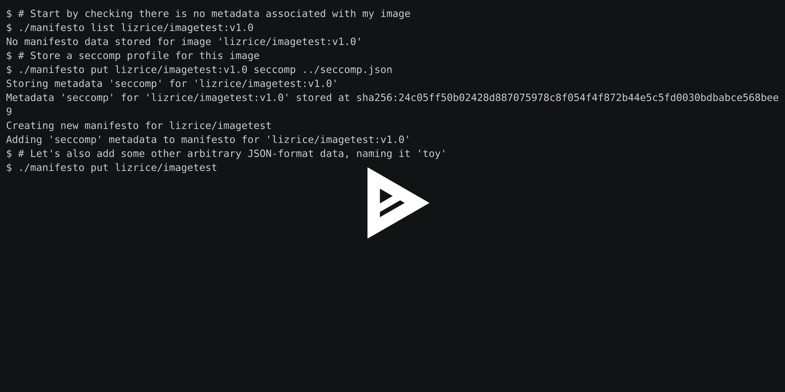
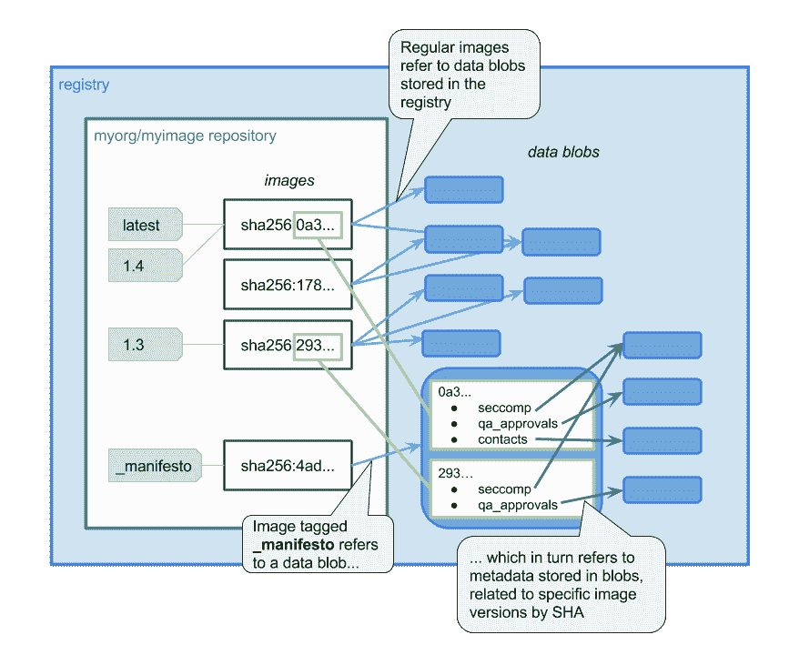

# 宣言:来自 Aqua Security 的一个新的开源容器元数据工具

> 原文：<https://thenewstack.io/manifesto-aqua-securitys-new-open-source-container-metadata-tool/>

在 [Aqua Security](http://aquasec.com) ，我们刚刚发布了一个开源项目，帮助容器用户管理与他们的容器图像相关的元数据。它被称为[宣言](https://github.com/aquasecurity/manifesto)，它将自由格式的元数据存储在注册表中，与图像本身放在一起。

## 构建后元数据的需求

 [利兹·赖斯

Liz Rice 是集装箱安全专家 Aqua Security 的技术布道者。在此之前，她是 Microscaling Systems 的 CEO，也是管理容器元数据的工具 MicroBadger 的开发者之一。](https://www.aquasec.com/) 

我对容器元数据感兴趣已经有一段时间了，致力于 MicroBadger 和[标签模式标准](https://thenewstack.io/label-schema-launches-provide-standard-approach-container-metadata/)。这些项目解决了您可以在构建时通过标签添加到图像中的元数据，但是它们对于您可以在构建后更新的图像信息(可能贯穿其整个生命周期)并没有真正的帮助。

构建映像后需要更新的元数据的几个用例包括:

*   在映像通过部署前的一系列“关卡”时，跟踪映像的测试结果和批准状态
*   保存 [Seccomp / AppArmor 或其他安全配置文件](http://blog.aquasec.com/new-docker-security-features-and-what-they-mean-seccomp-profiles),以便运行该映像
*   存储映像的最新漏洞扫描报告。

在所有这些情况下(以及更多情况下),都有可能将信息存储在其他地方，但是将它与相关的图像联系起来是一件令人头疼的事情。Manifesto 项目旨在消除这种痛苦，并使存储和检索图像数据变得无缝。

## 命令行工具

通过[宣言](https://github.com/aquasecurity/manifesto)，我们已经建立了一个原型命令行界面(CLI ),允许用户添加、列出和获取特定图像的任意元数据。

[](https://asciinema.org/a/128283)

## 自动化的元数据

上面的演示显示了检索特定图像的 seccomp 配置文件并将其存储在一个文件中。这可以很容易地传递到部署容器的命令中——例如在 Docker:

```
  $  manifesto get myorg/myimage:v1.1  seccomp  &gt;  seccomp.json
  $  docker run  --security-opt seccomp=seccomp.json myorg/myimage:v1.1

```

更一般地说，CLI 可以用在许多自动化脚本中——例如，存储测试结果和作为 CI/CD 管道一部分的映像的[所有重要漏洞扫描。](http://blog.aquasec.com/the-known-unknowns-the-importance-of-ongoing-security-scans-for-containers)

[](https://github.com/aquasecurity/manifesto)

## 利用公证人保护数据安全

元数据保持安全和完整是很重要的——您不希望坏人能够篡改您的漏洞报告来掩盖漏洞，或者篡改您的安全配置文件。Docker 团队在[通过公证](https://github.com/docker/notary/blob/master/docs/getting_started.md)确保图像来源方面做得非常出色，通过 Manifesto，我们的目标是利用公证获取图像元数据以及图像本身。事实上，有一个关于标准化漏洞报告的[莫比项目提案](https://docs.google.com/document/d/1m7i9CtQ-Cgx8j4tdtzwC-q2hX5z-bu1vQxgovc3f3eU/edit#heading=h.p2ufjlbiiu0u)讨论了使用类似的方法。

## 宣言的未来

我们的目标是将 Manifesto 从目前的原型阶段发展成为一个健壮、安全和有用的工具。我们已经得到了一些有用的反馈，亲爱的读者，我们欢迎你的[想法、评论、公关和 GitHub 明星](https://github.com/aquasecurity/manifesto)！

通过 Pixabay 的特征图像。

<svg xmlns:xlink="http://www.w3.org/1999/xlink" viewBox="0 0 68 31" version="1.1"><title>Group</title> <desc>Created with Sketch.</desc></svg>