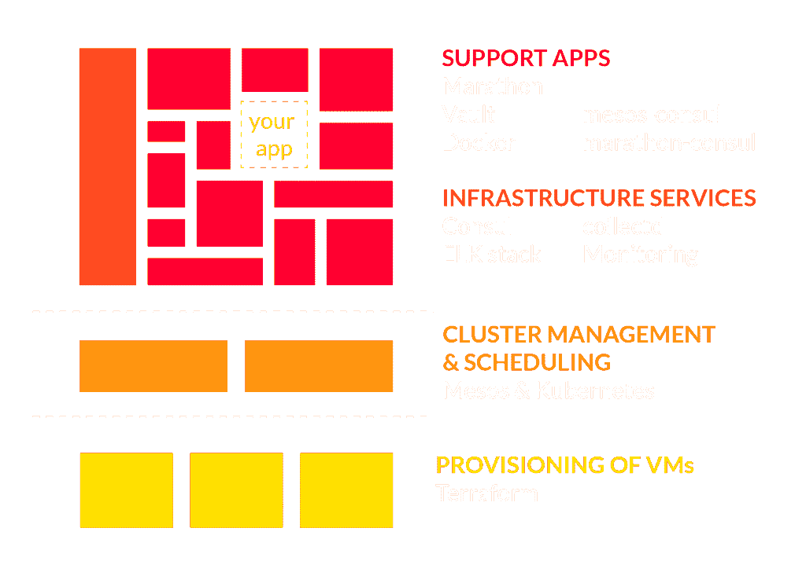
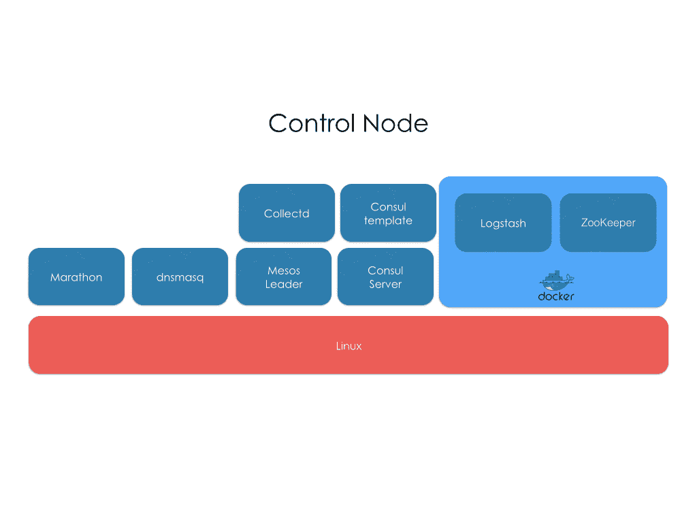
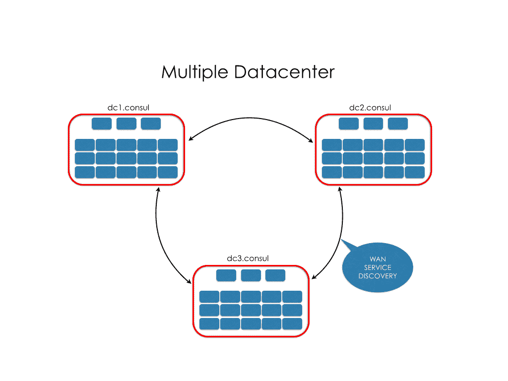

# Mantl 引入微服务作为堆栈

> 原文：<https://thenewstack.io/mantl-introduces-microservices-stack/>

DevOps 的未来千变万化。随着开发人员继续承担开发运维的责任，这需要满足整个开发团队需求的工具，而不是少数人的需求。在基于容器的工作流中工作，允许应用程序开发人员使用 Docker 和 Kubernetes 等服务快速启动实例，尽管随着时间的变化，对基于容器的服务管理器的需求正在上升。来自思科的 Mantl 解决了这一需求，并应对了为同时处理企业和小规模应用的 DevOps 团队安排微服务经理的挑战。

## 微服务和开发运维

微服务是 DevOps 的支柱，使那些在容器中工作的人能够高效地工作。Mantl 微服务管理器的每一小段都被称为一片雪花，结合起来形成滚雪球效应，级联到应用开发的每一层。在运行服务时，当试图找出日志存储、云提供商或如何通过最少的调试连接微服务以获得最大效率时，可能会出现问题。

Mantl 微服务架构

Mantl 允许团队在任何云提供商上运行其服务。这包括裸机服务、OpenStack、AWS、vagger 和 GCE。Mantl 使用 DevOp 社区中的行业标准工具，包括[马拉松](https://mesosphere.github.io/marathon/)，Mesos，Kubernetes，Docker，[跳马](https://vaultproject.io/)等等。Mantl 堆栈的每一层都允许在支持、峰值工作负载期间管理 Mesos 或 Kubernetes 集群，或使用 [Terraform](https://terraform.io/) 启动新虚拟机之间建立统一、紧密的管道。无论您是通过添加新虚拟机进行扩展以准备启动，还是在集群上部署多个节点，Mantl 都允许您在一个中心位置使用 DevOps 堆栈的每一部分，而无需回溯调试或重新编译代码来确保您需要的微服务在您需要时发挥作用。

在基于容器的 DevOps 环境中工作时，拥有合适的微服务是日常工作成败的关键。通过马拉松式用户界面，用户可以停止和重启集群，终止不良节点，以及管理高峰时段的扩展。有了 Mantl，使用 Terraform 添加更多虚拟机进行 QA 测试或实时使用变得很简单——不需要拼凑代码来确保这两个部分一起工作没有错误。解决微服务冲突会严重影响工作效率。Mantl 减少了解决与微服务冲突的时间，因此 DevOps 可以将更多时间用于应用程序。

## 微服务堆栈的未来

微服务正在塑造 web 开发的未来，带来了在 DevOps 中工作的最佳实践。随着越来越多的项目需要在更短的时间内从概念到发布的能力，应用程序开发人员的需求也发生了变化。微服务平台是网络发展变化的直接结果，Mantl 采用了基于社区的方法来组织构建基于网络的平台、服务和应用所需的基础设施。从编写代码行转移到将堆栈的各个部分粘在一起是开发人员和程序员如何与他们日常使用的服务进行交互的最重要的转变之一。粘合代码被视为一种必要的邪恶，它的出现是为了确保项目运行的所有东西都能协同工作。

人工控制节点

随着越来越多的微服务成为领先的行业标准，需要在不调试无休止的冲突的情况下将这些部分连接起来。展望未来，开发包含 DevOps 所有必要部分的统一中央堆栈将加强社区，因为在需要粘合代码的服务中工作的更多潜在痛点将得到解决。Mantl 通过寻求社区对其架构的建议来帮助实现这一点——根据日常实际使用的内容添加组件——而不是构建一个充满过时或低效服务的微服务堆栈。

Mantl 正在与 OSS 社区合作，着眼于社区参与，走向未来。安全性是 DevOps 在开源环境下工作的主要关注点之一，Mantl 已经通过向其平台添加大量安全特性解决了这个问题。其中包括管理 Linux 帐户的能力，允许设置哪些用户可以访问 root 命令，Marathon、Consul 和 Mesos 的身份验证，以及应用程序动态防火墙。Mantl 的软件需求包括 Ansible 1.9 和 Python 2.7。按照提供的说明，Mantl 可以跨多个服务器运行。

## 微服务作为一个堆栈

Mantl 采用了传统开发栈的概念，并将其应用于用于创建项目的工具。借助这种结构，DevOps 团队能够快速启动并运行他们的团队，而无需拼凑单个微服务，也无需花费时间编写或共享所需的粘合代码来确保应用程序按预期运行。人们可以使用 Mantl 堆栈来安装当今使用的最常见、最可信的 DevOps 工具，而不是单独管理微服务。

随着时间的推移，开发堆栈会发生变化，每天都会在每个单独的组件中添加、更改或调试功能。更新单个微服务可能会导致应用程序中断错误，从而导致生产延迟。使用 Mantl，管理这些服务是集中的，Mantl 能够在一个平台内处理日志记录、容器管理、集群部署等等。Mantl 不是专注于微服务的一个部分，而是为当今的 DevOps 团队的需求提供了一个全方位的解决方案。

在多个数据中心上运行的 Mantl

转向微服务作为基于堆栈的工作流解决方案，可以将更多的时间用于积极的开发工作。Mantl 自动化了曾经需要数小时将单个组件编码在一起的任务，这导致了一个堆栈，消除了怀疑一个软件是否能与另一个很好地工作的猜测。转移焦点更简单，如果您的微服务堆栈的一部分没有按预期工作，可以有多个选项来改变。Mantl 为 DevOps 团队提供了多种支持应用和基础设施服务，以选择最适合他们的应用，而不是只有一种选择来完成任务。

随着开发运维团队的需求不断变化，他们经常被要求学习专业领域之外的技能。这些不断变化的技能组合意味着，随着团队变得更加精简，电子商务开发人员和程序员可能会被要求学习与 DevOps 相关的技能，从而在项目工作中进行更深入的合作和解决问题。有了像 Mantl 这样的微服务堆栈，可以确保团队能够轻松地协作，让每个人都了解他们正在使用什么工具进行构建。由于 Mantl 为 DevOps 提供了许多最新的技术，这确保了更深入地了解 DevOps 的所有内容，从而减少了解释潜在软件冲突的时间，增加了产品开发的时间。

总的来说，Mantl 是一个为当今 DevOps 团队的需求而构建的微服务平台，提供了一个运行最佳技术的解决方案，用于在基于容器的工作流中构建高度可伸缩的应用程序。

<svg xmlns:xlink="http://www.w3.org/1999/xlink" viewBox="0 0 68 31" version="1.1"><title>Group</title> <desc>Created with Sketch.</desc></svg>