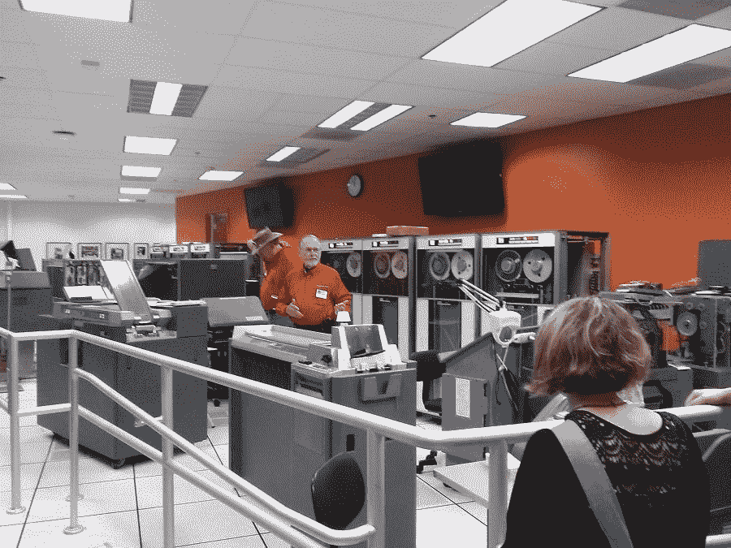

# 25 年后，许多强大的 Amigas 仍在使用

> 原文：<https://thenewstack.io/many-mighty-amigas-still-use-25-years-later/>

“在 20 世纪 80 年代中后期，Amiga 是演示领域无可争议的冠军，”[回忆起](http://arstechnica.com/gadgets/2013/04/a-history-of-the-amiga-part-9-the-demo-scene/) Ars Technica。"它的定制芯片、多种图形模式和 16 位处理器超越了个人电脑."

一些渴望的极客将它的记忆保存在他们的心中，这一年我们发现仍然有少数几个 hardy Amigas 已经连续运行了 25 年。

就好像阿米加从未真正离开过我们。

但是为什么对这个有几十年历史的设备有这种特殊的喜爱呢？“Amiga 可以在 360×576 分辨率下显示 4096 种颜色，”Ars 报道说，“同时播放四通道立体声数字声音，而不会增加 CPU 的负担。与此同时，一台典型的个人电脑大多以文本模式运行，或者，如果你幸运的话，以 320×200 的分辨率显示，有四种绚丽的颜色，有时还会发出一声孤独的哔哔声。”

根据 Addison-Wesley 的“ [Amiga 硬件参考手册](https://www.amazon.com/Amiga-Hardware-Reference-Manual-Technical/dp/0201567768)，Amiga 有一个定制的芯片组，带有几个协处理器来处理音频、视频和直接存储器访问。这释放了 CPU 用于其他任务，使 Amiga 相对于其竞争对手具有竞争优势。

据估计，最终售出了 4，850，000 辆 Amigas，其中大约 30%在英国，另外 30%在德国。据报道，北美仅售出 70 万辆，与意大利的销量大致相同。

有一段时间，它是每个关于家庭计算的谈话的一部分。早在 1991 年，在*神秘科学剧场 3000* 的一集里，甚至有一个关于它的笑话[。当这两个机器人争论个人电脑是否优于苹果电脑时，他们的朋友乔尔顽皮地介绍了第三种选择——在他们都回到](https://www.youtube.com/watch?v=yyIB8FrHuf4#t=1m13s)[质问*Gamera vs Barugon*之前。](http://mst3k.wikia.com/wiki/Gamera_vs_Barugon)

[https://www.youtube.com/embed/yyIB8FrHuf4?start=73&feature=oembed](https://www.youtube.com/embed/yyIB8FrHuf4?start=73&feature=oembed)

视频

很久以前的那些小机器仍然很受欢迎。但是 386 芯片和 256 色 VGA 显示器的出现开始使个人电脑变得更有吸引力，到 1994 年，Commodore 已经申请破产。其资产被德国个人电脑制造商 Escom 收购，后者也于 1997 年破产。Gateway 2000 购买了品牌名称 Amiga，但后来在没有发布任何产品的情况下将其出售。

但是那些 80 年代的电脑被证明非常耐用。为了回答“它们现在在哪里”这个问题，去年 Geek.com 发现了一个已经在密执安的学校系统中连续使用了 30 年的装置。“大急流城公立学区在 20 世纪 80 年代向未来迈出了一大步，当时它使用能源债券的资金购买了一台 Commodore Amiga 电脑，”它报道说，并指出 Amiga 取代了一台冰箱大小的电脑。三十年来，Amiga 使用 1200 位调制解调器和无线电信号控制该地区 19 所学校的供暖和空调，同时收集温度和其他状态报告。

据当地新闻报道，它实际上是由一名高中生建立的——在接下来的 30 年里，每当他们有问题时，学校都会打电话给他。根据这份报告，多年来，他不得不在易贝上寻找替换零件，而且“如果明天电脑停止工作，工作人员将不得不手动打开和关闭每栋大楼的气候控制系统。”但是在去年 11 月 T2 通过了 1.75 亿美元的债券措施后，这个努力工作的设备最终被安排退休。

这不是唯一一台仍在生产的 80 年代电脑。在波兰[有一家汽车修理店已经用同一辆 Commodore 64](http://www.gizmodo.com.au/2016/09/this-old-arse-commodore-64-is-still-being-used-to-run-an-auto-shop-in-poland/) 超过 25 年了。自 1991 年以来，在格但斯克的某个地方，它的 64 千字节内存已经足够运行一些关键的本土软件，用于计算平衡传动轴的重量。据脸书的一位评论者称，有一次一个漏水的窗户真的淹没了机器——这个故事引来了数百个赞赏的回应。

一位东海岸的极客评论道:“旧的硬件是为了永恒而建造的，钢制外壳，永不褪色的塑料。”。“令人难以置信的是它还在滴答作响。”

“我们的第一台电脑是 Commodore 64，”另一位评论者回忆道。“销售员说这是我们唯一需要的电脑。也许他是对的！”

但是在复古发烧友的世界里，有一个快乐的极客可能获得了最终的发现。他最后得到了一辆从未开过的阿米加 2000。它有 256 kB 的只读存储器，256 kB 的随机存储器和一个 3.5 英寸的软盘驱动器。在曼彻斯特的一户人家，它在运输箱里放了二十多年都没有打开过。

它特别可爱，因为 Amiga 2000 是 Commodore 1987 年 PC 的高端版本。“随着时间的推移，最终拥有 Amiga 的先生们去世了，从未真正启动过机器，他的妻子也不愿出售它。最终，他的妻子也去世了……是时候清算这对夫妇的财产了。

幸运的是，清算人认识一位名叫格伦的老式电脑爱好者，他承诺给这台电脑一个好归宿。他们以 200 英镑——约 245 美元——的价格卖给了他，据报道，这是你在易贝买一辆老 Amiga 的价格。

“自从这个故事最初发布以来，格伦已经做了更多的拆箱和初始设置，”[报道](http://hothardware.com/news/dude-scores-virgin-amiga-2000-new-in-box)热硬件，“并让他的新 Amiga 2000 启动和运行。”

他们补充道，“外壳和键盘都是完美的……”

当然，不仅仅是业余爱好者在使用旧机器。五月，CNN [报道](http://www.cnn.com/2016/05/26/us/pentagon-floppy-disks-nuclear/)美国的核轰炸机仍然由一个使用 8 英寸软盘的系统控制。“美国政府问责局的报告说，美国政府部门每年花费 600 多亿美元来运行和维护过时的技术。这是现代 IT 系统投资的三倍。”

洲际弹道导弹也使用相同的 8 英寸软盘进行协调，而美国财政部实际上正在运行用汇编语言编写的应用程序。

一些政府硬件可以追溯到更远的地方。MuckRock.com——一个专门研究 FOIA 请求的网站——[最近发起了](https://www.muckrock.com/news/archives/2016/oct/03/one-governments-oldest-computers-isnt-earth/)一项活动，旨在确定美国政府仍在使用的最古老的电脑。他们得出结论，这是 1977 年美国宇航局发射到太空的旅行者 1 号探测器上的计算机，旅行者 1 号探测器在 1979 年从木星和 1980 年从土星发回照片，现在正在广阔的星际空间漫游。去年，为了更新软件，NASA [发布了招聘 FORTRAN 程序员的公告](http://www.popularmechanics.com/space/a17991/voyager-1-voyager-2-retiring-engineer/)。

但最终，旧机器似乎幸存了下来，因为在我们内心深处，我们希望它们幸存下来。在加州山景城，离谷歌全球总部仅几英里的地方坐落着一台修复的 1959 年大型机，配有磁带机和读卡器。

计算机历史博物馆经常为那些想回到个人电脑还没有出现的时代的游客们打开它。

<svg xmlns:xlink="http://www.w3.org/1999/xlink" viewBox="0 0 68 31" version="1.1"><title>Group</title> <desc>Created with Sketch.</desc></svg>