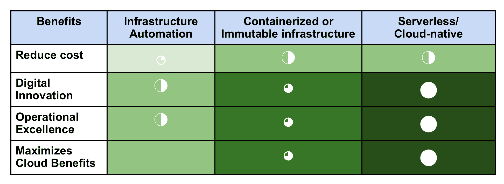
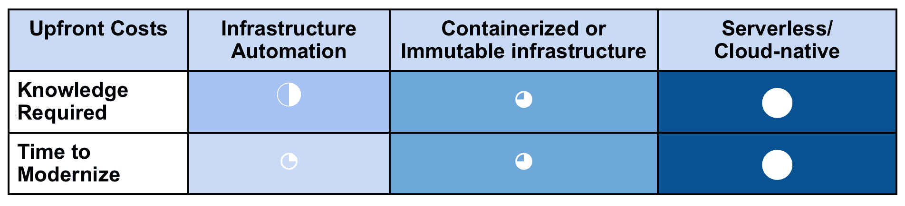

# 绘制您的 Monolith 现代化之旅

> 原文：<https://thenewstack.io/map-your-journey-to-monolith-modernization/>

将一个整体应用程序分解成更小、更易管理的部分有很多好处。然而，分解一个整体应用程序可能是一个挑战，因为许多都是脆弱的，这个任务必须小心处理。因此，在今天的文章中，我们将分享你需要什么资源来使你的巨石现代化。

不要认为这是一个食谱，而是开始前你需要收集的原料。

### 收集技能和应用知识

 [德里克·马吉尔

Derek Magill 是 NTT 数据公司 Flux7 的解决方案架构师，他在 IT 工程领域拥有 20 多年的经验，专攻高性能计算。Derek 目前担任 CELUG 的主席，是高性能计算专业人员协会的执行董事。](https://www.flux7.com/) 

如果你的 monolith 像许多人一样，几十个编码员在它上面工作了很多年。在这个过程中，它从一个单一焦点的应用程序膨胀为一个有许多目标的应用程序。在这些情况下，收集尽可能多的关于应用程序的部落知识会很有帮助。知道这些资源在哪里，并在开始之前在内部整理它们。他们对独石的依赖性和其他细微差别的了解将对旅途有极大的帮助。

虽然尽可能深入了解 monolith 很重要，但拥有一个精通云原生技术(如微服务架构)的团队也是必不可少的。如果你内部没有这些技能，可以考虑聘请一名顾问，他会教你的团队如何捕鱼，同时帮助改造整块巨石。

开始之前需要回答的关键问题包括:

1.  现代化计划的预期结果是什么？是降低成本、提高运营效率、加强创新还是其他？
2.  你有深入了解独石的内部资源吗？具体是谁？他们可以帮助现代化工作吗？如果可以，什么时候/按照什么时间表？
3.  你的资源对这个应用有多深的了解？这些资源是原始开发团队的一部分吗？
4.  最后，开发者能否映射应用的服务、依赖关系等？他们能分享它的脆弱之处和/或所用技术的局限性吗？

### 规划你的路线

刘易斯·卡罗尔曾经写道:“如果你不知道你要去哪里，任何道路都会带你去那里。”拥有具体的计划和明确的 monolith 应用程序现代化路径对于实现您的目标至关重要。一些整体现代化的方法提供了比其他方法更全面的成本优化，这将带来更好的云投资回报率。例如，容器化将帮助您实现自动扩展和 CI/CD 功能，而完全无服务器的结构将充分利用云的弹性和成本效益。

请记住，收益越大，前期投资就越多。因此，应该完成清晰的成本收益分析，以了解哪种方法最适合您的特定 app 以及您希望实现的收益。

### 定义现代化标准

根据成本效益分析的结果，有三种常见的现代化目的地。请注意，这不是一个从一个方格移动到下一个方格的线性练习，而是一个根据一系列标准和期望结果来决定目的地的练习。事实上，与直接跳到你想要的最终状态相比，线性移动可能会花费你更多的时间和资源。

## 基础设施自动化

有时也称为云基础架构就绪，这种方法应该保留给低商业价值的应用程序。我们称这些应用为维持应用，因为它们是为了维持业务，而不是创造新的收入。(我们将创收应用称为投资应用。)

对于这些应用，基础架构自动化允许您在新虚拟机上的云中重新安装应用，允许您清除技术债务，如随着时间的推移而积累的不再相关的配置。同时，这种方法允许您采用新的最佳实践，例如，通过新的漏洞检测提高安全性。

### 不变的基础设施

也称为云服务就绪、平台再造或容器化，这种方法允许 monolith 利用云基础设施，特别是从操作系统或数据库等组件的升级版本中。在容器化过程中，应用程序代码被更改为使用基础平台服务，如 Amazon RDS 和 Amazon Elasticache，以及高级 Amazon EC2 服务，如 autoscaling 和 ELB。当最初的开发团队无法提供帮助时，和/或当应用程序不适合 Lambda 等高级技术时，重新平台化是一个不错的选择。

### 无服务器或托管基础架构

这种方法也经常被称为云原生或重构。它是 monolith 应用程序完全现代化的理想选择，因为它允许您充分利用先进技术，如无服务器和微服务等架构。这条道路需要重构组成应用程序的服务，同时保留业务逻辑。该应用程序被分成不同的层和服务，如数据库，被替换为云服务。

新的云原生应用程序有许多好处，包括小的、可组合的部分，允许开发团队自治地并发工作，从而提高团队利用率。在高级自动化和代码库的帮助下，团队加快了上市时间，这些代码库已经被拆分为单独的服务。此外，与原始的 monolith 不同，更新可以快速推送给客户。最后，风险降低了，因为开发人员不再需要理解 monolith 代码库的复杂性来避免可能导致整个应用程序崩溃的更改。

就像厨师在开始一道菜之前确保他们手头有所有的配料一样，在你开始你的 monolith 现代化之旅之前收集这些配料将有助于确保成功。收集内部知识，获得适当的技术和工艺技能，并基于成本效益分析为您的特定整体应用确定最佳路径，您将准备好开始整体现代化之旅。

通过 Pixabay 的特征图像。

<svg xmlns:xlink="http://www.w3.org/1999/xlink" viewBox="0 0 68 31" version="1.1"><title>Group</title> <desc>Created with Sketch.</desc></svg>