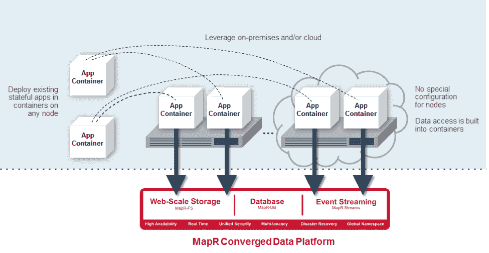
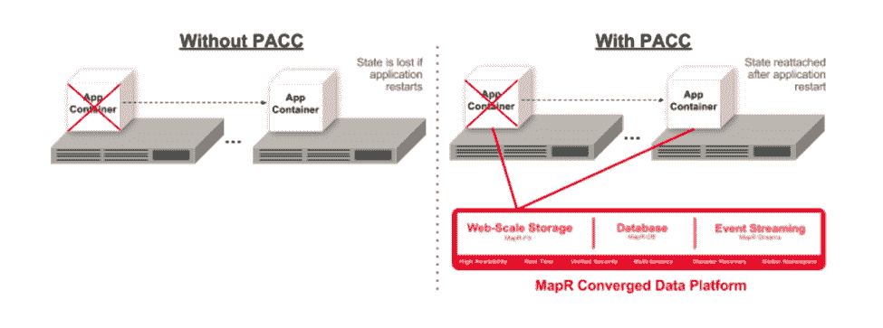

# MapR 平台为容器化应用程序提供持久的数据访问

> 原文：<https://thenewstack.io/mapr-platform-offers-persistent-data-access-containerized-applications/>

这是集装箱时代。像 Docker 这样的服务越来越多的使用正在改变企业内部处理软件的方式。然而，这种容器利用率的提高确实给企业首席信息官带来了在生产中推广应用程序的问题。

最大的问题之一是扩展应用程序以满足业务需求。虽然在理论上，容器能够处理企业应用程序，但在实践中，它们经常受到日常中断的阻碍:网络故障、服务器故障甚至定期维护，因此，组织倾向于谨慎行事，将容器用于无状态 web 应用程序，而不是试图克服这些存储问题，实际上一些分析师已经警告公司要警惕使用有状态应用程序。

这是数据分析专家 MapR 一直在努力解决的问题。对于公司来说，要实现真正强大的分析，需要弥合存储和计算之间的这种分离，从而实现容器的部署。

数据分析平台公司 [MapR Technologies](https://www.mapr.com/) 的产品营销高级总监 Dale Kim 说，公司一直在寻找在企业基础设施中引入容器而不会遇到可扩展性问题的方法。“有两种方法。首先是使用现有存储并添加容器。如果数据量很小，这种方法是可以的，但是如果数据量很大，那么就会遇到困难。第二种方法是在存储之上添加一个流程编排层，这并不能解决复杂性问题。”

MapR 声称已经解决了这个问题，实现了从基础设施内的任何资源即时访问数据。据[MapR 高级副总裁 Jack Norris](https://www.mapr.com/blog/author/jack-norris) 称，该系统将为数据分析提供一个单一的融合系统。他说，这将意味着公司不再需要让集群与 San 对话，然后将数据转移到另一个系统来处理分析。

面向 Docker 的全新 [MapR 融合数据平台支持从任何底层基础设施资源快速访问任何数据。](https://www.mapr.com/products/persistent-application-client-container)

“随着 MapR 持久应用客户端容器(PACCs)的引入，容器化的应用可以轻松地利用所有 MapR 平台服务( [MapR-FS](https://www.mapr.com/products/mapr-fs) 、 [MapR-DB](https://www.mapr.com/resources/enterprise-database-edition-and-mapr-db) 、 [MapR Streams](https://www.mapr.com/products/mapr-streams) )作为持久数据存储，”该公司的[网站断言](https://www.mapr.com/products/persistent-application-client-container)。

这个容器优化的环境包括一系列功能，可以帮助公司更容易地部署 Docker:这些功能包括预构建的 Docker 容器和容器级别的安全认证。

Map R 期待新平台的客户之一是数据分析公司 [Quantium](https://www.quantium.com/) ，该公司有 500 名分析师为其客户的时间关键型应用程序运行 Docker。根据 Quantium 的企业架构师 Gerard Paulke 的说法，MapR 数据平台的使用将维持对客户的服务。“目前，如果我们丢失了一个容器，我们就必须复制 Docker 卷并再次启动节点。”

他说，新产品将有助于公司“对接”组件，从而更快地启动集群。它还将通过提供更广泛的选择，帮助 Quantium 改善其对客户的服务。“我们有许多外部客户希望使用我们的基础设施，新平台将使我们能够为他们提供一个完全容器化的文件系统空间，或者，如果他们愿意，可以在云中旋转容器。

诺里斯说，该平台的引入可以改变组织。“对话将完全不同:将不再讨论某样东西是云还是本地应用。对话将不再围绕应用的位置，而是围绕成本、延迟和监管等问题。”

他补充说，这也将有助于公司更好地规划。“他们可以从几个容器开始，然后用数据扩展。这是人们一直在等待的。”

更多信息请点击此处:

https://youtu.be/AwWnJYYV7OI

<svg xmlns:xlink="http://www.w3.org/1999/xlink" viewBox="0 0 68 31" version="1.1"><title>Group</title> <desc>Created with Sketch.</desc></svg>