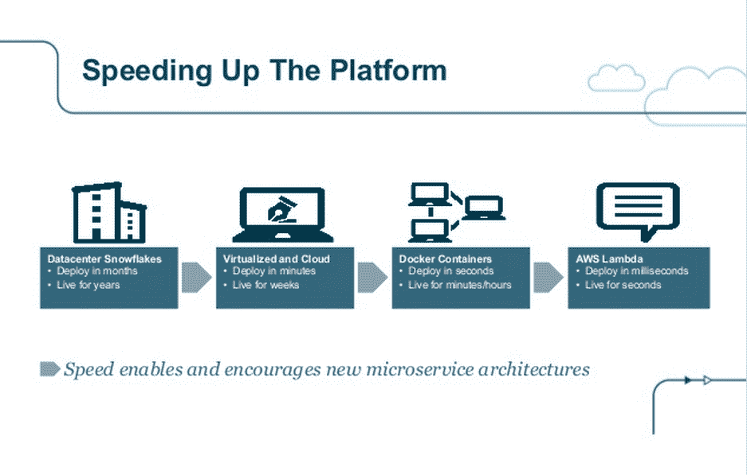
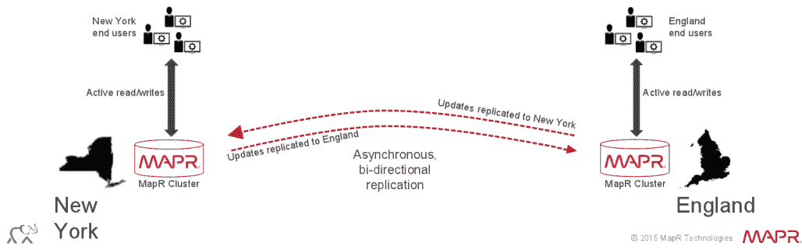
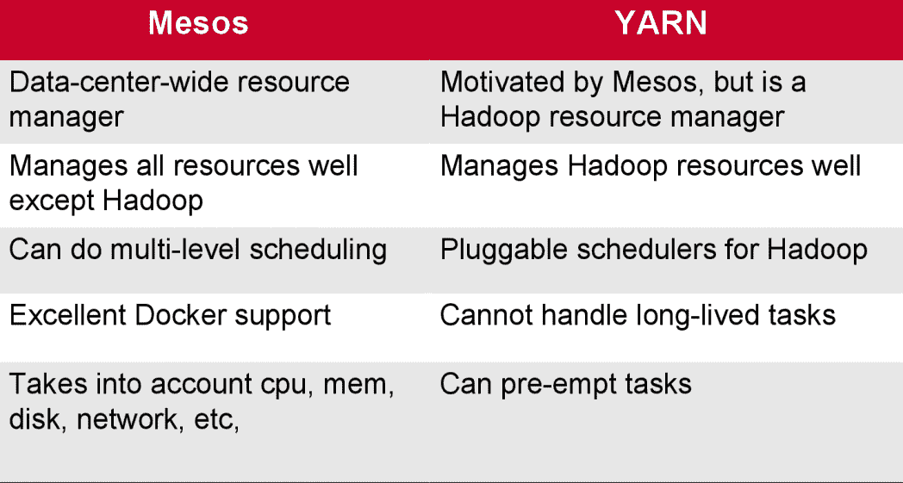
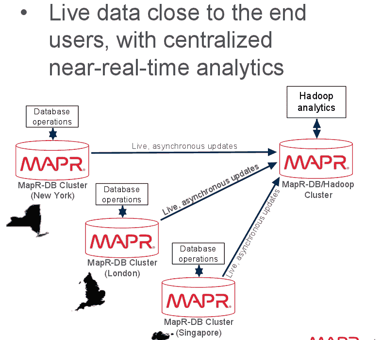
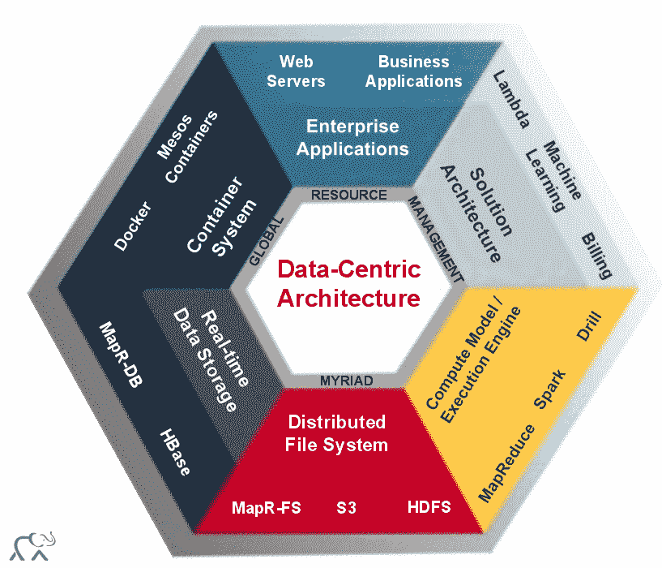

# 通过 Mesos 和 Yarn 使 MapR 的以数据为中心的平台更具弹性

> 原文：<https://thenewstack.io/maprs-data-centric-architecture-mesos-yarn-combo/>

MapR 今天发布了[新版本](https://www.mapr.com/blog),提供了一些关于塑造新的以数据为中心的架构的影响的观点。特别是，它显示了[纱线](http://hadoop.apache.org/docs/current/hadoop-yarn/hadoop-yarn-site/YARN.html)、 [Mesos](http://mesos.apache.org/) 的重要性，以及随着开发反映数据重力和容器密度力量的新模式的需求增加，Docker 发挥的持续价值。

这需要处理的事情很多，但可以归结为 MapR、易贝和 Mesosphere 上周推出的新开源项目 Myriad。Myriad 结合了 Mesos 的编排和纱线的资源管理。它说明了数据如何主导应用程序的开发方式。这表明，对于如何使平台更具弹性，从而使分析更容易获得和广泛使用，有了新的想法。

## 新模式

“实时”是描述数据影响我们开发和管理应用的方式的更常见的方式。但是对于实时工作，我们需要更好地理解[数据如何遵循根据工作负载的计算需求而变化的模式。](https://thenewstack.io/sdn-docker-real-changes-ahead/)

这个概念说明了为什么分析不再是业务的一个方面。分析体现在公司的整个运营中，在应用程序开发中更为深入。现在的问题是如何分配计算资源来简化分析。因此，需要数据尽可能接近用户。这就是为什么数据重力的概念如此贴切。有了质量，数据变得太重而无法移动。相反，计算资源将越来越多地涌向数据，然后转移到另一个任务。MapR 首席营销官杰克·诺里斯(Jack Norris)说:“没有单独的分析部分。分析“发生在整个平台上”

交付计算资源的差异一直与速度有关。有了像 AWS Lambda 这样的服务，计算部署只需几毫秒，正如 Battery Ventures 的阿德里安·科克罗夫特去年 12 月在 Dockercon 讨论的那样。这是他的[幻灯片](http://www.slideshare.net/adriancockcroft/dockercon-state-of-the-art-in-microservices?ref=http://thenewstack.io/dockercon-europe-adrian-cockcroft-on-the-state-of-microservices/)中的一张图片:

诺里斯说，信息的移动规模如此之大，以至于需要为大而快的数据构建架构。

> “这就是我们如此投入这个庞大项目的原因。这是因为需要更有弹性。”

这为 MapR 提供了如何以不同方式同步数据的基础，例如在数据中心之间双向同步。

当考虑提高数据传输速度的需求时，核心问题就来了。这就是 Myriad 发挥作用的地方。[奥赖利有一篇关于主题](http://radar.oreilly.com/2015/02/a-tale-of-two-clusters-mesos-and-yarn.html)的帖子，非常值得一读。下面是它是如何分解的。Mesos 可以被描述为分布式内核。它能够扩展应用程序的数量和大小，以及不同类型的工作负载所需的计算、存储和其他资源。它的核心在内核中，内核执行主要功能，例如为应用程序分配资源。Yarn 在 Hadoop 内分配资源。结合起来，Hadoop 集群可以与 Mesos 协同工作。纱线将被用来旋转簇本身。

这给 MapR 及其客户带来的是一个以数据为中心的架构。它包含容器，具有可移植性，并且尊重数据重力。它将数据库操作和 Hadoop 分析整合到一个部署中。

下面是 MapR 如何代表以数据为中心的架构的更全面的描述:

MapR 还推出了所谓的“快速启动”解决方案。这些是用户可以部署的模板。例如，它将允许公司使用 Hadoop 来查看几个月的数据，以更好地检测更广泛时间跨度的数据异常。

有争议的是，Cloudera、Hortonworks 和 Hadoop 生态系统的其余部分为客户开辟了道路，以便他们可以体验分析可以提供的东西。但是 Hadoop 看起来是不是有点过时了？在某些方面，与《Docker》和《CoreOS》等新剧相比，确实如此。但这也是为什么 Myriad 看起来有些腿。它将数据中心编排与 Hadoop 集群的资源管理相结合，实现了多种功能。这将容器生态系统与数据分析平台的功能结合在一起，如果包装得当，这种结合可以对我们看待数据中心的方式及其作为真正弹性服务提供商的未来产生一些影响。

<svg xmlns:xlink="http://www.w3.org/1999/xlink" viewBox="0 0 68 31" version="1.1"><title>Group</title> <desc>Created with Sketch.</desc></svg>