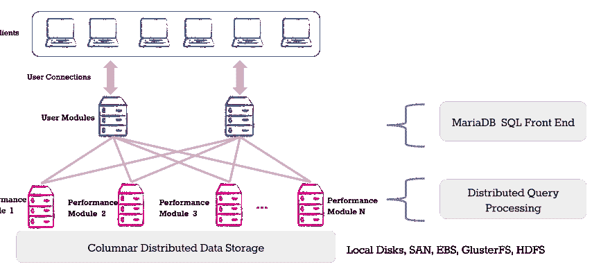

# MariaDB ColumnStore 增加了同步分析、事务处理

> 原文：<https://thenewstack.io/mariadbs-columnstore-adds-simultaneous-analytics-transactional-processing/>

MariaDB 已经正式发布了 [ColumnStore 1.0](https://mariadb.com/products/) ，这是一个存储引擎，允许用户在 [MariaDB 10.1](https://mariadb.com/kb/en/mariadb/what-is-mariadb-101/) 数据库的单个前端上同时运行分析和交易流程。

虽然开源社区反对 MariaDB 的 MaxScale 数据库代理的[许可模式，但 ColumnStore 是开源的，在 GPLv2 下许可。](http://www.infoworld.com/article/3109213/open-source-tools/open-source-uproar-as-mariadb-goes-commercial.html)

ColumnStore 是 MySQL 的默认存储引擎 InnoDB 的一个分支。尽管 SQL 替代方案很受欢迎，但该公司指出，每个 OLTP(在线事务处理)和分析解决方案都在构建 SQL 层。

因此，它开始将 InfiniDB 的 OLAP(在线分析处理)引擎与 MariaDB 的 OLTP(在线事务处理)引擎结合起来，使用户能够近乎实时地对生产数据进行分析查询。

这当然不是第一个结合了这两种功能的数据库。大玩家如 [SAP](https://blogs.sap.com/2015/04/20/analytics-and-transactions-together-in-one-database-on-one-platform/) 、甲骨文、[微软](https://msdn.microsoft.com/en-us/library/dn817827.aspx)、 [IBM](http://www.ibm.com/developerworks/data/library/techarticle/dm-1409oltap-db2-shadow-tables/index.html) 和 [Teradata](http://www.info.teradata.com/htmlpubs/DB_TTU_14_00/SQL_Reference/B035_1145_111A/Ordered_Analytical_Functions.083.001.html) 以及新贵如 [VoltDB](https://www.voltdb.com/) 、 [NuoDB](http://www.nuodb.com/) 、 [Clustrix](http://www.clustrix.com/) 、 [MemSQL](http://www.memsql.com/) 、[拼接机](https://thenewstack.io/apache-arrow-designed-accelerate-hadoop-spark-columnar-layouts-data/)、 [CockroachDB](https://thenewstack.io/cockroachdb-unkillable-distributed-sql-database/) 等提供这种能力。早在 2010 年，优质 MySQL 支持提供商 Percona 就在谈论[专栏商店](https://www.percona.com/blog/2010/08/16/testing-mysql-column-stores/)。

区别？

“我们从客户那里了解到，他们希望使用自己的工具集。他们是 Tableau 客户或 Pentaho 客户。在 Hadoop 之类的东西上很难有效地使用它们。ColumnStore 提供了 [ANSI SQL](http://gerardnico.com/wiki/language/sql/ansi) ，世界上最流行的查询语言，”MariaDB 工程副总裁 [David Thompson](https://www.linkedin.com/in/davidwbthompson) 说。

## **工作原理**

InnoDB 或其他默认的 MySQL 存储引擎 [MyISAM](http://dev.mysql.com/doc/refman/5.7/en/myisam-storage-engine.html) 为多达 100，000 行或 100 万行以下的表的分析查询工作负载提供了合理的性能。汤普森在博客文章[中写道，超过这个范围，性能就很难调整和保持。](https://mariadb.com/resources/blog/getting-to-know-mariadb-columnstore/)

ColumnStore 适用于对更大的数据集进行报告或分析。例如，客户 [Pinger](http://wp.pinger.com/) 的移动应用程序使用 ColumnStore 处理数百万条短信和电话，此外每天还有超过 15 亿行日志。

ColumnStore 的数据接收速率高达每秒一百万行。

它有[两个组件](https://mariadb.com/resources/blog/columnstore-architecture-use-case):用户模块(UM)和生产模块(PM)。UM 作为执行管理器(ExeMgr)在 MariaDB 服务器上运行。用户模块将任务分配给访问下面的柱状分布式存储层的并行性能模块。随着数据量的增长，您需要扩展两组模块。

由于是多线程的，UM 可以处理以不同顺序返回的结果，并且可以处理多任务，因为多个 pm 并行工作，并在将结果发送回客户端之前进行最终聚合。这提高了性能。冗余和高可用性是内置的。

对于 ColumnStore，该公司宣称:

*   更低的拥有成本
*   MariaDB 用户能够打开特定数据集的列引擎，并从与他们的事务系统相同的前端运行分析。
*   提供 ANSI SQL 功能，包括对复杂连接、聚合和窗口函数的查询。它还可以与 Hadoop 的 HDFS 文件系统一起工作。
*   通过 ODBC/JDBC 与 BI 工具的现成连接，以及标准的 [MariaDB 连接器](https://mariadb.com/kb/en/mariadb/client-libraries/)。
*   它还可以与 R 一起进行高级统计分析。

它包括 SSL 支持、审计和身份验证插件以及基于角色的访问。

承认 SQL 不是机器学习和数据发现的最佳选择，它计划将像 [MLLib](http://spark.apache.org/mllib/) 这样的 Apache Spark 库集成到产品中。它还计划添加一个回归窗口功能，并与 [MaxScale](https://mariadb.com/resources/datasheets/mariadb-maxscale/) 数据库代理工具完全集成。

451 Research 大数据分析师 [Jason Stamper](https://451research.com/analyst-team/analyst/Jason+Stamper) 表示:“虽然其他一些公司确实能够通过使用内存方法提供交易和分析功能，为交易数据库提供必要的速度来运行分析，但 MariaDB 与 MySQL 的兼容性特别好，这是它追求的巨大用户基础。

他解释说，将分析运行在更接近操作数据库的位置有几个优点——减少了分析查询的延迟，比管理单独的分析和事务数据库的复杂性更低，并且有可能减少或消除将数据从操作数据库转移到分析数据库的提取、转换和加载(ETL)阶段的需要，这可能很昂贵，并指出大型企业 Oracle Database、IBM DB2 和 Microsoft SQL Server 都提供内存选项。

## **开源 vs BSL**

该公司根据其商业来源许可证授权其 MaxScale 数据库代理，该许可证是由 MySQL 创建者[迈克尔“蒙蒂”威得纽斯](https://www.linkedin.com/in/montywi) [在 2013 年](http://timreview.ca/article/691)开发的。MariaDB 本身[就是 MySQL 的一个分支](https://mariadb.org/about/)。

该许可证设定了一个数据点，在这个数据点上，代码将成为开放源代码，但在此之前，它是专有的。这在开源世界引发了轩然大波，促使 Percona 的一名员工发起了一个[分叉](https://lists.launchpad.net/maria-discuss/msg03856.html)和[竞争项目](https://twitter.com/VadimTk/status/766333511514992640)。

汤普森表示，该公司已经决定存储引擎应该是开源的，但该公司可能在未来使用 BSL 来“在顶层创造价值”

史丹博指出，有许多开放源码的许可选择，并补充说，他认为说所有的马里亚数据库技术都应该是开放源码是不合理的。

“毕竟，该公司需要创收来投资于[马里亚数据库服务器](https://mariadb.org/)——它不是一个非营利组织，随着 MySQL 的不断改进，保持与 MySQL 的兼容性需要付出工程成本。

“马里亚数据库需要跟上，如果不是超越创新的话。……它不能进行这样的创新并继续改进其产品，只能采用纯开源(或免费)模式，而且它并不是唯一一个这样做的公司。[为 PostgreSQL 以及 Oracle 的 MySQL 提供支持和附加功能的企业数据库](http://www.enterprisedb.com/)有一个几乎相同的方法。基本功能是免费和开放源码的，但在某些时候，支持和额外的企业功能需要客户的投资，否则整个商业模式就会土崩瓦解，”他说。

通过 Pixabay 获取特征图像。

<svg xmlns:xlink="http://www.w3.org/1999/xlink" viewBox="0 0 68 31" version="1.1"><title>Group</title> <desc>Created with Sketch.</desc></svg>