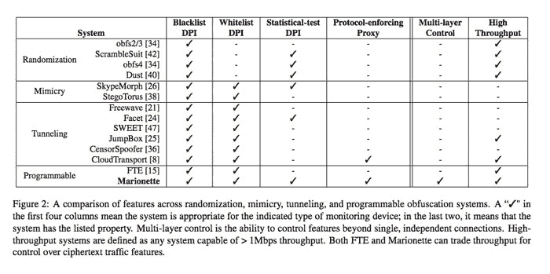

# 牵线木偶:开源工具帮助用户绕过互联网审查

> 原文：<https://thenewstack.io/marionette-open-source-tool-helps-users-bypass-internet-censorship/>

木偶是一个新的审查规避工具，是免费的，开源的，可以由用户编程，以适应他们的特殊需求和网络环境。

互联网的出现给世界各地的活动人士和持不同政见者带来了巨大的好处，使许多人能够以比以前更大的规模分享信息、联系和组织起来。像占领运动和 T2 阿拉伯之春这样的全球性运动在很大程度上是由 Twitter 和脸书等社交媒体提供的工具维持的，这些工具促进了普通公民之间的快速沟通，并给了 T4 前所未有的机会来畅所欲言并轻松动员起来。不足为奇的是，一些拥有暴虐政权的国家正试图通过压制这些工具，通过在线监控和审查某些网站来阻止国内的民众起义和信息的自由流动。

但是阻止访问网站并不能阻止人们寻找其他的方式，近年来，许多技术和工具正在被开发出来，以帮助网民绕过政府对互联网的审查。除了使用网络镜像、存档网站、备用 DNS 服务器、代理网站、虚拟专用网络(VPN)和 [sneakernets](https://en.wikipedia.org/wiki/Sneakernet "Sneakernet") 之外，一大群反审查软件已经出现，以掩盖通常会被[中国](https://en.wikipedia.org/wiki/Internet_censorship_in_China)、[伊朗](https://en.wikipedia.org/wiki/Internet_censorship_in_Iran)和[叙利亚](https://en.wikipedia.org/wiki/Internet_censorship_in_Syria)等国家禁止的在线活动。有了像 [ScrambleSuit](http://www.cs.kau.se/philwint/scramblesuit/) 、 [FreeWave](http://freehaven.net/anonbib/cache/ndss13-freewave.pdf) 和 [Dust](https://www.schneier.com/blog/archives/2013/08/evading_interne.html) 这样的名字，这些审查规避系统中的每一个都有不同的方法和实现，从使用随机化到[隧道](https://en.wikipedia.org/wiki/Tunneling_protocol)或模仿许可的协议。

但是其中一些节目不能很好地适应不断发展的审查策略。因此，为了克服这些程序的一些限制，RedJack 的安全研究人员 [Scott Coull](http://www.scottcoull.com/) ，Thomas Shrimpton 和波特兰州立大学的密码学教授 [Kevin Dyer](https://kpdyer.com/) ，正在开发[木偶](https://github.com/kpdyer/marionette)，这是一个开源的“网络流量混淆系统”，允许用户根据自己的需要重新配置它，而不必重新编程或重新设计底层系统。

## 可编程和灵活的反审查工具

以下是牵线木偶的工作原理:该系统基于一种“功能强大的[概率自动机](https://en.wikipedia.org/wiki/Probabilistic_automaton)”，它使用户能够通过利用允许活动的样本来掩饰任何被禁止的在线活动——比如说，在线游戏——作为某种烟幕来隐藏正在发送的协议的真实性质。这是一种灵活的一体化替代方案，没有类似软件的缺点(见下图)。

Marionette 的系统能够同时控制加密的流量功能，从“密文格式到状态协议语义和统计属性”，这意味着它可以通过编程模仿其他流行的混淆系统目前提供的任意数量的功能。为了使事情变得更容易，它还用“用户友好的特定领域语言(DSL)编写，这使得新的模糊策略的快速开发和测试成为可能，这些策略是健壮的，并对未来的网络监控工具做出响应。”

在最近于 [USENIX 安全会议](https://www.usenix.org/conference/usenixsecurity15)期间发表的一篇[论文中，该团队强调了木偶的一个主要优势:它可以适应用户独特的网络环境，并被编程为在政府审查系统主动探测可疑连接时不会引起怀疑的方式做出响应。该团队写道，牵线木偶之所以与众不同，是因为它是一种灵活的工具，可以根据当时的需求进行定制:](https://kpdyer.com/publications/usenix2015-marionette.pdf)

> 因此，Marionette 的主要目标不是开发一个实现单一混淆方法来击败所有可能的审查策略的系统，而是让用户能够根据目标协议的广度、受控流量特性的深度和整体网络吞吐量来选择最适合其用例的混淆方法。

该团队希望像 [Tor](https://www.torproject.org/) 或审查规避工具 [Lantern](https://getlantern.org/) 这样的知名匿名网络将采用牵线木偶，而该系统的开源性质将允许个人网民和开发者调整并公开与其他人分享他们的反审查设置，以寻求快速、阻碍限制的预设。被广泛接受可能需要时间，但像木偶这样的工具对全球互联网自由至关重要。在一个只需点击鼠标就能获得改变游戏规则的信息的世界里，坚定而积极的用户会以某种方式抵制政府实施的审查。更多信息请访问技术评论，在 GitHub 上查看[木偶](https://github.com/kpdyer/marionette)或者在这里阅读完整的[论文](https://kpdyer.com/publications/usenix2015-marionette.pdf)。

专题图片:[opensource.com](https://www.flickr.com/photos/opensourceway/)制作的《[斯洛伐克共和国](https://www.flickr.com/photos/opensourceway/6554315319/in/photolist-aZbzAx-NsZSn-QoaFF-QHgMs-Q7D71-6JJ5H-QkU5D-qE2UAj-6pqssU-Q6gzH-8QctUB-Qhr44-Q7ksR-QBAjK-Q7ksX-QvxGG-QfJSU-QG8yf-S4xpZ-bf1Gt2-7fWNF5-dddFMV-QzTKC-ANcoG-dvCkwq-Qy7N6-qx3Gru-QnB6J-Q3ZdY-7tXcqq-8CbZ36-QH7Jt-71X2X-J4pNm-35pFBs-QmvVF-QXR9b-RHTXd-QK19x-fxy9R-QW9iS-5Jj5Lu-QHVnq-PBDiU-QsH1P-Q68Z7-4F49Be-5Jj5Hu-dm5fn-SryDq)互联网审查》在 [CC BY-SA 2.0](https://creativecommons.org/licenses/by-sa/2.0/) 下获得许可。

<svg xmlns:xlink="http://www.w3.org/1999/xlink" viewBox="0 0 68 31" version="1.1"><title>Group</title> <desc>Created with Sketch.</desc></svg>