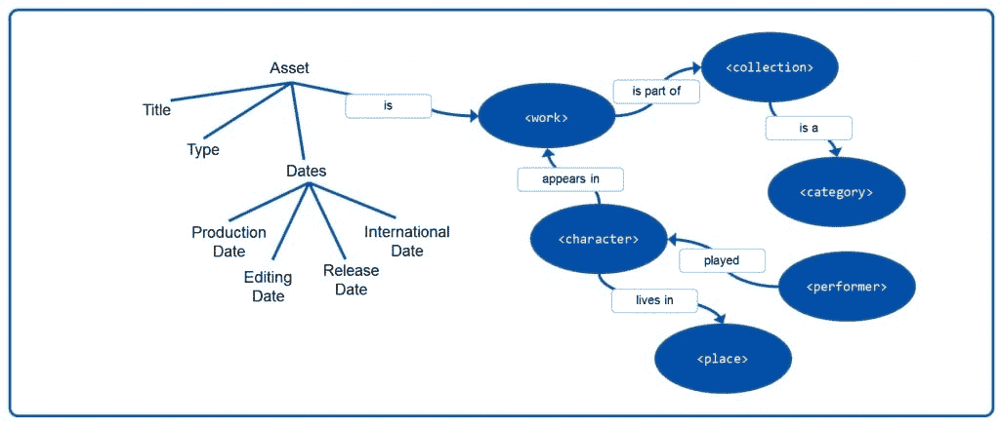
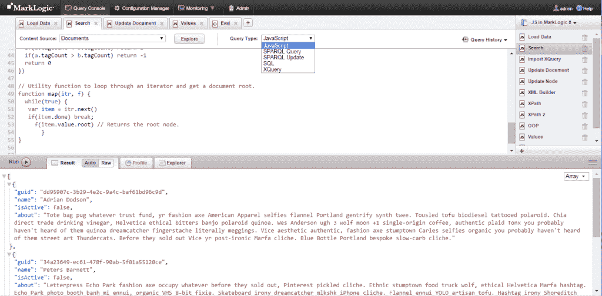
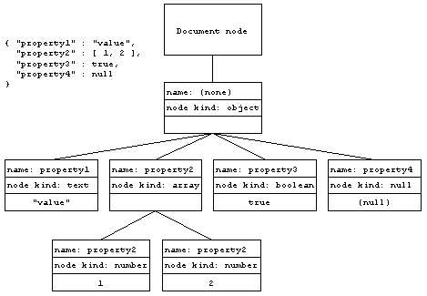

# MarkLogic 从 XML 根扩展到包含 JSON

> 原文：<https://thenewstack.io/marklogic-expands-xml-roots-embrace-json/>

MarkLogic 是一家著名的 NoSQL 数据库供应商，专注于企业级应用程序工作负载。大型公司通常运行任务关键型应用程序，其客户数据随时都在变化。在企业内部，MarkLogic 的 NoSQL 数据库管理系统专注于管理不同的数据模型:那些不容易封装在传统关系数据模型中的数据模型。

因此，MarkLogic 的数据库系统是模式不可知的。MarkLogic 不需要开发人员在特定的行、列或表中定义数据，而是允许客户使用多个或自定义模式，以及语义来更好地对数据、知识图、地理空间查询等进行建模。 [MongoDB](https://www.mongodb.com) 和 [Couchbase](http://www.couchbase.com/) 也分享了这种“定制模式”方法，就像今天市场上的许多 NoSQL 数据库选项一样。MarkLogic 的[语义](http://www.marklogic.com/what-is-marklogic/features/semantics/)，基于 XML，在 [RDF](http://www.w3.org/RDF/) (资源描述框架)中提供了一种叫做“Triples”的数据语言，带有标准的查询语言 SPARQL。

图为:MarkLogic 语义数据模型分解

尽管该公司是在 XML 达到其宣传曲线顶峰的时候成立的，但在发现其客户面临诸如必须用 XQuery 编写应用程序界面等痛点后，MarkLogic 已经从 XQuery 转向 JSON 作为主要的交互形式。

JavaScript 和 JSON 有许多开发人员在为这些语言编写应用程序，而在企业层面寻找 XQuery 开发人员可能很困难。MarkLogic 8 允许用户用 JavaScript 编写查询函数，能够从 XQuery 调用 JavaScript(反之亦然)以及导入社区编码的 JavaScript 脚本模块。这些特性允许使用 MarkLogic 作为数据库的团队用 JavaScript 编写应用程序，同时仍然可以灵活地使用 XQuery，因为 XQuery 适用于他们的特定情况。

“由于 JSON 贯穿于应用程序的整个堆栈，开发人员可以用 angular.js 和 JSON with node 编写应用程序。MarkLogic 的产品执行副总裁 Joe Pasqua 说:“JS 在中间，JavaScript 在 MarkLogic 内部运行，每一层都有 JavaScript 和 JSON。

数据库管理系统分析公司 [Monash Research](http://www.dbms2.com/) 的负责人[Curt Monash 写道:“JSON 部分让 MarkLogic 摆脱了 XML/JSON 争论中通常会失败的一方。](http://www.dbms2.com/2013/03/18/dbms-development-marklogic-hadoop/)

## 把你的健康托付给 NoSQL

与大多数 NoSQL 数据库不同，MarkLogic 提供事务处理，符合 [ACID 事务属性](https://www.techopedia.com/definition/23949/atomicity-consistency-isolation-durability-acid)。

酸代表原子性、一致性、隔离性和持久性。原子性是对数据库中发生的事务操作的一种全有或全无的方法。因此，如果数据库处理一个事务，它要么完成，要么根本不处理。这确保了没有事务仅被部分处理，这意味着在大规模运行时会发生较少的数据损坏。

一致性确保数据遵循数据库中定义的规则。如果某个事务不符合规则集或返回无效结果，数据库将回滚到遵循这些规则的前一个状态。隔离对于银行业中的企业级数据库用例至关重要。取款时，每笔[交易都独立发生](https://www.techopedia.com/definition/23949/atomicity-consistency-isolation-durability-acid)而不受干扰——交易顺序并不强制执行。持久性有助于确保如果在事务完成之前发生系统故障，数据库将恢复到以前的状态。

图为:截图，MarkLogic 8

MarkLogic 最引人注目的一个用例是美国 Healthcare.gov 网站，这是一个国家医疗保险注册门户网站，在推出时因表现低迷而受到批评。由于用户试图在最后一分钟注册保单，负载出现了大幅峰值，高峰时期 Healthcare.gov 门户网站上的活跃用户超过 50，000 人。

Healthcare.gov 发射的考验和磨难被很好地记录了下来。承包商的开发人员[很大程度上不熟悉 MarkLogic 技术和/或 XQuery，尽管数据库系统似乎不是缓慢的罪魁祸首。事实上，MarkLogic 是让系统按计划运行的关键。](https://gigaom.com/2013/11/25/how-the-use-of-a-nosql-database-played-a-role-in-the-healthcare-gov-snafu/)

Healthcare.gov 的每个州都有不同的收集客户数据的模式，而 MarkLogic 数据库还必须从保险提供商那里获取有关他们在医疗保健市场上可用的计划的数据。

MarkLogic 的 Joe Pasqua 表示:“该数据库还必须与不同的联邦机构、国税局、移民局集成，所有这些机构都具有不同的数据格式，以整合资格计算、计划、购物，并处理人们购买计划时的用户体验。

标准的关系数据库无法收集 Healthcare.gov 站点所需规模的数据。因此，Healthcare.gov 的技术团队开始采用 NoSQL 作为 Healthcare.gov 的数据库架构，尽管经过几年的工作他们并不成功。

MarkLogic 被引入 Healthcare.gov 是因为它可以灵活地处理来自不同州、机构和保险公司的数据格式。由于大量的数据存储和使用级别，Healthcare.gov 需要企业级横向扩展架构。MarkLogic 采用了带有横向扩展集群的项目，对数据库使用无共享架构。在高峰负载期间，会添加更多的节点，然后在系统运行时重新分配数据。当负载进来时，它们可以被平均分配。当负载通过时，它可以收缩——这允许在需要的时候和地方有弹性。

图为:MarkLogic 中的 JSON 节点

Pasqua 指出，在推出 Healthcare.gov 期间，MarkLogic 面临的一个不可预见的挑战是实际的物理基础设施。经常会出现硬件故障、网络故障或滚动故障，导致存储性能下降。这是 MarkLogic 在 Healthcare.gov 的同行所担心的问题，因为存储中断意味着客户可能会错过开放注册期，或者如果计划丢失或用户数据在中断中损坏，数据丢失可能会给保险公司带来代价高昂的错误。MarkLogic 通过其快速恢复工具(如时间点备份恢复和增量备份)来确保客户数据在连续停机的情况下保持不变。

虽然 MarkLogic 面临考验，但它已经建立了一个坚实的数据库，其功能使其有别于市场上为当今企业级客户提供的其他 NoSQL 产品。随着越来越多的公司寻求了解收集到的用户数据并根据这些数据采取行动，利用 NoSQL 数据库功能来简化大规模数据收集和分析的机会不断增加。

特征图片: [Tegelpoca](https://www.flickr.com/photos/51807288@N03/) 的 [Catbent](https://www.flickr.com/photos/51807288@N03/5846696589/in/photolist-9UDRcB-5qYW7X-J9CfQ-rNJzA-dxJHJA-dxJHTu-ewu3fv-ewu38T-5poWyi-9Xfyk6-9XiqRE-9nCTge-9UDRWp-te6MgW-ttn8v7-sySvHa-sySsWt-te7VFS-syStfe-sySuLk-sySwLT-sySv4K-ttn5TU-te6HSG-o1hWen-ohuJ3k-99gM3Q-78mHP1-9UGHqd-9UDRAt-9UGJcW-9UGJ7Y-9UDRTt-8HARmx-9i4v5B-9i4v8P-e1zUV2-dxJHY7-dxJHUY-bdRzD2-6V48qS-6V48o9-sujTR6-rs73ct-hZxjVh-5jhfU6-vbafSv-qtX3cd-qQV2bG-vmBaQz/) 在 [CC BY-SA 2.0](https://creativecommons.org/licenses/by-sa/2.0/) 下获得授权。

<svg xmlns:xlink="http://www.w3.org/1999/xlink" viewBox="0 0 68 31" version="1.1"><title>Group</title> <desc>Created with Sketch.</desc></svg>