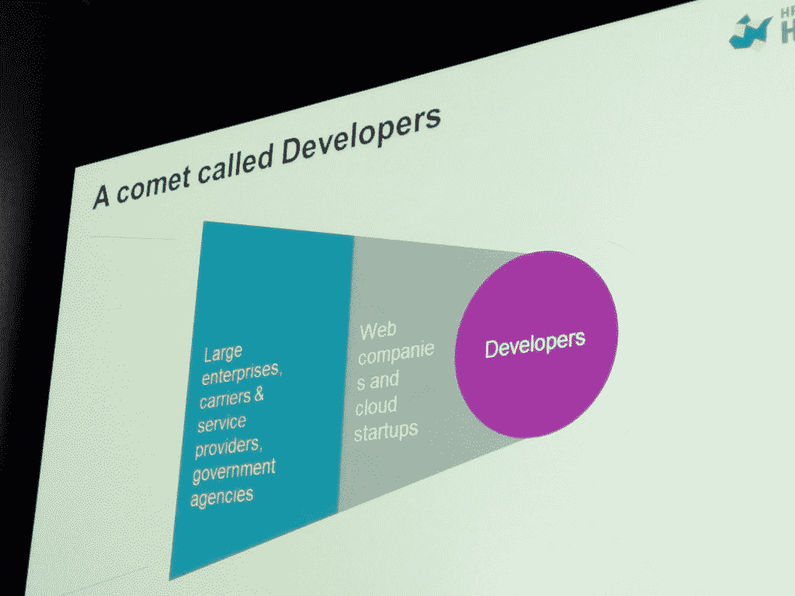

# Marten Mickos:为什么 Docker 类似于大城市的助力车

> 原文：<https://thenewstack.io/marten-mickos-docker-containers-are-analogous-to-mopeds-in-a-big-city/>

在领导将 Eucalyptus Systems 出售给这家硅谷巨头后，rten Mickos 进入了他在惠普的第五周。他现在领导惠普的云工作，向首席执行官梅格·惠特曼汇报。今天，他在拉斯维加斯的分布式计算大会上做了主题演讲，他给出了自己关于容器和 Docker 生态系统的类比。

他的评论是在一次探讨开源软件的历史及其在分布式计算中的作用的演讲之后。

这是一个容易跟进的讨论，但它没有提到 Docker，这导致了观众的一个问题(主题演讲的 31:04 分钟标记),基于以下假设:

> 集装箱化是新的热点。

 米科斯说，首先的问题是:“为什么是现在？”简单地说，它指出了预测将会发生什么的不可能性。此外，集装箱不能解决世界的问题。你可以挤压一个气球，但空气只是去了别的地方。技术也是如此。看起来你好像在消除复杂性，但实际上只是把它推到了别的地方。

容器也是如此，它需要一个运行平台以及网络和其他支持。

> 可能大车是 hypervisor，助力车是 Docker 容器。

我很好奇 Marten 所说的 PaaS 环境的种子是容器。Cloud Foundry 和 Heroku 一样使用容器技术。Docker 实际上起源于 PaaS。

但我同意他的观点，这个类比确实有效。轻便摩托车驾驶员可能会淋湿，但这就是为什么驾驶员要穿防护服的原因。码头工人确实需要更好的保护，但那是迟早的事。更重要的是，问题在于它与虚拟机的关系以及二者如何共存。

### 更多关于 Mickos 在 RICON 演讲的笔记

Mickos 在演讲中花了大部分时间讨论开发者的角色、开源和惠普公司的云计算项目 HP Helion。

一些亮点:

开发者并不控制世界，但他们肯定像彗星一样带着奇怪的想法在太空中飞行。他们对监控之类的事情也有点着迷。但是他们所有的工作都是涓滴细流。只是等着看结果如何。

  

比如数据库运动之初就有 MySQL 和 Oracle。今天有图形数据库和各种各样的其他数据库。不过，测试数据库的是开发人员，他们让试图确定使用什么数据库的人更容易。

但是我们没有从分布式系统开始。它始于诸如灯堆之类的开发，而灯堆根本就不是分布式的。

现在我们看到了各种形式的开源社区。OpenStack 有一个开源生态系统，公司和个人开发者都参与其中。

Cloud Foundry 由一家公司领导，但它是一个有许多贡献者的开源项目。

分布式基础设施的使用帮助公司将劣势转化为优势。

今天的可伸缩系统不像过去的堆栈。服务器不再是有名字的宠物，而是像牛一样被对待。

整体堆栈不再是标准。相反，我们已经签署了敏捷模型。在云世界中，我们为失败而设计。

开源曾经一度不被世界所接受。但现在是了。它被消费化了。

开源将如何在云中取胜？事实上，它现在正在发生。

至于 HP Helion——还有混合动力市场需要考虑。在那个世界中，这意味着通过将抽象提升到 PaaS 层来连接互不通信的不同云。你不关心底层的云是什么。

惠普现在是 open stack Juno 版本的主要贡献者。

HP Helion 有一个开源信条。

对象存储增长无处不在

而且…集装箱化是新的热点。

<svg xmlns:xlink="http://www.w3.org/1999/xlink" viewBox="0 0 68 31" version="1.1"><title>Group</title> <desc>Created with Sketch.</desc></svg>