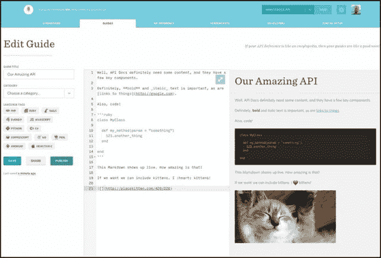

# Mashape 对意式冰淇淋的收购将使 API 更加美味

> 原文：<https://thenewstack.io/mashapes-gelato-acquisition-molds-apis-experiences/>

使新堆栈可行的第一个原因是曾经紧密锁定的功能的解耦。这是从单一应用程序到互操作服务的转变。API(应用程序编程接口)是这些服务之间的桥梁，正如我们在这里提到的， [Mashape 是一家帮助组织使用 API 公开其关键业务功能的公司。](https://thenewstack.io/mashape-opens-kong-a-microservices-proxy-built-on-nginx/)

周四，Mashape 宣布它正在收购一个名为[意式冰淇淋](https://gelato.io/)(其一些客户的字面意思是“尼克和亚当”)的团队，该团队的业务是为组织开发基于网络的前端门户，使他们自己的 API 可以被其他人利用。两家公司的合作开辟了一种可能性，即 Mashape 的用于微服务的 Kong API gateway 可能很快就会与前端门户相连，这些门户除了提供开发工具外，还提供指导、文档和支持。

意式冰淇淋 API 降价编辑器的屏幕截图

Mashape 向客户传达的信息是:“超过 200，000 个 Kong Docker 和 5，000 个 Kong 实例正在运行，最大的社区请求之一是与开发人员门户集成。”“这将让 Kong 用户处理密钥管理、开发人员入职和文档导入。我们认为意式冰淇淋是您团队的最佳工具，具有本机 Swagger/API 蓝图支持、自动生成的代码示例、API explorer、设计精美的文档和无缝的入门功能。此外，面向 API 分析的 Galileo 集成即将推出，因此您可以查看和监控开发人员的使用情况。”

> Mashape Analytics(最近被重新命名为 Galileo)真正缺乏的是……好吧，一个易于部署的网站，让开发人员浏览各个功能，测试它们并将其合并到他们自己的项目中。

这最后的承认可能是最大的新闻。去年 6 月，Mashape 开始在其 API gateway 中集成一项分析服务，使 API 发布者能够跟踪他们的服务是如何被使用的，由谁使用，以及在什么环境下使用。Mashape Analytics(最近被重新命名为 Galileo)真正缺乏的是……好吧，一个易于部署的网站，让开发人员浏览各个功能，测试它们并将其合并到他们自己的项目中。

既然伽利略和意式冰淇淋正在凝胶化，我们可以说，开发人员可能会被鼓励将最佳实践构建到他们的 API 函数中，然后通过他们的 API 门户以博客的形式直接与他们的客户分享这些实践。

Mashape 的首席执行官 Augusto Marietti 在最近接受 New Stack 采访时解释说:“在早期，你调用的 API 越多，你就越酷。“许多解决方案都试图争取更大的销量，这样他们就可以向你收取更多的费用。然后当人们对此有了经验后，他们知道这是行不通的。我们实际上应该做的是减少请求的数量，这样我们的产品和应用程序才更有性能。”

Marietti 解释说，网飞率先减少了 API 事务数量，以提高其微服务的效率。Marietti 指出，教会其他开发者如何将这种效率融入他们自己的代码，最终可能会减少函数的使用量，反过来，可能会在短期内减少出版商的收入。

重要的是长期，他解释道。通过对何时何地应该进行连接的问题进行适当的分析，开发人员可以被迫生产更高效的微服务。

“通过分离越来越多的软件和微服务，”他指出，“更多的连接因此而发生……是的，你必须进行更少的交易；但同样真实的是，你必须越来越多地去耦合，这会产生反作用，”马里蒂说。

## 微服务的两个层次

Marietti 认为有两层功能与微服务相关:基础设施和代码。“这是两码事，”他解释道。“Docker 和 CoreOS 都是非常棒的解决方案，是基础设施、操作系统和服务器级别的基础。但是还有另一半:代码部分，它被留在了后面。Kong 是第一批通过将 Kong 的所有逻辑统一在一个地方来解决代码部分的平台之一，但对于微服务来说，在代码方面还有很多事情要做。”

首席执行官告诉我们，为了让伽利略可视化微服务之间的关系，它需要在部署代码的地方共存，而不是在某个单独的服务器上。这也是意式冰淇淋共存的地方。如果 API 是用 Swagger 在 JSON 中描述的，那么意式冰淇淋可以自动为这些函数构建文档页面。

然而，有趣的部分从这里开始:意式冰淇淋充当了一种内容管理系统，让你使用一种通用的降价语言就地编辑那些页面。所有页面间的导航都是结构化的，所以你需要添加的只是通用语言，这种语言赋予了页面的敏感性和易读性。

正如承诺的那样，Mashape 将意式冰淇淋每个门户网站每月的基本订阅价格从 25 美元降至 19 美元。

Docker 和 Red Hat 是新堆栈的赞助商。

特征图片: [Pixabay](https://pixabay.com/) ，在 [CC BY-SA 2.0](https://creativecommons.org/licenses/by/2.0/) 下授权。

<svg xmlns:xlink="http://www.w3.org/1999/xlink" viewBox="0 0 68 31" version="1.1"><title>Group</title> <desc>Created with Sketch.</desc></svg>