# 掌握 JavaScript 中的“this”:回调和 bind()、apply()、call()

> 原文：<https://thenewstack.io/mastering-javascript-callbacks-bind-apply-call/>

在关于掌握 JavaScript 中的' **this** '关键字的教程的第一部分[中，我们看了为什么' **this** '的概念会很棘手，即使对于有经验的程序员来说也是如此，以及一般情况下如何处理' **this** '涵盖的场景包括全局' **this** '，如何在使用对象构造函数时找到' **this** '，以及在跟踪调用对象时向左看的技巧。我们相信您还记得，主要的收获是…](https://thenewstack.io/tutorial-mastering-javascript/)

> 调用对象包含调用站点，调用站点决定了' **this** '绑定。

现在，正如所承诺的那样，我们回来讨论最坏的情况' **this** '场景回调，或者如何为作为参数传递给另一个函数的函数找到' **this** '绑定。握紧你的头，不要再哭了，因为有一些技巧需要学习——既要识别回调'**这个**'又要识别，如果所有其他方法都失败了，如何继续下去，强行进行明确的'**这个**'绑定。

## 回电审查

当一个函数被调用时，JavaScript 解释器会创建一个执行上下文。该记录包含关于从哪里调用函数(调用栈)、如何调用函数、传递了什么参数等信息。该记录的属性之一是' **this** '引用，该引用将在该函数执行期间使用。

让我们快速浏览一下回调是如何进行的。高阶函数是接受另一个函数作为自变量的函数。回调函数是一个幸运的函数，它被传递给封闭的高阶函数:

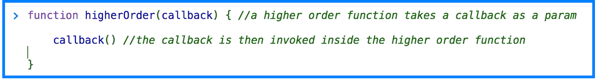

回调函数在高阶函数内部被执行(调用)，但不一定是立即执行。它被“回调”——因此得名——在任何一点上服务于代码的目的。

## 变得非常棘手:回调函数中的“this”

许多人发现 JavaScript 回调一开始就很有挑战性。当我们把“**这个**”加入其中时，即使是资深的 JavaScript 程序员也会抱头痛哭。但是，成功确定回调的' **this** '绑定有一个简单的关键:

> 回调函数受传递给它的更高阶函数的支配。

换句话说，要跟踪回调的' **this** 指向什么，你需要检查包围它的高阶函数。

这是因为，在封闭函数调用的回调中，' **this** '上下文发生了变化。值' **this** 保存的值被重新分配给调用该函数的函数，也就是说，这是您的调用位置，它保存您的' **this** ':

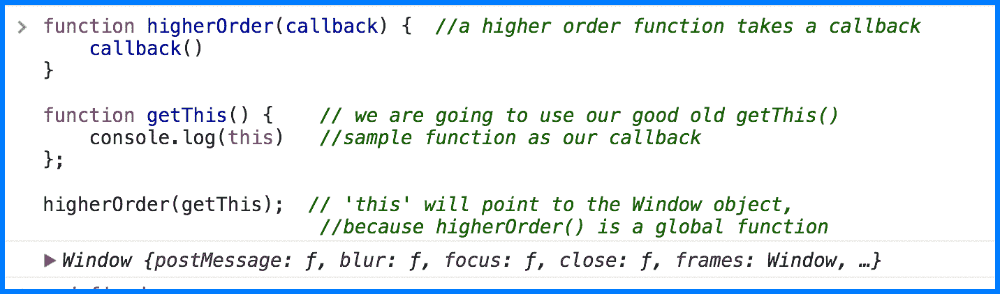

您可以通过查看外部函数 **higherOrder()** 的工作方式来识别' **this** ':它是在全局范围内定义的，因此它的' **this** '将指向作为其调用对象的窗口对象。

为了进一步说明回调' **this** '将如何指向调用对象或函数，现在我们将调用回调作为对象上定义的方法。这在实际的 JavaScript 编程中不太可能发生，但仍然是一个有用的例子，当回调碰巧发生在对象内部时，' **this** '绑定以相同的方式工作。

这是点规则左侧适用的情况。在一个新函数 callbackAsMethod()中，我们创建了一个新对象 oddballObject，它的“名称”属性为“不要这样做”然后，我们向 oddballObject 添加一个名为“callback”的新属性，并将其设置为等于作为参数传入的回调函数。然后，我们将回调作为一个方法运行，使用相同的回调函数 getThis()，传递给 callbackAsMethod() —因此回调中的' **this** '将是点运算符或调用对象的剩余部分:

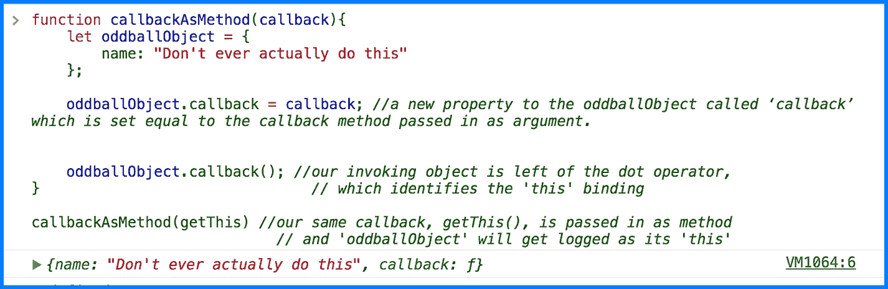

你不能通过查看回调函数来判断这个将会是什么‘**——毕竟 getThis()的作用域是**窗口**。您需要查看 getThis()是如何被高阶函数调用的，在本例中，调用对象将回调作为方法调用。**

值得庆幸的是，构造函数内部的回调非常简单:您将回调作为构造函数调用，并且' **this** '将指向新构造的对象。记住“new”关键字是一个构造函数的标识符，并且给出了“ **this** 将指向的位置:

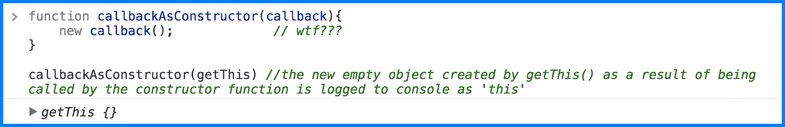

回想一下我们的关键要点(真的，如果你现在还不能从记忆中引用，是时候考虑把它纹在你的手臂上或别的什么地方了):

调用对象包含调用站点，调用站点决定了' **this** '绑定。函数或方法的定义位置与它的“**这个**指向的位置无关。

尽管回调函数增加了额外的复杂性，需要更多的思考，但在核心上，它们与常规函数没有任何不同。

## “我放弃了！！!"或者，控制“这个”

如果'**'这个**'都变得太多了，不要害怕。对于没有耐心或者可能只是困惑的 JavaScript 程序员来说，有一些方法可以指定' **this** '。使用 **bind()** 、 **apply()** 或 **call()** 允许我们显式设置' **this** '的值，不需要猜测。你决定“这”等于什么，故事结束。

回想一下我们默认的 getThis()函数，其中' **this** 指向窗口:

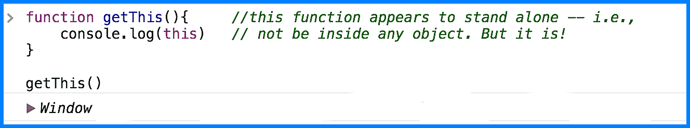

如果我们想控制'**这个**'指向哪里，并把 window 的值改成别的值，会怎么样呢？这就是 bind()、call()和 apply()派上用场的地方。这三个都是函数的内置方法。

对任何函数调用 bind()都会返回函数的副本，其中' **this** '被设置为传递给 bind 的第一个参数。这就是你如何确定，**这个**到底是什么:

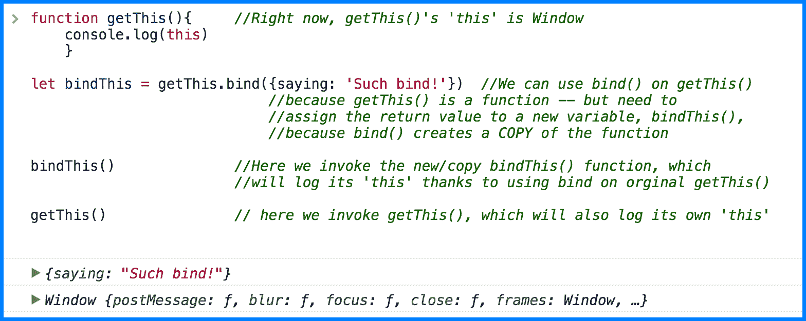

同样:注意 **bind()** 如何不调用函数；它返回函数的一个副本，这就是为什么当你使用 **bind()** 这个新函数时，它首先需要被赋给一个变量，然后被调用。

在我们的示例中，bindThis()返回副本，并将' **this** '设置为新对象(“说:‘这样绑定！").因此，即使 bindThis()是从原始的 getThis()函数创建的——它自己的“ **This** ”仍然是窗口——我们也能够为 bindThis()显式地设置“this”为我们自己选择的不同值，即使 bindThis()正在调用全局 getThis()函数。

同样，我们可以使用 **apply()** 和 **call()** 来改变 getThis()内部的' **this** '值。

与 **bind()** 一样，我们传递我们想要的' **this** 值作为参数。区别在于 apply()和 call()都会改变函数中的' **this** '值，然后立即运行它。对于这两者，第一个参数 your 被选择' **this** ' binding。在我们的默认函数中，添加了参数，' **this** '仍然指向窗口:

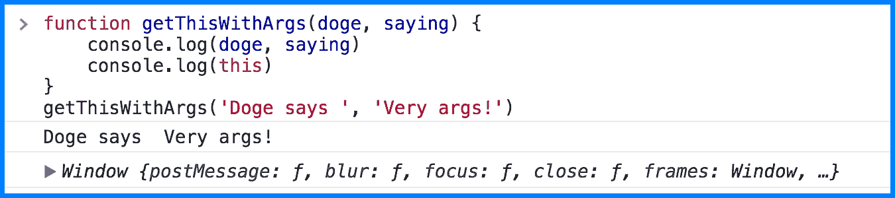

如果不向函数传递任何参数，apply()和 call()的行为完全相同。但是在接受 args 的函数中，apply()和 call()略有不同。让我们修改 getThis()函数，使它接受两个参数。一个是名字，一个是说法。使用 apply()和 call()，我们使用默认函数 getThisWithArgs()，首先传入所选的' **this** '值，然后第二次传入我们的参数。

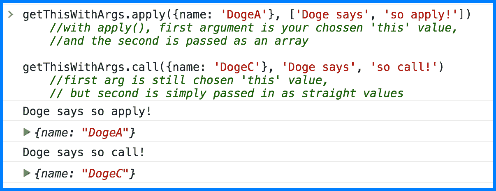

对于 apply()，参数作为数组传递；在 call()中，参数是一个接一个传入的。这是一个非常小的差别，当实际使用 apply()和 call()的时候，这一差别应该就很明显了。

## Bind() =永久绑定

重要的是要记住，一旦 bind()设置了一个选择的' **this** '值，它就是不可变的。也就是说，从 bind()返回的函数不能再绑定到不同的' **this** '值。函数只能绑定一次。明智地选择，蚱蜢。

举例来说:我们创建一个已经绑定的变量，并在默认的 getThis()函数上使用 bind()将' **this** '设置为 Doge 对象“Help！Doge bound！”—然后，我们尝试使用 bind()、apply()和 call()设置一个新的“ **this** ”绑定，并传入新的“ **this** ”设置。然而，已经为已经绑定的对象建立了一个绑定，JavaScript 解释器忽略这个新对象并返回原来的绑定——不管我们试图抛出什么，或者如何抛出:

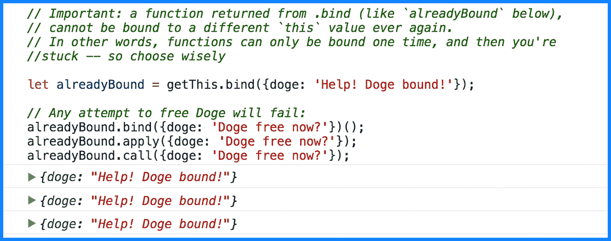

## 大结局:带 bind 的回调()

令人高兴的是，当您想要确切地设置' **this** '将使用 bind()、apply()或 call()的什么' **this** '时，为回调函数标识'**this**的工作方式是相同的。鉴于它们的工作方式几乎相同，只是略有不同，我们将只做一个快速 bind()演示。(闪回:要记住的重要区别是，apply()和 call()都在函数内部设置“this”值，然后立即运行它。Bind()返回函数的副本而不运行它，所以必须显式调用它)。

这里我们有一个高阶函数 callbackBindToDoge()，它接受回调并使用 bind 将回调的' **this** '设置为一个特定的值。我们应该期望返回一个名称属性等于 Doge 的对象:

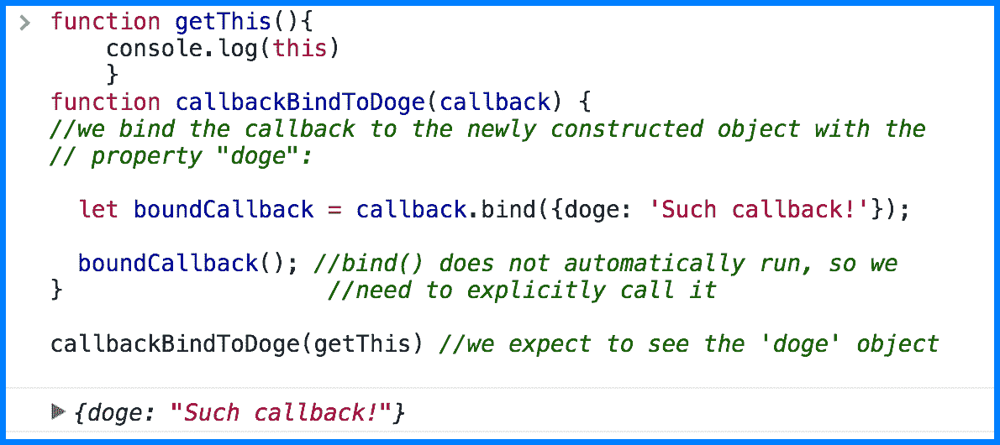

和前面的回调函数的例子一样，只看 getThis 作为回调参数，你不知道' **this** 会是什么。但是，一旦您回溯到调用函数 callbackBindToDoge()并查看其内部，就会清楚' **this** '将被设置在哪里。因为我们有 bind()像一个大的红色箭头说“' **this** '这里！”

最后一点:回想一下上一节，从 bind 返回的函数永远不能绑定到其他任何东西。让我们看看当我们传递 callbackBindToDoge()一个已经绑定的回调函数时会发生什么。它将尝试执行其任务，将任何传递的回调绑定到原始/内部 doge 对象，“这样的回调！”—但它会失败:

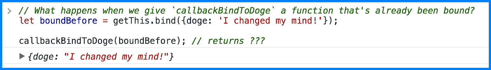

惊呆了。

请记住这一点:回调函数完全由调用它们的高阶函数控制。这个外部封闭函数就是调用点。

检查外部函数，看看那里发生了什么，您可以跟踪回调的'**this**'——不管那个狡猾的小家伙想藏在哪里。

<svg xmlns:xlink="http://www.w3.org/1999/xlink" viewBox="0 0 68 31" version="1.1"><title>Group</title> <desc>Created with Sketch.</desc></svg>