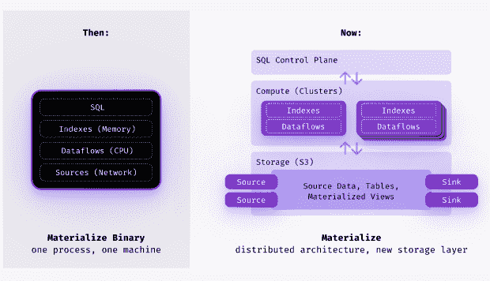
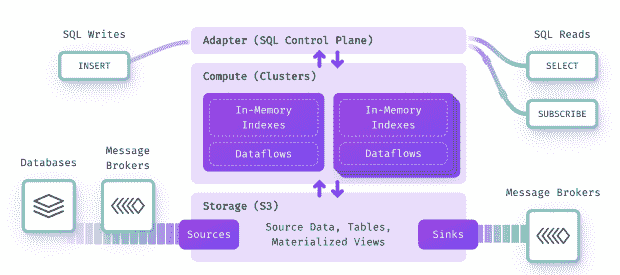

# 物化:管理实时数据

> 原文：<https://thenewstack.io/materialize-managed-real-time-data/>

利用实时数据的能力不再是一种美好的拥有，而是对高性能公司至关重要的，随着其分布式流数据库的早期可用性的宣布，[实现了](https://materialize.com/)的这一观点。

“人们正试图使用更新鲜、更实时的数据。但事实是，现有的流处理器和实时框架太难了。但我们认为，在未来五年内，实时数据将成为默认，这就是为什么我们一直在努力实现物化，”物化办公室主任[杰西卡·拉夫林](https://www.linkedin.com/in/jessica-laughlin-5133b282/)解释道。

在其最新的迭代中，Materialize 提供了一个简单的 SQL 接口，可作为完全托管的云服务，提供存储和计算的分离、严格的可序列化性、主动复制、水平可扩展性和工作负载隔离。

它以一个 [Postgres 数据库](https://thenewstack.io/the-slow-climb-of-postgres-and-the-value-of-persistence/)的形式出现，支持完整的 ANSI SQL，同时提供以前只能在基于批处理的系统中找到的功能。

“我们正在让流媒体变得像批处理一样简单，将批处理的最佳实践引入流媒体，”拉夫林说。

由于它是 Postgres 兼容的，正如现场工程总监 Seth Wiesman 所说，“如果你在 T9 之前使用过数据库，你已经编写过 SQL，你知道如何使用物化。”它集成了 Postgres 生态系统中的所有工具。

最初编写为一个 Rust 二进制文件，最初版本的 Materialize 从 Kafka 获取数据，并允许用户在标准 SQL 中查询、转换和连接他们的流数据。虽然它为快速变化的数据提供了增量视图维护，但它最大的缺点是依赖上游系统作为正在处理的数据的持久数据源。

该公司的联合创始人在一篇博客文章中解释说，希望在 Materialize 上构建业务关键、生产就绪的应用程序的用户不断要求该公司将持久性纳入产品中。

在过去的一年里，这家总部位于纽约的公司专注于将其流处理器和数据库的代码重新架构为一个持久、可扩展的[云原生](https://materialize.com/blog/materialize-unbundled/)分布式云产品。

## 随着数据变化而更新

[弗兰克·麦克雪莉](https://github.com/frankmcsherry)2013 年在微软研究院工作时，参与了一个名为 Naiad 的项目，该项目提出了[及时数据流的概念，](https://www.youtube.com/watch?v=yyhMI9r0A9E)支持对持续更新的数据进行实时查询。

他和他的联合创始人 [Arjun Narayan](https://www.linkedin.com/in/arjunravinarayan/) 在博士数据库圈子里建立了联系，他们在 2019 年创办了这家公司。纳拉扬是 McSherry 首席科学家兼首席执行官。

Materialize 的核心数据库引擎依赖及时数据流作为其流处理框架。物化基本上是一个包装器。它从多个来源获取数据，包括关系数据库、事件流和数据湖，然后使用与批处理数据仓库相同的复杂 SQL 查询来转换或连接数据。

物化视图不同于静态物化视图，在静态物化视图中，您必须刷新物化视图，物化视图会随着数据的变化而不断更新，但在复杂的转换、连接或聚合中会保持毫秒级的延迟。

威斯曼说，及时数据流的优势在于细粒度的操作进度跟踪，这使得 Materialize 能够提供严格的可序列化性。

最重要的是，它使用[差分数据流](https://timelydataflow.github.io/differential-dataflow/)，这不仅能够对大量数据进行高效计算，还能在数据变化时保持计算。

假设有一条记录影响了视图一个输出行。因为我们使用差分数据流，我们只需要重新计算那一行。我们的工作与差值成正比。因此，您可能有 1tb 的数据，10 亿行，但我们只更新正在积极变化的数据。这使得系统运行起来既高效又便宜，”威斯曼说。

软件即服务平台还提供:

*   存储和计算的分离，“所以我们有独立的服务，可以随着数据和应用程序需求的变化而扩展和起伏，”拉夫林解释道。
*   AWS S3 铲斗中的弹性存储可降低成本。
*   多路复杂连接—流到流、流到表、表到表等等，全部在标准 SQL 中完成。
*   水平可扩展性利用及时的数据流帮助用户处理大规模、快速扩展的工作负载。
*   活动复制使用户能够使用相同的工作负载启动多个群集，以实现高可用性。
*   工作负载隔离允许用户启动具有不同工作负载的多个集群，仍然共享弹性存储，而不用担心来自其他集群的干扰。

该公司坚持认为，物化使公司不仅是数据驱动的，而且是事件驱动的。

任何数据库都可以给你一个问题的答案——“X 的当前值是多少？”例如，威斯曼解释说。事件驱动的架构提供了采取行动的信息。

“想象一下，你正在经营一家拍卖行，你正在跟踪你系统内的所有出价，你想开发一个工具，在拍卖结束时提醒每场拍卖的获胜者，”他说。

“您可以编写 SQL 来询问数据库谁是赢家，但这是一种被动的行为。…你可以每小时、每 10 分钟做一次。但是我们想要一个事件驱动的架构，在这个架构中，数据库会告诉你，‘嘿，拍卖刚刚结束，苏珊赢了。给她发一封电子邮件，推送通知或电话。积极做一些真实的事情。"

## '新鲜、最新的回复'

McSherry 和 Narayan 根据“物化视图”的数据库概念命名了 Materialize，这是指预先计算查询结果，以便在需要时立即可用，而不是按需进行工作。该公司已经筹集了超过 1 亿美元，最近一次是一年前宣布的 6000 万美元的 C 轮融资。

[光速创投(Lightspeed Venture Partners)的 Nnamdi Iregbulem](https://news.crunchbase.com/business/real-time-modern-data-stack/) 将 Materialize 与 ClickHouse 和 Tinybird 归为一类，后者提供“实时分析，让分析师以低延迟获得对其业务查询的最新回应。”他将 Kafka 归类为高速大容量流媒体，将 Apache Flink 和 Apache Samza 归类为过滤和转换流媒体数据的流媒体。

[https://www.youtube.com/embed/WVORbibyFGA?feature=oembed](https://www.youtube.com/embed/WVORbibyFGA?feature=oembed)

视频

物化用户包括 [Centerfield 保险服务](https://www.centerfield.com/insurance/)(以前的 Datalot)。

“我们正在重建我们的主要 Datalot(现在的 Centerfield)应用程序，该应用程序主要负责提供分析数据，”该公司的数据副总裁 Josh Arenberg 在决定尝试 Materialize 的电子邮件中说。

“除了为用户构建报告之外，向应用程序呈现分析数据还会带来一些挑战。出于以下原因，我们正在探索流处理的理念来推动这些分析:

1.  拥有最新的可用数据，而不必为单个用户访问重新处理/重新运行查询。这意味着如果你的应用程序有很多访问者，你对数据库的使用不会随着并发用户的数量而增加。
2.  构建事件驱动的系统，用于警报和自动化分析数据，这意味着为分析指标而不是时间点快照生成信号。我们希望能够在事情超出界限时使用这些数据采取行动，而不仅仅是构建时间点报告。
3.  在应用程序中构建实时可视化，无需重新运行查询或刷新即可更新。"

Centerfield 正在构建一个流管道，作为一种实时饱和其分析数据库(雪花)的方法，因此它已经有了可用的数据，并且如果新生的物化技术或其他流解决方案不成功，它的备份位置总是执行反向 ETL，并以某种频率从雪花查询中提取数据。

“但 Materialize 代表了一种更清洁的方法，所以我们对它的工作效果非常满意，特别是在其他解决方案的一些不太成功的实验之后，”他说。

“我认为我们获得了很大的信心，因为基础技术，及时数据流，已经使用了一段时间，并在一些大公司进行了战斗测试。由于大部分新代码位于 SQL 层，我们通常会发现早期的问题往往出现在查询处理中，而不是数据流中。老实说，没有那么多问题。

“…我们很快意识到[物化团队]正在构建高质量的代码，并且对我们可能有的任何错误报告都非常敏感。我也喜欢他们在 Rust 中构建[，所以我们不需要担心所有种类的错误。”](https://thenewstack.io/microsoft-rust-is-the-industrys-best-chance-at-safe-systems-programming/)

虽然物化技术还没有达到普遍的可用性，他说它超过了预期。

“这么早意味着这项技术的运营需要一定的工作，其中大部分现在已经通过(去年秋天宣布的)物化云产品解决了。但是核心引擎一直都很坚固。当我们给它输入正确的源数据时，我从未见过来自 Materialize 的“错误”答案。

“我也不能夸大 Materialize 团队质量的重要性。没有这种强有力的合作关系，我们不可能取得过去几年的成就。”

除了上面提到的数据应用，Centerfield 还发现了 Materialize 的其他几个重要用途，他说:

1.  “过去一年的大部分时间都在关注 Centerfield 对 Datalot 的收购，而 Materialize 在将保险数据实时输入 Centerfield 后端方面发挥了关键作用。它使这一过程变得简单可靠。
2.  我们的分析部门已经能够使用它来为业务的各个方面构建一些真正令人难以置信的实时仪表板，用于指导全天的业务决策。
3.  我们已经使用 Materialize 作为实时特征库建立了几个机器学习算法。它允许我们建立一个实时的用户交互流来运行我们的模型。"

<svg xmlns:xlink="http://www.w3.org/1999/xlink" viewBox="0 0 68 31" version="1.1"><title>Group</title> <desc>Created with Sketch.</desc></svg>