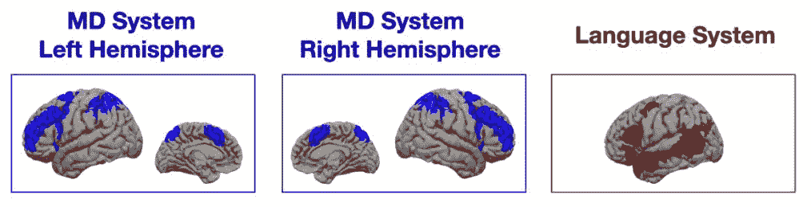
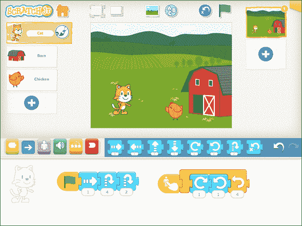

# 数学还是语言:大脑的哪一部分处理计算机代码？

> 原文：<https://thenewstack.io/math-or-language-which-part-of-the-brain-processes-computer-code/>

当我们阅读计算机代码时，到底发生了什么？美国国家科学基金会、麻省理工学院大脑和认知科学系以及麦戈文大脑研究所最近资助了一些有趣的研究来寻找答案。四名研究人员——三名来自麻省理工学院，一名来自塔夫茨大学——对数十名执行“程序理解任务”的参与者的大脑进行了核磁共振扫描，在这些任务中，他们预测了程序的输出。

这个想法是为了确定计算机代码在大脑中是如何被理解的——变量、函数名和关键字是如何变成有意义的表达式，然后合并成一个更大的整体。对计算机科学教育者来说会有线索吗——甚至对 IT 世界的开发者来说会有一些诱人的见解吗？也许对计算机编程教师来说最值得注意的是，它试图回答大脑的哪一部分最负责学习编码技能的问题。是做数学的那部分吗？还是负责学习语言的部分？

## 音乐、数学和语言

根据麻省理工学院的[公告，该论文的高级作者](https://news.mit.edu/2020/brain-reading-computer-code-1215)[伊芙琳娜·费多伦科](https://evlab.mit.edu/)已经在研究大脑的语言网络是否用于其他功能的问题，该公告指出，根据她以前的工作，“音乐和数学似乎没有激活这种语言网络。”他们还引用了[安娜·伊万诺娃](https://neuranna.mit.edu/)，一位麻省理工学院的研究生和这项研究的第一作者，她解释了下一个探索领域。“在这里，我们对探索语言和计算机编程之间的关系很感兴趣，部分是因为计算机编程是一项如此新的发明，以至于我们知道不可能有任何硬连线机制使我们成为优秀的程序员。”

麻省理工学院的声明总结了 Ivanova 想要研究的两个学派。“一种观点认为，为了擅长编程，你必须擅长数学。另一种观点认为，由于编码和语言之间的相似性，语言技能可能更相关。”

或者，正如研究人员在结果论文中解释的那样，“如果代码理解依赖于将自然语言中的形式映射到意义的相同回路，我们期望看到语言系统中的活动”——尽管他们也在研究第二种可能性:用于解决复杂问题的“多需求”大脑区域。

Ivanova 在麻省理工学院的公告中解释道:“它几乎可以做任何认知上具有挑战性的事情，让你努力思考。”

研究人员甚至观察了对 Python 代码样本和图形编程语言 ScratchJr(由麻省理工学院媒体实验室与塔夫茨大学和有趣的发明公司合作开发的)的反应。该论文解释说，他们的研究是认真彻底的。在 Python 实验中，我们进一步研究了两种问题类型(数学问题和字符串操作)和三种基本的程序结构类型(顺序语句、forloops 和 if 语句)Python 测试涉及 24 名成年参与者——15 名女性，而 ScratchJr 测试涉及 19 名成年参与者——12 名女性。

结果呢？研究人员发现，这个“多重需求”区域对两种代码都有反应——甚至是更直观的图形语言。与此同时，与语言相关的区域确实对基于句子的问题做出了反应——“但对代码问题的反应很弱或根本没有。”论文的标题简明扼要地总结了最终结果:“对计算机代码的理解主要依赖于一般领域的执行大脑区域。”

“神经科学家发现，解释代码激活了一个通用的大脑网络，但不是语言处理中心，”麻省理工学院新闻稿的标题澄清道。

“然而，尽管阅读计算机代码激活了多需求网络，但它似乎比数学或逻辑问题更依赖于网络的不同部分，这表明编码也不能精确复制数学的认知需求。”

## 经验丰富的编码员

麻省理工学院的声明指出，这项研究没有排除其他大脑区域的参与。“研究人员表示，虽然他们没有发现任何似乎专门用于编程的区域，但这种专门的大脑活动可能会在拥有更多编程经验的人身上出现。”但 Fedorenko 指出，至少在他们的研究中，“在熟悉编码并能有效完成这些任务，但经验相对有限的人中，你似乎还没有看到任何专业化。”

麻省理工学院还指出，该论文附有一篇来自约翰·霍普金斯大学研究人员的姐妹论文，该论文得出了类似的结论“解决代码问题激活了多需求网络，而不是语言区域……”，这最终对教育者产生了影响。正如科技作家 Clive Thompson [所说的](https://boingboing.net/2020/12/30/study-finds-brain-activity-of-people-coding-isnt-quite-like-when-they-use-language-or-do-math.html)，“科学家探索这个数学/语言问题的一个原因是，坦率地说，我们在教授编程和计算机科学方面相当*糟糕*。没人知道:你会像对待数学一样对待它吗？比如语言？比如……*什么*，准确的说？”

> “理解计算机代码似乎是它自己的事情。它不等同于语言，也不等同于数学和逻辑”——安娜·伊万诺娃。

《今日心理学》杂志*上的一篇文章指出[“这项新发现揭示了对于人类大脑来说，理解代码的过程与阅读语言的过程是不同的。“根据研究结果，从教育的角度来看，像教授外语一样教授计算机编码可能不是最有效的方法。”](https://www.psychologytoday.com/au/blog/the-future-brain/202012/do-math-geeks-or-linguists-make-better-programmers)*

 *麻省理工学院指出，“这些发现表明，对于编码应该作为基于数学的技能还是基于语言的技能来教授，并没有一个明确的答案。研究人员说，这在一定程度上是因为学习编程可能会利用语言和多需求系统，即使一旦学会，编程就不依赖于语言区域。

Ivanova 告诉他们，“看起来计算机科学教育工作者将不得不开发他们自己的方法来最有效地教授代码。”

但是对她来说，观察真正的程序员的反应很有趣。

“这肯定涉及到语言处理，”BoingBoing 的一位评论者说。“作为程序员，我不得不接触一些不同的音乐，因为歌词会分散我的注意力。我甚至发现自己把听到的歌词打了出来。”

在 Reddit 的科学论坛上，麻省理工学院的公告吸引了超过 16500 张赞成票和 464 条评论。

微软云倡导者 Alvaro Videla 在 Twitter 上做出了一个赞赏的回应,“作为一个业余爱好者，我可以告诉你，虽然我计划写一篇评论……但这是我读过的关于这个主题的最严肃、最细致的论文。它考虑了通常被忽略的代码方面。它认识到自己的局限性…所以总而言之，掌声！如果你对语言和编程感兴趣，这篇论文是必须的。”

当然，最终还有一种可能性:大脑可能仍然是一个谜。Clive Thompson 总结道:“我很高兴看到从这一系列神经学探索中还会出现什么，但我敢打赌，最终的答案，如果我们得到了，将会像我们正在学习的关于大脑的一切一样:疯狂复杂，超级偶然，难以概括。”

* * *

## WebReduce

<svg xmlns:xlink="http://www.w3.org/1999/xlink" viewBox="0 0 68 31" version="1.1"><title>Group</title> <desc>Created with Sketch.</desc></svg>*