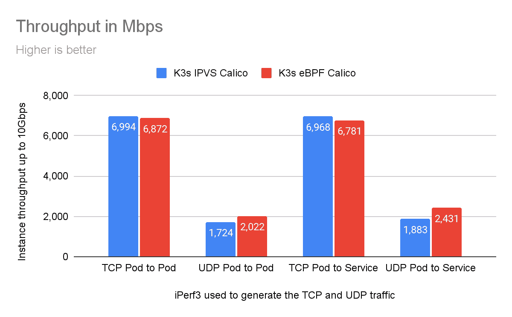
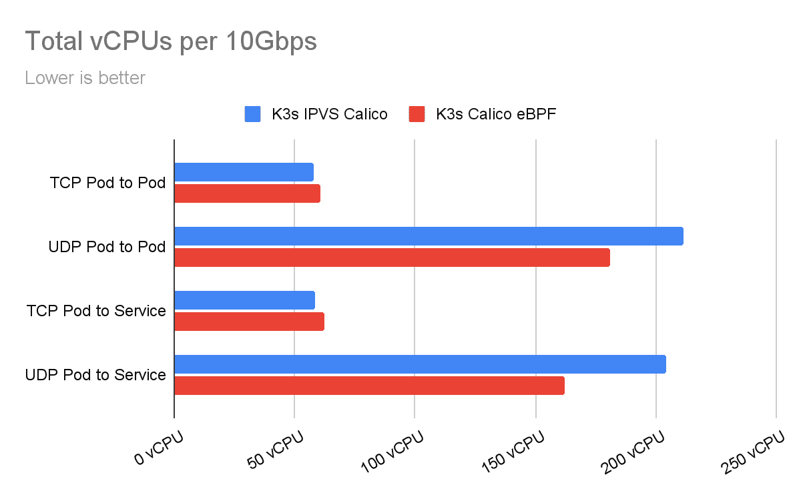

# 利用 Calico eBPF 数据平面最大限度地提高 K3s 资源效率

> 原文：<https://thenewstack.io/maximize-k3s-resource-efficiency-with-calico-ebpf-data-plane/>

[](https://www.linkedin.com/in/rramezanpour/)

[Reza Ramezanpour](https://www.linkedin.com/in/rramezanpour/)

[Reza 是 Tigera 的一名开发人员，致力于促进 Calico 项目的采用。在加入 Tigera 之前，Reza 是一名系统工程师和网络管理员。](https://www.linkedin.com/in/rramezanpour/)

[](https://www.linkedin.com/in/rramezanpour/)[](https://www.linkedin.com/in/rramezanpour/)

亚马逊定制的 Graviton 处理器允许用户在 AWS 公共云中创建 Arm 实例，Rancher K3s 是在这些实例中运行 Kubernetes 的绝佳方式。通过允许用一个二进制文件实现针对 Arm 优化的 Kubernetes 的轻量级实现，K3s 将集群初始化过程简化为执行一个简单的命令。

在之前的一篇文章[中，我讨论了 Arm 架构如何成为 x86 在云计算领域的竞争对手，以及可以采取哪些措施来利用这种情况并为这个新时代做好准备。按照同样的叙述，在本文中，我将看一个在 AWS 上运行的 Calico eBPF 数据平面的例子，使用](https://thenewstack.io/is-arm-architecture-the-future-of-cloud-computing/) [Terraform](https://www.terraform.io/) 引导我们安装到 AWS，使用 [Rancher K3s](https://rancher.com/docs/k3s/latest/en/) 部署集群。

为了实现 Arm 兼容性，需要对 Calico 进行一些更改，包括更新器件、启用 eBPF 和为 ARM64 环境编译运算符:

*   [Tigera 操作器](https://github.com/tigera/operator/pull/1464/files)–安装 Calico 的推荐方式。
*   [构建](https://github.com/projectcalico/go-build/pull/297)——一个容器环境，其中包含 Calico 在编译过程中需要的所有工具。
*   [Calico-node](https://github.com/projectcalico/node/pull/1044)–承载 Felix 的豆荚，Felix 是将控制平面决策传送到集群的大脑。

让我们讨论一下如何运行一个 Arm 支持的 Kubernetes 集群，该集群配备了 Calico 用于安全性，eBPF 作为数据层。

## eBPF 是什么？

eBPF 是嵌入在 Linux 内核中的虚拟机。它允许将小程序加载到内核中，并附加到钩子上，当某些事件发生时，钩子就会被触发。这允许定制内核的行为。

Calico 的 eBPF 数据平面利用 BPF 功能实现源 IP 保护、直接服务器返回(DSR)甚至更好的性能。对 eBPF 及其功能的完整解释超出了本文的范围，但是如果您有兴趣了解更多内容，您可以查看本文中的[，它讨论了 eBPF 的功能以及为什么您应该使用它。](https://www.tigera.io/blog/ebpf-when-and-when-not-to-use-it/)

## 表演

Calico eBPF 数据平面是 Calico 标准 Linux 数据平面(基于 iptables)的替代方案，进一步提升了性能极限。Calico 使用 BPF 程序快速有效地处理数据包，而无需离开 Linux 内核的数据包处理环境。这种方法实现的效率接近于内核中本地编译的代码。



**注意:** AWS 对 EC2 实例之间的单个流量有限制，将此类流量限制为 5 Gbps。

下图显示了基准测试消耗的总 CPU 利用率，以 vcpu 衡量。这是客户端和服务器 CPU 利用率的总和。



这些统计数据是使用两个`A1.xlarge`实例、这个 [K8s 基准测试套件](https://github.com/frozenprocess/k8s-bench-suite/tree/arm64)和 iperf 的多个彼此并行连接的实例收集的。请注意，AWS 对 EC2 实例之间的单个流量有限制，将这种类型的流量限制在 5 Gbps。

## 演示

本节为您提供在 AWS 公共云基础设施上部署配备 Calico eBPF 数据平台的 Rancher K3s Arm 集群的必要步骤。

### 在开始之前

这个演示部分使用来自 Amazon 的 [A1 实例。除了 Amazon 帐户，请确保您的系统上安装了以下应用程序:](https://aws.amazon.com/ec2/instance-types/a1/)

### 集群准备

使用以下链接下载 Terraform 模板集群:

```
curl  -OL https://github.com/frozenprocess/demo-cluster/archive/refs/heads/master.zip

```

浏览到`demo-cluster` :
中的`calico-k3s-aws`文件夹

在`calico-k3s-aws`文件夹中，你会发现一个名为`terraform.tfvars-example`的示例变量文件。从该文件中删除后缀`example`提供了一种简单的方法来修改将使用 Terraform 部署的集群的一些属性。

对于这个例子，由于我们的文档关注于设置 Arm 环境，您需要相应地修改以下值:

```
availability_zone_names  =  ["us-west-2a","us-west-2c"]
image_id  =  "ami-06d1fcb7a93046a55"
instance_type  =  "m6g.large"

```

**注:**在撰写本文时，AWS us-west-2 地区仅在`us-west-2a`和`us-west-2c`可用区提供 ARM64 实例。

Terraform 使用“提供商”来连接各种环境。使用以下命令下载与本演示相关的“提供者”:

现在我们的 Terraform 项目已经准备好了，使用`apply`来填充资源。运行以下命令后，将创建两个普通 Ubuntu EC2 虚拟机、一个虚拟私有云(VPC)、一个互联网网关(IGW)、两个子网和一个默认路由。

**注意:**执行以下命令将在您的 AWS 帐户中创建资源。在批准部署之前，请花点时间查看资源。

成功部署后，应该会有类似如下的输出:

```
instance_1_private_ip  =  "172.16.2.183"
instance_1_public_ip  =  "34.219.2.61"
instance_2_private_ip  =  "172.16.1.81"
instance_2_public_ip  =  "54.187.109.181"

```

### K3s 服务器安装

K3s 服务器就是扮演控制平面角色的进程。此安装过程会创建对控制和维护群集至关重要的重要文件。

使用`instance_1_public_ip`值和`calico-demo.pem`文件连接到实例一。

**注意:**在 Windows 中，使用 PuTTY 完成此步骤。更多信息可在[这里](https://www.chiark.greenend.org.uk/~sgtatham/putty/latest.html)找到。

```
ssh ubuntu@34.219.2.61  -i  calico-demo.pem

```

K3s 的单一二进制方法为安装集群提供了近乎神奇的体验。只需运行以下命令，集群将在几秒钟内准备就绪！

```
curl  -sfL https://get.k3s.io | INSTALL_K3S_VERSION=v1.21.3+k3s1 K3S_KUBECONFIG_MODE="644" INSTALL_K3S_EXEC="--flannel-backend=none --tls-san=k3s.local --cluster-cidr=192.168.0.0/16 --disable-network-policy --disable=traefik" sh -

```

尽管 K3s 的体积很小，但它有很多功能。在本演示中，我们将禁用法兰绒、Traefik 和 K3s 默认网络策略，以简化此过程。(如果您想了解这些功能的更多信息，请查看[此链接](https://rancher.com/docs/k3s/latest/en/installation/install-options/server-config/)。)

让我们使用 kubectl:
来检查集群的状态

您应该会看到类似下面的结果。请注意，所有的 pod 都处于`pending`状态。这是因为我们的集群中没有安装容器网络接口(CNI)。

```
NAMESPACE NAME                                      READY STATUS    RESTARTS AGE
kube-system local-path-provisioner-5ff76fc89d-pm2f5 0/1 Pending 0          23s
kube-system metrics-server-86cbb8457f-6mmbd 0/1 Pending 0          23s
kube-system coredns-7448499f4d-g6d9c                  0/1 Pending 0          23s

```

## 安装印花棉布

Tigera 运营商是一个伟大的方式来安装印花布。运算符是以受控方式与自定义资源进行交互的一种很好的方式。

**注意:** Calico ARM64 eBPF 支持处于早期阶段。您需要修改`tigera-operator`清单并将`-arm64`添加到`image: quay.io/tigera/operator:master`行的末尾。在下面的命令中，我使用了`sed`来自动执行程序。但是，如果您使用的是 Windows 或者在使用下面的命令时遇到问题，可以考虑使用文本编辑器手动完成这个步骤，然后使用`kubetl create -f <<myfile.yaml>>`应用修改后的清单。

使用以下命令在集群上安装 Tigera Operator:

```
curl https://docs.projectcalico.org/master/manifests/tigera-operator.yaml | sed 's#:master#:master-arm64#' | kubectl create -f -

```

可以使用以下命令验证操作员安装:

```
kubectl get pods  -n  tigera-operator

```

接下来，您应该会看到类似如下的输出:

```
NAME READY STATUS    RESTARTS AGE
tigera-operator-86c4fc874f-86x8r 1/1 Running 0          56s

```

Calico 包含许多功能，可根据其基本组件进行调整。安装操作符后，它将不断检查默认名称空间中的配置，该名称空间包含用于在集群中配置 Calico 的`kind: Installation`头。

使用以下命令开始安装:

```
kubectl create  -f  -  <<EOF
apiVersion:  operator.tigera.io/v1
kind:  Installation
metadata:
  name:  default
spec:
  calicoNetwork:
    bgp:  "Disabled"
    ipPools:
    -  blockSize:  26
      cidr:  192.168.0.0/16
      encapsulation:  VXLAN
      natOutgoing:  Enabled
      nodeSelector:  all()
EOF

```

使用以下命令验证 Calico 部署已经完成:

```
kubectl rollout status ds/calico-node  -n  calico-system

```

应该有类似如下的输出:

```
daemon set  "calico-node"  successfully rolled out

```

此时，我们的 K3s 集群中有一个工作节点，它配备了使用标准 Linux 数据平面的 Calico。

### K3s 代理安装

添加 K3s 工作节点就像安装服务器一样简单。简单复制令牌:

```
sudo cat  /var/lib/rancher/k3s/server/node-token

```

您应该会看到类似如下的输出:

```
K10d650693ae9d1c33239dee97b00c5a5f669c9921525f9b02f83c68cd7decae829::server:695a8f016aeb78245bb527f81fe42cd6

```

使用前面由我们的 Terraform 项目和 SSH 创建的`instance_2_public_ip`值和`calico-demo.pem`进入第二个实例:

```
ssh ubuntu@54.187.109.181  -i  calico-demo.pem

```

接下来，使用以下命令安装代理，并将工作节点加入集群。

(注意:请更改以下命令中的 IP 地址、端口和令牌，以适应您的环境。您需要指定第一个节点的内部 IP `instance_1_private_ip`，而不是外部 IP。)

```
curl  -sfL https://get.k3s.io | INSTALL_K3S_VERSION=v1.21.3+k3s1 K3S_URL=https://172.16.2.183:6443 K3S_TOKEN=K10d650693ae9d1c33239dee97b00c5a5f669c9921525f9b02f83c68cd7decae829::server:695a8f016aeb78245bb527f81fe42cd6 sh -

```

回到服务器，执行以下命令来验证新安装的 worker:

应该有类似如下的输出:

```
NAME STATUS ROLES AGE VERSION
ip-172-16-2-183  Ready control-plane,master  7m39s  v1.21.1+k3s1
ip-172-16-1-81  Ready  <none>  16s  v1.21.1+k3s1

```

### 启用 eBPF

默认情况下，Calico 被设置为使用`iptables`数据层，它在默认名称空间中提供一个名为`kubernetes`的服务，并使用`kube-proxy` pods 将它代理给 API 服务器。

由于 Calico 可以接管 eBPF 模式下的`kube-proxy`职责，我们可以安全地移除这些 pod。然而，我们必须允许 Calico 直接与 api 服务器对话，以防止任何中断。

使用以下命令确定 API 服务器信息:

```
kubectl get endpoints kubernetes  -o  wide
NAME ENDPOINTS AGE
kubernetes  172.16.1.211:6443  4m18s

```

通过使用配置映射，我们可以告诉 Calico 如何直接联系集群 API 服务器。

**注意**:地址和端口可能不同。确保这些值输入正确，因为不正确的值会触发`tigera-operator` pod 的崩溃循环。

使用以下命令创建所需的配置图:

```
cat  <<  EOF  >  kubernetes-services-endpoint.yaml
kind:  ConfigMap
apiVersion:  v1
metadata:
  name:  kubernetes-services-endpoint
  namespace:  tigera-operator
data:
  KUBERNETES_SERVICE_HOST:  "172.16.2.183"
  KUBERNETES_SERVICE_PORT:  "6443"
EOF

```

使用`kubectl apply`应用文件并创建`ConfigMap` :

```
Kubectl apply  -f  kubernetes-services-endpoint.yaml

```

集群可能需要 60 秒钟才能获得`ConfigMap`。之后，使用以下命令重启操作器，以获取更改:

```
kubectl delete pod  -n  tigera-operator  -l  k8s-app=tigera-operator

```

K3s 嵌入了`kube-proxy`进程，很难禁用。由于 kube-proxy 和 eBPF 都试图与集群数据流交互，我们必须将 Felix 配置参数`BPFKubeProxyIptablesCleanupEnabled`更改为`false`。如果`kube-proxy`和`BPFKubeProxyIptablesCleanupEnabled`都被启用，`kube-proxy`将编写它的 iptables 规则，Felix 将尝试清理它们，导致 iptables 在两者之间摆动。

导出在服务器安装过程中创建的集群证书文件:

```
export KUBECONFIG=/etc/rancher/k3s/k3s.yaml

```

使用以下命令禁用 iptables 清理:

```
calicoctl patch felixconfiguration default  --patch='{"spec": {"bpfKubeProxyIptablesCleanupEnabled": false}}'

```

执行以下命令，用 eBPF 改变集群数据平面:

```
kubectl patch installation.operator.tigera.io default  --type merge  -p  '{"spec":{"calicoNetwork":{"linuxDataplane":"BPF", "hostPorts":null}}}'

```

让我们通过执行以下命令来验证集群的健康状况和节点架构:

```
kubectl get nodes  -L  kubernetes.io/arch
NAME              STATUS ROLES                  AGE VERSION        ARCH
ip-172-16-2-244 Ready    <none> 65s v1.21.3+k3s1 arm64
ip-172-16-1-224 Ready    control-plane,master 2m21s v1.21.3+k3s1 arm64

```

就是这样！现在，您有了一个使用 eBPF 数据平面的多节点 K3s 集群，它由 Calico 保护。

## 打扫

在 demo 文件夹中，发出以下命令来删除为此演示创建的所有资源:

```
terraform destroy  -auto-approve

```

## 结论

K3s 的极简方法使其对于资源受限的环境来说是无价的，并且它的单一二进制方法允许跨任何基础设施更快地部署。用户可以通过使用 Calico eBPF 数据平面进一步提高资源效率，同时还可以受益于 Calico 的其他功能，如功能丰富的网络策略语言、BGP 路由等。

在本文中，我探讨了如何安装一个配备了 Calico 的多节点 K3s 集群，以及如何用 eBPF 交换标准的 Linux 数据层。在这里，我只是触及了 Calico eBPF 能力的皮毛。更多信息，请看我们的 [eBPF 文档](https://docs.projectcalico.org/about/about-ebpf)。

如果你喜欢这篇博文，你可能也会喜欢:

你知道你可以成为认证印花布操作员吗？在这个 [*免费、自定进度的认证课程*](https://academy.tigera.io/course/certified-calico-operator-level-1/) *中，学习 Kubernetes 和使用 Calico 的容器网络和安全基础知识。*

<svg xmlns:xlink="http://www.w3.org/1999/xlink" viewBox="0 0 68 31" version="1.1"><title>Group</title> <desc>Created with Sketch.</desc></svg>