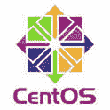
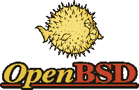
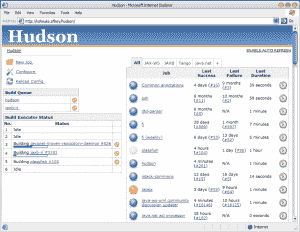

# 愿叉子与你同在:开源叉子简史

> 原文：<https://thenewstack.io/may-fork-short-history-open-source-forks/>

每次有分叉的时候，我认为分叉实际上是好东西，这意味着有人看到了需要和技术原因来做一些不同于标准内核的事情。但是大部分分叉都是失败的。他们发现他们需要的东西实际上不值得去做，结果，大多数叉子都死了。莱纳斯·托沃兹。

上周，一些团体[鼓动](https://thenewstack.io/docker-fork-talk-split-now-table/)对开源 Docker 容器软件进行分流，列举了一些对技术进展的不满，包括 Docker 公司的快速发布时间表。现有代码库的分叉是一个重要的决定，可能会迫使依赖软件的多方做出选择。

开源的历史充满了开源的分叉。很多叉子都非常成功。这些分叉成功背后的原因之一是它们是出于一种需要而创建的——最初的项目没有满足社区的需要。原创项目可能会对自己的分叉皱眉，他们可能会反击，但事实是，正如托沃兹所说，有人看到了拓展业务的理由。在许多情况下，forks 比 mother 项目更成功，因为他们背后有压倒性的社区支持。

我们不知道 Docker 是否应该分叉，或者分叉是否会成功。但是在这个故事中，我们挑选了开源历史上一些最成功的企业软件分支。

## Ubuntu 一个 Debian fork？

Debian 是最古老的基于 Linux 的发行版之一，它成为了许多发行版的基础。最受欢迎的 Debian 分叉之一是 Ubuntu。Ubuntu 采用 Debian 包并构建自己的包。它有自己的软件库，自己的内核。尽管许多人会争论 Ubuntu 是否是一个分叉，甚至[马克·舒托沃尔斯也不完全确定。](https://wiki.ubuntu.com/MarkShuttleworth#Is_Ubuntu_a_Debian_fork.3F_Or_spoon.3F_What_sort_of_silverware_are_you.2C_man.3F)

## 从 Red Hat Enterprise Linux 派生出来的 Oracle Enterprise Linux

Ubuntu 显然是 Debian 的友好分支，因为 Canonical 雇佣了许多 Debian 开发人员，他们为 Debian upstream 做出了贡献。而 Oracle Enterprise Linux 显然不是 Red Hat Enterprise Linux 的友好分支。

甲骨文早在 2006 年就与 RHEL 分道扬镳，免费提供他们所谓的“甲骨文企业 Linux”。它的信息是，你不需要支付红帽运行甲骨文数据库，免费获得 RHEL 作为 OEL。

Red Hat 通过混淆其对内核的更改，并且不提供在源 tarball 中为文件的更改打补丁来回击 Oracle。甲骨文带着 RedPatch 服务回来了，向公众提供了 RHEL 内核变化的视图，按补丁细分。

## 从 Red Hat Enterprise Linux 派生的 CentOS

CentOS(社区企业操作系统)是 2004 年从 RHEL 分离出来的，CentOS 的第一个版本是版本 2。CentOS 是根据 RHEL 的源代码构建的，因此与 RHEL 兼容。与 OEL 不同，它不是一个敌对的分支。相反，CentOS 的目标是向那些想在网络服务器上运行 RHEL 而无需付费的人提供支持。

CentOS 在某种程度上帮助了 Red Hat，使其从 Debian 手中“夺取”了一大块 web 服务器市场。再看红帽和 Canonical 的竞争，每一个远离**的服务器。deb** 基地到**。rpm** base 是 Red Hat 的胜利。在很短的时间内，CentOS 击败 Debian 成为最受欢迎的网络服务器。红帽就是红帽，2014 年做了一个聪明的举动，收购了 CentOS。在保持 CentOS 独立性的同时，Red Hat 声称拥有付费和免费市场份额。

## OpenBSD 从 NetBSD 派生而来

另一边的草不会更绿。BSD(伯克利软件发行)领域也有许多分支。最流行的分叉是 OpenBSD。直言不讳的 NetBSD 联合创始人 Theo de Raadt 在被发现是高级开发人员和 NetBSD 核心团队成员后，接手了这个项目。他在 1995 年宣布 OpenBSD 是从 NetBSD 1.0 派生出来的。OpenBSD 是仅次于 FreeBSD 的第二流行的 BSD。

## OpenOffice fork LibreOffice

甲骨文通过收购太阳微系统公司收购了 OpenOffice，但 OpenOffice 在甲骨文的宏伟计划中并不合适。着眼于 OpenSolaris 的命运，OpenOffice.org 社区成员在 2010 年成立了文档基金会。同年，他们派生出 OpenOffice 代码库并创建了 LibreOffice。 LibreOffice 很快成为主流发行版的默认办公套件。

随着许多核心开发人员加入 LibreOffice 项目，Oracle OpenOffice 的命运已经注定。甲骨文停止了 OpenOffice.org 的开发，打下了剩下的开发团队。2011 年甲骨文向 Apache 软件基金会捐赠了 OpenOffice 的代码和商标。

在 2016 年 9 月 1 日发送的一封邮件中，Apache OpenOffice 副总裁 Dennis Hamilton [表示，由于缺乏贡献，可能会退出项目](http://mail-archives.apache.org/mod_mbox/openoffice-dev/201609.mbox/%3C008d01d204a9%24bd37caa0%2437a75fe0%24%40apache.org%3E) 。

## MySQL fork MariaDB

OpenOffice 并不是甲骨文唯一遭受损失的开源项目。当甲骨文表示希望收购太阳微系统公司时，MySQL 的创始人迈克尔·维德纽斯反对甲骨文收购 MySQL，并发起了“拯救 MySQL 运动”。宣布收购 Sun 的那天，Widenius 将 GPLed 版本的 MySQL 派生出来，创建了 MariaDB，它是 MySQL 的替代产品。后来，MariaDB 成为许多基于 Linux 的发行版的默认数据库，尽管 MySQL [仍然是最流行的开源数据库](http://db-engines.com/en/)。

具有讽刺意味的是，虽然 Oracle 从未关闭 MySQL，但 Widenius 却将 MaxScale(一种智能代理，允许将数据库语句转发到一个或多个数据库)变成了专利。有趣的是，在 MaxScale 宣布的几个小时内，一些社区成员在 GitHub 上以 GPLScale 的名义叉开了它。

## 哈德逊的詹金斯

#/media/File:Hudson_Screenshot.png)

最初的上传者是英文维基百科上的 Faisal.akeel。

Oracle 在开源社区中似乎没有什么好名声。继 OpenOffice 和 MySQL 之后，Hudson 是又一个被其社区瓜分的 Oracle 开源项目(通过 Sun Microsystem 收购)。2011 年，在与甲骨文就商标问题发生长期纠纷后，哈德森被换成了詹金斯。有趣的是，Oracle [将 Jenkins 视为分叉，而 Jenkins 贡献者将 Hudson 视为分叉](https://en.wikipedia.org/wiki/Hudson_(software))。今天，Jenkins 是最受欢迎和最广泛使用的持续集成工具之一，而 Oracle 放弃了 Hudson，将代码库捐赠给 Eclipse。

## Nextcloud 分叉 ownCloud

在今年早些时候的一次高调分叉中，ownCloud 创始人 Frank Karlitschek 从他共同创建的公司辞职，并分叉了他创建的项目。2016 年 6 月，Karlitschek 宣布了 ownCloud 的分支，被命名为 Nextcloud。Karlitschek 携手 Spreedbox 创始人 [Niels Mache](https://twitter.com/NielsMache) 围绕 Nextcloud 创建了一家新公司。在 Nextcloud 宣布后的 12 小时内，ownCloud 因投资者撤资而关闭了其美国办事处。

Karlitschek 从他自己的 Cloud 错误中吸取了教训，创建了一个 Nextcloud 基金会，该基金会拥有和控制该名称的商标，并监督项目的开发。Nextcloud 也成为少数几个取消 CLAs(贡献者许可协议)的公司之一。

## OpenSSH

OpenSSH 是现代 IT 基础设施中最重要的组件之一。OpenSSH 是在 1999 年从当时免费的 SSH 项目中分出来的，后来变成了专有技术。OpenSSH 在技术上是 OSSH 的一个分支，OSSH 是 SSH 项目的一个分支，是从 SSH 1 . 2 . 12 版本的代码库创建的，该版本的许可证允许分支。OpenSSH 是基于 Linux(和 BSD)的系统上连接远程机器的默认实用程序。2015 年，微软在其 Windows PowerShell 中引入了对 OpenSSH 的支持。

## Apache HTTP 服务器

很多开源软件要么基于其他项目，要么是分叉的，包括最流行的开源 web 服务器 Apache。Apache 项目在 1995 年脱离了 NCSA HTTPd web 服务器，当时原始项目的开发速度减慢了。有趣的是，当 Apache web server codebase 将许可证改为 Apache 2.0 许可证时，OpenBSD project 分叉了 Apache HTTP server，创建了 OpenBSD Httpd。

## 结论

很明显，由他们的社区创建的 forks 取得了巨大的成功。事实上，在大多数情况下，他们超越了原来的项目。与此同时，有一些分叉是出于敌意而产生的，这些分叉仍然处于休眠状态。从历史上看，这些分叉告诉我们的是，开源是不可遏制的；如果一个项目没有兑现它的承诺，如果它忽略了自己的社区，它将被分叉。

愿叉子与你同在！

<svg xmlns:xlink="http://www.w3.org/1999/xlink" viewBox="0 0 68 31" version="1.1"><title>Group</title> <desc>Created with Sketch.</desc></svg>