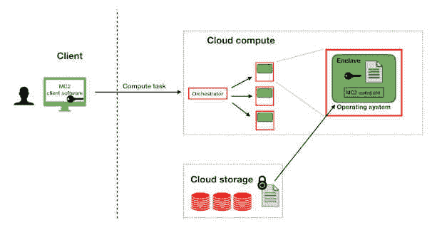

# MC2:机器学习的安全协作分析

> 原文：<https://thenewstack.io/mc2-secure-collaborative-analytics-for-machine-learning/>

[机器学习](https://thenewstack.io/category/machine-learning/) (ML)近年来获得了显著的地位，因为它能够应用于许多行业，并有效地解决复杂的问题。然而，[研究](https://venturebeat.com/ai/why-do-87-of-data-science-projects-never-make-it-into-production/)显示，近 90%的人工智能/人工智能模型从未真正投入生产或投放市场。主要挑战是 [ML/AI 模型](https://thenewstack.io/add-it-up-how-long-does-a-machine-learning-deployment-take/)需要大量高质量、准确和及时的数据才能有效，但由于安全和隐私问题，组织长期以来一直不愿意共享敏感信息。

个人数据变得越来越普遍，导致隐私问题日益严重。因此，全球数据保护法变得越来越严格，组织面临着越来越高的违规风险。减轻这种担忧并将 AI/ML 提升到下一个级别需要一种新的协作方法——安全协作学习。

安全协作学习使多方能够在不公开共享敏感数据的情况下建立相互健壮的 ML 模型。有了这项技术，银行可以使用这些稳健的模型来检测金融犯罪和洗钱。医疗保健组织可以在不暴露敏感信息的情况下，从多个患者数据集提高临床洞察力，移动网络运营商能够通过集体分析流量数据来预测呼叫率的波动。

在加州大学伯克利分校 RISELab 对这种模式进行了多年的广泛研究后，联合创始人拉卢卡·阿达·波帕和里沙布·波德达尔开发了 MC2 开源平台来解决这一关键的多方合作挑战。

MC2(多方协作和合作竞争)支持对加密数据进行丰富的分析和机器学习，确保数据即使在处理过程中也保持隐蔽。通过 secure enclaves 的临时“黑盒”方法，正在使用的数据对运行作业的服务器保持机密。这听起来可能很矛盾，但这是真的:多个数据所有者可以联合运行分析或根据他们的集体数据训练 ML 模型，而实际上不会向其他任何人透露这些数据。这减轻了将机密工作负载转移给不受信任的第三方或云提供商的顾虑。MC2 解决了不断扩大的云采用、数据共享需求和对数据隐私日益增长的担忧之间的矛盾。

本文的其余部分将详细介绍这个流行的开源项目的关键技术方面，描绘出通往安全、协作的 ML 和 AI 的道路。

## 支持安全领域的软件堆栈

安全区域支持创建可信执行环境(TEE ),一个多方可以在不受信任的机器上协作处理机密数据的域。以前的方法将数据转储到 TEE 中，并为需要数据的人提供访问以进行协作，但这为隐藏的风险和第三方泄漏打开了大门，在这种监管环境下，企业根本无法承受这些风险和泄漏。

借助安全飞地，每个飞地都可以访问系统内存的受限部分，并且放置在飞地中的数据或软件被加密并与系统的其余部分隔离。这创建了一个额外的安全层，防止任何入侵，甚至是来自系统本身的入侵。更进一步，secure enclaves 支持远程证明，这使用户能够以加密方式验证 enclave 正在运行可信的、未经修改的代码。

MC2 无缝运行流行的分析和机器学习框架(Apache Spark、XGBoost 等。)中，从最终用户那里抽象出编写 enclave 代码的复杂性。此外，MC2 处理分区，因此只有需要直接计算敏感数据的组件才会自动加载到 enclave 中。

最后，MC2 通过两种方式使用加密技术来加强这些飞地组件:

1.  MC2 有内置的措施来验证需要分布式执行的作业的完整性。
2.  由于开发人员仍然需要监控和处理安全飞地的旁路泄漏和攻击，MC2 在飞地代码中使用数据无关技术，以确保没有旁路信息通过内存访问模式泄漏。

MC2 同时提供软件和硬件数据保护。双重安全性降低了旁道攻击的风险，这是一个关键的飞地漏洞。

## 实践中的 MC2

在合作开始时，每个机构都要准备运行计算的脚本。每个组织的脚本都是相同的，并且是提前商定的。

随着加密数据上传到服务器，MC2 会收到大量本地更新。该程序根据用于开发预测的加密数据训练决策树模型。通过本地更新的聚合，MC2 基于从每一方收集的加密数据的分析产生最终算法。

一旦算法最终确定，每个组织下载从加密数据集合创建的结果。这种全球模型提供了分析洞察力。即使在这个阶段，各方也无法看到其他组织的数据。他们只能访问集体分析，然后将这些分析应用于他们自己的私有数据集。

这在实践中可能看起来很简单，因为事实就是如此！MC2 让任何人都可以在加密数据上进行多方协作。

## 机密分析的下一波浪潮

是的，个人数据正变得越来越普遍，隐私问题日益严重，随之而来的数据保护法也越来越严格。然而，与此同时，各组织正在意识到能够相互共享数据的巨大好处—银行可以合作检测金融犯罪，医疗机构可以合作进行医学研究，等等。

由于缺乏 ML 无法应用的安全处理环境，世界上超过 3000 亿美元的最有价值的数据仍未被开发，并且 [Gartner 预测](https://www.gartner.com/en/newsroom/press-releases/2021-03-23-gartner-identifies-top-security-and-risk-management-t)到 2025 年，超过 50%的组织将采用隐私增强计算来处理敏感数据并进行多方分析，这凸显了安全访问加密数据的重要性。

机密计算空间不会很快放慢速度，现在是企业采用这项技术的时候了。随着敏感数据量每天都在增加，对 MC2 平台的需求从未像现在这样高。对加密数据的保密计算和分析将很快成为所有寻求就敏感信息进行协作的行业的必备条件。

<svg xmlns:xlink="http://www.w3.org/1999/xlink" viewBox="0 0 68 31" version="1.1"><title>Group</title> <desc>Created with Sketch.</desc></svg>