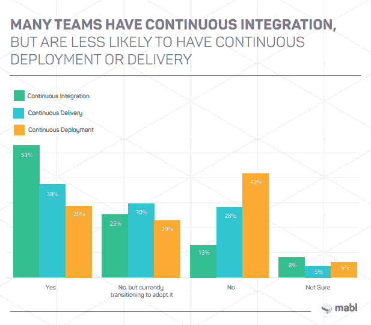

# 衡量 CI/CD 采用率是一个问题

> 原文：<https://thenewstack.io/measuring-ci-cd-adoption-rates-is-a-problem/>

两年前，我们注意到[并非所有开发人员都使用 CI/CD](/week-numbers-not-developers-use-ci-cd/) ，因为“只有”42%的数字海洋调查使用持续集成/持续部署(CI/CD)。尽管随着时间的推移，许多公司仍然不使用 CI/CD，尽管成熟采用微服务和/或容器的公司几乎总是在使用 CI/CD。由于两个原因，CI/CD 的使用程度谁也说不准。

首先，对于什么是 CI/CD，没有一致同意的定义。当 [mabl 调查](https://www.mabl.com/devtestops-survey-download) 500 名软件测试人员时，53%的人说他们的团队使用持续集成，而只有 38%的人使用持续交付，29%的人使用持续部署。就像 DevOps 一样，营销人员热衷于将解决 CI/CD 领域的任何工具定义为该市场或更大的 DevOps 工具细分市场的一部分。

资料来源:劳工及福利局的《2019 年发展计划景观调查》

也很难定义 CI/CD 的市场规模，因为大多数调查没有衡量采用的深度。仅仅因为 CI/CD 工具在公司内部使用并不意味着它被广泛使用，也不意味着它的用例已经超出了最基本的范围。一个更好的衡量标准是自动化 Git 提交代码到生产的流程的百分比。Codefresh 的 DevOps 聚焦[调查报告称，三分之一的公司已经自动化了超过一半的工作负载，但只有 1%的公司实现了自动化。考虑这个问题的另一种方式是根据公司中使用特定产品或服务的开发人员的百分比。](https://codefresh.io/continuous-deployment/engineers-struggle-with-ci-cd-automation-to-deploy-more-often/)

衡量 CI/CD 采用情况的相关性出现在最近的一次 twitter 对话中，GitLab 首席执行官 Sid Sijbrandijg 表示，大约一半的全球 2000 强公司使用了 CI/CD 最佳实践，如功能标志和跟踪，但只有大约 1%的工作负载是通过这种方式处理的。作为那次谈话的一部分，红和尚的詹姆斯州长写道:“我们还在旅程的早期。所以许多[组织]仍然在做手工测试和构建。现代发展发生在小口袋里。”

We [noted last year](/testing-automation-perspectives/) that most developers have some sort of automated testing. More [recent research](/devops-quality-metrics-ranked-from-overrated-distractions-to-hidden-gems/) by Tricentis shows that while DevOps practitioners are very likely to be counting how many automated tests are being performed, they realize that quantity is different than quality. In fact, when measuring their build processes, DevOps practitioners say that the top metric is how many automated tests are addressing issues that are generating the most risk.

As GitLab, GitHub and others compete head-to-head, will they be operating in separate niche markets, or will they both be vendors of bundled DevOps and CI/CD services?

GitLab and Tricentis are sponsors of The New Stack.

Feature image via [Pixabay](https://thenewstack.io/devops-quality-metrics-ranked-from-overrated-distractions-to-hidden-gems/).

<svg xmlns:xlink="http://www.w3.org/1999/xlink" viewBox="0 0 68 31" version="1.1"><title>Group</title> <desc>Created with Sketch.</desc></svg>