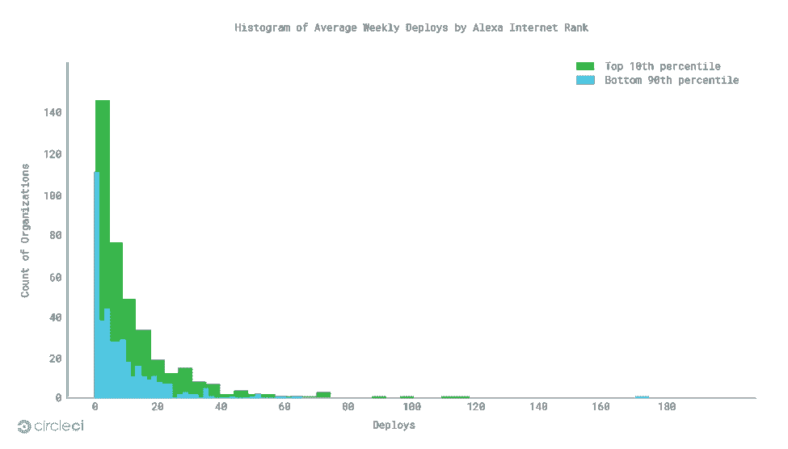

# 测量工程速度:部署频率是 DevOps 健康的“重要标志”

> 原文：<https://thenewstack.io/measuring-engineering-velocity-deploy-frequency-as-a-vital-sign-of-devops-health/>

这是 CircleCI 主办的关于测量工程速度的三部分系列文章的第二部分。阅读更多关于主线稳定性的内容

[part 1](https://thenewstack.io/measuring-engineering-velocity-mainline-branch-stability-matters/)

和

[deploy time in part 3](https://thenewstack.io/measuring-engineering-velocity-how-deploy-time-affects-cost-and-quality/)

.

如果您正在您的组织中采用 DevOps，您无疑会遇到一些常见的障碍，如组织摩擦和文化惰性。应对这些挑战需要衡量:没有衡量，你就不知道如何跟踪或定义进展，也无法确定你的数字化转型努力是否朝着正确的方向前进。

为了帮助定义和改进 DevOps 测量，[我们新的 CircleCI 报告](https://circleci.com/resources/velocity-report/)着眼于最有可能影响工程速度的三个指标:主线分支稳定性、部署时间和部署频率。我们的研究结果基于 2017 年年中在 CircleCI 的云平台上建立的 GitHub 和 Bitbucket 组织的样本。在本文中，我们将关注部署频率的结果；在我们的[上一篇文章](https://thenewstack.io/measuring-engineering-velocity-mainline-branch-stability-matters/)和[下一篇文章](https://thenewstack.io/measuring-engineering-velocity-how-deploy-time-affects-cost-and-quality/)中阅读更多关于主线分支稳定性的内容。

## 部署频率:高性能的关键指标

 [吉姆·罗斯，CircleCI

首席执行官吉姆·罗斯(Jim Rose)于 2014 年通过收购 Distiller 加入 CircleCI，Distiller 是一种仅用于 iOS 的持续集成服务。他是 Distiller 的联合创始人兼首席执行官。在 Distiller 之前，Jim 是许多公司的联合创始人和首席执行官；丰富，一个由基金会资本，谷歌风险投资等支持的社交市场；互联网品牌收购的旅游领域垂直搜索引擎 Vamoose2000 年，MobShop 发明了网上团购并获得专利，筹集了超过 4900 万美元的资金，其知识产权被 Groupon 收购。](https://circleci.com/) 

部署频率表明公司的实际速度，也是稳定性和部署时间的函数:高主线分支稳定性和低部署时间都鼓励更高的部署频率。我们将部署频率视为组织开发运维状况的“重要标志”。每一次“脉动”或部署，组织都在传递价值，发现客户需求并解决问题。频率也直接受到成本的影响:当部署成本下降时，工程师就会被鼓励更频繁地部署。

“我们认为部署频率是高绩效组织的一个关键指标，”《Accelerate》的作者、DevOps Research and Assessment LLC 的首席执行官/首席科学家 Nicole Forsgren 博士说。“高性能者可以按需部署，而低性能者只能每月或更长时间部署一次代码。这种部署速度上的差异在提供价值、取悦您的客户以及跟上合规性和法规变化方面至关重要。”

调查结果:在我们的研究中，部署频率被测量为每个组织每周在我们的云平台上运行的具有有效部署步骤的“默认分支”构建的中值数量。我们发现 75%的组织每周部署他们最活跃的项目少于 13 次。表现最好的人(95%的人)每周部署他们的主线分支 32 次；这是中位数的 5 倍多，是倒数第 5 百分位的近 24 倍。

对于 Alexa 互联网排名前 10%的组织，我们看到了领先优势的增长和更大的分布，第 95%的组织每周部署 42 次，是第 5%的 40 倍，但仍是中位数的 5 倍(每周部署 8 次)。范围上的细微差异也有所体现，75%的组织每周部署不到 16 次。

Alexa 互联网排名靠前的组织似乎行动最快。高分组织和其他组织之间的分布略高，Alexa 互联网排名前百分位数的组织在高端推动代码更多。这反映了速度的重要性:要成为任何类别中的佼佼者，组织必须最大化他们的部署率。

## 保持部署频率的最佳实践

小而短暂的拉请求:部署频率是一个复合指标，取决于主线分支的稳定性和提交部署时间(CDT)。一个众所周知但强大的策略是限制拉请求的大小和生命周期。

“一般来说，我们有一种反对长期分支机构的文化，以至于大约 80%的分支机构在 24 小时内被合并，”Code.org 工程主管杰里米·斯通解释说。Code.org 的首席软件工程师 Brad Buchanan 补充道，“我们将会看到小至一两行代码的拉请求，其中大部分都在 200 行以下。”

虽然这看起来不可能，但它表明了 Code.org 致力于将工作分成小的、可运输的单元。通过这样做，Code.org 创造了一种增量开发的文化，允许工程师更快地将代码从审查中取出并送到用户手中。

特性标志:缩短拉请求(PRs)和增加部署频率的另一种方法是使用特性标志。launch crystally 的首席技术客户经理 Tim Wong 说:“大型 PRs 之所以大，是因为依赖关系。"通过相互独立地运送相关部分，你减少了 PR rot 中的代码量."

将工作分成可消化的块是持续软件开发的核心。特性标志使开发人员能够在完成工作时发布他们正在做的工作。开发人员很高兴，因为他们完成了任务，用户也很高兴，因为他们的产品仍然工作。

部署频率是组织速度和增长的最佳预测指标之一(以及主线分支稳定性和部署时间)。通过跟踪这一重要指标，您就踏上了开发最佳实践以提高部署频率的道路，并将 DevOps 原则传播到整个组织。

<svg xmlns:xlink="http://www.w3.org/1999/xlink" viewBox="0 0 68 31" version="1.1"><title>Group</title> <desc>Created with Sketch.</desc></svg>