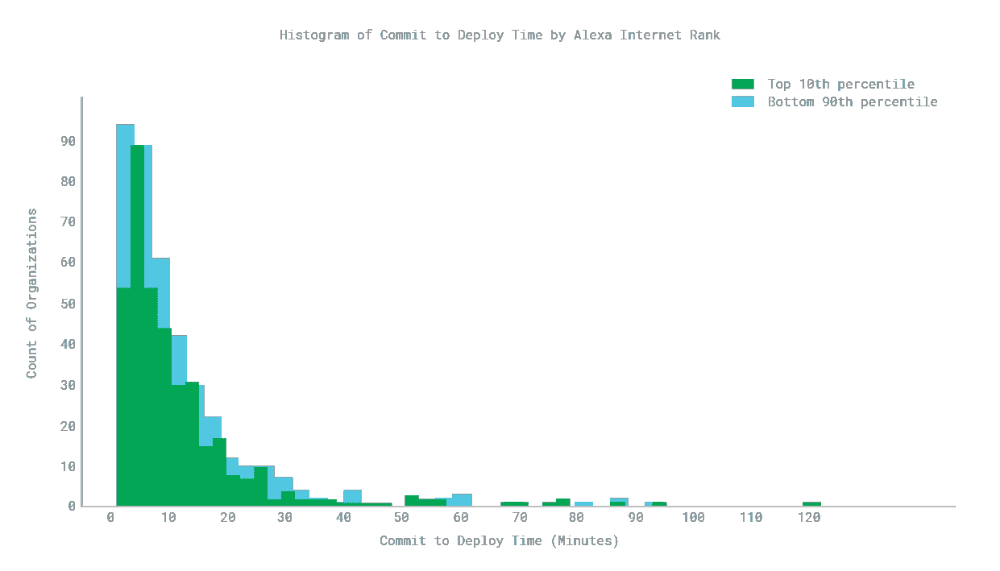

# 测量工程速度:部署时间如何影响成本和质量

> 原文：<https://thenewstack.io/measuring-engineering-velocity-how-deploy-time-affects-cost-and-quality/>

如果你正计划采用 DevOps，好消息是:采用 DevOps 实践的公司更成功，不管他们在哪个行业。然而，工程领导者在尝试制定 DevOps 实践时遇到困难并不罕见。跟踪关键指标(如主线分支稳定性、承诺部署时间(CDT)和部署频率)有助于加快开发运维之旅，同时增加速度和增长的机会。[我们新的 CircleCI 报告](https://circleci.com/resources/velocity-report/)根据 2017 年年中在 CircleCI 的云平台上构建的 GitHub 和 Bitbucket 组织的样本，深入研究了这些指标。在本文中，我们将讨论部署时间；阅读第一部分中关于[主线分支稳定性](https://thenewstack.io/measuring-engineering-velocity-mainline-branch-stability-matters/)和第二部分中关于[部署频率](https://thenewstack.io/measuring-engineering-velocity-deploy-frequency-as-a-vital-sign-of-devops-health/)的更多信息。

## 部署时间:更快变更和修补的优势

 [吉姆·罗斯，CircleCI

首席执行官吉姆·罗斯(Jim Rose)于 2014 年通过收购 Distiller 加入 CircleCI，Distiller 是一种仅用于 iOS 的持续集成服务。他是 Distiller 的联合创始人兼首席执行官。在 Distiller 之前，Jim 是许多公司的联合创始人和首席执行官；丰富，一个由基金会资本，谷歌风险投资等支持的社交市场；互联网品牌收购的旅游领域垂直搜索引擎 Vamoose2000 年，MobShop 发明了网上团购并获得专利，筹集了超过 4900 万美元的资金，其知识产权被 Groupon 收购。](https://circleci.com/) 

在代码被编写、审查和测试之后，它仍然需要被交付给用户。代码从主线分支转移到生产的时间可能从几分钟到几个小时不等——每当组织的代码库因新功能或错误修复而改变时，都会产生这种成本。

部署时间是对部署成本的衡量。部署时间越短，更换产品的成本就越低。当部署时间很短时，工程师等待部署的时间会更少，从而可以更快地开始新的工作。产品所有者可以进行更多的实验，制造更多的原型。客户可以更快地看到变化，并且在发现错误的几分钟内就可以修补。

**调查结果:**在这项研究中，部署时间是以排队构建和完成构建之间的挂钟分钟数来衡量的。我们发现部署时间在很大程度上受到控制，80.2%的组织在 15 分钟内完成部署。最快的组织(第 95 百分位)在 2.7 分钟内完成部署，而中间值为 7.6 分钟。从那里，一个长尾延伸到 30 分钟的底部第 5 百分位。

在表现最佳的组织中(Alexa 互联网排名第 10 位的组织)，80%的组织在不到 17 分钟内完成部署，前 5 位的组织在 2.6 分钟内完成部署。这些组织的中位数是 7.9 分钟，倒数第 5 个百分位数是 36.1 分钟。

## 减少部署时间的最佳实践

**QA 客户:**拥有健壮测试套件的组织可以减少执行手动 QA 所花费的时间，这有助于减少部署时间。然而，技术不是唯一的因素:它还需要高度优化的流程，包括很少的错误、从故障中有效恢复以及持续的监控。有了这些部分，组织就可以把客户当作 QA 团队——至少在安全的情况下。这并不意味着 QA 不重要，只是说在可能的情况下自动化昂贵的手工工作有一定的优势。

**找到平衡:**我们研究的关键指标，包括主线分支稳定性和部署频率，都不是孤立的变量；对其中一个进行优化会影响到其他的。例如，不到 5%的时间处于亏损状态的组织平均每周部署 5.3 次，部署时间为 6.7 分钟。相比之下，其他人平均每周部署 8.7 次，部署时间为 11.7 分钟。

没有适当测试的快速移动将导致更低的稳定性和更高的部署频率——而只关注速度的组织可能不得不花费更多的时间来修复他们的错误。这可能解释了为什么尽管部署时间更长，这些公司仍然部署更多——不是因为他们计划这样做，而是因为他们不得不这样做。

相反，随着 cruft 和技术债务的增加，只优先考虑部署频率的组织增加了不稳定的可能性。发布错误代码也增加了对更多部署来修复问题的需求。因此，部署频率不能被安全地视为组织速度的决定性度量。

在 12 分钟或更短时间内完成构建的组织每周平均部署 5.3 次，不稳定性为 0.2%。超过 12 分钟的组织平均每周部署 8.3 次，不稳定性为 2.7%。这加强了这样一种理论，即那些推动自己快速满足客户需求的组织可能会发现自己处于糟糕的状态，或者等待项目建立的时间更长。找到正确的平衡是关键。

<svg xmlns:xlink="http://www.w3.org/1999/xlink" viewBox="0 0 68 31" version="1.1"><title>Group</title> <desc>Created with Sketch.</desc></svg>