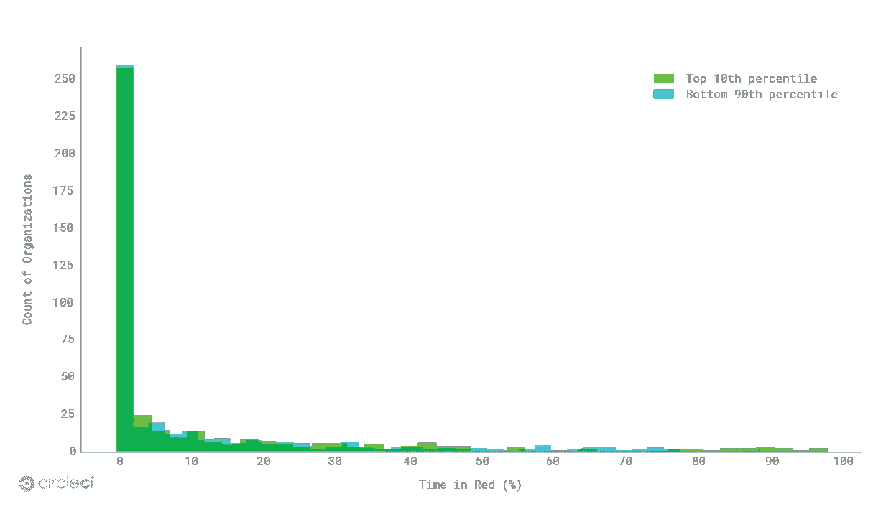

# 测量工程速度:为什么主线分支稳定性很重要

> 原文：<https://thenewstack.io/measuring-engineering-velocity-mainline-branch-stability-matters/>

与 DevOps 相关的指标能否表明您的业务增长潜力？如果是，您如何改进这些度量标准，以便 DevOps 成为您改进代码的黄金标准？我们试图在关于工程速度的新 CircleCI 报告中回答这些问题，深入探讨 DevOps 对数字化转型的影响。通过检查 2017 年年中在 CircleCI 的云平台上构建的 GitHub 和 Bitbucket 组织的样本，我们能够研究最有可能影响工程速度的三个指标:主线分支稳定性、部署时间和部署频率。在本帖中，我们将重点关注主线分支稳定性的结果。(在我们即将发布的文章中，阅读关于部署时间和[部署频率](https://thenewstack.io/measuring-engineering-velocity-deploy-frequency-as-a-vital-sign-of-devops-health/)的更多信息。)

## 主线分支稳定性:保持可部署性的关键

 [吉姆·罗斯，CircleCI

首席执行官吉姆·罗斯(Jim Rose)于 2014 年通过收购 Distiller 加入 CircleCI，Distiller 是一种仅用于 iOS 的持续集成服务。他是 Distiller 的联合创始人兼首席执行官。在 Distiller 之前，Jim 是许多公司的联合创始人和首席执行官；丰富，一个由基金会资本，谷歌风险投资等支持的社交市场；互联网品牌收购的旅游领域垂直搜索引擎 Vamoose2000 年，MobShop 发明了网上团购并获得专利，筹集了超过 4900 万美元的资金，其知识产权被 Groupon 收购。](https://circleci.com/) 

主线分支是您的应用程序的真实来源——由您的开发人员创建的每个特性分支的主模型。如果主线分支中断了，您的团队就不能开始构建新的特性，也不能快速响应来解决重大事件。

在我们的研究中，我们用项目的默认分支处于失败状态的时间百分比来衡量稳定性。挂钟时间代表真实世界的时间流逝，而不是项目的所有容器(测试软件的虚拟机)所消耗的总时间。默认分支是项目选择作为项目“主”分支的分支。

**调查结果:**正如我们在研究中发现的，稳定性是一个关键指标，在我们的样本中，80%的组织在 90%的时间里保持其主线分支可部署。中值稳定性为 98.7%；第五低百分位数的主线分支有 47%的时间处于失败状态。

对于 Alexa 互联网排名前 10%的组织，研究结果类似，排名后 5%的组织 46%的时间处于失败状态。中位数稳定性为 98.5%，最高百分位数为 99.9%。同样，在所有 Alexa 排名的组织中，80%的组织在 90%的时间里保持其主分支稳定。

无论组织是财富 100 强的一部分还是三人创业公司，大多数都理解高主线分支稳定性的价值。但是，达到并维持这种稳定性需要重新思考团队结构和传统流程。

## 维护主线分支稳定性的最佳实践

**强大的测试套件:**如果一条主线分支出现故障，生产就会陷入停顿。聪明的公司知道这一点，并投资于强大的自动化测试。通过测试每一个变化，工程师确保他们的代码如预期的那样运行。这些测试套件充当了一种软件的预防性保健。通过例行检查来发现漏洞要容易得多——例行检查越多越好。

Code for America 的高级软件工程师本·谢尔登认为好的测试可以减少认知负荷。“在我们的大多数代码审查中，我们有很高的信心，如果测试通过，实际破坏东西的风险很低，”Sheldon 说。“我们的代码审查过程不是围绕着预防问题，而是围绕着理解正在发生的变化。最终，我们希望工程师有机会在高层次上谈论架构，或者代码库的长期发展方向。”

**特性标志:**即使是最复杂的测试套件也无法捕捉真实应用程序的复杂性。特性标志可以增加发布更安全版本的机会，而不是依赖测试来捕捉每一个潜在的问题。

launch crystally 的首席技术客户经理 Tim Wong 解释说:“特性标志将功能的发布从部署中分离出来。“通过特性标志，您可以决定何时部署代码，以及何时发布代码。你在现实世界中进行测试，然后你就可以决定你是否准备好给你的用户。”

功能标志的一个额外效果是，它们可以在事故中用于防御。如果在生产中出现问题，开发人员可以简单地关闭有问题的特性，隔离有问题的代码，直到产生一个补丁。这通常比回滚整个更改要快。

从失败中有效恢复:即使有最好的测试套件，错误也不可避免地会进入生产环境。发生这种情况时，重要的是要有一个快速、可靠的恢复过程。

由 Stripe 出版的软件杂志 [Increment](https://increment.com/) 最近发表了其对亚马逊、脸书和谷歌等领先公司的[事件响应](https://increment.com/on-call/when-the-pager-goes-off/)的研究。研究发现，这些组织拥有定义良好的流程来处理生产中断，从呼叫待命工程师到持续分类问题的操作手册，所有这些对于维护主线分支的健康至关重要。

《增量报告》中与我们的研究相关的一个发现是，领先企业在解决问题之前会先缓和。这通常意味着回滚更改，而不是修复根本原因。调试一个错误是非常耗时的，并且会导致更多的赤字时间，而恢复一个更改可以快速地阻止流程。

传达失败的代价:bug 不仅仅是代码库中的错误；他们有真正的后果。识别和理解这些后果的影响有助于确定工作的优先级，并增强解决技术问题的动力。

在帮助人们在线申请食品券的美国代码服务公司 GetCalFresh，工程师们每天划出一个小时来观察人们如何填写食品券申请表。如果在那一小时里有什么东西坏了，工程师们会亲眼目睹。这使得抽象的“错误”变得更加具体，并增加了解决问题的动力。工程师不仅能看到他们工作的影响，还能看到问题如何影响生活。

**沟通潜在冲突:**虽然测试是防止失败的最明显的方法，但还有其他变量会影响失败。其中最阴险的是缺乏对潜在代码冲突的意识和沟通。围绕技术栈的各个部分组织团队似乎是合理的，比如后端和前端，但是这些结构有弱点。工程师的水平切片有更多的盲点，对他们的代码如何影响他人的洞察力更少。

在为教师和学生提供计算机科学培训的 Code.org，工程师们被组织成由三到七名工程师组成的功能性垂直“小集团”。每个小集团都参与到每日的站立会议中，工程师们分享计划外的工作并强调潜在的冲突。这些日常站立工作是因为有足够多的工程师可以工作，但没有太多的人会失去其他人正在做的事情的背景。

密切关注主线分支的稳定性是您的组织可以采用更灵活的开发实践的方法之一。这也是确保你的 DevOps 文化拥抱变化并适应变化的好方法。

<svg xmlns:xlink="http://www.w3.org/1999/xlink" viewBox="0 0 68 31" version="1.1"><title>Group</title> <desc>Created with Sketch.</desc></svg>