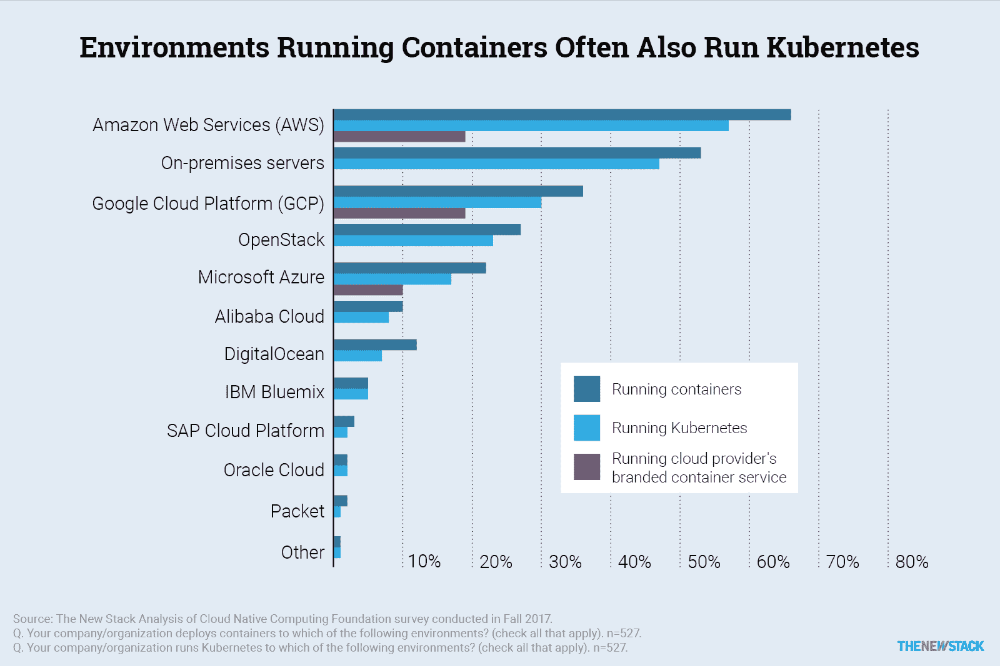

# 本周数字:衡量 Kubernetes 即服务的成功

> 原文：<https://thenewstack.io/measuring-success-kubernetes-service/>

亚马逊网络服务、谷歌和 Azure 的客户使用容器和 Kubernetes，但他们会选择这些公司的 Kubernetes 服务吗？我们没有答案，但我们已经报道了如何在 2017 年下半年 [AWS](https://thenewstack.io/aws-kubernetes-now/) 和[微软](https://thenewstack.io/closer-look-aks-managed-kubernetes-azure-container-service/)开始提供由谷歌首先开发的托管 Kubernetes，因此现在三大云提供商都提供托管 Kubernetes 服务。更复杂的是， [AWS Fargate](https://aws.amazon.com/fargate/) 是一项服务，它将允许客户为 Kubernetes (EKS)部署到亚马逊弹性容器服务，而不必管理集群。

使用特定的云环境确实会影响用户的 Kubernetes 部署。使用 Kubernetes 的公司中有 67%表示他们将容器部署到 AWS。对于那些在 AWS 上实际部署 Kubernetes 的人来说，这个数字下降到 57%。19%的人说他们也使用 AWS 弹性集装箱服务(ECS)来管理集装箱。微软 Azure 和谷歌云平台用户在使用模式上与 AWS 客户类似。采用云提供商品牌容器服务的客户比例相对较低。

相反，这些组织中的许多都直接在云提供商的基础设施上部署 Kubernetes 发行版。为了衡量 EKS、Azure Container Service 和谷歌容器引擎的成功，看看他们的 Kubernetes 中使用这些服务的用户的百分比。

内部部署、托管服务、容器即服务(CaaS)及其 KaaS 风格各有利弊。新堆栈的[电子书系列](https://thenewstack.io/ebooks/)将继续报告用户对 Kubernetes 部署的偏好。敬请关注。

谷歌和微软是新堆栈的赞助商。

特征图像由[的](https://unsplash.com/photos/fN603qcEA7g?utm_source=unsplash&utm_medium=referral&utm_content=creditCopyText)在[的](https://unsplash.com/search/photos/containers?utm_source=unsplash&utm_medium=referral&utm_content=creditCopyText)上弹出。

<svg xmlns:xlink="http://www.w3.org/1999/xlink" viewBox="0 0 68 31" version="1.1"><title>Group</title> <desc>Created with Sketch.</desc></svg>