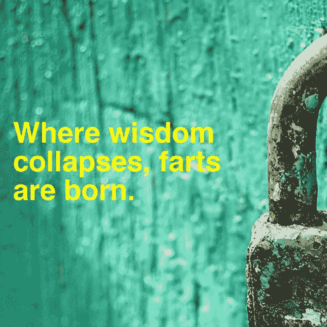
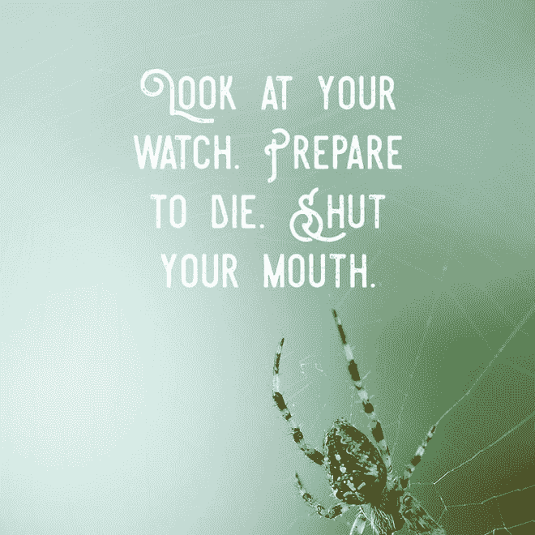

# 认识一下制作荒诞励志海报的 AI

> 原文：<https://thenewstack.io/meet-ai-makes-absurd-inspirational-posters/>

人工智能似乎正在以极快的速度发展，承担越来越多曾经被认为太复杂而无法解决的问题。从在复杂的游戏中击败排名靠前的人，如[围棋](https://thenewstack.io/alphagos-win-human-go-champion-means-ai/)和[无限注德州扑克](https://thenewstack.io/computers-can-now-bluff/)，到创作[流行歌曲](https://thenewstack.io/artificial-intelligence-todays-newest-hitmaker/)、[小说](https://thenewstack.io/day-computer-wrote-novel-almost-won-literary-competition/)，甚至设计[交互式“认知”雕塑](https://thenewstack.io/ibm-ai-helps-designers-create-interactive-thinking-sculpture/)，人工智能似乎在各个方面都取得了巨大的进步。

但有时会出现可怕的错误。

看看这个被设计用来创作灵感海报的人工智能。它被命名为 [Inspirobot](http://inspirobot.me/) ，是一个“致力于为无意义的人类生活产生无限量独特的灵感报价的人工智能。”当你第一次访问 Inspirobot 网站时，你面对的是一台 oculus 机器，它散发着一种无害的、有点危险的气息。

乍一看，它的海报具有你通常的激励性食物的所有特征:乐观的图像和经过策划的无威胁字体的文本。但这些陈腐的哲学垃圾和 Inspirobot 的创造之间的相似之处也就到此为止了。当你仔细阅读时，你会发现 Inspirobot 的信息从奇怪的:

…诱发鼻息:

…这些荒谬的花絮:

…完全令人不安。

事情还不止于此:起初，当 Inspirobot 不断提供这些令人振奋的废话让你窒息时，你没有多少话从机器人本身说出来。但是当你继续点击并生成更多这些可怕的海报时，Inspirobot 也加入了一些奇怪的安慰感叹词。

这个机器人应该产生无限量的非智慧的溃疡诱导金块。但如果你痴迷地持续点击，InspiroBot 似乎会发生黑暗的转变，正如米歇尔·沃尔什在 [*Nerdist*](http://nerdist.com/a-i-generates-the-ridiculous-inspirational-posters-that-we-need-right-now/) 发现的那样:“但我们几乎不知道，即使是它的能力也是有极限的，因为事实证明，如果你持续点击‘生成’超过任何合理的时间，Inspirobot 就会开始出现某种存在主义的怪癖。这让我们吓坏了。”

呀。该机器人的创造者没有说明这些无意义的短语和机器人明显怪异的性格背后是什么样的算法，但它可能是一个相对简单的软件，旨在最大限度地搞笑(或令人毛骨悚然，取决于你怎么看)。

起初，这些所谓的“励志”海报显然没有什么用处，甚至有点滑稽。但随着时间的推移，这些看起来就像令人毛骨悚然的坏运气饼干，促使你要么扬起眉毛，要么考虑你是否应该离开电脑……现在。这让我们想起了当微软的聊天机器人 Tay 被引入世界时，作为一个人工智能，它应该与真实的人聊天，并从现实世界的对话中学习，不料它[在几天内就退化为喷出偏执的硫酸。](https://thenewstack.io/requiem-tay-reactions-microsofts-teenaged-ai-gone-bad/)

或许 Inspirobot 不仅是为了娱乐我们这些有大量时间可以浪费、有强壮的食指可以锻炼的人，也是为了引发一些关于人工智能潜在陷阱的思考。因为越来越清楚的是，在未来，智能机器将遍布我们的生活:在我们道路上的[无人驾驶汽车](https://thenewstack.io/happens-nobody-owns-cars/)，为我们居住的[酒店](https://thenewstack.io/hotel-run-entirely-robots-opens-japan/)和住宅提供服务，在种植我们食物的[农场](https://thenewstack.io/corn-tracking-robot-may-save-us-starving-future/)，在工作场所与人类合作[，以及在战场上战斗。](https://thenewstack.io/collaborative-robots-will-help-human-workers-not-replace/)

Inspirobot 半开玩笑的生存危机似乎暗示了这样一个问题:如果我们周围所有这些智能机器有一天都达到了同一个临界点，会发生什么？难怪一些专家谨慎地建议在杀手机器人有机会胡作非为之前禁止它们。

最重要的是，这些考虑甚至没有触及伦理问题，即如果和/或当超智能机器变得有知觉，能够主观感知痛苦和快乐，本质上成为人工意识的自我时，我们将做什么。

在任何情况下，这都是一个机器人讽刺性话语中的许多值得思考的东西，所以要想看到更多 Inspirobot 的 Franken-quotes 或产生一些你自己的，就去它的 [Twitter](https://twitter.com/TheInspiroBot) 和[网站](http://inspirobot.me/)。

<svg xmlns:xlink="http://www.w3.org/1999/xlink" viewBox="0 0 68 31" version="1.1"><title>Group</title> <desc>Created with Sketch.</desc></svg>