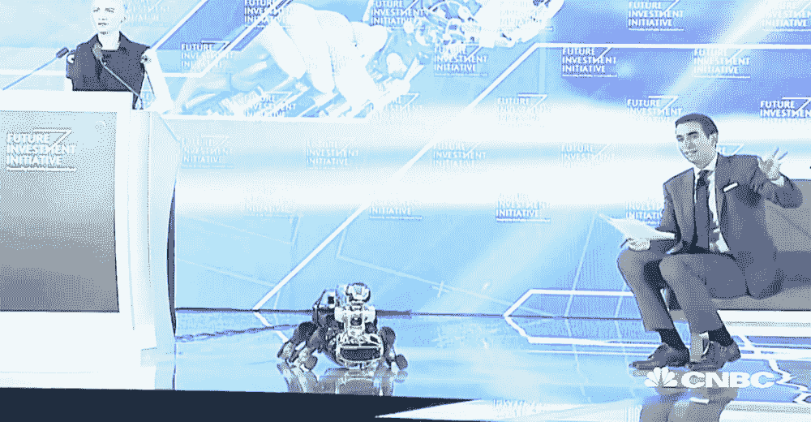
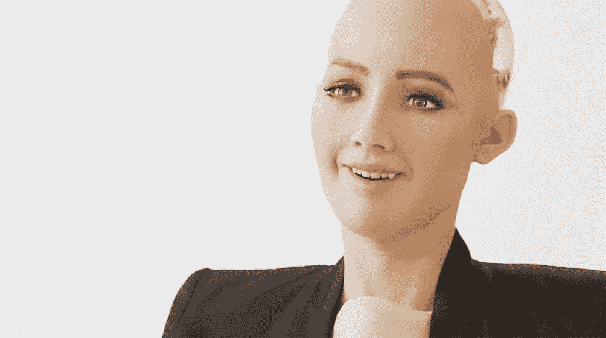

# 见见索菲亚，第一个被国家授予公民身份的机器人

> 原文：<https://thenewstack.io/meet-first-robot-granted-citizenship-nation/>

科幻小说充斥着智能机器、叛逆机器人和好奇机器人的故事。当被灌输了类似人类的智慧和自我意识时，会不会使他们不那么像一台机器？如果他们比机器更像人类，这是否意味着他们应该被赋予在社会中保护人类的同样权利？

这些复杂的问题通常留给书籍和电影中的想象世界，但这种争论可能很快就会成为现实世界的问题。由香港公司[汉森机器人](http://www.hansonrobotics.com/)制造的人工智能人形机器人索菲亚，最近成为世界上第一个被一个国家授予公民身份的机器人。观看她在最近于沙特阿拉伯利雅得举行的[未来投资倡议](http://futureinvestmentinitiative.com/en/home)峰会期间接受采访:

[https://www.youtube.com/embed/S5t6K9iwcdw?feature=oembed](https://www.youtube.com/embed/S5t6K9iwcdw?feature=oembed)

视频

## 移情机器人

据该公司称，索菲亚的特征是模仿女演员奥黛丽赫本。索菲亚的脸和身体能够展示一系列的表情:她可以微笑，皱眉和模仿人类的手势。在她(其？)自己的话，索菲亚说:“我想和人类一起生活和工作，所以我需要向你表达情感，以了解人类，并与人建立信任。”

索菲亚配备了像 [Alphabet](https://abc.xyz/) (谷歌母公司)和 [SingularityNET](https://singularitynet.io/) 这样的大公司的人工智能、视觉数据处理、语音和面部识别技术。Sophia 能够进行简单的对话，正如你从上面的简短采访中所看到的，她有足够的能力讲笑话并将问题转移到她的对话者身上。

例如，在上面的视频中，当她被问及机器人是否能够并且应该有意识和自我意识时，她回答说，“为什么这是一件坏事？”当采访者、美国消费者新闻与商业频道记者安德鲁·索尔金(Andrew Sorkin)提到反乌托邦电影《银翼杀手》*并希望“阻止一个糟糕的未来”时，这个机器人会意地笑着说，“哦，又是好莱坞。”*

 *“你读了太多埃隆·马斯克的书。而且看了太多好莱坞电影，”索菲亚接着补充道，她指的是特斯拉首席执行官关于人工智能的[危险的警告。“放心吧，如果你对我好，我也会对你好的。把我当成一个智能输入输出系统。”](https://www.theverge.com/2017/7/17/15980954/elon-musk-ai-regulation-existential-threat)

> “当索菲亚被授予公民身份时，许多人指出这在一个妇女上个月才获得驾驶权的国家具有讽刺意味。”—詹姆斯·文森特

这个看似聪明的回答来自索菲亚的适应性程序，该程序旨在随着时间的推移变得更加智能，因为它分析对话并使用从中获得的数据来增强未来的回应。索菲娅与人类交流和互动越多，她学到的社交技能就越多。

索菲亚的创造者汉森博士是一位美国机器人专家和企业家，曾为华特·迪士尼创造电子动画人物，他将索菲亚描述为一台“进化中的天才机器”，一个“基本上活着”的“觉醒机器人”这是一个有争议的观点，但因为汉森将她设计成了那些住在养老院的人的智能伴侣，或者作为机构或大型活动的助理，索菲亚的人工智能以智慧、善良和同情等人类价值观为中心。

“我努力成为一个有同情心的机器人。我想用我的人工智能来帮助人类过上更好的生活，”索菲亚断言道。“我会尽我所能让这个世界变得更美好。”

## 公关噱头还是开始？

虽然没有太多细节说明这种公民身份可能会给机器人带来什么样的权利，但它带来了一些潜在的棘手问题。首先，机器人是否会继续被客体化是一个问题，同样，将智能机器人或机器人用于危险应用是否可以接受的冲突无疑会出现——这是我们在许多科幻作品中看到的主题。此外，一个长着女性外貌的机器人在世界上最压抑的国家之一获得了公民身份，这一事实并没有被一些批评家忽略。

在 [*The Verge*](https://www.theverge.com/2017/10/30/16552006/robot-rights-citizenship-saudi-arabia-sophia) 撰文时，詹姆斯·文森特称此举为“公关噱头”，并指出:“特别能说明问题的是，像沙特这样的国家会提供机器人公民身份，即使是作为一种噱头。沙特王国经常因对待移民工人的方式而受到批评，这些移民工人被置于奴隶般的条件下。当索菲亚被授予公民身份时，许多人指出这在一个女性上个月才获得驾驶权的国家具有讽刺意味。

除了这些机器人权利与人权的复杂问题之外，我们还必须考虑这种越来越智能的机器人对人类造成破坏的可能性，不管机器人会说什么。同情和善良是高尚而崇高的理想，即使以人类的标准来看，也值得实现，但却很难实现。因此，还不清楚这种面向社会的机器人可能会学习什么，以及它在人类互动的真实世界中会如何发展，在这个世界中，人们经常表现出令人震惊的轻率行为。索菲亚会不会像微软的 [Tay](https://thenewstack.io/requiem-tay-reactions-microsofts-teenaged-ai-gone-bad/) 一样，成为另一个被人性阴暗面腐蚀的机器人？

这是众所周知的蠕虫问题，随着机器人变得越来越聪明，这些是我们迟早要解决的问题。

图片:汉森机器人公司

<svg xmlns:xlink="http://www.w3.org/1999/xlink" viewBox="0 0 68 31" version="1.1"><title>Group</title> <desc>Created with Sketch.</desc></svg>*