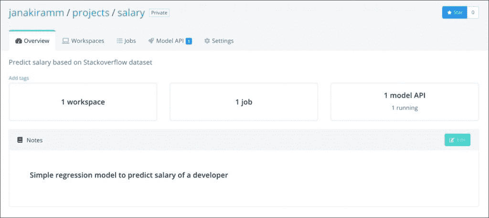
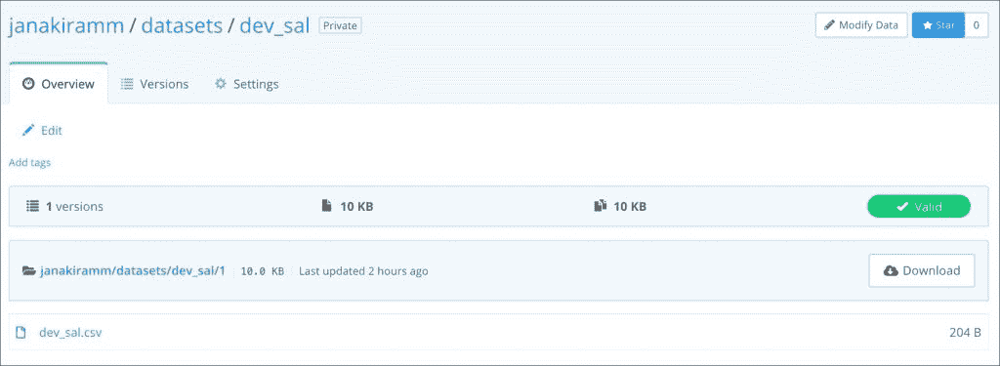
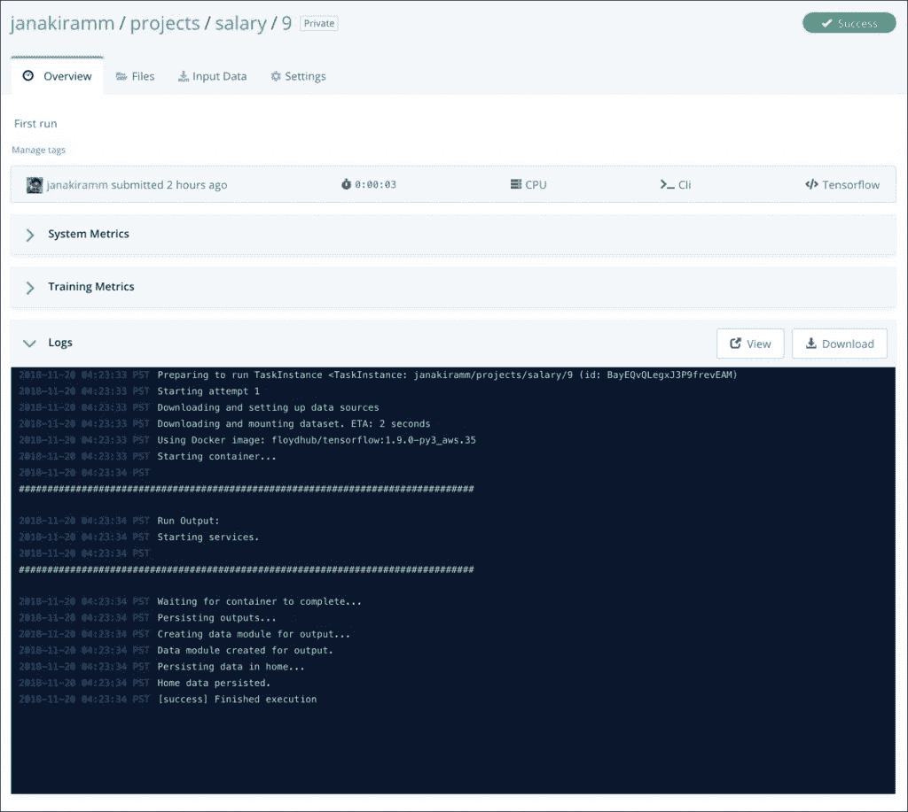
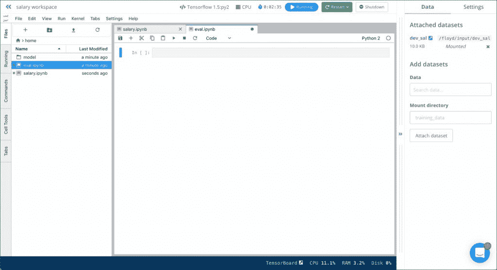

# 认识一下 FloydHub:数据科学的英雄

> 原文：<https://thenewstack.io/meet-floydhub-the-heroku-of-data-science/>

本文是我们探索基于云的机器学习服务系列的一部分。在介绍了 [Azure ML Services](/how-the-azure-ml-streamlines-cloud-based-machine-learning/) 、 [Google Cloud ML Engine](https://thenewstack.io/google-cloud-ml-engine-train-and-deploy-machine-learning-models/) 、 [Amazon SageMaker](https://thenewstack.io/train-deploy-machine-learning-models-with-amazon-sagemaker/) 、 [IBM Watson Studio Cloud](/build-machine-learning-models-with-ibm-watson-studio-cloud/) 和 [Paperspace Gradient](https://thenewstack.io/paperspace-gradient-a-modern-paas-for-machine-learning/) 之后，我们将进一步了解另一个流行的 ML 即服务平台 FloydHub。

问任何数据科学团队什么最让他们沮丧，普遍的答案是环境配置和管理。

关于数据科学和机器学习领域最好的事情是工具、框架和库是 100%开源的。虽然这对社区来说很好，但另一面是分裂。开发人员和数据科学家经常被工具的选择弄得不知所措。加上依赖关系，GPU 和高端 CPU，以及工具每个版本可能的冲突，很快就变成了配置噩梦。

与一般的认知相反，处理机器学习和人工智能不仅仅是选择和优化最复杂的算法。有趣的是，这仅占成功实现所需总工作量的 20%。剩下的 80%处理数据工程、数据准备、基础设施供应、配置管理、环境管理、工件版本控制、模型部署和生命周期管理。

为了成功实施机器学习项目，组织应该雇用数据工程师、DevOps 专业人员、数据科学家和开发人员。他们的合作对组织的长期成功至关重要。

> 与一般的认知相反，处理机器学习和人工智能不仅仅是选择和优化最复杂的算法。

不是每个公司都有能力投资这些团队。可能只有几个数据科学家和传统开发人员来处理机器学习模型的整个生命周期。新型 ML PaaS 产品通过展示预配置和可定制的环境、自动化模型训练和可扩展模型托管，精确地解决了这一差距。他们让团队专注于核心业务问题，而不是迷失在工具和框架的无数选择中。

来自湾区的年轻初创公司 FloydHub 致力于解决数据科学家面临的问题和挑战。创始人将该平台称为数据科学的 Heroku，这当然是一个恰当的描述。

该平台是在 Amazon EC2 实例上运行的 Docker 容器的抽象，它公开了一个简单的 API 来执行开发机器学习模型所涉及的大多数任务。与 Heroku 类似，开发人员上传代码，剩下的交给 PaaS，FloydHub 希望用户上传数据集、用于训练模型的代码以及用于展示训练好的模型以进行推理的代码。

用户可以使用预定义的配置设置快速启动培训工作，或者选择提供带有自定义配置的 YAML 文件。FloydHub 将接管创建定制环境并在其中运行代码的职责。

让我们看看 FloydHub 的核心组件:

## 项目

FloydHub 项目充当属于特定项目的所有资产的边界。它将保存代码、版本化实验、输出文件、日志和作业的完整历史。它还可能包含在工作区创建的 Jupyter 笔记本。

使用 FloydHub 的第一步是创建项目。

## 资料组

FloydHub 在数据和代码之间提供了强大的隔离。由于数据集在多个项目中重复使用，因此将它们保存在一个独立但可集中访问的位置是有意义的。任何项目都可以访问上传到其帐户的数据集。有一些公共数据集，如 MNIST 和 VOC，用于常见的 ML 实验。

FloydHub 中数据集的最大优点是它们被版本化了。这在数据准备和数据工程阶段非常有用，在这两个阶段，原始数据集要经过多次转换。开发人员可以通过参考版本轻松访问历史数据集。

FloydHub CLI 可用于从本地工作站上传数据集。我找不到批量上传的工具，也找不到直接从公共场所导入数据集的能力，比如 S3 桶。

## 乔布斯

一旦创建了项目并上传了数据集，很明显下一步就是开始培训工作。FloydHub 有一个简单直观的工作流程来启动培训工作。

这份工作是一项艰巨的任务。开发人员应该在创建作业之前在本地机器上编写和测试 Python 代码。当需要大规模运行培训工作时，他们只需选择一个预定义的环境，如 TensorFlow、Caffe 和 PyTorch，以及一个基于 CPU 或 GPU 的实例类型。它们还可以指向已经上传的数据集的位置。

FloydHub 上传代码，将其注入到预先配置的容器映像中，并在目标环境中启动容器。基于 GPU 的作业被打包为 NVIDIA-DOCKER 容器，可以利用 NVIDIA K80 或 P100 GPU。可以通过本地 CLI 或 web 界面发出的流日志来监控作业。作业一完成，FloydHub 就自动终止容器并停止作业。作业生成的文件可以从门户网站下载。

如果作业需要定制包和依赖项，可以将它们添加到一个名为 floyd_requirements.txt 的文件中，该文件遵循与 Python 的 requirements.txt 相同的格式。这使用户能够精确定义作业所需的版本和框架。

一份工作可以有两种不同的生活方式，即培训和服务。默认模式是训练模式，但也可以是服务模式，它可以承载用于推理的训练模型。FloydHub 希望您包含一个名为 app.py 的文件，该文件包含反序列化模型的样板代码，并将其作为 REST 端点公开。当使用切换模式服务器启动作业时，它将持续运行，直到被手动终止。

下面的屏幕截图显示了在服务模式下启动一个作业并访问它进行推理是多么简单。我看到的唯一差距是 REST 端点不安全。FloydHub 应该至少包含一个可用于 HTTP 基本身份验证的 API 密钥。

我非常喜欢 FloydHub CLI 运行作业的简单性。它有足够的开关来定义您期望运行的作业。

## 工作区

随着 Jupyter 笔记本成为数据科学 IDE 的黄金标准，FloydHub 通过工作区增加了对它们的支持。除了运行笔记本之外，工作区几乎就像一个虚拟机，用户可以在其中访问 shell。

现有的数据集位置可以挂载为目录，对笔记本可见。本地机器上的文件可以直接上传到工作区，以便从 Jupyter 笔记本上访问。

在我的评估中，我发现工作空间并没有完全融入工作。例如，作业和工作区不共享公共存储，这使得移动和重用模型工件(如检查点文件)变得困难。

理想情况下，工作空间应该成为工作的替代输入。用户应该通过 CLI 从本地计算机启动作业，或者单击工作区 UI 中的按钮。无论工作地点在哪里，都应该一视同仁。这种整合将带来更顺畅的工作流程和一致的体验。

FloydHub 因其处理 ML 实验和模型管理的极简和简单方法而获得高分。这是一个强大的 PaaS，用于运行基于 Scikit-learn 的简单、经典的 ML 模型或基于 TensorFlow 或 Caffe 的复杂深度学习模型。

<svg xmlns:xlink="http://www.w3.org/1999/xlink" viewBox="0 0 68 31" version="1.1"><title>Group</title> <desc>Created with Sketch.</desc></svg>