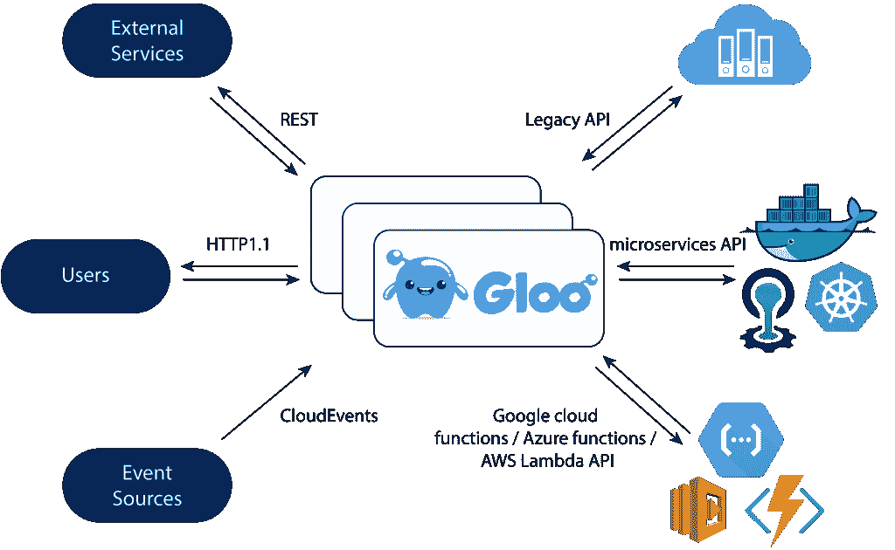

# 认识 Gloo，它是统一传统 API、微服务和无服务器的“功能网关”

> 原文：<https://thenewstack.io/meet-gloo-the-function-gateway-that-unifies-legacy-apis-microservices-and-serverless/>

Solo 希望将所有 IT 运营统一在一个共同的标准下，即功能。通过将组织的所有服务、整体应用程序 API 和无服务器调用作为同一数据平面上的功能公开，企业可以利用一组统一的管理和监控工具。

“我们在功能的层面上走路线，”索罗创始人 T2 艾迪·莱文说。“那里有很多魔法。”

大多数企业仍然有单一的应用程序，但许多企业正在探索使用微服务。这些整体可通过 API 进行访问，并由传统的应用性能管理(APM)工具进行监控，Splunk 和其他日志调查工具提供了深度分析。对于微服务(通常在 Kubernetes 或 Cloud Foundry 等平台上运行)，监控通常通过 Prometheus(可扩展监控)和 Open Tracing(事务日志记录)等工具来完成。通常，微服务监控工具和传统工具不能很好地协同工作，因此需要两套工具来进行监控。

增加这种架构复杂性的是，许多组织也在探索无服务器领域，这主要是通过 AWS Lambda 或 Google Cloud Functions 等服务由云驱动的。这些也有自己的监测工具，如 [AWS X 射线](https://aws.amazon.com/xray/)。

Solo 的方法是将这些不同风格的计算视为一个单一的实体，即功能实体，这样就可以用一个单一的系统来监控和管理它们。为了实现这一愿景，该公司构建了一个功能网关，它类似于 API 网关，但用于功能。

该软件名为 Gloo，基于已经广泛用于微服务的[特使代理](https://www.envoyproxy.io/)。Envoy 在服务或 IP 级别进行路由，并可以通过编写过滤器进行扩展，因此 Gloo 是围绕一个在功能级别工作的基本过滤器构建的。它做普通网关做的事情，如发现、路由、功能到功能的转换，但都是在功能级。Gloo 将传入的请求和事件路由到上游函数。

Gloo 功能管理

*   超时设定
*   度量和跟踪
*   健康检查
*   重试次数
*   高级负载平衡
*   SNI 支持下的 TLS 终止
*   HTTP 标头修改

这种方法不需要客户端和服务器之间的每次交互都使用相同的消息传递协议，也不需要用户编写支持代码来与每个 API 进行交互。Gloo 拥有高度可扩展的架构，这使得 Solo 可以快速添加对 GRPC、NATS、Swagger/OpenAPI 以及许多其他接口的支持。

通过建立在 Envoy 的基础上，Gloo 继承了 Envoy 的所有功能，并为组织的所有功能提供了所有微服务监控工具，如 Prometheus 和 OpenTracing，而不仅仅是源于微服务的功能。

## 轻松的无服务器胜利

该软件还为所有流行的无服务器服务提供过滤器，包括 AWS Lambda、谷歌云平台和刚刚宣布的 [Azure Functions](https://medium.com/solo-io/simplify-serverless-with-gloo-50ed6db7a599) 。

Levine 解释说，Gloo 的一个直接好处是，它可以简化管理无服务器服务的过程，甚至跨不同的云。该软件可以自动执行身份验证过程，无需为每个功能编写单独的 API。它可以自动发现单个帐户下的所有功能。它还提供了转换工具，比如将无服务器调用的结果从提供的基本 JSON 转换成 HTML。

https://www.youtube.com/watch?v=TQpG3NBixNs

Gloo 是用 Go 编写的一个二进制文件，可以作为 Kubernetes pod 部署在 Docker 容器中，现在也可以部署在 Cloud Foundry 上。设置还需要一个 Envoy 的副本，尽管安装过程可以通过该公司开发的附加软件 [TheTool](https://github.com/solo-io/thetool) 大大简化。然后，用户编写配置对象来捕获工作流逻辑。

*4 月 18 日周四，Idit Levine 将在波士顿的 Cloud Foundry 峰会上就调试微服务* *发表* *演讲。
*

[Cloud Foundry Foundation](https://www.cloudfoundry.org/) 是新堆栈的赞助商。

<svg xmlns:xlink="http://www.w3.org/1999/xlink" viewBox="0 0 68 31" version="1.1"><title>Group</title> <desc>Created with Sketch.</desc></svg>