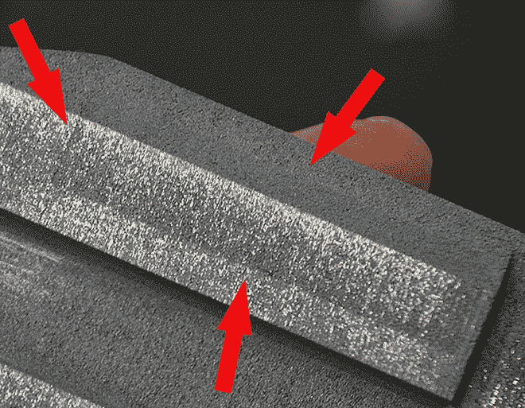
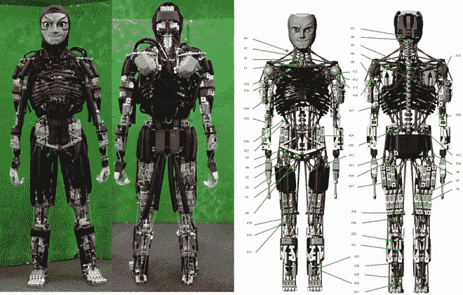
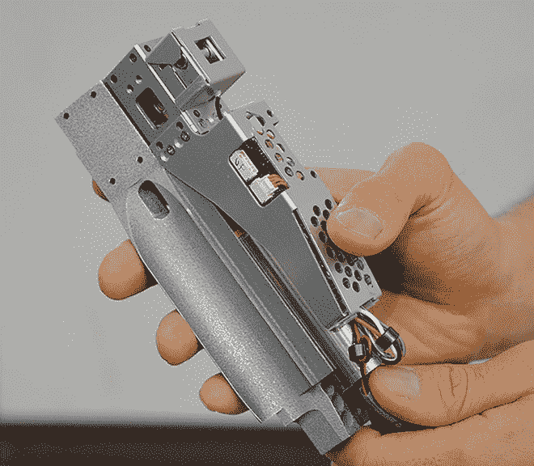
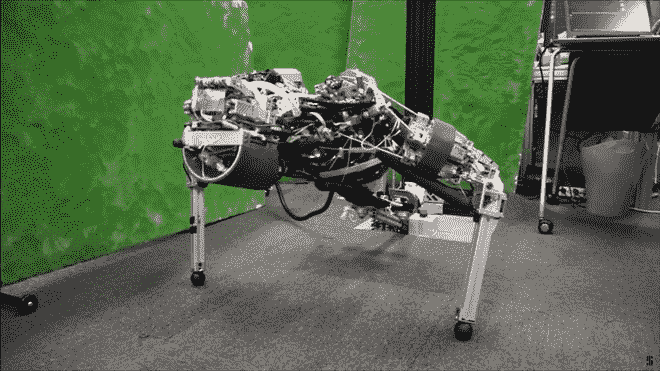

# 来认识一下肯戈罗，这个通过流汗来降温的机器人

> 原文：<https://thenewstack.io/meet-kengoro-robot-sweats-cool/>

着眼于未来，机器人将[与人类](https://thenewstack.io/collaborative-robots-will-help-human-workers-not-replace/)一起协同工作，或者更令人不安的是，甚至[完全取代它们](https://thenewstack.io/robotic-nation-upon-us/)，机器人最近已经获得了一些类似人类的能力。研究人员正致力于将感受疼痛的[能力](https://thenewstack.io/researchers-developing-robots-can-feel-pain/)以及被基于细菌的大脑[控制的潜力](https://thenewstack.io/robots-someday-controlled-bacteria-based-brains/)灌输给我们的机器对手，以努力创造能够以一定程度的自主性对环境刺激做出反应的机器人。

另一个与机器人相关的问题是过热问题。像人类一样，当机器人努力工作时，它们往往会过热。出汗是哺乳动物体温调节的自然解决方案，现在，东京大学 JSK 实验室的研究人员已经开发出一种类似的出汗过程来冷却绰号为 Kengoro 的人形机器人。

这个 123 磅重、5.5 英尺高的 Kengoro 是 JSK 实验室受生物启发的机器人系列中的最新成员，这些机器人拥有类似人类的肌肉骨骼系统。Kengoro 建立在它的前辈基础上，由一系列电路板，齿轮和 108 个马达组成，帮助它以接近拟人化的优雅移动。

Kengoro 与以前型号的区别在于它能够将金属结构框架用作冷却剂输送系统。不依赖笨重的风扇、散热器和散热片，水可以从它的金属“骨头”中渗出，在马达周围流动，随着液体蒸发冷却它们。观看 Kengoro 全速做俯卧撑的动作，近距离观察它的机器人汗腺:

https://youtu.be/RA4u_9FLzso

根据 [*IEEE Spectrum*](http://spectrum.ieee.org/automaton/robotics/humanoids/this-robot-can-do-more-pushups-because-it-sweats) 的说法，水能够从 Kengoro 的金属框架中渗透出来，这种框架由 3D 打印的铝粉组成，这些铝粉已经用激光的热量压实成固体(或者用行业术语来说，它已经被“烧结”)。

像这样的添加制造工艺允许很高的精度和控制，允许研究人员在制造过程中通过改变激光的能量密度来改变材料的渗透性。使用这种技术，该团队能够创造出一些区域渗透性比其他区域高的铝组件，铺设一个数字化制造的“微通道”系统，帮助引导水。正如人们在下图中看到的那样，激光烧结铝中有一个可渗透的通道——几乎察觉不到，但这一区域看起来比其他区域稍暗。

该团队的巧妙设计将结构实用性与重要的功能需求相结合，而不是通过冷却风扇或散热器增加重量。

该项目的负责人[丰田章男](https://www.linkedin.com/in/toyotaka-kozuki-3a178888)说:“通常机器人的框架只是用来支撑力量。“我们的概念是给框架增加更多功能，用它来转移水分、释放热量，同时支撑力量。”

机器人的烧结铝“骨骼”也被打印成包含不同的孔隙率增加的分层，从最深层开始，这有助于排出的液体从其表面均匀蒸发，而不是让它不方便地到处滴落。

这里是对作为 Kengoro 机器人汗腺的模块的近距离观察，它被放置在整个框架的电机附近。当电机产生热量时，Kengoro 的出汗过程将通过蒸发冷却电机。

有点像人类的汗水，主要由水组成，Kengoro 的“汗水”是由去离子水组成的，每 12 小时需要一杯半去离子水来保持最佳温度。根据科学家的测试，这种非常规的冷却方法实际上比基于空气的冷却或仅仅在内部管道周围送水的效果好三倍。唯一的问题是，它没有主动冷却那么强大，主动冷却需要像散热器这样更耗能的选择。尽管如此，这种创新技术确实允许 Kengoro 在没有过热的情况下更长时间地满负荷运行。正如你在上面的视频中看到的，它能够不间断地做 11 分钟俯卧撑——这非常令人印象深刻，即使你不是机器人。

那么这对我们人类来说意味着什么呢？一个自我调节、自主的人形机器人将与我们迄今为止看到的看起来不那么危险的协作机器人有所不同，并且可能会给即将到来的机器人启示录带来一些担忧，即机器人[将取代人类从事各种工作](https://thenewstack.io/will-happen-robots-take-jobs/)。另一方面，社会的日益机器人化也可能意味着人类的创造力可以从乏味的忙碌中解放出来，转向其他更令人满意的出路——或者至少我们希望如此。更多，在 [JSK 实验室](http://www.jsk.t.u-tokyo.ac.jp/)。

图片:JSK 实验室。

<svg xmlns:xlink="http://www.w3.org/1999/xlink" viewBox="0 0 68 31" version="1.1"><title>Group</title> <desc>Created with Sketch.</desc></svg>