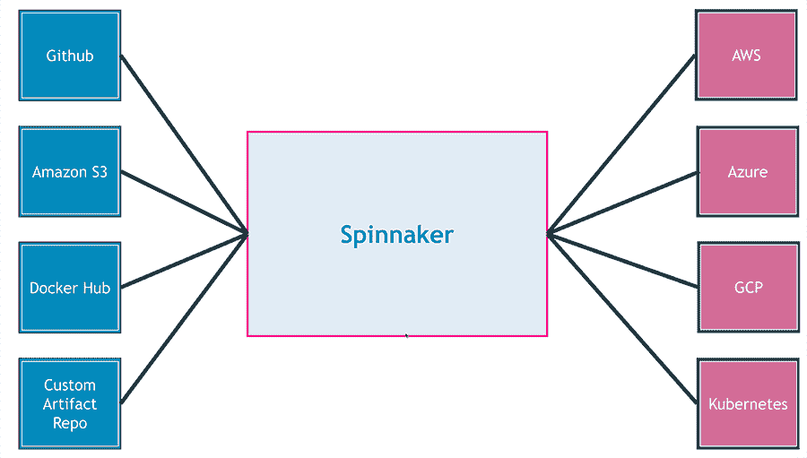
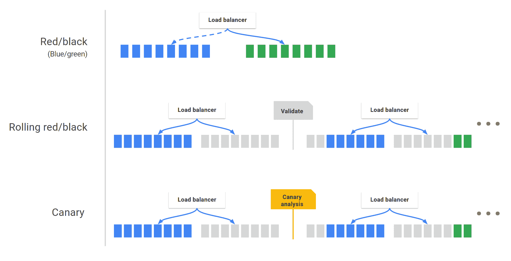
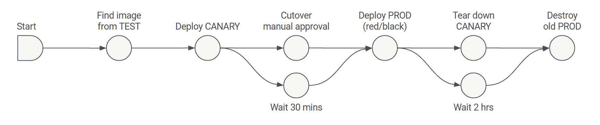

# 认识 Spinnaker:终极多云部署工具

> 原文：<https://thenewstack.io/meet-spinnaker-ultimate-multi-cloud-deployment-tool/>

视频流媒体服务公司网飞当然对网络规模的部署略知一二。自 2011 年[混沌猴](https://github.com/Netflix/chaosmonkey)创建以来，该公司一直定期为开源生态系统做出贡献。

2012 年，网飞开发了 [Asgard](https://github.com/Netflix/asgard) 来自动化亚马逊网络服务的部署，包括亚马逊机器映像(AMIs)、弹性云计算(EC2)实例、自动扩展组、启动配置和弹性负载平衡器。网飞构建 Asgard 是为了向以 AWS 为目标的内部团队展示一致的部署体验。它通过标准术语和一组 API 抽象出 EC2 基础设施的基础。

到 2015 年，Asgard 开发者开始将软件转移到 AWS 之外，以支持[谷歌云](https://cloud.google.com/kubernetes-engine)和[微软 Azure](https://azure.microsoft.com/en-us/?v=17.14) 。Asgard 的多云头像演变成了一个全新的工具，叫做 [Spinnaker](https://www.spinnaker.io/) 。在其当前版本中，Spinnaker 支持各种部署目标，包括主流云和容器平台，包括 OpenStack、DC/OS、Kubernetes 和 Cloud Foundry。

无论目标环境如何，部署体验总是一致的，并提供以下功能:

*   支持以灵活的管道和可配置的管道阶段捕获的可重复自动化部署。
*   提供应用程序在其部署管道中经过的所有环境的全局视图。
*   通过一致可靠的 API 提供编程配置和执行。
*   易于配置、维护和扩展。
*   具有运营弹性。
*   无需迁移即可提供 Asgard 的现有优势。

Spinnaker 不仅仅是自动化多云部署。它强调通过强大的管道功能进行持续部署。Spinnaker 可以为每个目标环境打包应用程序构件，比如二进制文件和容器映像。例如，它可以构建一个 AMI 部署在 EC2 中，同时将相同的应用程序打包成一组可以在 Kubernetes 中运行的 Pods。Spinnaker 与现有工具紧密集成，如 Jenkins、Docker Hub、Travis CI 和 Circle CI。运营团队在跨试运行和生产环境管理部署方面获得最终控制权。

Spinnaker 鼓励使用不可变的基础设施。运营团队永远不必使用 SSH 来管理通过 Spinnaker 部署的虚拟机。如果虚拟机的运行状况不是绿色，这意味着运行状况检查失败，Spinnaker 会自动启动一个新的虚拟机，并停止将流量路由到不健康的虚拟机。

使用 Spinnaker 的最大好处是团队永远不必管理每个目标环境的单独资源。他们可以向 Spinnaker 注册目标平台，并使用该接口来定义部署策略和管道阶段。处理当代云原生应用程序的组织会发现 Spinnaker 在管理端到端应用程序生命周期方面非常有效。

## 设置 Spinnaker

Spinnaker 可以通过模板在 AWS、Azure 和 GCP 中轻松设置。它在 AWS 中作为 CloudFormation 模板，在 Azure 中作为 Azure 资源管理器模板，在 GCP 中作为部署管理器模板。

如果你不想使用现有的模板，你可以使用一个名为 [Halyard](https://github.com/spinnaker/halyard) 的工具在 Ubuntu 14.04 上设置和配置 Spinnaker。Halyard 通过抽象安装 Spinnaker 所涉及的细节来简化安装。

在目前的形式下，Spinnaker 还不够安全，不能在公共互联网上公开。与 LDAP 的集成和对标准认证机制的支持仍在进行中。当部署在公共云环境中时，最好通过基于 SSH 的端口转发或 VPN 进行访问。

由于 Spinnaker 是作为基于一组 Docker 容器的微服务应用程序构建的，因此它可以部署在 Docker Swarm 或 Kubernetes 集群中。我们将在下一篇文章中探讨这个部署模型。

## 使用 Spinnaker 管理部署

可以将 Spinnaker 视为在目标部署中部署应用程序构件的中间件。在高层次上，它是一个连接源代码和生产环境的工具。

首先注册目标部署平台——虚拟机、平台即服务或容器编排引擎。然后，您将定义可能具有多个阶段的管道，以便在一个或多个目标部署中部署应用程序。

一旦向 Spinnaker 注册了目标部署环境，您就可以创建以下资源，这些资源映射到目标环境中完全相同的资源。

*   **负载平衡器—** 这将定义应用程序最终可用的端点。在 Kubernetes 的世界里，这意味着服务。在 AWS 中，它可能是一个弹性负载平衡器。
*   **安全组—** 该资源定义了一组防火墙规则，这些规则被转换成相应环境中的网络策略。
*   **应用程序—** 应用程序是集群的逻辑分组。
*   **集群—**Spinnaker 集群定义了一组与部署相关的计算资源。它通常代表一个独特、孤立的环境，如开发、试运行、测试或生产环境。每个集群可以有一个或多个服务器组。可以配置群集来设置每个服务器组的所需状态。
*   **服务器组—** 服务器组是一个弹性部署单元，由细粒度的计算资源(如虚拟机或 pod)组成，通过单个负载平衡器公开，并由安全组控制。每个服务器组都有定义所需状态的最小和最大数量的计算资源。在 AWS 中，服务器组映射到自动扩展组(ASG)。在 Kubernetes 中，它被翻译成一个副本集。

虽然该术语似乎受到 EC2 的很大影响，但它被用于配置 PaaS 环境，如 Google App Engine 或 Cloud Foundry，以及容器编排工具，如 Kubernetes 和 DC/OS。

Spinnaker 使用上面定义的资源来管理应用程序部署。注册和配置完成后，就可以实现各种模式，比如蓝/绿部署和金丝雀部署。

在配置目标环境之后，DevOps 团队创建管道来将工件部署到这些环境中。

**管道—** 管道是在 Spinnaker 中定义部署策略的关键。它们由一系列被称为阶段的动作组成。可以沿着管道逐级传递参数。管道可以手动启动，也可以配置为由自动触发事件启动，例如 Jenkins 作业完成、注册表中出现新的 Docker 映像、一个 **cron** 计划，或者在另一个管道中的一个阶段完成时。管道通过电子邮件、SMS 或 HipChat 在管道执行过程中的不同点(如管道开始/完成/失败)向相关方发出通知。

**阶段—**Spinnaker 中的阶段是一个动作，它构成了管道的基本构建块。DevOps 团队可以按任何顺序对管道中的阶段进行排序，尽管有些阶段的顺序可能比其他阶段更常见。Spinnaker 提供了许多阶段，如部署、调整大小、禁用、手动判断等等。例如，部署阶段可以配置为针对其中一个服务器组，而另一个阶段可以用于手动触发生产群集中最新版本的滚动升级。

**策略—**Spinnaker 中的策略定义了特定部署是如何发生的。汉兰达的部署策略会将新版本推入一个服务器组，当它变得健康时，它会自动终止运行以前版本的服务器组。红/黑策略通过使两个版本并行运行，提供了一种执行蓝/绿部署的机制。滚动推送通过优雅地删除以前的版本并用新版本替换它来执行滚动升级。

还可以定义与开发运维团队定义的特定部署模式相一致的定制策略。

## 三角帆社区

Spinnaker 的用户群在网飞之外稳步增长。有一些商业实现和专业服务可以从[军械库](http://www.armory.io)、[肯赞](https://kenzan.com)和 [OpsMx](http://opsmx.com) 等公司获得。

由于缺少文档和教程，没有多少用户采用 Spinnaker。如果您的目标是多云部署或部署云原生应用程序，Spinnaker 可能是您正在寻找的工具。

在即将发表的一篇文章中，我将向您介绍在本地 Kubernetes 集群中设置 Spinnaker 并使用它部署容器化应用程序的过程。敬请关注。

*关于学习 Spinnaker 的这个系列的附加版本可以在这里找到。*

<svg xmlns:xlink="http://www.w3.org/1999/xlink" viewBox="0 0 68 31" version="1.1"><title>Group</title> <desc>Created with Sketch.</desc></svg>